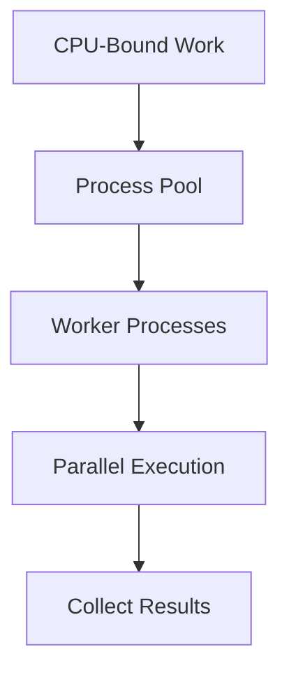

# Day 042 [Intermediate]: Concurrency with multiprocessing

## Index

- [Goal](#goal)
- [Prerequisites](#prerequisites)
- [Explanation](#explanation)
- [Topic by Topic](#topic-by-topic)
- [Key Concepts](#key-concepts)
- [Visual Concept Map](#visual-concept-map)
- [End-to-End Practical](#end-to-end-practical)
- [Hands-on Coding](#hands-on-coding)
- [Mini Exercise](#mini-exercise)
- [Assessment Quiz](#assessment-quiz)
- [Task](#task)
- [Self Check](#self-check)
- [Interview Questions and Answers](#interview-questions-and-answers)
- [Day 042 Outcome](#day-042-outcome)

## Goal

Use multiprocessing to speed up CPU-bound workloads and understand process communication and lifecycle management.

## Prerequisites

- Day 041 completed
- Comfortable with threading basics and function-based architecture

## Explanation

Multiprocessing launches separate Python processes, each with its own interpreter and memory space. This enables true parallel execution for CPU-heavy tasks and bypasses the GIL limits seen in threading.

## Topic by Topic

### Topic 1: Why Multiprocessing for CPU-Bound Work

Theory:
CPU-heavy tasks like numeric computation, parsing, or transformations benefit from parallel processes.

Practical:
Use multiprocessing when threads do not improve CPU-bound runtime.

Code Example:

```python
def heavy_compute(n):
  total = 0
  for i in range(n):
    total += i * i
  return total
```

**Explanation:**
This topic explains Why Multiprocessing for CPU-Bound Work in a practical Python context so you can write clear, reliable, and maintainable programs for real-world tasks.

**Key Points:**
- Understand the core idea behind Why Multiprocessing for CPU-Bound Work.
- Apply the practical pattern with good readability and validation habits.
- Keep the solution maintainable, testable, and safe for production use where relevant.

### Topic 2: Process Lifecycle Basics

Theory:
Processes are created, started, and joined similar to threads but in separate memory spaces.

Practical:
Always protect process-spawning code with main guard.

Code Example:

```python
from multiprocessing import Process

def worker():
  print("process running")

if __name__ == "__main__":
  p = Process(target=worker)
  p.start()
  p.join()
```

**Explanation:**
This topic explains Process Lifecycle Basics in a practical Python context so you can write clear, reliable, and maintainable programs for real-world tasks.

**Key Points:**
- Understand the core idea behind Process Lifecycle Basics.
- Apply the practical pattern with good readability and validation habits.
- Keep the solution maintainable, testable, and safe for production use where relevant.

### Topic 3: Pools for Task Distribution

Theory:
Pool distributes work across workers with simpler API.

Practical:
Use map-style APIs for batch CPU tasks.

Code Example:

```python
from multiprocessing import Pool

def square(x):
  return x * x

if __name__ == "__main__":
  with Pool(processes=4) as pool:
    print(pool.map(square, [1, 2, 3, 4, 5]))
```

**Explanation:**
This topic explains Pools for Task Distribution in a practical Python context so you can write clear, reliable, and maintainable programs for real-world tasks.

**Key Points:**
- Understand the core idea behind Pools for Task Distribution.
- Apply the practical pattern with good readability and validation habits.
- Keep the solution maintainable, testable, and safe for production use where relevant.

### Topic 4: Inter-Process Communication

Theory:
Processes do not share memory by default.

Practical:
Use Queue, Pipe, or Manager when state exchange is required.

Code Example:

```python
from multiprocessing import Process, Queue

def producer(q):
  q.put("done")

if __name__ == "__main__":
  q = Queue()
  p = Process(target=producer, args=(q,))
  p.start()
  print(q.get())
  p.join()
```

**Explanation:**
This topic explains Inter-Process Communication in a practical Python context so you can write clear, reliable, and maintainable programs for real-world tasks.

**Key Points:**
- Understand the core idea behind Inter-Process Communication.
- Apply the practical pattern with good readability and validation habits.
- Keep the solution maintainable, testable, and safe for production use where relevant.

### Topic 5: Serialization and Pickle Constraints

Theory:
Data passed to child processes is serialized.

Practical:
Keep worker arguments simple and avoid non-picklable objects.

Code Example:

```python
# Prefer top-level functions for pool workers to avoid pickling issues.
```

**Explanation:**
This topic explains Serialization and Pickle Constraints in a practical Python context so you can write clear, reliable, and maintainable programs for real-world tasks.

**Key Points:**
- Understand the core idea behind Serialization and Pickle Constraints.
- Apply the practical pattern with good readability and validation habits.
- Keep the solution maintainable, testable, and safe for production use where relevant.

### Topic 6: Choosing Threading vs Multiprocessing

Theory:
Workload type determines best model.

Practical:
I/O-bound usually threading or async; CPU-bound often multiprocessing.

Code Example:

```python
# Use process pools for CPU-intensive transformations.
```

**Explanation:**
This topic explains Choosing Threading vs Multiprocessing in a practical Python context so you can write clear, reliable, and maintainable programs for real-world tasks.

**Key Points:**
- Understand the core idea behind Choosing Threading vs Multiprocessing.
- Apply the practical pattern with good readability and validation habits.
- Keep the solution maintainable, testable, and safe for production use where relevant.

## Key Concepts

- Multiprocessing enables true CPU parallelism
- Main guard is required for safe startup
- Process pools simplify distribution
- IPC is explicit via queues, pipes, managers
- Serialization overhead affects design
- Pick concurrency model by workload characteristics

## Visual Concept Map



## End-to-End Practical

1. Create CPU-heavy function.
2. Run baseline sequential version.
3. Run parallel version with process pool.
4. Compare execution times.
5. Add queue-based result reporting for one task.

## Hands-on Coding

### Example 1: Case - Parallel Number Processing

Scenario:
Compute expensive transforms over a large number list.

```python
from multiprocessing import Pool

def transform(x):
  return (x * x + x) % 97

if __name__ == "__main__":
  data = list(range(100000))
  with Pool(4) as pool:
    out = pool.map(transform, data)
  print(len(out))
```

### Example 2: Case - Worker Queue Status

Scenario:
Send per-worker progress messages to parent.

```python
from multiprocessing import Process, Queue

def run_task(task_id, q):
  q.put(f"task {task_id} completed")

if __name__ == "__main__":
  q = Queue()
  p = Process(target=run_task, args=(1, q))
  p.start()
  print(q.get())
  p.join()
```

### Example 3: Case - CPU Benchmark Comparison

Scenario:
Compare sequential and process-pool runtime.

```python
import time
from multiprocessing import Pool

def heavy(x):
  s = 0
  for i in range(500000):
    s += (i * x) % 17
  return s

if __name__ == "__main__":
  inputs = [1, 2, 3, 4]
  t1 = time.perf_counter()
  seq = [heavy(x) for x in inputs]
  t2 = time.perf_counter()
  with Pool(4) as pool:
    par = pool.map(heavy, inputs)
  t3 = time.perf_counter()
  print("sequential", t2 - t1, "parallel", t3 - t2, len(seq), len(par))
```

## Mini Exercise

Scenario:
Process a list of large numbers in parallel and return both computed result and worker ID for each chunk.

Expected output:

- Pool-based implementation
- Collected list of results
- Runtime comparison with sequential run

## Assessment Quiz

### Quiz Questions

1. Why is multiprocessing useful for CPU-heavy tasks?
2. Why do we use if **name** == "**main**"?
3. True or False: Child processes share Python objects directly by default.
4. What is one cost of multiprocessing?
5. When might threading still be better?

### Quiz Answers

1. It uses multiple CPU cores with separate processes
2. To prevent recursive process spawning issues
3. False
4. Process startup and serialization overhead
5. For I/O-bound workloads with lightweight context

## Task

- Convert one CPU-bound script from sequential to process pool
- Add timing comparison
- Document one tradeoff of multiprocessing in your use case

## Self Check

- You can start and manage child processes safely
- You can use pools for scalable CPU work
- You can reason about IPC and serialization costs

## Interview Questions and Answers

### Beginner

**Question:** Why choose multiprocessing over threading for CPU tasks?

**Answer:** It can run on multiple cores in parallel, avoiding GIL bottlenecks.

**Question:** What does a process pool do?

**Answer:** It manages a fixed set of worker processes to execute tasks efficiently.

### Middle

**Question:** What is a common multiprocessing mistake on Windows?

**Answer:** Forgetting the main guard around process creation.

**Question:** Why can multiprocessing be slower for tiny tasks?

**Answer:** Serialization and process overhead can outweigh compute time.

### Advanced

**Question:** How do you design robust multiprocess pipelines?

**Answer:** Batch tasks, minimize cross-process data transfer, and isolate worker logic.

**Question:** What workload shape best fits process pools?

**Answer:** Medium-to-heavy independent CPU tasks with limited shared-state needs.

## Day 042 Outcome

- You can apply multiprocessing for CPU-bound parallelism
- You can use pools and IPC primitives correctly
- You are ready for asyncio fundamentals on Day 043
