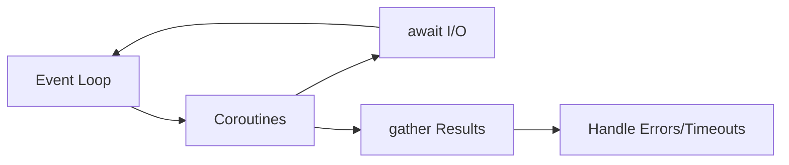

# Day 043 [Intermediate]: Asyncio Fundamentals

## Index

- [Goal](#goal)
- [Prerequisites](#prerequisites)
- [Explanation](#explanation)
- [Topic by Topic](#topic-by-topic)
- [Key Concepts](#key-concepts)
- [Visual Concept Map](#visual-concept-map)
- [End-to-End Practical](#end-to-end-practical)
- [Hands-on Coding](#hands-on-coding)
- [Mini Exercise](#mini-exercise)
- [Assessment Quiz](#assessment-quiz)
- [Task](#task)
- [Self Check](#self-check)
- [Interview Questions and Answers](#interview-questions-and-answers)
- [Day 043 Outcome](#day-043-outcome)

## Goal

Understand asyncio core concepts and build non-blocking Python workflows for high-concurrency I/O operations.

## Prerequisites

- Day 042 completed
- Familiarity with threading and event-driven ideas

## Explanation

asyncio uses an event loop to run coroutines cooperatively. Instead of creating many threads, tasks yield control during waits, allowing one thread to manage many concurrent I/O operations.

## Topic by Topic

### Topic 1: Event Loop and Coroutines

Theory:
Coroutines are async functions that can pause and resume.

Practical:
Use asyncio.run to start top-level async program.

Code Example:

```python
import asyncio

async def hello():
  await asyncio.sleep(0.2)
  return "hello"

print(asyncio.run(hello()))
```

**Explanation:**
This topic explains Event Loop and Coroutines in a practical Python context so you can write clear, reliable, and maintainable programs for real-world tasks.

**Key Points:**
- Understand the core idea behind Event Loop and Coroutines.
- Apply the practical pattern with good readability and validation habits.
- Keep the solution maintainable, testable, and safe for production use where relevant.

### Topic 2: Creating Concurrent Tasks

Theory:
Task objects schedule coroutines for concurrent progress.

Practical:
Use create_task when independent coroutines should run in parallel waiting periods.

Code Example:

```python
import asyncio

async def work(i):
  await asyncio.sleep(0.3)
  return f"done-{i}"

async def main():
  tasks = [asyncio.create_task(work(i)) for i in range(3)]
  print(await asyncio.gather(*tasks))

asyncio.run(main())
```

**Explanation:**
This topic explains Creating Concurrent Tasks in a practical Python context so you can write clear, reliable, and maintainable programs for real-world tasks.

**Key Points:**
- Understand the core idea behind Creating Concurrent Tasks.
- Apply the practical pattern with good readability and validation habits.
- Keep the solution maintainable, testable, and safe for production use where relevant.

### Topic 3: await and Non-Blocking Delays

Theory:
await yields control to event loop until awaited operation completes.

Practical:
Use asyncio.sleep, not time.sleep, inside async code.

Code Example:

```python
import asyncio

async def ticker():
  for _ in range(3):
    print("tick")
    await asyncio.sleep(0.1)
```

**Explanation:**
This topic explains await and Non-Blocking Delays in a practical Python context so you can write clear, reliable, and maintainable programs for real-world tasks.

**Key Points:**
- Understand the core idea behind await and Non-Blocking Delays.
- Apply the practical pattern with good readability and validation habits.
- Keep the solution maintainable, testable, and safe for production use where relevant.

### Topic 4: Error Handling in Async Workflows

Theory:
Exceptions in one task can affect group execution behavior.

Practical:
Handle exceptions around gather and choose return_exceptions strategy when needed.

Code Example:

```python
import asyncio

async def ok():
  await asyncio.sleep(0.1)
  return "ok"

async def fail():
  await asyncio.sleep(0.1)
  raise ValueError("boom")

async def main():
  results = await asyncio.gather(ok(), fail(), return_exceptions=True)
  print(results)
```

**Explanation:**
This topic explains Error Handling in Async Workflows in a practical Python context so you can write clear, reliable, and maintainable programs for real-world tasks.

**Key Points:**
- Understand the core idea behind Error Handling in Async Workflows.
- Apply the practical pattern with good readability and validation habits.
- Keep the solution maintainable, testable, and safe for production use where relevant.

### Topic 5: Timeout and Cancellation Basics

Theory:
Timeouts prevent stalled tasks from blocking overall workflow.

Practical:
Use wait_for to enforce deadlines.

Code Example:

```python
import asyncio

async def slow():
  await asyncio.sleep(2)
  return "late"

async def main():
  try:
    print(await asyncio.wait_for(slow(), timeout=0.5))
  except asyncio.TimeoutError:
    print("timeout")
```

**Explanation:**
This topic explains Timeout and Cancellation Basics in a practical Python context so you can write clear, reliable, and maintainable programs for real-world tasks.

**Key Points:**
- Understand the core idea behind Timeout and Cancellation Basics.
- Apply the practical pattern with good readability and validation habits.
- Keep the solution maintainable, testable, and safe for production use where relevant.

### Topic 6: Async Design Guidelines

Theory:
Async code stays effective when boundaries and responsibilities are clear.

Practical:
Avoid blocking libraries inside async paths unless wrapped via executors.

Code Example:

```python
# Keep synchronous CPU-heavy work outside core async event loop path.
```

**Explanation:**
This topic explains Async Design Guidelines in a practical Python context so you can write clear, reliable, and maintainable programs for real-world tasks.

**Key Points:**
- Understand the core idea behind Async Design Guidelines.
- Apply the practical pattern with good readability and validation habits.
- Keep the solution maintainable, testable, and safe for production use where relevant.

## Key Concepts

- Event loop schedules coroutine execution
- await enables cooperative concurrency
- create_task and gather coordinate many tasks
- Async code must avoid blocking calls
- Timeouts and cancellation improve resilience
- Async architecture requires clear boundaries

## Visual Concept Map



## End-to-End Practical

1. Write three async fetch-style coroutines.
2. Run them concurrently with gather.
3. Add one failing coroutine.
4. Add timeout around one slow call.
5. Print success and failure summary.

## Hands-on Coding

### Example 1: Case - Concurrent API Simulation

Scenario:
Fetch pseudo-endpoints concurrently.

```python
import asyncio

async def fetch(endpoint):
  await asyncio.sleep(0.2)
  return {"endpoint": endpoint, "status": 200}

async def main():
  endpoints = ["/users", "/orders", "/products"]
  results = await asyncio.gather(*(fetch(e) for e in endpoints))
  print(results)

asyncio.run(main())
```

### Example 2: Case - Timeout Policy

Scenario:
Abort and mark slow operation as timeout.

```python
import asyncio

async def fetch_slow():
  await asyncio.sleep(1)
  return "ok"

async def main():
  try:
    print(await asyncio.wait_for(fetch_slow(), 0.2))
  except asyncio.TimeoutError:
    print("request timed out")
```

### Example 3: Case - Mixed Task Results

Scenario:
Collect both success and failure objects.

```python
import asyncio

async def good(i):
  return i

async def bad():
  raise RuntimeError("failed")

async def main():
  out = await asyncio.gather(good(1), bad(), return_exceptions=True)
  print(out)
```

## Mini Exercise

Scenario:
Build an async batch runner for 10 pseudo-URLs with per-task timeout and final summary of passed/failed calls.

Expected output:

- Concurrent batch execution
- Timeout handling for slow tasks
- Final counts of success and failure

## Assessment Quiz

### Quiz Questions

1. What does await do in asyncio?
2. Why is time.sleep harmful inside async functions?
3. True or False: gather can return exceptions as results.
4. What problem does wait_for solve?
5. When should create_task be used?

### Quiz Answers

1. Yields control until awaited operation completes
2. It blocks the event loop
3. True
4. Enforcing timeouts on coroutines
5. For independently running coroutines concurrently

## Task

- Build one async batch workflow with gather
- Add timeout and exception handling
- Document where async improved responsiveness

## Self Check

- You can create and run coroutines confidently
- You can manage task groups and exceptions
- You can avoid common blocking mistakes

## Interview Questions and Answers

### Beginner

**Question:** What is a coroutine?

**Answer:** An async function that can pause and resume via await.

**Question:** What is the event loop?

**Answer:** Scheduler that runs and coordinates async tasks.

### Middle

**Question:** How do you run multiple async calls together?

**Answer:** Use asyncio.gather or create_task-based coordination.

**Question:** Why add timeouts in async services?

**Answer:** To prevent slow dependencies from stalling overall response.

### Advanced

**Question:** What architecture mistake hurts asyncio scalability?

**Answer:** Mixing blocking I/O or CPU-heavy synchronous logic in the event loop path.

**Question:** How do you make async pipelines robust?

**Answer:** Use cancellation strategy, timeout policy, and explicit error aggregation.

## Day 043 Outcome

- You can design and run asyncio-based workflows
- You can manage async task lifecycle and resilience controls
- You are ready for higher-level async I/O patterns on Day 044
