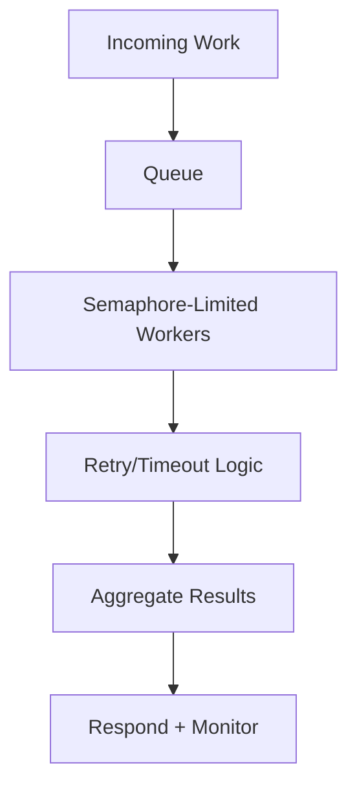

# Day 044 [Intermediate]: Async IO Patterns

## Index

- [Goal](#goal)
- [Prerequisites](#prerequisites)
- [Explanation](#explanation)
- [Topic by Topic](#topic-by-topic)
- [Key Concepts](#key-concepts)
- [Visual Concept Map](#visual-concept-map)
- [End-to-End Practical](#end-to-end-practical)
- [Hands-on Coding](#hands-on-coding)
- [Mini Exercise](#mini-exercise)
- [Assessment Quiz](#assessment-quiz)
- [Task](#task)
- [Self Check](#self-check)
- [Interview Questions and Answers](#interview-questions-and-answers)
- [Day 044 Outcome](#day-044-outcome)

## Goal

Apply production-oriented async patterns such as fan-out/fan-in, rate limiting, retries, and backpressure in Python I/O services.

## Prerequisites

- Day 043 completed
- Good understanding of coroutines and gather

## Explanation

Async fundamentals are useful, but scalable services need stronger control patterns. Today focuses on designing resilient async workflows that stay responsive under load and dependency failures.

## Topic by Topic

### Topic 1: Fan-Out and Fan-In

Theory:
Fan-out launches many independent tasks. Fan-in aggregates their results.

Practical:
Use gather to collect parallel operation outputs.

Code Example:

```python
import asyncio

async def worker(i):
  await asyncio.sleep(0.1)
  return i * 2

async def main():
  results = await asyncio.gather(*(worker(i) for i in range(5)))
  print(results)
```

**Explanation:**
This topic explains Fan-Out and Fan-In in a practical Python context so you can write clear, reliable, and maintainable programs for real-world tasks.

**Key Points:**
- Understand the core idea behind Fan-Out and Fan-In.
- Apply the practical pattern with good readability and validation habits.
- Keep the solution maintainable, testable, and safe for production use where relevant.

### Topic 2: Concurrency Limits with Semaphore

Theory:
Unlimited concurrency can overload APIs or databases.

Practical:
Use asyncio.Semaphore to cap in-flight requests.

Code Example:

```python
import asyncio

sem = asyncio.Semaphore(3)

async def guarded_task(i):
  async with sem:
    await asyncio.sleep(0.2)
    return f"ok-{i}"
```

**Explanation:**
This topic explains Concurrency Limits with Semaphore in a practical Python context so you can write clear, reliable, and maintainable programs for real-world tasks.

**Key Points:**
- Understand the core idea behind Concurrency Limits with Semaphore.
- Apply the practical pattern with good readability and validation habits.
- Keep the solution maintainable, testable, and safe for production use where relevant.

### Topic 3: Retry Pattern for Transient Failures

Theory:
Temporary failures should be retried with bounded attempts.

Practical:
Implement retry loop with delay and clear stop condition.

Code Example:

```python
import asyncio

async def unstable_call():
  raise RuntimeError("temporary")

async def with_retry(max_attempts=3):
  for attempt in range(1, max_attempts + 1):
    try:
      return await unstable_call()
    except Exception:
      if attempt == max_attempts:
        raise
      await asyncio.sleep(0.1 * attempt)
```

**Explanation:**
This topic explains Retry Pattern for Transient Failures in a practical Python context so you can write clear, reliable, and maintainable programs for real-world tasks.

**Key Points:**
- Understand the core idea behind Retry Pattern for Transient Failures.
- Apply the practical pattern with good readability and validation habits.
- Keep the solution maintainable, testable, and safe for production use where relevant.

### Topic 4: Timeout and Fallback Strategy

Theory:
Timeouts avoid hanging operations; fallbacks preserve degraded service.

Practical:
Wrap slow calls and return fallback defaults when needed.

Code Example:

```python
import asyncio

async def slow_fetch():
  await asyncio.sleep(2)
  return {"data": 1}

async def safe_fetch():
  try:
    return await asyncio.wait_for(slow_fetch(), timeout=0.3)
  except asyncio.TimeoutError:
    return {"data": None}
```

**Explanation:**
This topic explains Timeout and Fallback Strategy in a practical Python context so you can write clear, reliable, and maintainable programs for real-world tasks.

**Key Points:**
- Understand the core idea behind Timeout and Fallback Strategy.
- Apply the practical pattern with good readability and validation habits.
- Keep the solution maintainable, testable, and safe for production use where relevant.

### Topic 5: Backpressure with Queues

Theory:
Producer speed can exceed consumer speed.

Practical:
Use bounded asyncio.Queue to control memory growth.

Code Example:

```python
import asyncio

queue = asyncio.Queue(maxsize=10)

async def producer():
  for i in range(20):
    await queue.put(i)

async def consumer():
  while True:
    item = await queue.get()
    print(item)
    queue.task_done()
```

**Explanation:**
This topic explains Backpressure with Queues in a practical Python context so you can write clear, reliable, and maintainable programs for real-world tasks.

**Key Points:**
- Understand the core idea behind Backpressure with Queues.
- Apply the practical pattern with good readability and validation habits.
- Keep the solution maintainable, testable, and safe for production use where relevant.

### Topic 6: Async Observability and Shutdown

Theory:
Graceful cancellation and structured logging are critical in async systems.

Practical:
Handle CancelledError and cancel background tasks safely on shutdown.

Code Example:

```python
# Add cancellation handling in long-running coroutines for clean exits.
```

**Explanation:**
This topic explains Async Observability and Shutdown in a practical Python context so you can write clear, reliable, and maintainable programs for real-world tasks.

**Key Points:**
- Understand the core idea behind Async Observability and Shutdown.
- Apply the practical pattern with good readability and validation habits.
- Keep the solution maintainable, testable, and safe for production use where relevant.

## Key Concepts

- Fan-out/fan-in handles parallel request batches
- Semaphores enforce safe concurrency limits
- Retries should be bounded and targeted
- Timeouts and fallback protect responsiveness
- Queues implement backpressure for stability
- Graceful cancellation improves service reliability

## Visual Concept Map



## End-to-End Practical

1. Build async producer-consumer pipeline.
2. Add semaphore limit on downstream calls.
3. Add retry for transient errors.
4. Add timeout and fallback output.
5. Add graceful shutdown for all tasks.

## Hands-on Coding

### Example 1: Case - Async Batch Fetch with Limits

Scenario:
Run 100 pseudo requests with max 10 concurrent calls.

```python
import asyncio

sem = asyncio.Semaphore(10)

async def fetch(i):
  async with sem:
    await asyncio.sleep(0.05)
    return i

async def main():
  results = await asyncio.gather(*(fetch(i) for i in range(100)))
  print(len(results))
```

### Example 2: Case - Retry + Timeout Wrapper

Scenario:
Protect unstable service call with bounded resilience policy.

```python
import asyncio

async def guarded_call():
  for attempt in range(3):
    try:
      return await asyncio.wait_for(asyncio.sleep(0.2, result="ok"), timeout=0.1)
    except asyncio.TimeoutError:
      if attempt == 2:
        return "fallback"
```

### Example 3: Case - Queue-Based Pipeline

Scenario:
Decouple producer speed from consumer speed.

```python
import asyncio

async def producer(queue):
  for i in range(5):
    await queue.put(i)
  await queue.put(None)

async def consumer(queue):
  while True:
    item = await queue.get()
    if item is None:
      break
    print("consumed", item)
```

## Mini Exercise

Scenario:
Design an async mini pipeline that ingests tasks, processes with limited concurrency, retries failures once, and returns final summary counts.

Expected output:

- Queue + semaphore workflow
- Retry handling for failing tasks
- Summary with success and failure totals

## Assessment Quiz

### Quiz Questions

1. Why use semaphore in async applications?
2. What problem does backpressure solve?
3. True or False: Unlimited async tasks are always better for throughput.
4. Why combine timeout with fallback?
5. What is graceful cancellation?

### Quiz Answers

1. To cap concurrent operations safely
2. It prevents producer-overrun and memory pressure
3. False
4. To keep system responsive during slow dependencies
5. Cleanly stopping running tasks without corrupting state

## Task

- Implement one async pipeline with queue and semaphore
- Add timeout and retry policy
- Add shutdown logic with cancellation handling

## Self Check

- You can apply advanced async coordination patterns
- You can design resilient async flows under failure
- You can control concurrency and memory pressure

## Interview Questions and Answers

### Beginner

**Question:** Why limit async concurrency?

**Answer:** To avoid overwhelming downstream systems and local resources.

**Question:** What is a fallback response?

**Answer:** A safe default result used when normal call fails or times out.

### Middle

**Question:** What is backpressure in async systems?

**Answer:** A control mechanism that prevents producers from overloading consumers.

**Question:** Why should retries be bounded?

**Answer:** Unlimited retries can increase load and worsen outages.

### Advanced

**Question:** How do you make async services production-ready?

**Answer:** Enforce concurrency limits, timeouts, retries, observability, and graceful shutdown.

**Question:** What is the risk of naive gather on huge task sets?

**Answer:** High memory usage and uncontrolled pressure on dependencies.

## Day 044 Outcome

- You can build resilient async I/O workflows using core patterns
- You can manage load, failures, and cancellation systematically
- You are ready for low-level socket networking on Day 045
