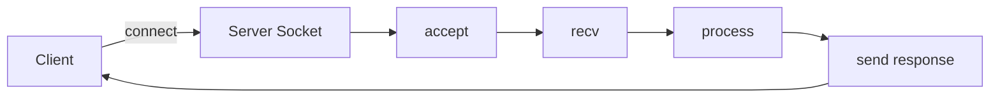

# Day 045 [Intermediate]: Networking with sockets

## Index

- [Goal](#goal)
- [Prerequisites](#prerequisites)
- [Explanation](#explanation)
- [Topic by Topic](#topic-by-topic)
- [Key Concepts](#key-concepts)
- [Visual Concept Map](#visual-concept-map)
- [End-to-End Practical](#end-to-end-practical)
- [Hands-on Coding](#hands-on-coding)
- [Mini Exercise](#mini-exercise)
- [Assessment Quiz](#assessment-quiz)
- [Task](#task)
- [Self Check](#self-check)
- [Interview Questions and Answers](#interview-questions-and-answers)
- [Day 045 Outcome](#day-045-outcome)

## Goal

Understand socket programming basics and build simple client-server communication systems in Python.

## Prerequisites

- Day 044 completed
- Basic understanding of network concepts like host, port, and protocol

## Explanation

Sockets are low-level endpoints for network communication. They form the foundation for protocols and frameworks used by web servers, chat systems, and distributed services.

## Topic by Topic

### Topic 1: Socket Fundamentals

Theory:
A socket represents one end of a communication channel.

Practical:
Use TCP sockets for reliable ordered byte streams.

Code Example:

```python
import socket

s = socket.socket(socket.AF_INET, socket.SOCK_STREAM)
print("socket created")
s.close()
```

**Explanation:**
This topic explains Socket Fundamentals in a practical Python context so you can write clear, reliable, and maintainable programs for real-world tasks.

**Key Points:**
- Understand the core idea behind Socket Fundamentals.
- Apply the practical pattern with good readability and validation habits.
- Keep the solution maintainable, testable, and safe for production use where relevant.

### Topic 2: Building a TCP Server

Theory:
Server binds to host and port, listens for connections, then accepts clients.

Practical:
Handle one client first, then expand for multiple clients.

Code Example:

```python
import socket

server = socket.socket(socket.AF_INET, socket.SOCK_STREAM)
server.bind(("127.0.0.1", 5001))
server.listen(1)
conn, addr = server.accept()
data = conn.recv(1024)
conn.sendall(b"ACK:" + data)
conn.close()
server.close()
```

**Explanation:**
This topic explains Building a TCP Server in a practical Python context so you can write clear, reliable, and maintainable programs for real-world tasks.

**Key Points:**
- Understand the core idea behind Building a TCP Server.
- Apply the practical pattern with good readability and validation habits.
- Keep the solution maintainable, testable, and safe for production use where relevant.

### Topic 3: Building a TCP Client

Theory:
Client connects to server, sends bytes, and reads response.

Practical:
Encode text before sending and decode received bytes.

Code Example:

```python
import socket

client = socket.socket(socket.AF_INET, socket.SOCK_STREAM)
client.connect(("127.0.0.1", 5001))
client.sendall("hello".encode("utf-8"))
reply = client.recv(1024).decode("utf-8")
print(reply)
client.close()
```

**Explanation:**
This topic explains Building a TCP Client in a practical Python context so you can write clear, reliable, and maintainable programs for real-world tasks.

**Key Points:**
- Understand the core idea behind Building a TCP Client.
- Apply the practical pattern with good readability and validation habits.
- Keep the solution maintainable, testable, and safe for production use where relevant.

### Topic 4: Message Framing and Protocol Design

Theory:
TCP is stream-based; message boundaries are not automatic.

Practical:
Use delimiters, fixed-size headers, or length-prefix framing.

Code Example:

```python
# Example idea: send "length:data" format and parse accordingly.
```

**Explanation:**
This topic explains Message Framing and Protocol Design in a practical Python context so you can write clear, reliable, and maintainable programs for real-world tasks.

**Key Points:**
- Understand the core idea behind Message Framing and Protocol Design.
- Apply the practical pattern with good readability and validation habits.
- Keep the solution maintainable, testable, and safe for production use where relevant.

### Topic 5: Handling Multiple Clients

Theory:
One blocking server handles clients sequentially.

Practical:
Use threading or async models to serve multiple clients concurrently.

Code Example:

```python
import socket
import threading

def handle(conn):
  data = conn.recv(1024)
  conn.sendall(data.upper())
  conn.close()
```

**Explanation:**
This topic explains Handling Multiple Clients in a practical Python context so you can write clear, reliable, and maintainable programs for real-world tasks.

**Key Points:**
- Understand the core idea behind Handling Multiple Clients.
- Apply the practical pattern with good readability and validation habits.
- Keep the solution maintainable, testable, and safe for production use where relevant.

### Topic 6: Reliability and Security Basics

Theory:
Network code must handle disconnects, timeouts, and malformed input.

Practical:
Set timeouts, validate payloads, and close sockets in finally blocks.

Code Example:

```python
# Add socket timeouts and defensive parsing for robust services.
```

**Explanation:**
This topic explains Reliability and Security Basics in a practical Python context so you can write clear, reliable, and maintainable programs for real-world tasks.

**Key Points:**
- Understand the core idea behind Reliability and Security Basics.
- Apply the practical pattern with good readability and validation habits.
- Keep the solution maintainable, testable, and safe for production use where relevant.

## Key Concepts

- TCP sockets provide reliable stream communication
- Server flow is bind, listen, accept, recv, send, close
- Client flow is connect, send, recv, close
- Stream framing must be designed explicitly
- Concurrency model affects multi-client behavior
- Defensive error handling is required for network stability

## Visual Concept Map



## End-to-End Practical

1. Build a local TCP echo server.
2. Connect from a client and exchange messages.
3. Add simple command parsing in server.
4. Add timeout handling and safe close.
5. Extend to handle multiple clients.

## Hands-on Coding

### Example 1: Case - Echo Server

Scenario:
Return exactly what client sends.

```python
import socket

def run_server():
  sock = socket.socket(socket.AF_INET, socket.SOCK_STREAM)
  sock.bind(("127.0.0.1", 5002))
  sock.listen(1)
  conn, _ = sock.accept()
  conn.sendall(conn.recv(1024))
  conn.close()
  sock.close()
```

### Example 2: Case - Uppercase Service

Scenario:
Transform client text to uppercase response.

```python
import socket

def transform_server():
  srv = socket.socket(socket.AF_INET, socket.SOCK_STREAM)
  srv.bind(("127.0.0.1", 5003))
  srv.listen(1)
  c, _ = srv.accept()
  msg = c.recv(1024).decode("utf-8")
  c.sendall(msg.upper().encode("utf-8"))
  c.close()
  srv.close()
```

### Example 3: Case - Timeout Safety

Scenario:
Prevent hanging connections.

```python
import socket

sock = socket.socket(socket.AF_INET, socket.SOCK_STREAM)
sock.settimeout(3)
```

## Mini Exercise

Scenario:
Create a tiny chat-like protocol where client sends command words (PING, TIME, QUIT) and server responds accordingly.

Expected output:

- Command parsing on server
- At least three supported commands
- Clean close on QUIT

## Assessment Quiz

### Quiz Questions

1. Why does TCP need explicit message framing?
2. What does accept return?
3. True or False: recv always returns a complete logical message.
4. Why set timeouts on sockets?
5. What is one risk of handling all clients sequentially?

### Quiz Answers

1. TCP is a byte stream without message boundaries
2. A client connection socket and client address
3. False
4. To avoid hanging indefinitely on network operations
5. One slow client can block others

## Task

- Build one local TCP server and one client
- Add command framing rule
- Add error handling and timeouts for robustness

## Self Check

- You can create and run socket client-server code
- You can explain stream-framing requirements clearly
- You can harden basic network flows for reliability

## Interview Questions and Answers

### Beginner

**Question:** What is a socket?

**Answer:** A communication endpoint used to send and receive network data.

**Question:** What protocol is commonly used with SOCK_STREAM?

**Answer:** TCP.

### Middle

**Question:** Why is message framing needed for TCP?

**Answer:** TCP delivers byte streams, so logical message boundaries are not preserved automatically.

**Question:** How can you serve multiple socket clients?

**Answer:** Use threads, async I/O, or process-based worker models.

### Advanced

**Question:** What reliability features are essential in network services?

**Answer:** Timeout policy, retry decisions, defensive parsing, and graceful connection teardown.

**Question:** When do teams move from raw sockets to higher-level frameworks?

**Answer:** When protocol complexity and operational concerns grow beyond low-level manual management.

## Day 045 Outcome

- You can build fundamental socket-based network programs
- You can reason about framing, concurrency, and reliability tradeoffs
- You are ready for higher-level protocol and web-service abstractions next
