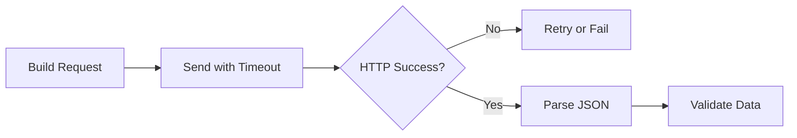

# Day 046 [Intermediate]: HTTP Requests with requests

## Index

- [Goal](#goal)
- [Prerequisites](#prerequisites)
- [Explanation](#explanation)
- [Topic by Topic](#topic-by-topic)
- [Key Concepts](#key-concepts)
- [Visual Concept Map](#visual-concept-map)
- [End-to-End Practical](#end-to-end-practical)
- [Hands-on Coding](#hands-on-coding)
- [Mini Exercise](#mini-exercise)
- [Assessment Quiz](#assessment-quiz)
- [Task](#task)
- [Self Check](#self-check)
- [Interview Questions and Answers](#interview-questions-and-answers)
- [Day 046 Outcome](#day-046-outcome)

## Goal

Learn to call HTTP APIs reliably using the requests library, with proper error handling, timeouts, and response validation.

## Prerequisites

- Day 045 completed
- Basic understanding of HTTP methods and JSON

## Explanation

The requests library is a simple and powerful way to make HTTP calls in Python. In real applications, the key is not only sending requests, but handling failures, retries, and malformed responses safely.

## Topic by Topic

### Topic 1: GET and POST Basics

Theory:
GET reads data, POST sends data to create or process resources.

Practical:
Start with clear request method selection based on API contract.

Code Example:

```python
import requests

response = requests.get("https://api.example.com/users")
print(response.status_code)
```

**Explanation:**
This topic explains GET and POST Basics in a practical Python context so you can write clear, reliable, and maintainable programs for real-world tasks.

**Key Points:**
- Understand the core idea behind GET and POST Basics.
- Apply the practical pattern with good readability and validation habits.
- Keep the solution maintainable, testable, and safe for production use where relevant.

### Topic 2: Query Params, Headers, and JSON Body

Theory:
params, headers, and json arguments structure requests cleanly.

Practical:
Avoid manual URL string concatenation where possible.

Code Example:

```python
import requests

params = {"page": 1, "size": 20}
headers = {"Authorization": "Bearer demo-token"}
response = requests.get("https://api.example.com/items", params=params, headers=headers)
```

**Explanation:**
This topic explains Query Params, Headers, and JSON Body in a practical Python context so you can write clear, reliable, and maintainable programs for real-world tasks.

**Key Points:**
- Understand the core idea behind Query Params, Headers, and JSON Body.
- Apply the practical pattern with good readability and validation habits.
- Keep the solution maintainable, testable, and safe for production use where relevant.

### Topic 3: Timeouts and Connection Safety

Theory:
Without timeout, requests can hang indefinitely.

Practical:
Always pass timeout in production services.

Code Example:

```python
import requests

response = requests.get("https://api.example.com/health", timeout=5)
print(response.ok)
```

**Explanation:**
This topic explains Timeouts and Connection Safety in a practical Python context so you can write clear, reliable, and maintainable programs for real-world tasks.

**Key Points:**
- Understand the core idea behind Timeouts and Connection Safety.
- Apply the practical pattern with good readability and validation habits.
- Keep the solution maintainable, testable, and safe for production use where relevant.

### Topic 4: Response Parsing and Validation

Theory:
Successful HTTP status does not always mean valid payload.

Practical:
Check status code, then parse JSON, then validate required keys.

Code Example:

```python
import requests

response = requests.get("https://api.example.com/profile", timeout=5)
response.raise_for_status()
data = response.json()
if "user_id" not in data:
  raise ValueError("Missing user_id")
```

**Explanation:**
This topic explains Response Parsing and Validation in a practical Python context so you can write clear, reliable, and maintainable programs for real-world tasks.

**Key Points:**
- Understand the core idea behind Response Parsing and Validation.
- Apply the practical pattern with good readability and validation habits.
- Keep the solution maintainable, testable, and safe for production use where relevant.

### Topic 5: Error Handling and Retry Strategy

Theory:
Network calls can fail transiently due to timeouts, DNS errors, or 5xx responses.

Practical:
Wrap calls in try/except and retry selected failure types.

Code Example:

```python
import time
import requests

def fetch_with_retry(url, retries=3):
  for attempt in range(1, retries + 1):
    try:
      r = requests.get(url, timeout=3)
      r.raise_for_status()
      return r.json()
    except requests.RequestException:
      if attempt == retries:
        raise
      time.sleep(0.5 * attempt)
```

**Explanation:**
This topic explains Error Handling and Retry Strategy in a practical Python context so you can write clear, reliable, and maintainable programs for real-world tasks.

**Key Points:**
- Understand the core idea behind Error Handling and Retry Strategy.
- Apply the practical pattern with good readability and validation habits.
- Keep the solution maintainable, testable, and safe for production use where relevant.

### Topic 6: Session Reuse and Performance

Theory:
requests.Session reuses TCP connections for efficiency.

Practical:
Use one session object when making repeated calls to same host.

Code Example:

```python
import requests

with requests.Session() as session:
  session.headers.update({"User-Agent": "my-app/1.0"})
  r = session.get("https://api.example.com/ping", timeout=5)
  print(r.status_code)
```

**Explanation:**
This topic explains Session Reuse and Performance in a practical Python context so you can write clear, reliable, and maintainable programs for real-world tasks.

**Key Points:**
- Understand the core idea behind Session Reuse and Performance.
- Apply the practical pattern with good readability and validation habits.
- Keep the solution maintainable, testable, and safe for production use where relevant.

## Key Concepts

- Choose correct HTTP method for intent
- Use params, headers, and json fields cleanly
- Always set request timeout
- Validate payload after response parsing
- Handle transient failures with controlled retries
- Reuse sessions for repeated API interactions

## Visual Concept Map



## End-to-End Practical

1. Create API helper with requests.Session.
2. Add GET endpoint with query parameters.
3. Add POST endpoint with JSON payload.
4. Add timeout, status checks, and retry wrapper.
5. Return validated Python objects only.

## Hands-on Coding

### Example 1: Case - Paginated User Fetch

Scenario:
Fetch users page by page from an external API.

```python
import requests

def fetch_users(page=1):
  r = requests.get("https://api.example.com/users", params={"page": page}, timeout=5)
  r.raise_for_status()
  return r.json()
```

### Example 2: Case - POST Order Payload

Scenario:
Send order request and handle failure responses.

```python
import requests

payload = {"product_id": 12, "qty": 2}
r = requests.post("https://api.example.com/orders", json=payload, timeout=5)
print(r.status_code)
```

### Example 3: Case - Safe API Wrapper

Scenario:
Build one reusable function for robust calls.

```python
import requests

def safe_get(url):
  try:
    response = requests.get(url, timeout=4)
    response.raise_for_status()
    return response.json()
  except requests.RequestException as exc:
    return {"error": str(exc)}
```

## Mini Exercise

Scenario:
Build a weather API helper with GET request, timeout, retry, and validation for required fields.

Expected output:

- One resilient API call function
- Retry behavior on transient failure
- Validated response dictionary

## Assessment Quiz

### Quiz Questions

1. Why should timeout be mandatory in requests?
2. What does raise_for_status do?
3. True or False: response.json always contains expected keys.
4. Why use requests.Session?
5. What errors should retry target first?

### Quiz Answers

1. Prevents hanging network calls
2. Raises exception for 4xx/5xx responses
3. False
4. Connection reuse and cleaner shared configuration
5. Transient failures like timeout and temporary server errors

## Task

- Implement one API client using Session
- Add timeout + retry + payload validation
- Log one success and one failure case

## Self Check

- You can build reliable HTTP calls in Python
- You can handle response and failure paths cleanly
- You can structure reusable API helper functions

## Interview Questions and Answers

### Beginner

**Question:** Why is requests popular in Python?

**Answer:** It offers simple and readable APIs for HTTP communication.

**Question:** What is a timeout in HTTP requests?

**Answer:** Maximum wait duration before raising an exception.

### Middle

**Question:** Why parse and validate JSON separately?

**Answer:** Parsed JSON may still miss required fields or have invalid structure.

**Question:** When should you use Session instead of direct requests.get?

**Answer:** For repeated calls to the same service with shared headers/auth.

### Advanced

**Question:** What makes API integration production-ready?

**Answer:** Timeouts, retries, status checks, payload validation, and observability.

**Question:** Why can aggressive retries be harmful?

**Answer:** They can amplify load during outages and worsen service instability.

## Day 046 Outcome

- You can make robust HTTP calls using requests
- You can design resilient API wrappers with validation and retries
- You are ready for web scraping workflows on Day 047
