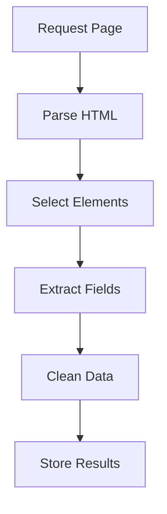

# Day 047 [Intermediate]: Web Scraping with BeautifulSoup

## Index

- [Goal](#goal)
- [Prerequisites](#prerequisites)
- [Explanation](#explanation)
- [Topic by Topic](#topic-by-topic)
- [Key Concepts](#key-concepts)
- [Visual Concept Map](#visual-concept-map)
- [End-to-End Practical](#end-to-end-practical)
- [Hands-on Coding](#hands-on-coding)
- [Mini Exercise](#mini-exercise)
- [Assessment Quiz](#assessment-quiz)
- [Task](#task)
- [Self Check](#self-check)
- [Interview Questions and Answers](#interview-questions-and-answers)
- [Day 047 Outcome](#day-047-outcome)

## Goal

Learn to extract structured data from HTML pages using BeautifulSoup with reliable selectors, cleanup logic, and responsible scraping practices.

## Prerequisites

- Day 046 completed
- Basic familiarity with HTML tags and attributes

## Explanation

BeautifulSoup parses HTML into a searchable tree. With clear selectors and data-cleaning rules, you can convert raw web pages into structured datasets for analysis or automation.

## Topic by Topic

### Topic 1: Fetching HTML Safely

Theory:
Scraping starts with HTTP request and valid response check.

Practical:
Use timeout and status checks before parsing content.

Code Example:

```python
import requests

r = requests.get("https://example.com", timeout=5)
r.raise_for_status()
html = r.text
```

**Explanation:**
This topic explains Fetching HTML Safely in a practical Python context so you can write clear, reliable, and maintainable programs for real-world tasks.

**Key Points:**
- Understand the core idea behind Fetching HTML Safely.
- Apply the practical pattern with good readability and validation habits.
- Keep the solution maintainable, testable, and safe for production use where relevant.

### Topic 2: Parsing and Basic Selectors

Theory:
BeautifulSoup supports tag search and CSS selectors.

Practical:
Prefer stable selectors tied to semantic classes or ids.

Code Example:

```python
from bs4 import BeautifulSoup

soup = BeautifulSoup(html, "html.parser")
title = soup.select_one("h1")
print(title.get_text(strip=True) if title else "missing")
```

**Explanation:**
This topic explains Parsing and Basic Selectors in a practical Python context so you can write clear, reliable, and maintainable programs for real-world tasks.

**Key Points:**
- Understand the core idea behind Parsing and Basic Selectors.
- Apply the practical pattern with good readability and validation habits.
- Keep the solution maintainable, testable, and safe for production use where relevant.

### Topic 3: Extracting Lists and Tables

Theory:
Many pages expose repeated item cards or rows.

Practical:
Loop over matched nodes and build dictionaries.

Code Example:

```python
items = []
for card in soup.select(".product-card"):
  name = card.select_one(".name")
  price = card.select_one(".price")
  items.append({
    "name": name.get_text(strip=True) if name else None,
    "price": price.get_text(strip=True) if price else None,
  })
```

**Explanation:**
This topic explains Extracting Lists and Tables in a practical Python context so you can write clear, reliable, and maintainable programs for real-world tasks.

**Key Points:**
- Understand the core idea behind Extracting Lists and Tables.
- Apply the practical pattern with good readability and validation habits.
- Keep the solution maintainable, testable, and safe for production use where relevant.

### Topic 4: Data Cleaning and Normalization

Theory:
Scraped text often contains whitespace, symbols, and inconsistent formats.

Practical:
Clean values before storing or comparing them.

Code Example:

```python
def clean_price(text):
  return float(text.replace("$", "").replace(",", "").strip())
```

**Explanation:**
This topic explains Data Cleaning and Normalization in a practical Python context so you can write clear, reliable, and maintainable programs for real-world tasks.

**Key Points:**
- Understand the core idea behind Data Cleaning and Normalization.
- Apply the practical pattern with good readability and validation habits.
- Keep the solution maintainable, testable, and safe for production use where relevant.

### Topic 5: Pagination and Incremental Scraping

Theory:
Data may span multiple pages.

Practical:
Iterate page URLs and append results with delay.

Code Example:

```python
import time

all_items = []
for page in range(1, 4):
  url = f"https://example.com/products?page={page}"
  # fetch, parse, append
  time.sleep(0.5)
```

**Explanation:**
This topic explains Pagination and Incremental Scraping in a practical Python context so you can write clear, reliable, and maintainable programs for real-world tasks.

**Key Points:**
- Understand the core idea behind Pagination and Incremental Scraping.
- Apply the practical pattern with good readability and validation habits.
- Keep the solution maintainable, testable, and safe for production use where relevant.

### Topic 6: Responsible Scraping Practices

Theory:
Scraping should respect site rules and system load.

Practical:
Review robots rules, avoid aggressive request rates, and include polite user-agent.

Code Example:

```python
headers = {"User-Agent": "LearningBot/1.0 (educational use)"}
```

**Explanation:**
This topic explains Responsible Scraping Practices in a practical Python context so you can write clear, reliable, and maintainable programs for real-world tasks.

**Key Points:**
- Understand the core idea behind Responsible Scraping Practices.
- Apply the practical pattern with good readability and validation habits.
- Keep the solution maintainable, testable, and safe for production use where relevant.

## Key Concepts

- Fetch page content safely before parsing
- Use resilient selectors for extraction
- Convert repeated HTML blocks to structured records
- Clean and normalize scraped values
- Handle pagination with controlled pacing
- Apply responsible and ethical scraping behavior

## Visual Concept Map



## End-to-End Practical

1. Fetch target page with requests.
2. Parse HTML with BeautifulSoup.
3. Extract repeated card data.
4. Clean text and numeric fields.
5. Save structured output as JSON or CSV.

## Hands-on Coding

### Example 1: Case - Headline Scraper

Scenario:
Collect article headlines from a news page.

```python
import requests
from bs4 import BeautifulSoup

r = requests.get("https://example.com/news", timeout=5)
soup = BeautifulSoup(r.text, "html.parser")
headlines = [h.get_text(strip=True) for h in soup.select("h2.headline")]
print(headlines)
```

### Example 2: Case - Product Card Extractor

Scenario:
Extract product name and price from grid layout.

```python
records = []
for card in soup.select(".card"):
  name = card.select_one(".title")
  price = card.select_one(".price")
  records.append({"name": name.get_text(strip=True), "price": price.get_text(strip=True)})
```

### Example 3: Case - Table to Rows

Scenario:
Extract tabular rows into list of dictionaries.

```python
rows = []
for tr in soup.select("table tr"):
  cols = [td.get_text(strip=True) for td in tr.select("td")]
  if cols:
    rows.append(cols)
```

## Mini Exercise

Scenario:
Scrape top 10 book titles and prices from a sample catalog page and export them as list of dictionaries.

Expected output:

- At least 10 extracted records
- Cleaned title and price fields
- Robust handling for missing elements

## Assessment Quiz

### Quiz Questions

1. Why should you validate HTTP response before parsing?
2. What is the benefit of CSS selectors in BeautifulSoup?
3. True or False: Raw scraped text is always analysis-ready.
4. Why add delay while paginating?
5. What is one ethical scraping rule?

### Quiz Answers

1. To avoid parsing invalid or error pages
2. Clear and flexible element targeting
3. False
4. To reduce server load and avoid throttling
5. Respect site policies and avoid abusive request rates

## Task

- Build one scraper for card or table data
- Add field cleaning and missing-data handling
- Export results to JSON or CSV format

## Self Check

- You can scrape and parse structured HTML sections
- You can clean data into usable format
- You can apply responsible scraping practices

## Interview Questions and Answers

### Beginner

**Question:** What does BeautifulSoup do?

**Answer:** It parses HTML/XML and helps extract data via tags and selectors.

**Question:** Why combine requests with BeautifulSoup?

**Answer:** requests fetches web content and BeautifulSoup parses it.

### Middle

**Question:** What makes a selector brittle?

**Answer:** Depending on unstable class names or deeply nested layout-only markup.

**Question:** How do you handle missing elements in scraping?

**Answer:** Check if selector result exists before reading text or attributes.

### Advanced

**Question:** How do you make scrapers maintainable over time?

**Answer:** Centralize selectors, add validation checks, and monitor schema drift.

**Question:** What is the main production risk in scraping pipelines?

**Answer:** Silent extraction failures when page structure changes unexpectedly.

## Day 047 Outcome

- You can build reliable BeautifulSoup scraping workflows
- You can extract, clean, and structure page data safely
- You are ready to build Flask APIs on Day 048
