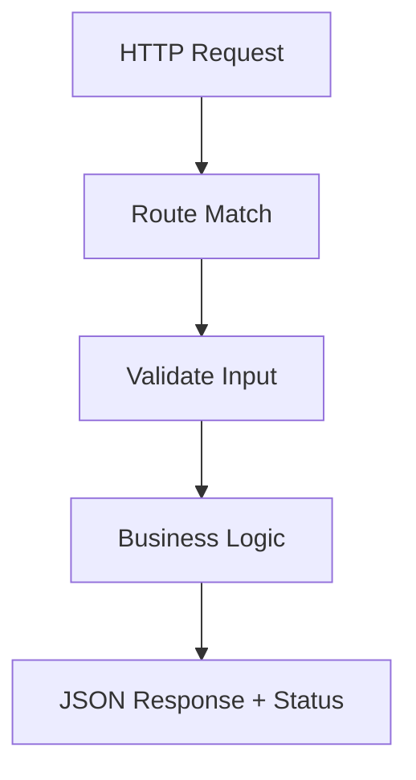

# Day 048 [Intermediate]: API Building with Flask Basics

## Index

- [Goal](#goal)
- [Prerequisites](#prerequisites)
- [Explanation](#explanation)
- [Topic by Topic](#topic-by-topic)
- [Key Concepts](#key-concepts)
- [Visual Concept Map](#visual-concept-map)
- [End-to-End Practical](#end-to-end-practical)
- [Hands-on Coding](#hands-on-coding)
- [Mini Exercise](#mini-exercise)
- [Assessment Quiz](#assessment-quiz)
- [Task](#task)
- [Self Check](#self-check)
- [Interview Questions and Answers](#interview-questions-and-answers)
- [Day 048 Outcome](#day-048-outcome)

## Goal

Learn to build clean JSON APIs in Flask with route design, request handling, validation, and consistent response structures.

## Prerequisites

- Day 047 completed
- Basic knowledge of HTTP methods and JSON payloads

## Explanation

Flask is a lightweight web framework that lets you quickly expose Python logic through HTTP endpoints. The main skill is not only creating routes, but designing predictable API behavior for clients.

## Topic by Topic

### Topic 1: Flask App and Route Basics

Theory:
Flask maps URL routes to Python functions.

Practical:
Start with health and simple resource endpoints.

Code Example:

```python
from flask import Flask, jsonify

app = Flask(__name__)

@app.get("/health")
def health():
  return jsonify({"status": "ok"})
```

**Explanation:**
This topic explains Flask App and Route Basics in a practical Python context so you can write clear, reliable, and maintainable programs for real-world tasks.

**Key Points:**
- Understand the core idea behind Flask App and Route Basics.
- Apply the practical pattern with good readability and validation habits.
- Keep the solution maintainable, testable, and safe for production use where relevant.

### Topic 2: Handling Request Data

Theory:
Clients send path params, query params, and JSON bodies.

Practical:
Use request.args and request.get_json safely.

Code Example:

```python
from flask import request

@app.get("/items")
def items():
  page = int(request.args.get("page", 1))
  return jsonify({"page": page})
```

**Explanation:**
This topic explains Handling Request Data in a practical Python context so you can write clear, reliable, and maintainable programs for real-world tasks.

**Key Points:**
- Understand the core idea behind Handling Request Data.
- Apply the practical pattern with good readability and validation habits.
- Keep the solution maintainable, testable, and safe for production use where relevant.

### Topic 3: Returning JSON and Status Codes

Theory:
APIs should return meaningful status codes for success and failure.

Practical:
Use 200 for success, 201 for created, 400 for client errors, 404 for missing resources.

Code Example:

```python
@app.post("/items")
def create_item():
  data = request.get_json(silent=True) or {}
  if "name" not in data:
    return jsonify({"error": "name is required"}), 400
  return jsonify({"id": 1, "name": data["name"]}), 201
```

**Explanation:**
This topic explains Returning JSON and Status Codes in a practical Python context so you can write clear, reliable, and maintainable programs for real-world tasks.

**Key Points:**
- Understand the core idea behind Returning JSON and Status Codes.
- Apply the practical pattern with good readability and validation habits.
- Keep the solution maintainable, testable, and safe for production use where relevant.

### Topic 4: In-Memory CRUD Pattern

Theory:
Before database integration, in-memory lists help prototype API flows.

Practical:
Implement create, list, get, update, and delete patterns.

Code Example:

```python
store = [{"id": 1, "name": "Notebook"}]

@app.get("/items/<int:item_id>")
def get_item(item_id):
  item = next((x for x in store if x["id"] == item_id), None)
  if not item:
    return jsonify({"error": "not found"}), 404
  return jsonify(item)
```

**Explanation:**
This topic explains In-Memory CRUD Pattern in a practical Python context so you can write clear, reliable, and maintainable programs for real-world tasks.

**Key Points:**
- Understand the core idea behind In-Memory CRUD Pattern.
- Apply the practical pattern with good readability and validation habits.
- Keep the solution maintainable, testable, and safe for production use where relevant.

### Topic 5: Error Handling and API Consistency

Theory:
Clients depend on stable response schemas.

Practical:
Return predictable keys like data and error.

Code Example:

```python
@app.errorhandler(404)
def not_found(_):
  return jsonify({"error": "resource not found"}), 404
```

**Explanation:**
This topic explains Error Handling and API Consistency in a practical Python context so you can write clear, reliable, and maintainable programs for real-world tasks.

**Key Points:**
- Understand the core idea behind Error Handling and API Consistency.
- Apply the practical pattern with good readability and validation habits.
- Keep the solution maintainable, testable, and safe for production use where relevant.

### Topic 6: API Design Best Practices

Theory:
Naming, versioning, and validation strategy affect maintainability.

Practical:
Keep endpoints resource-based and avoid action-heavy route names.

Code Example:

```python
# Prefer /api/v1/orders over /doCreateOrder style endpoints.
```

**Explanation:**
This topic explains API Design Best Practices in a practical Python context so you can write clear, reliable, and maintainable programs for real-world tasks.

**Key Points:**
- Understand the core idea behind API Design Best Practices.
- Apply the practical pattern with good readability and validation habits.
- Keep the solution maintainable, testable, and safe for production use where relevant.

## Key Concepts

- Flask route decorators define endpoint behavior
- Request data can come from path, query, and body
- Status codes should reflect outcome clearly
- CRUD structure gives clean API baseline
- Error responses should be consistent
- Resource-oriented naming improves long-term API design

## Visual Concept Map



## End-to-End Practical

1. Create Flask app with /health endpoint.
2. Build in-memory items CRUD routes.
3. Add input validation on POST and PUT.
4. Return consistent success and error payloads.
5. Test endpoints with curl or Postman.

## Hands-on Coding

### Example 1: Case - Basic Health and Version API

Scenario:
Expose service status and API version.

```python
@app.get("/api/v1/info")
def info():
  return jsonify({"service": "inventory", "version": "1.0.0"})
```

### Example 2: Case - Create and List Products

Scenario:
Store incoming products and return all entries.

```python
products = []

@app.post("/api/v1/products")
def create_product():
  payload = request.get_json(silent=True) or {}
  if "name" not in payload:
    return jsonify({"error": "name required"}), 400
  products.append(payload)
  return jsonify(payload), 201

@app.get("/api/v1/products")
def list_products():
  return jsonify(products)
```

### Example 3: Case - Update with Not Found Handling

Scenario:
Update product by id with proper 404 behavior.

```python
@app.put("/api/v1/products/<int:pid>")
def update_product(pid):
  return jsonify({"id": pid, "updated": True})
```

## Mini Exercise

Scenario:
Build a notes API with routes for create, list, get by id, and delete. Include validation for title field.

Expected output:

- Four working routes
- Validation for required fields
- Correct status codes for success and failures

## Assessment Quiz

### Quiz Questions

1. Why should APIs use consistent response shape?
2. What is the difference between 200 and 201?
3. True or False: request.get_json can return None.
4. Why is resource-based routing preferred?
5. What is one risk of missing validation?

### Quiz Answers

1. It simplifies client parsing and reduces integration bugs
2. 200 is generic success, 201 indicates resource creation
3. True
4. It aligns with REST design and readability
5. Invalid data can cause runtime and integrity issues

## Task

- Build one CRUD API resource in Flask
- Add validation and structured error responses
- Test all endpoints with valid and invalid payloads

## Self Check

- You can build and run Flask API routes
- You can map route behavior to correct status codes
- You can enforce basic payload validation

## Interview Questions and Answers

### Beginner

**Question:** Why use Flask for API prototyping?

**Answer:** It is lightweight, readable, and quick to set up.

**Question:** What does jsonify do?

**Answer:** It converts Python objects to JSON HTTP responses.

### Middle

**Question:** How do you read query parameters in Flask?

**Answer:** Using request.args with optional defaults.

**Question:** Why should APIs return explicit status codes?

**Answer:** Clients rely on status codes for flow control and error handling.

### Advanced

**Question:** What makes an API maintainable as it scales?

**Answer:** Consistent response contracts, validation layers, versioning, and clear route semantics.

**Question:** What common anti-pattern appears in beginner Flask APIs?

**Answer:** Returning success code with error payloads or inconsistent schema formats.

## Day 048 Outcome

- You can build practical Flask JSON APIs with robust response handling
- You can design routes and validations in a maintainable way
- You are ready for Flask routing and template rendering on Day 049
