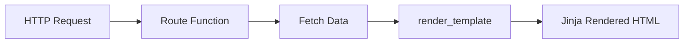

# Day 049 [Intermediate]: Flask Routing Templates

## Index

- [Goal](#goal)
- [Prerequisites](#prerequisites)
- [Explanation](#explanation)
- [Topic by Topic](#topic-by-topic)
- [Key Concepts](#key-concepts)
- [Visual Concept Map](#visual-concept-map)
- [End-to-End Practical](#end-to-end-practical)
- [Hands-on Coding](#hands-on-coding)
- [Mini Exercise](#mini-exercise)
- [Assessment Quiz](#assessment-quiz)
- [Task](#task)
- [Self Check](#self-check)
- [Interview Questions and Answers](#interview-questions-and-answers)
- [Day 049 Outcome](#day-049-outcome)

## Goal

Learn Flask routing patterns and Jinja template rendering to build dynamic server-side pages with clean URL design.

## Prerequisites

- Day 048 completed
- Basic understanding of HTML and Flask request-response flow

## Explanation

Flask can power both APIs and web pages. Routing decides which function handles each URL, while Jinja templates allow dynamic HTML rendering using Python data.

## Topic by Topic

### Topic 1: Route Mapping Fundamentals

Theory:
Routes connect URL patterns to view functions.

Practical:
Use clear route names and HTTP method constraints.

Code Example:

```python
from flask import Flask

app = Flask(__name__)

@app.get("/")
def home():
  return "Welcome"
```

**Explanation:**
This topic explains Route Mapping Fundamentals in a practical Python context so you can write clear, reliable, and maintainable programs for real-world tasks.

**Key Points:**
- Understand the core idea behind Route Mapping Fundamentals.
- Apply the practical pattern with good readability and validation habits.
- Keep the solution maintainable, testable, and safe for production use where relevant.

### Topic 2: Dynamic Route Parameters

Theory:
Route params capture values from URL path.

Practical:
Use converters like int for type-safe path segments.

Code Example:

```python
@app.get("/users/<int:user_id>")
def user_detail(user_id):
  return f"User {user_id}"
```

**Explanation:**
This topic explains Dynamic Route Parameters in a practical Python context so you can write clear, reliable, and maintainable programs for real-world tasks.

**Key Points:**
- Understand the core idea behind Dynamic Route Parameters.
- Apply the practical pattern with good readability and validation habits.
- Keep the solution maintainable, testable, and safe for production use where relevant.

### Topic 3: Rendering Templates with Data

Theory:
render_template injects Python variables into HTML templates.

Practical:
Store templates in templates folder and pass named context values.

Code Example:

```python
from flask import render_template

@app.get("/profile")
def profile():
  return render_template("profile.html", name="Riya", role="Analyst")
```

**Explanation:**
This topic explains Rendering Templates with Data in a practical Python context so you can write clear, reliable, and maintainable programs for real-world tasks.

**Key Points:**
- Understand the core idea behind Rendering Templates with Data.
- Apply the practical pattern with good readability and validation habits.
- Keep the solution maintainable, testable, and safe for production use where relevant.

### Topic 4: Jinja Expressions, Loops, and Conditions

Theory:
Jinja supports variable interpolation, loops, and branching in HTML.

Practical:
Use templates for presentation, keep business logic in Python.

Code Example:

```html
<h1>{{ title }}</h1>
<ul>
  
  <li>{{ item }}</li>
  
</ul>
```

**Explanation:**
This topic explains Jinja Expressions, Loops, and Conditions in a practical Python context so you can write clear, reliable, and maintainable programs for real-world tasks.

**Key Points:**
- Understand the core idea behind Jinja Expressions, Loops, and Conditions.
- Apply the practical pattern with good readability and validation habits.
- Keep the solution maintainable, testable, and safe for production use where relevant.

### Topic 5: Layout Reuse with Template Inheritance

Theory:
Shared layout reduces duplication across pages.

Practical:
Use base.html with block sections for child pages.

Code Example:

```html
 
<p>Dashboard page</p>

```

**Explanation:**
This topic explains Layout Reuse with Template Inheritance in a practical Python context so you can write clear, reliable, and maintainable programs for real-world tasks.

**Key Points:**
- Understand the core idea behind Layout Reuse with Template Inheritance.
- Apply the practical pattern with good readability and validation habits.
- Keep the solution maintainable, testable, and safe for production use where relevant.

### Topic 6: URL Building and Maintainability

Theory:
Hardcoded URLs become fragile during refactors.

Practical:
Use url_for for route-safe link generation.

Code Example:

```python
from flask import url_for

# url_for("user_detail", user_id=5)
```

**Explanation:**
This topic explains URL Building and Maintainability in a practical Python context so you can write clear, reliable, and maintainable programs for real-world tasks.

**Key Points:**
- Understand the core idea behind URL Building and Maintainability.
- Apply the practical pattern with good readability and validation habits.
- Keep the solution maintainable, testable, and safe for production use where relevant.

## Key Concepts

- Routes should be explicit and readable
- Dynamic path params enable resource-level views
- Templates separate presentation from Python logic
- Jinja supports loops and conditions for dynamic UI
- Inheritance keeps templates DRY and scalable
- url_for improves routing maintainability

## Visual Concept Map



## End-to-End Practical

1. Create base layout template.
2. Build home and user routes.
3. Pass dynamic list data to templates.
4. Add conditional block for empty states.
5. Use url_for in navigation links.

## Hands-on Coding

### Example 1: Case - Blog Home Route

Scenario:
Render list of post titles in home page.

```python
@app.get("/blog")
def blog_home():
  posts = ["Intro", "Flask Routing", "Templates"]
  return render_template("blog.html", posts=posts)
```

### Example 2: Case - Product Detail Page

Scenario:
Display product using dynamic id route.

```python
@app.get("/products/<int:pid>")
def product_detail(pid):
  return render_template("product.html", pid=pid)
```

### Example 3: Case - Navigation with url_for

Scenario:
Generate links robustly in templates.

```html
<a href="{{ url_for('blog_home') }}">Blog</a>
```

## Mini Exercise

Scenario:
Build a mini portfolio site with routes for home, projects, and contact. Use one shared base template and render dynamic project list.

Expected output:

- Three routes
- Template inheritance with base layout
- One dynamic list rendered via Jinja loop

## Assessment Quiz

### Quiz Questions

1. Why use render_template instead of returning plain HTML strings?
2. What does <int:id> do in a route?
3. True or False: Jinja templates should contain complex business logic.
4. Why is url_for preferred over hardcoded links?
5. What problem does template inheritance solve?

### Quiz Answers

1. It enables dynamic and maintainable page generation
2. It captures path variable and enforces integer conversion
3. False
4. It keeps links stable across route refactors
5. It removes duplicated layout code

## Task

- Build three Flask page routes with templates
- Add one dynamic route with typed parameter
- Use base template inheritance and url_for links

## Self Check

- You can design clean route structures
- You can render dynamic data in templates
- You can keep page layer maintainable with Jinja patterns

## Interview Questions and Answers

### Beginner

**Question:** What is a route in Flask?

**Answer:** A URL pattern mapped to a Python function.

**Question:** What is Jinja used for?

**Answer:** Dynamic HTML templating in Flask applications.

### Middle

**Question:** Why use template inheritance?

**Answer:** It centralizes common layout and avoids repetition.

**Question:** How do dynamic route parameters help?

**Answer:** They allow resource-specific pages without creating many static routes.

### Advanced

**Question:** What architecture issue appears when template logic grows too much?

**Answer:** Business rules leak into view layer, reducing maintainability and testability.

**Question:** How do you keep Flask page routes scalable?

**Answer:** Group routes logically, keep views thin, and use reusable template components.

## Day 049 Outcome

- You can implement robust Flask routing and template flows
- You can render dynamic page content cleanly
- You are ready for forms and validation patterns on Day 050
