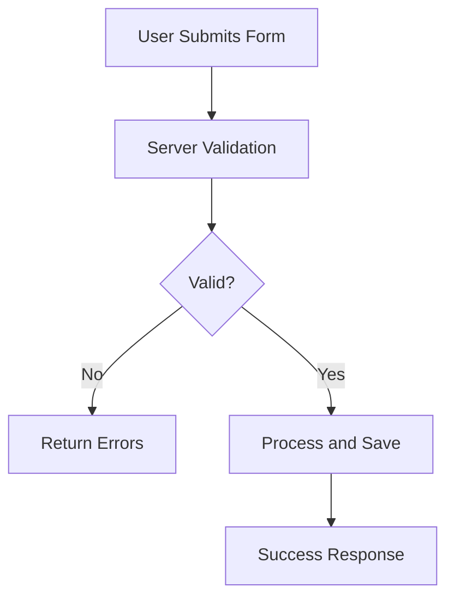

# Day 050 [Intermediate]: Flask Forms and Validation

## Index

- [Goal](#goal)
- [Prerequisites](#prerequisites)
- [Explanation](#explanation)
- [Topic by Topic](#topic-by-topic)
- [Key Concepts](#key-concepts)
- [Visual Concept Map](#visual-concept-map)
- [End-to-End Practical](#end-to-end-practical)
- [Hands-on Coding](#hands-on-coding)
- [Mini Exercise](#mini-exercise)
- [Assessment Quiz](#assessment-quiz)
- [Task](#task)
- [Self Check](#self-check)
- [Interview Questions and Answers](#interview-questions-and-answers)
- [Day 050 Outcome](#day-050-outcome)

## Goal

Build robust Flask form flows with server-side validation, safe error feedback, and clean user input handling.

## Prerequisites

- Day 049 completed
- Familiarity with Flask routes, templates, and request object

## Explanation

Forms are central to user interaction in web apps. Validation should never rely only on browser checks; server-side rules protect data quality and security.

## Topic by Topic

### Topic 1: Form Handling with GET and POST

Theory:
Typical form flow renders page on GET and processes submission on POST.

Practical:
Keep route behavior explicit for readability.

Code Example:

```python
from flask import Flask, request, render_template

app = Flask(__name__)

@app.route("/contact", methods=["GET", "POST"])
def contact():
  if request.method == "POST":
    name = request.form.get("name", "")
    return f"Received: {name}"
  return render_template("contact.html")
```

**Explanation:**
This topic explains Form Handling with GET and POST in a practical Python context so you can write clear, reliable, and maintainable programs for real-world tasks.

**Key Points:**
- Understand the core idea behind Form Handling with GET and POST.
- Apply the practical pattern with good readability and validation habits.
- Keep the solution maintainable, testable, and safe for production use where relevant.

### Topic 2: Manual Server-Side Validation

Theory:
Validation rules enforce required fields, length bounds, and format checks.

Practical:
Collect errors in list or dictionary and display them in template.

Code Example:

```python
def validate_contact(data):
  errors = {}
  if not data.get("name", "").strip():
    errors["name"] = "Name is required"
  if "@" not in data.get("email", ""):
    errors["email"] = "Valid email is required"
  return errors
```

**Explanation:**
This topic explains Manual Server-Side Validation in a practical Python context so you can write clear, reliable, and maintainable programs for real-world tasks.

**Key Points:**
- Understand the core idea behind Manual Server-Side Validation.
- Apply the practical pattern with good readability and validation habits.
- Keep the solution maintainable, testable, and safe for production use where relevant.

### Topic 3: WTForms Basics

Theory:
WTForms provides structured fields and validators.

Practical:
Useful for larger apps with many forms.

Code Example:

```python
from wtforms import Form, StringField
from wtforms.validators import DataRequired, Email

class ContactForm(Form):
  name = StringField("Name", [DataRequired()])
  email = StringField("Email", [DataRequired(), Email()])
```

**Explanation:**
This topic explains WTForms Basics in a practical Python context so you can write clear, reliable, and maintainable programs for real-world tasks.

**Key Points:**
- Understand the core idea behind WTForms Basics.
- Apply the practical pattern with good readability and validation habits.
- Keep the solution maintainable, testable, and safe for production use where relevant.

### Topic 4: Error Feedback in Templates

Theory:
Users should see field-specific validation messages.

Practical:
Render error messages near corresponding inputs.

Code Example:

```html

<p class="error">{{ errors.name }}</p>

```

**Explanation:**
This topic explains Error Feedback in Templates in a practical Python context so you can write clear, reliable, and maintainable programs for real-world tasks.

**Key Points:**
- Understand the core idea behind Error Feedback in Templates.
- Apply the practical pattern with good readability and validation habits.
- Keep the solution maintainable, testable, and safe for production use where relevant.

### Topic 5: CSRF and Security Considerations

Theory:
Forms can be vulnerable to CSRF and malicious payloads.

Practical:
Enable CSRF protection and sanitize data paths.

Code Example:

```python
# In Flask-WTF, include csrf_token in forms and configure secret key.
```

**Explanation:**
This topic explains CSRF and Security Considerations in a practical Python context so you can write clear, reliable, and maintainable programs for real-world tasks.

**Key Points:**
- Understand the core idea behind CSRF and Security Considerations.
- Apply the practical pattern with good readability and validation habits.
- Keep the solution maintainable, testable, and safe for production use where relevant.

### Topic 6: Validation Architecture and Reuse

Theory:
As forms grow, duplicated validation logic becomes hard to maintain.

Practical:
Centralize validation rules and return normalized error structures.

Code Example:

```python
# Keep validation helpers reusable across routes and API endpoints.
```

**Explanation:**
This topic explains Validation Architecture and Reuse in a practical Python context so you can write clear, reliable, and maintainable programs for real-world tasks.

**Key Points:**
- Understand the core idea behind Validation Architecture and Reuse.
- Apply the practical pattern with good readability and validation habits.
- Keep the solution maintainable, testable, and safe for production use where relevant.

## Key Concepts

- GET renders form; POST processes submission
- Server-side validation is mandatory
- Field-level errors improve user experience
- WTForms helps organize complex form logic
- CSRF protection is critical for state-changing forms
- Centralized validation improves maintainability

## Visual Concept Map



## End-to-End Practical

1. Build one registration form template.
2. Create GET and POST route.
3. Add required-field and email validation.
4. Display inline error messages.
5. Save valid data and show success confirmation.

## Hands-on Coding

### Example 1: Case - Contact Form Validation

Scenario:
Validate name and email for a contact form.

```python
@app.route("/contact", methods=["GET", "POST"])
def contact_form():
  errors = {}
  if request.method == "POST":
    errors = validate_contact(request.form)
    if not errors:
      return "Form submitted successfully"
  return render_template("contact.html", errors=errors)
```

### Example 2: Case - Registration Form Rules

Scenario:
Add minimum password length and username checks.

```python
def validate_register(data):
  errs = {}
  if len(data.get("password", "")) < 8:
    errs["password"] = "Password must be at least 8 characters"
  return errs
```

### Example 3: Case - Preserve Input on Error

Scenario:
Re-render previous user input when validation fails.

```html
<input name="name" value="{{ request.form.get('name', '') }}" />
```

## Mini Exercise

Scenario:
Create a feedback form with fields: name, email, message. Validate all fields and show individual error messages. Add success message for valid submissions.

Expected output:

- One GET/POST route
- Validation for all fields
- Error rendering plus success response

## Assessment Quiz

### Quiz Questions

1. Why is browser-only validation insufficient?
2. What does CSRF protection prevent?
3. True or False: Validation should happen after saving to database.
4. Why show field-specific errors?
5. What is one benefit of reusable validation helpers?

### Quiz Answers

1. Clients can bypass browser checks
2. Unauthorized cross-site form submissions
3. False
4. It helps users correct issues quickly
5. Consistent rules across routes and easier maintenance

## Task

- Build one validated form flow in Flask
- Add CSRF protection if using Flask-WTF
- Write tests for valid and invalid form submissions

## Self Check

- You can implement robust Flask form handling
- You can validate and report input issues safely
- You can design reusable validation architecture

## Interview Questions and Answers

### Beginner

**Question:** Why is server-side validation required?

**Answer:** Because client-side checks can be bypassed and are not trustworthy.

**Question:** What HTTP methods are common in form flow?

**Answer:** GET for rendering and POST for submission.

### Middle

**Question:** How do you keep form routes clean?

**Answer:** Separate validation logic into helper functions and keep response logic explicit.

**Question:** What is a common form security requirement?

**Answer:** CSRF protection on state-changing endpoints.

### Advanced

**Question:** How do you scale validation across many forms?

**Answer:** Use centralized schema or form classes, shared validators, and consistent error contracts.

**Question:** What anti-pattern should be avoided in form processing?

**Answer:** Mixing validation, persistence, and rendering logic in one large route function.

## Day 050 Outcome

- You can build secure and user-friendly Flask form workflows
- You can apply reusable server-side validation patterns
- You are ready to continue with advanced Flask architecture topics next
