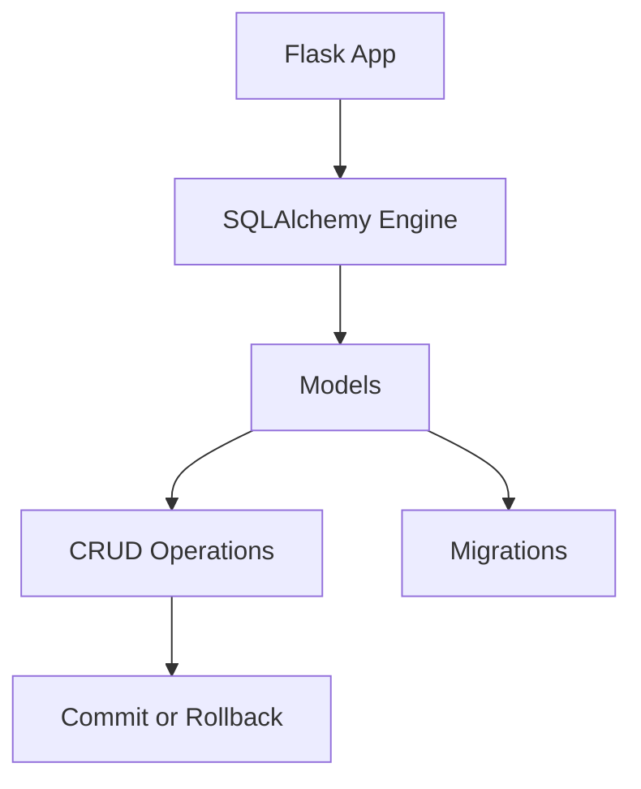

# Day 051 [Intermediate]: Flask Database with SQLAlchemy

## Index

- [Goal](#goal)
- [Prerequisites](#prerequisites)
- [Explanation](#explanation)
- [Topic by Topic](#topic-by-topic)
- [Key Concepts](#key-concepts)
- [Visual Concept Map](#visual-concept-map)
- [End-to-End Practical](#end-to-end-practical)
- [Hands-on Coding](#hands-on-coding)
- [Mini Exercise](#mini-exercise)
- [Assessment Quiz](#assessment-quiz)
- [Task](#task)
- [Self Check](#self-check)
- [Interview Questions and Answers](#interview-questions-and-answers)
- [Day 051 Outcome](#day-051-outcome)

## Goal

Learn to integrate SQLAlchemy with Flask for data modeling, CRUD operations, and safe session handling.

## Prerequisites

- Day 050 completed
- Basic SQL concepts and Flask route knowledge

## Explanation

SQLAlchemy provides an ORM layer that maps Python classes to database tables. With Flask-SQLAlchemy, you can build cleaner persistence logic and avoid raw SQL in most common operations.

## Topic by Topic

### Topic 1: Flask-SQLAlchemy Setup

Theory:
You configure database URI and initialize SQLAlchemy with app.

Practical:
Use environment-based DB URI for flexible dev and prod setups.

Code Example:

```python
from flask import Flask
from flask_sqlalchemy import SQLAlchemy

app = Flask(__name__)
app.config["SQLALCHEMY_DATABASE_URI"] = "sqlite:///app.db"
app.config["SQLALCHEMY_TRACK_MODIFICATIONS"] = False
db = SQLAlchemy(app)
```

**Explanation:**
This topic explains Flask-SQLAlchemy Setup in a practical Python context so you can write clear, reliable, and maintainable programs for real-world tasks.

**Key Points:**
- Understand the core idea behind Flask-SQLAlchemy Setup.
- Apply the practical pattern with good readability and validation habits.
- Keep the solution maintainable, testable, and safe for production use where relevant.

### Topic 2: Model Definition and Constraints

Theory:
Models define columns, types, and constraints.

Practical:
Declare indexes and uniqueness for correctness and performance.

Code Example:

```python
class User(db.Model):
  id = db.Column(db.Integer, primary_key=True)
  email = db.Column(db.String(120), unique=True, nullable=False)
  name = db.Column(db.String(80), nullable=False)
```

**Explanation:**
This topic explains Model Definition and Constraints in a practical Python context so you can write clear, reliable, and maintainable programs for real-world tasks.

**Key Points:**
- Understand the core idea behind Model Definition and Constraints.
- Apply the practical pattern with good readability and validation habits.
- Keep the solution maintainable, testable, and safe for production use where relevant.

### Topic 3: CRUD Operations

Theory:
ORM methods map to create, read, update, and delete flows.

Practical:
Commit transactions deliberately and validate inputs first.

Code Example:

```python
new_user = User(email="riya@example.com", name="Riya")
db.session.add(new_user)
db.session.commit()

user = User.query.filter_by(email="riya@example.com").first()
```

**Explanation:**
This topic explains CRUD Operations in a practical Python context so you can write clear, reliable, and maintainable programs for real-world tasks.

**Key Points:**
- Understand the core idea behind CRUD Operations.
- Apply the practical pattern with good readability and validation habits.
- Keep the solution maintainable, testable, and safe for production use where relevant.

### Topic 4: Relationships and Joins

Theory:
Foreign keys and relationships model connected entities.

Practical:
Use relationship for readable linked data access.

Code Example:

```python
class Post(db.Model):
  id = db.Column(db.Integer, primary_key=True)
  title = db.Column(db.String(150), nullable=False)
  user_id = db.Column(db.Integer, db.ForeignKey("user.id"), nullable=False)

class User(db.Model):
  id = db.Column(db.Integer, primary_key=True)
  posts = db.relationship("Post", backref="author", lazy=True)
```

**Explanation:**
This topic explains Relationships and Joins in a practical Python context so you can write clear, reliable, and maintainable programs for real-world tasks.

**Key Points:**
- Understand the core idea behind Relationships and Joins.
- Apply the practical pattern with good readability and validation habits.
- Keep the solution maintainable, testable, and safe for production use where relevant.

### Topic 5: Migrations and Schema Evolution

Theory:
Schemas evolve; manual table recreation is unsafe in real projects.

Practical:
Use migration tools (Flask-Migrate/Alembic) for versioned schema changes.

Code Example:

```bash
flask db init
flask db migrate -m "create user table"
flask db upgrade
```

**Explanation:**
This topic explains Migrations and Schema Evolution in a practical Python context so you can write clear, reliable, and maintainable programs for real-world tasks.

**Key Points:**
- Understand the core idea behind Migrations and Schema Evolution.
- Apply the practical pattern with good readability and validation habits.
- Keep the solution maintainable, testable, and safe for production use where relevant.

### Topic 6: Session and Transaction Best Practices

Theory:
Unmanaged sessions can leave inconsistent state after failures.

Practical:
Rollback on exceptions and keep transactions focused.

Code Example:

```python
try:
  db.session.add(User(email="a@a.com", name="A"))
  db.session.commit()
except Exception:
  db.session.rollback()
  raise
```

**Explanation:**
This topic explains Session and Transaction Best Practices in a practical Python context so you can write clear, reliable, and maintainable programs for real-world tasks.

**Key Points:**
- Understand the core idea behind Session and Transaction Best Practices.
- Apply the practical pattern with good readability and validation habits.
- Keep the solution maintainable, testable, and safe for production use where relevant.

## Key Concepts

- ORM maps Python classes to relational tables
- Models should define clear constraints
- CRUD operations need validation and explicit commits
- Relationships simplify linked data access
- Migrations keep schema changes safe and traceable
- Rollback strategy protects transaction integrity

## Visual Concept Map



## End-to-End Practical

1. Configure Flask app with SQLite.
2. Create User and Post models.
3. Add CRUD routes for users.
4. Introduce migration for one new column.
5. Add transaction rollback in failure path.

## Hands-on Coding

### Example 1: Case - User Registration Persistence

Scenario:
Save new users and reject duplicate emails.

```python
existing = User.query.filter_by(email=payload["email"]).first()
if existing:
  return {"error": "email already exists"}, 400
db.session.add(User(email=payload["email"], name=payload["name"]))
db.session.commit()
```

### Example 2: Case - Post Listing with Author

Scenario:
Return post and author name together.

```python
posts = Post.query.all()
data = [{"title": p.title, "author": p.author.name} for p in posts]
```

### Example 3: Case - Safe Update Flow

Scenario:
Update user profile and rollback on failure.

```python
user = User.query.get(user_id)
user.name = "Updated"
db.session.commit()
```

## Mini Exercise

Scenario:
Build a mini notes API with SQLAlchemy models Note and Category, including create and list endpoints.

Expected output:

- Two related models
- Persisted create endpoint
- List endpoint with linked category data

## Assessment Quiz

### Quiz Questions

1. Why use ORM instead of raw SQL for many app flows?
2. What problem do migrations solve?
3. True or False: You should skip rollback on failed transaction.
4. Why add unique constraints at database level?
5. What is one risk of large long-running transactions?

### Quiz Answers

1. Cleaner model-driven development and reduced boilerplate
2. Safe, versioned schema changes
3. False
4. Enforce data integrity beyond application checks
5. Locks and inconsistent state under failure

## Task

- Create one Flask app with SQLAlchemy models and relationships
- Implement two CRUD routes using ORM
- Add migration and one rollback-protected transaction

## Self Check

- You can configure and use SQLAlchemy in Flask
- You can design models and relationships correctly
- You can manage transactions safely

## Interview Questions and Answers

### Beginner

**Question:** What is SQLAlchemy in simple terms?

**Answer:** It is a Python toolkit/ORM that maps classes to database tables.

**Question:** Why are migrations important?

**Answer:** They manage schema changes safely as the app evolves.

### Middle

**Question:** How do you prevent duplicate user emails?

**Answer:** Add unique constraint in model and check before insert.

**Question:** Why call rollback after failed commit?

**Answer:** To reset session state and avoid partial/invalid transaction context.

### Advanced

**Question:** What is a common ORM performance pitfall?

**Answer:** N+1 query pattern when loading related data lazily without planning.

**Question:** How do teams keep data layer maintainable?

**Answer:** Use clear model boundaries, migration discipline, and repository/service patterns where needed.

## Day 051 Outcome

- You can build data-driven Flask apps with SQLAlchemy
- You can manage schema evolution and transaction safety
- You are ready for authentication workflows on Day 052
