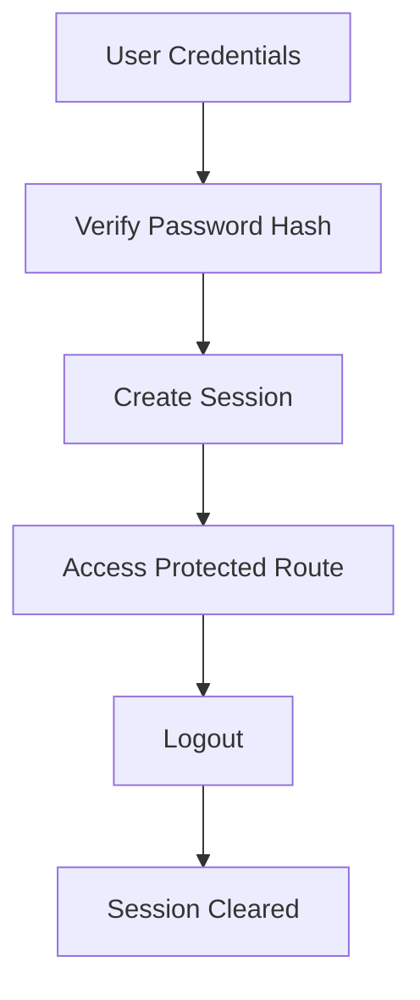

# Day 052 [Intermediate]: Flask Authentication

## Index

- [Goal](#goal)
- [Prerequisites](#prerequisites)
- [Explanation](#explanation)
- [Topic by Topic](#topic-by-topic)
- [Key Concepts](#key-concepts)
- [Visual Concept Map](#visual-concept-map)
- [End-to-End Practical](#end-to-end-practical)
- [Hands-on Coding](#hands-on-coding)
- [Mini Exercise](#mini-exercise)
- [Assessment Quiz](#assessment-quiz)
- [Task](#task)
- [Self Check](#self-check)
- [Interview Questions and Answers](#interview-questions-and-answers)
- [Day 052 Outcome](#day-052-outcome)

## Goal

Build secure user authentication in Flask with password hashing, session management, route protection, and logout flow.

## Prerequisites

- Day 051 completed
- Comfortable with Flask routes and SQLAlchemy models

## Explanation

Authentication confirms user identity and controls access to protected resources. A production-ready flow includes secure password storage, login validation, session handling, and defense against common attack vectors.

## Topic by Topic

### Topic 1: Authentication Flow Design

Theory:
Core flow is register, login, session establish, authorize, logout.

Practical:
Define this flow explicitly before implementation.

Code Example:

```python
# register -> login -> access protected routes -> logout
```

**Explanation:**
This topic explains Authentication Flow Design in a practical Python context so you can write clear, reliable, and maintainable programs for real-world tasks.

**Key Points:**
- Understand the core idea behind Authentication Flow Design.
- Apply the practical pattern with good readability and validation habits.
- Keep the solution maintainable, testable, and safe for production use where relevant.

### Topic 2: Password Hashing

Theory:
Passwords must never be stored in plain text.

Practical:
Use Werkzeug password hash helpers.

Code Example:

```python
from werkzeug.security import generate_password_hash, check_password_hash

hashed = generate_password_hash("secret123")
print(check_password_hash(hashed, "secret123"))
```

**Explanation:**
This topic explains Password Hashing in a practical Python context so you can write clear, reliable, and maintainable programs for real-world tasks.

**Key Points:**
- Understand the core idea behind Password Hashing.
- Apply the practical pattern with good readability and validation habits.
- Keep the solution maintainable, testable, and safe for production use where relevant.

### Topic 3: Session-Based Login

Theory:
After successful login, session stores authenticated identity.

Practical:
Set secret key and store minimal session data.

Code Example:

```python
from flask import session

session["user_id"] = user.id
session["logged_in"] = True
```

**Explanation:**
This topic explains Session-Based Login in a practical Python context so you can write clear, reliable, and maintainable programs for real-world tasks.

**Key Points:**
- Understand the core idea behind Session-Based Login.
- Apply the practical pattern with good readability and validation habits.
- Keep the solution maintainable, testable, and safe for production use where relevant.

### Topic 4: Protecting Routes

Theory:
Unauthorized users should not access restricted endpoints.

Practical:
Create login_required decorator or use Flask-Login.

Code Example:

```python
from functools import wraps
from flask import session, redirect, url_for

def login_required(fn):
  @wraps(fn)
  def wrapper(*args, **kwargs):
    if not session.get("logged_in"):
      return redirect(url_for("login"))
    return fn(*args, **kwargs)
  return wrapper
```

**Explanation:**
This topic explains Protecting Routes in a practical Python context so you can write clear, reliable, and maintainable programs for real-world tasks.

**Key Points:**
- Understand the core idea behind Protecting Routes.
- Apply the practical pattern with good readability and validation habits.
- Keep the solution maintainable, testable, and safe for production use where relevant.

### Topic 5: Logout and Session Expiry

Theory:
Logout should invalidate current session immediately.

Practical:
Clear session and redirect safely.

Code Example:

```python
from flask import session, redirect, url_for

@app.get("/logout")
def logout():
  session.clear()
  return redirect(url_for("login"))
```

**Explanation:**
This topic explains Logout and Session Expiry in a practical Python context so you can write clear, reliable, and maintainable programs for real-world tasks.

**Key Points:**
- Understand the core idea behind Logout and Session Expiry.
- Apply the practical pattern with good readability and validation habits.
- Keep the solution maintainable, testable, and safe for production use where relevant.

### Topic 6: Security Hardening Basics

Theory:
Auth systems need brute-force protection and secure cookie settings.

Practical:
Use rate limits, CSRF protection, and secure session cookie flags.

Code Example:

```python
app.config.update(
  SESSION_COOKIE_HTTPONLY=True,
  SESSION_COOKIE_SAMESITE="Lax"
)
```

**Explanation:**
This topic explains Security Hardening Basics in a practical Python context so you can write clear, reliable, and maintainable programs for real-world tasks.

**Key Points:**
- Understand the core idea behind Security Hardening Basics.
- Apply the practical pattern with good readability and validation habits.
- Keep the solution maintainable, testable, and safe for production use where relevant.

## Key Concepts

- Authentication flow should be explicit and testable
- Password hashing is mandatory
- Sessions manage authenticated state
- Protected routes enforce authorization boundaries
- Logout must fully clear session state
- Cookie and CSRF security settings reduce attack risk

## Visual Concept Map



## End-to-End Practical

1. Create User model with hashed password storage.
2. Build register and login routes.
3. Add login_required protection for dashboard route.
4. Add logout and session clear flow.
5. Test invalid login and unauthorized access behavior.

## Hands-on Coding

### Example 1: Case - Register Route

Scenario:
Accept username and password, hash password, store user.

```python
password_hash = generate_password_hash(form_password)
user = User(email=form_email, password_hash=password_hash)
db.session.add(user)
db.session.commit()
```

### Example 2: Case - Login Validation

Scenario:
Validate credentials and initialize session.

```python
user = User.query.filter_by(email=form_email).first()
if not user or not check_password_hash(user.password_hash, form_password):
  return {"error": "invalid credentials"}, 401
session["user_id"] = user.id
```

### Example 3: Case - Protected Dashboard

Scenario:
Require login to access dashboard route.

```python
@app.get("/dashboard")
@login_required
def dashboard():
  return "Welcome"
```

## Mini Exercise

Scenario:
Implement authentication for a simple notes app with register, login, logout, and a protected notes route.

Expected output:

- Secure hashed password storage
- Session-based login and logout
- Protected route blocked for anonymous users

## Assessment Quiz

### Quiz Questions

1. Why should passwords be hashed?
2. What is the role of session in auth?
3. True or False: Logging out should keep old session data.
4. Why protect routes with decorators?
5. What is one common auth security gap?

### Quiz Answers

1. To prevent credential exposure if database leaks
2. It stores authenticated user state across requests
3. False
4. To enforce access control consistently
5. Missing rate limiting or weak session configuration

## Task

- Build a complete register-login-logout flow
- Add one protected route with decorator
- Add tests for invalid login and unauthorized access

## Self Check

- You can build secure basic auth in Flask
- You can store and verify hashed passwords correctly
- You can enforce session-based access control

## Interview Questions and Answers

### Beginner

**Question:** Why not store plain passwords?

**Answer:** Plain passwords are unsafe and expose users if data is leaked.

**Question:** What does login_required do?

**Answer:** It blocks unauthenticated users from protected routes.

### Middle

**Question:** What data should go in session?

**Answer:** Minimal identity context, such as user id, not sensitive credentials.

**Question:** How do you verify login credentials safely?

**Answer:** Fetch user by identifier and compare password using hash check function.

### Advanced

**Question:** What is the difference between authentication and authorization?

**Answer:** Authentication confirms identity; authorization controls what that identity can access.

**Question:** How do you harden Flask auth beyond basics?

**Answer:** Add CSRF protection, secure cookie settings, rate limiting, and monitoring of login failures.

## Day 052 Outcome

- You can implement secure authentication flows in Flask
- You can protect routes and manage user sessions correctly
- You are ready for testing and deployment workflow on Day 053
