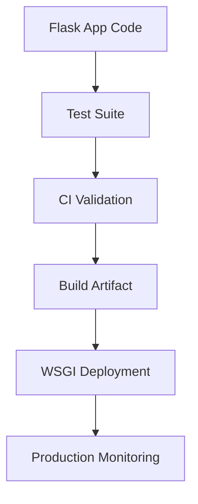

# Day 053 [Intermediate]: Flask Testing and Deployment

## Index

- [Goal](#goal)
- [Prerequisites](#prerequisites)
- [Explanation](#explanation)
- [Topic by Topic](#topic-by-topic)
- [Key Concepts](#key-concepts)
- [Visual Concept Map](#visual-concept-map)
- [End-to-End Practical](#end-to-end-practical)
- [Hands-on Coding](#hands-on-coding)
- [Mini Exercise](#mini-exercise)
- [Assessment Quiz](#assessment-quiz)
- [Task](#task)
- [Self Check](#self-check)
- [Interview Questions and Answers](#interview-questions-and-answers)
- [Day 053 Outcome](#day-053-outcome)

## Goal

Learn how to test Flask applications reliably and prepare them for deployment with production-safe configuration.

## Prerequisites

- Day 052 completed
- Comfortable with Flask routes, auth flow, and database basics

## Explanation

Testing ensures behavior remains correct as code evolves. Deployment ensures the app runs securely and reliably in production. Both are essential for professional-grade Flask systems.

## Topic by Topic

### Topic 1: Flask Test Client Basics

Theory:
Flask provides a built-in test client to simulate HTTP requests.

Practical:
Use it for endpoint tests without running a real server.

Code Example:

```python
def test_health(client):
  response = client.get("/health")
  assert response.status_code == 200
```

**Explanation:**
This topic explains Flask Test Client Basics in a practical Python context so you can write clear, reliable, and maintainable programs for real-world tasks.

**Key Points:**
- Understand the core idea behind Flask Test Client Basics.
- Apply the practical pattern with good readability and validation habits.
- Keep the solution maintainable, testable, and safe for production use where relevant.

### Topic 2: Pytest Fixtures for App Setup

Theory:
Fixtures centralize test app and database setup.

Practical:
Use separate test config (e.g., in-memory SQLite).

Code Example:

```python
import pytest
from app import create_app

@pytest.fixture
def app():
  app = create_app({"TESTING": True, "SQLALCHEMY_DATABASE_URI": "sqlite:///:memory:"})
  return app
```

**Explanation:**
This topic explains Pytest Fixtures for App Setup in a practical Python context so you can write clear, reliable, and maintainable programs for real-world tasks.

**Key Points:**
- Understand the core idea behind Pytest Fixtures for App Setup.
- Apply the practical pattern with good readability and validation habits.
- Keep the solution maintainable, testable, and safe for production use where relevant.

### Topic 3: Testing Auth and Protected Routes

Theory:
Auth tests should cover login success and failure paths.

Practical:
Also verify unauthorized users are blocked.

Code Example:

```python
def test_protected_requires_login(client):
  response = client.get("/dashboard")
  assert response.status_code in (302, 401)
```

**Explanation:**
This topic explains Testing Auth and Protected Routes in a practical Python context so you can write clear, reliable, and maintainable programs for real-world tasks.

**Key Points:**
- Understand the core idea behind Testing Auth and Protected Routes.
- Apply the practical pattern with good readability and validation habits.
- Keep the solution maintainable, testable, and safe for production use where relevant.

### Topic 4: Database Test Isolation

Theory:
Tests must not leak state into each other.

Practical:
Create and tear down database per test session or test.

Code Example:

```python
with app.app_context():
  db.create_all()
  yield
  db.session.remove()
  db.drop_all()
```

**Explanation:**
This topic explains Database Test Isolation in a practical Python context so you can write clear, reliable, and maintainable programs for real-world tasks.

**Key Points:**
- Understand the core idea behind Database Test Isolation.
- Apply the practical pattern with good readability and validation habits.
- Keep the solution maintainable, testable, and safe for production use where relevant.

### Topic 5: Production Deployment Basics

Theory:
Flask dev server is not for production use.

Practical:
Use WSGI servers like Gunicorn and set environment variables.

Code Example:

```bash
gunicorn -w 4 -b 0.0.0.0:8000 "app:app"
```

**Explanation:**
This topic explains Production Deployment Basics in a practical Python context so you can write clear, reliable, and maintainable programs for real-world tasks.

**Key Points:**
- Understand the core idea behind Production Deployment Basics.
- Apply the practical pattern with good readability and validation habits.
- Keep the solution maintainable, testable, and safe for production use where relevant.

### Topic 6: Config and Security for Deployment

Theory:
Configuration must differ across dev, test, and production.

Practical:
Keep secrets in environment variables and disable debug mode in production.

Code Example:

```python
app.config.update(
  DEBUG=False,
  SESSION_COOKIE_SECURE=True
)
```

**Explanation:**
This topic explains Config and Security for Deployment in a practical Python context so you can write clear, reliable, and maintainable programs for real-world tasks.

**Key Points:**
- Understand the core idea behind Config and Security for Deployment.
- Apply the practical pattern with good readability and validation habits.
- Keep the solution maintainable, testable, and safe for production use where relevant.

## Key Concepts

- Flask test client supports fast endpoint testing
- Fixtures improve repeatable setup and teardown
- Auth and access control require focused tests
- Database isolation prevents flaky tests
- Production deployment uses WSGI servers, not dev server
- Environment-based config is mandatory for safety

## Visual Concept Map



## End-to-End Practical

1. Create pytest fixtures for app and test DB.
2. Add tests for health, auth, and CRUD endpoint.
3. Run tests and fix failures.
4. Add production config profile.
5. Run with Gunicorn locally and verify routes.

## Hands-on Coding

### Example 1: Case - API Response Contract Test

Scenario:
Verify JSON schema keys for endpoint response.

```python
def test_items_response_shape(client):
  r = client.get("/api/v1/items")
  data = r.get_json()
  assert isinstance(data, list)
```

### Example 2: Case - Login Integration Test

Scenario:
Confirm login route sets session on valid credentials.

```python
def test_login_success(client):
  r = client.post("/login", data={"email": "a@a.com", "password": "secret"})
  assert r.status_code in (200, 302)
```

### Example 3: Case - Deployment Readiness Checklist

Scenario:
Ensure app has env-based secret key and debug off in prod.

```python
# Validate env vars: SECRET_KEY, DATABASE_URL, FLASK_ENV
```

## Mini Exercise

Scenario:
Write tests for one CRUD resource and deploy app locally with Gunicorn. Document one issue found in testing and how you fixed it.

Expected output:

- At least 5 passing tests
- Gunicorn run command tested locally
- One documented bug fix from test feedback

## Assessment Quiz

### Quiz Questions

1. Why is Flask test client useful?
2. Why should tests use a separate database?
3. True or False: Flask development server is suitable for production.
4. What does Gunicorn provide?
5. Why move secrets to environment variables?

### Quiz Answers

1. It allows fast request testing without real network server
2. To avoid corrupting production/dev data and ensure isolation
3. False
4. A production-ready WSGI server for Flask apps
5. To avoid hardcoded secrets in source code

## Task

- Create endpoint tests using pytest and Flask client
- Add isolated test DB fixture
- Run app under Gunicorn with production config

## Self Check

- You can create reliable Flask test suites
- You can verify auth and CRUD behavior automatically
- You can deploy Flask app with safe baseline settings

## Interview Questions and Answers

### Beginner

**Question:** What is Flask test client?

**Answer:** A utility to simulate requests against the app in tests.

**Question:** Why write tests before deployment?

**Answer:** To catch regressions and reduce production failures.

### Middle

**Question:** How do you keep tests deterministic?

**Answer:** Isolate database state, control fixtures, and avoid external side effects.

**Question:** Why separate configs for environments?

**Answer:** Dev and prod have different security and runtime needs.

### Advanced

**Question:** What deployment anti-pattern is common in small Flask apps?

**Answer:** Using debug server in production and storing secrets directly in code.

**Question:** How do teams maintain confidence after deployment?

**Answer:** Automated tests, health checks, logging, and rollback-ready release process.

## Day 053 Outcome

- You can test Flask apps systematically and confidently
- You can prepare and run production-safe deployment baseline
- You are ready to transition into FastAPI fundamentals on Day 054
