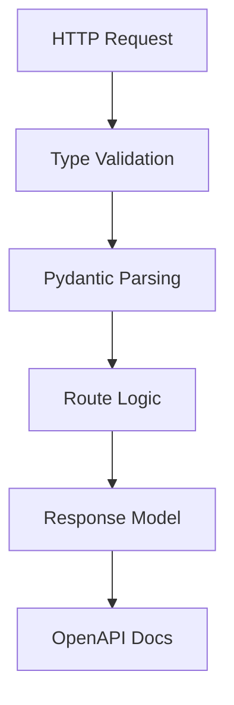

# Day 054 [Intermediate]: FastAPI Fundamentals

## Index

- [Goal](#goal)
- [Prerequisites](#prerequisites)
- [Explanation](#explanation)
- [Topic by Topic](#topic-by-topic)
- [Key Concepts](#key-concepts)
- [Visual Concept Map](#visual-concept-map)
- [End-to-End Practical](#end-to-end-practical)
- [Hands-on Coding](#hands-on-coding)
- [Mini Exercise](#mini-exercise)
- [Assessment Quiz](#assessment-quiz)
- [Task](#task)
- [Self Check](#self-check)
- [Interview Questions and Answers](#interview-questions-and-answers)
- [Day 054 Outcome](#day-054-outcome)

## Goal

Learn FastAPI core patterns for building modern typed APIs with automatic validation and interactive documentation.

## Prerequisites

- Day 053 completed
- Familiarity with REST APIs and Python type hints

## Explanation

FastAPI is designed for high-performance APIs and developer productivity. It leverages type hints and Pydantic models for request validation, serialization, and better maintainability.

## Topic by Topic

### Topic 1: App Setup and Route Basics

Theory:
FastAPI app object defines the service and endpoints.

Practical:
Use method decorators like @app.get and @app.post.

Code Example:

```python
from fastapi import FastAPI

app = FastAPI()

@app.get("/health")
def health():
  return {"status": "ok"}
```

**Explanation:**
This topic explains App Setup and Route Basics in a practical Python context so you can write clear, reliable, and maintainable programs for real-world tasks.

**Key Points:**
- Understand the core idea behind App Setup and Route Basics.
- Apply the practical pattern with good readability and validation habits.
- Keep the solution maintainable, testable, and safe for production use where relevant.

### Topic 2: Path and Query Parameters

Theory:
FastAPI parses and validates parameter types automatically.

Practical:
Type hints reduce manual parsing code.

Code Example:

```python
@app.get("/items/{item_id}")
def read_item(item_id: int, include_meta: bool = False):
  return {"id": item_id, "include_meta": include_meta}
```

**Explanation:**
This topic explains Path and Query Parameters in a practical Python context so you can write clear, reliable, and maintainable programs for real-world tasks.

**Key Points:**
- Understand the core idea behind Path and Query Parameters.
- Apply the practical pattern with good readability and validation habits.
- Keep the solution maintainable, testable, and safe for production use where relevant.

### Topic 3: Request Body Validation with Pydantic

Theory:
Pydantic models define expected input schema.

Practical:
Invalid input receives automatic 422 response.

Code Example:

```python
from pydantic import BaseModel

class ItemCreate(BaseModel):
  name: str
  price: float

@app.post("/items")
def create_item(payload: ItemCreate):
  return payload.model_dump()
```

**Explanation:**
This topic explains Request Body Validation with Pydantic in a practical Python context so you can write clear, reliable, and maintainable programs for real-world tasks.

**Key Points:**
- Understand the core idea behind Request Body Validation with Pydantic.
- Apply the practical pattern with good readability and validation habits.
- Keep the solution maintainable, testable, and safe for production use where relevant.

### Topic 4: Response Models and Serialization

Theory:
Response models ensure stable output contracts.

Practical:
Use response_model to enforce API response shape.

Code Example:

```python
class ItemOut(BaseModel):
  id: int
  name: str

@app.get("/items/{item_id}", response_model=ItemOut)
def get_item(item_id: int):
  return {"id": item_id, "name": "Notebook"}
```

**Explanation:**
This topic explains Response Models and Serialization in a practical Python context so you can write clear, reliable, and maintainable programs for real-world tasks.

**Key Points:**
- Understand the core idea behind Response Models and Serialization.
- Apply the practical pattern with good readability and validation habits.
- Keep the solution maintainable, testable, and safe for production use where relevant.

### Topic 5: Error Handling and HTTPException

Theory:
API errors should be explicit and meaningful.

Practical:
Raise HTTPException for known failure scenarios.

Code Example:

```python
from fastapi import HTTPException

@app.get("/users/{user_id}")
def get_user(user_id: int):
  if user_id < 1:
    raise HTTPException(status_code=400, detail="Invalid user id")
  return {"id": user_id}
```

**Explanation:**
This topic explains Error Handling and HTTPException in a practical Python context so you can write clear, reliable, and maintainable programs for real-world tasks.

**Key Points:**
- Understand the core idea behind Error Handling and HTTPException.
- Apply the practical pattern with good readability and validation habits.
- Keep the solution maintainable, testable, and safe for production use where relevant.

### Topic 6: OpenAPI Docs and Developer Experience

Theory:
FastAPI auto-generates interactive docs from code.

Practical:
Use docs for rapid testing and team onboarding.

Code Example:

```text
/docs for Swagger UI
/redoc for ReDoc
```

**Explanation:**
This topic explains OpenAPI Docs and Developer Experience in a practical Python context so you can write clear, reliable, and maintainable programs for real-world tasks.

**Key Points:**
- Understand the core idea behind OpenAPI Docs and Developer Experience.
- Apply the practical pattern with good readability and validation habits.
- Keep the solution maintainable, testable, and safe for production use where relevant.

## Key Concepts

- FastAPI routes are type-driven and concise
- Parameter parsing and validation are automatic
- Pydantic models define request/response contracts
- HTTPException enables clear error semantics
- response_model improves output consistency
- Auto-generated docs accelerate development workflows

## Visual Concept Map



## End-to-End Practical

1. Create FastAPI app and health endpoint.
2. Add CRUD-like item routes.
3. Add request and response Pydantic models.
4. Add error handling with HTTPException.
5. Test endpoints through /docs.

## Hands-on Coding

### Example 1: Case - Product API Baseline

Scenario:
Create simple product endpoints with typed payloads.

```python
class Product(BaseModel):
  name: str
  price: float

@app.post("/products")
def create_product(product: Product):
  return {"message": "created", "product": product.model_dump()}
```

### Example 2: Case - Search Endpoint with Query Params

Scenario:
Filter products by keyword and limit.

```python
@app.get("/products")
def list_products(q: str = "", limit: int = 10):
  return {"query": q, "limit": limit}
```

### Example 3: Case - Not Found Error Path

Scenario:
Return 404 when requested product does not exist.

```python
@app.get("/products/{pid}")
def get_product(pid: int):
  if pid != 1:
    raise HTTPException(status_code=404, detail="Product not found")
  return {"id": 1, "name": "Keyboard"}
```

## Mini Exercise

Scenario:
Build a mini task API with create, list, and get-by-id endpoints using Pydantic models and error handling.

Expected output:

- Typed models for request and response
- At least three endpoints
- Proper 404 and 400 handling

## Assessment Quiz

### Quiz Questions

1. Why are type hints important in FastAPI?
2. What does response_model enforce?
3. True or False: FastAPI needs manual request JSON validation for every field.
4. When should HTTPException be raised?
5. What benefit does /docs provide?

### Quiz Answers

1. They drive validation, parsing, and documentation
2. Stable structure of API output
3. False
4. When returning defined error cases with HTTP status
5. Interactive endpoint exploration and testing

## Task

- Build one typed FastAPI resource with Pydantic
- Add error paths using HTTPException
- Verify endpoint behavior in auto-generated docs

## Self Check

- You can create robust FastAPI endpoints with typed contracts
- You can validate input and structure outputs consistently
- You can leverage docs for rapid API testing

## Interview Questions and Answers

### Beginner

**Question:** What makes FastAPI different from many older frameworks?

**Answer:** Type hints directly drive validation and API documentation.

**Question:** What is Pydantic used for?

**Answer:** Defining and validating request and response schemas.

### Middle

**Question:** Why use response models even if endpoint already returns JSON?

**Answer:** They enforce consistent output contract and reduce accidental schema drift.

**Question:** What status does FastAPI return for body validation errors?

**Answer:** 422 Unprocessable Entity.

### Advanced

**Question:** What architecture advantage does FastAPI bring in team environments?

**Answer:** Strong contracts and generated docs reduce integration friction across teams.

**Question:** What common anti-pattern appears in FastAPI projects?

**Answer:** Returning untyped dictionaries everywhere, losing contract clarity and validation benefits.

## Day 054 Outcome

- You can build typed FastAPI endpoints with validation and documentation
- You can handle errors and response contracts professionally
- You are ready for dependency injection patterns on Day 055
