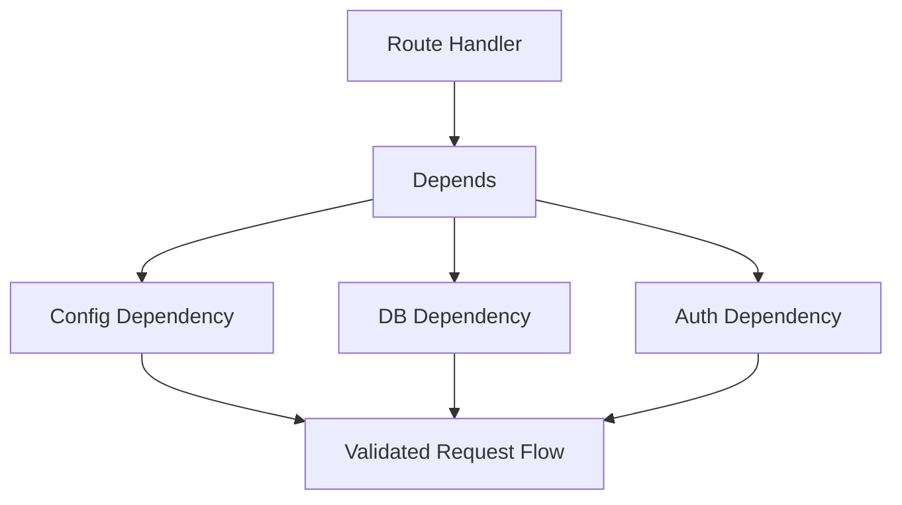

# Day 055 [Intermediate]: FastAPI Dependency Injection

## Index

- [Goal](#goal)
- [Prerequisites](#prerequisites)
- [Explanation](#explanation)
- [Topic by Topic](#topic-by-topic)
- [Key Concepts](#key-concepts)
- [Visual Concept Map](#visual-concept-map)
- [End-to-End Practical](#end-to-end-practical)
- [Hands-on Coding](#hands-on-coding)
- [Mini Exercise](#mini-exercise)
- [Assessment Quiz](#assessment-quiz)
- [Task](#task)
- [Self Check](#self-check)
- [Interview Questions and Answers](#interview-questions-and-answers)
- [Day 055 Outcome](#day-055-outcome)

## Goal

Master FastAPI dependency injection to build modular, testable, and reusable API components.

## Prerequisites

- Day 054 completed
- Familiarity with FastAPI routing and Pydantic models

## Explanation

Dependency injection in FastAPI lets routes receive shared services (database session, auth user, settings) without hardcoding implementation details. This improves maintainability and testability.

## Topic by Topic

### Topic 1: Depends Basics

Theory:
Depends declares external values that endpoint logic needs.

Practical:
Use lightweight dependency functions for config and shared helpers.

Code Example:

```python
from fastapi import Depends, FastAPI

app = FastAPI()

def get_region():
  return "ap-south"

@app.get("/meta")
def meta(region: str = Depends(get_region)):
  return {"region": region}
```

**Explanation:**
This topic explains Depends Basics in a practical Python context so you can write clear, reliable, and maintainable programs for real-world tasks.

**Key Points:**
- Understand the core idea behind Depends Basics.
- Apply the practical pattern with good readability and validation habits.
- Keep the solution maintainable, testable, and safe for production use where relevant.

### Topic 2: Injecting Database Session

Theory:
DB session management should be centralized and lifecycle-aware.

Practical:
Yield dependencies clean up resources automatically.

Code Example:

```python
def get_db():
  db = SessionLocal()
  try:
    yield db
  finally:
    db.close()
```

**Explanation:**
This topic explains Injecting Database Session in a practical Python context so you can write clear, reliable, and maintainable programs for real-world tasks.

**Key Points:**
- Understand the core idea behind Injecting Database Session.
- Apply the practical pattern with good readability and validation habits.
- Keep the solution maintainable, testable, and safe for production use where relevant.

### Topic 3: Auth Dependency Pattern

Theory:
Authorization checks can be modeled as dependencies.

Practical:
Inject current user object into protected routes.

Code Example:

```python
from fastapi import HTTPException

def get_current_user(token: str = Depends(oauth2_scheme)):
  if token != "valid-token":
    raise HTTPException(status_code=401, detail="Unauthorized")
  return {"id": 1, "name": "Riya"}
```

**Explanation:**
This topic explains Auth Dependency Pattern in a practical Python context so you can write clear, reliable, and maintainable programs for real-world tasks.

**Key Points:**
- Understand the core idea behind Auth Dependency Pattern.
- Apply the practical pattern with good readability and validation habits.
- Keep the solution maintainable, testable, and safe for production use where relevant.

### Topic 4: Reusable Validation Dependencies

Theory:
Cross-route validation logic should be shared.

Practical:
Dependency functions can enforce common checks.

Code Example:

```python
def pagination_params(limit: int = 10, offset: int = 0):
  return {"limit": limit, "offset": offset}

@app.get("/items")
def list_items(paging: dict = Depends(pagination_params)):
  return paging
```

**Explanation:**
This topic explains Reusable Validation Dependencies in a practical Python context so you can write clear, reliable, and maintainable programs for real-world tasks.

**Key Points:**
- Understand the core idea behind Reusable Validation Dependencies.
- Apply the practical pattern with good readability and validation habits.
- Keep the solution maintainable, testable, and safe for production use where relevant.

### Topic 5: Dependency Overrides in Tests

Theory:
Testing often requires replacing real dependencies.

Practical:
Use app.dependency_overrides for deterministic tests.

Code Example:

```python
def fake_user():
  return {"id": 999, "name": "TestUser"}

app.dependency_overrides[get_current_user] = fake_user
```

**Explanation:**
This topic explains Dependency Overrides in Tests in a practical Python context so you can write clear, reliable, and maintainable programs for real-world tasks.

**Key Points:**
- Understand the core idea behind Dependency Overrides in Tests.
- Apply the practical pattern with good readability and validation habits.
- Keep the solution maintainable, testable, and safe for production use where relevant.

### Topic 6: DI Architecture Best Practices

Theory:
Too many hidden dependencies can reduce clarity.

Practical:
Keep dependency graph shallow and names explicit.

Code Example:

```python
# Prefer focused dependencies over deep nested chains.
```

**Explanation:**
This topic explains DI Architecture Best Practices in a practical Python context so you can write clear, reliable, and maintainable programs for real-world tasks.

**Key Points:**
- Understand the core idea behind DI Architecture Best Practices.
- Apply the practical pattern with good readability and validation habits.
- Keep the solution maintainable, testable, and safe for production use where relevant.

## Key Concepts

- Depends enables inversion of control for route requirements
- Yield-based dependencies manage resource lifecycle safely
- Auth checks fit naturally into dependency model
- Shared validation can be centralized as dependencies
- Overrides make testing cleaner
- Keep dependencies explicit and composable

## Visual Concept Map



## End-to-End Practical

1. Create DB and auth dependencies.
2. Inject them into protected CRUD endpoints.
3. Add shared pagination dependency.
4. Override auth dependency in tests.
5. Verify behavior with both real and fake dependencies.

## Hands-on Coding

### Example 1: Case - Protected Profile Route

Scenario:
Require authenticated user for profile endpoint.

```python
@app.get("/profile")
def profile(user: dict = Depends(get_current_user)):
  return user
```

### Example 2: Case - DB-backed Item Query

Scenario:
Inject db session for item lookup route.

```python
@app.get("/items/{item_id}")
def get_item(item_id: int, db=Depends(get_db)):
  return {"id": item_id}
```

### Example 3: Case - Test Override

Scenario:
Bypass real auth in automated tests.

```python
def test_profile(client):
  app.dependency_overrides[get_current_user] = lambda: {"id": 1, "name": "Mock"}
  response = client.get("/profile")
  assert response.status_code == 200
```

## Mini Exercise

Scenario:
Build a mini task API where routes inject database session and current user dependencies. Add one test that overrides current user dependency.

Expected output:

- At least two injected dependencies
- One protected endpoint
- One dependency override in test case

## Assessment Quiz

### Quiz Questions

1. What does Depends provide in FastAPI?
2. Why use yield in DB dependency?
3. True or False: Dependency overrides are useful in testing.
4. Why inject auth logic as dependency?
5. What is one risk of deep dependency chains?

### Quiz Answers

1. Automatic injection of required components into handlers
2. To ensure cleanup after request lifecycle
3. True
4. Reusable and centralized authorization control
5. Reduced readability and harder debugging

## Task

- Build one route that injects db + auth dependencies
- Add reusable pagination dependency
- Write one test using dependency override

## Self Check

- You can design and use FastAPI dependencies confidently
- You can manage resource lifecycle with yield dependencies
- You can improve testability using dependency overrides

## Interview Questions and Answers

### Beginner

**Question:** What is dependency injection in FastAPI?

**Answer:** A way to provide route requirements (like db or user) from reusable helper functions.

**Question:** Why use Depends instead of global objects?

**Answer:** It improves modularity, reuse, and testing.

### Middle

**Question:** How do you inject database sessions safely?

**Answer:** Use a dependency that yields session and closes it in finally block.

**Question:** How do tests avoid real auth flow?

**Answer:** Override auth dependency with fake implementation.

### Advanced

**Question:** What DI design decision improves maintainability most?

**Answer:** Keeping dependencies focused, explicit, and independent from unrelated concerns.

**Question:** What anti-pattern appears in DI-heavy FastAPI apps?

**Answer:** Hidden nested dependencies that make behavior and debugging unclear.

## Day 055 Outcome

- You can apply FastAPI dependency injection for clean architecture
- You can build testable endpoints with composable dependencies
- You are ready for advanced FastAPI middleware and security patterns next
