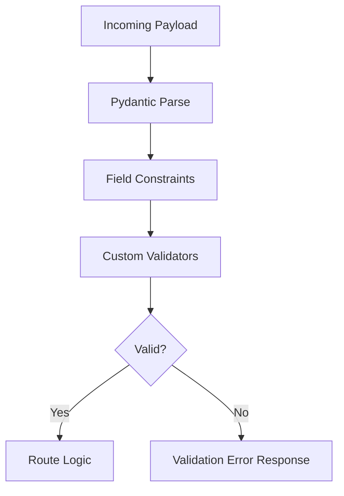

# Day 056 [Intermediate]: FastAPI Validation with Pydantic

## Index

- [Goal](#goal)
- [Prerequisites](#prerequisites)
- [Explanation](#explanation)
- [Topic by Topic](#topic-by-topic)
- [Key Concepts](#key-concepts)
- [Visual Concept Map](#visual-concept-map)
- [End-to-End Practical](#end-to-end-practical)
- [Hands-on Coding](#hands-on-coding)
- [Mini Exercise](#mini-exercise)
- [Assessment Quiz](#assessment-quiz)
- [Task](#task)
- [Self Check](#self-check)
- [Interview Questions and Answers](#interview-questions-and-answers)
- [Day 056 Outcome](#day-056-outcome)

## Goal

Build advanced input and output validation patterns in FastAPI using Pydantic models, field constraints, and custom validators.

## Prerequisites

- Day 055 completed
- Comfortable with FastAPI route basics and simple Pydantic schemas

## Explanation

Validation is one of FastAPI's biggest strengths. Pydantic models can enforce type, format, range, and business rules automatically, reducing runtime bugs and improving API contract trust.

## Topic by Topic

### Topic 1: Field Constraints with Annotated Models

Theory:
Pydantic fields can enforce min/max, regex, and numeric constraints.

Practical:
Use constraints to reject bad input early.

Code Example:

```python
from pydantic import BaseModel, Field

class ProductIn(BaseModel):
  name: str = Field(min_length=2, max_length=100)
  price: float = Field(gt=0)
  stock: int = Field(ge=0)
```

**Explanation:**
This topic explains Field Constraints with Annotated Models in a practical Python context so you can write clear, reliable, and maintainable programs for real-world tasks.

**Key Points:**
- Understand the core idea behind Field Constraints with Annotated Models.
- Apply the practical pattern with good readability and validation habits.
- Keep the solution maintainable, testable, and safe for production use where relevant.

### Topic 2: Optional Fields and Defaults

Theory:
Not every field is required in every operation.

Practical:
Different schemas for create and patch reduce ambiguity.

Code Example:

```python
from typing import Optional

class ProductPatch(BaseModel):
  name: Optional[str] = None
  price: Optional[float] = None
```

**Explanation:**
This topic explains Optional Fields and Defaults in a practical Python context so you can write clear, reliable, and maintainable programs for real-world tasks.

**Key Points:**
- Understand the core idea behind Optional Fields and Defaults.
- Apply the practical pattern with good readability and validation habits.
- Keep the solution maintainable, testable, and safe for production use where relevant.

### Topic 3: Custom Validators and Business Rules

Theory:
Some rules go beyond simple type checks.

Practical:
Use validators to enforce domain logic.

Code Example:

```python
from pydantic import BaseModel, field_validator

class UserIn(BaseModel):
  username: str

  @field_validator("username")
  @classmethod
  def no_spaces(cls, value: str):
    if " " in value:
      raise ValueError("username cannot contain spaces")
    return value
```

**Explanation:**
This topic explains Custom Validators and Business Rules in a practical Python context so you can write clear, reliable, and maintainable programs for real-world tasks.

**Key Points:**
- Understand the core idea behind Custom Validators and Business Rules.
- Apply the practical pattern with good readability and validation habits.
- Keep the solution maintainable, testable, and safe for production use where relevant.

### Topic 4: Nested Models and Lists

Theory:
Complex payloads often contain nested objects and collections.

Practical:
Nested schemas keep structure explicit and consistent.

Code Example:

```python
class Address(BaseModel):
  city: str
  pincode: str

class CustomerIn(BaseModel):
  name: str
  address: Address
  tags: list[str] = []
```

**Explanation:**
This topic explains Nested Models and Lists in a practical Python context so you can write clear, reliable, and maintainable programs for real-world tasks.

**Key Points:**
- Understand the core idea behind Nested Models and Lists.
- Apply the practical pattern with good readability and validation habits.
- Keep the solution maintainable, testable, and safe for production use where relevant.

### Topic 5: Response Validation and Data Safety

Theory:
Validation should apply to outputs too, not only input.

Practical:
Use response_model to enforce stable API responses.

Code Example:

```python
from fastapi import FastAPI

app = FastAPI()

class ProductOut(BaseModel):
  id: int
  name: str

@app.get("/products/{pid}", response_model=ProductOut)
def get_product(pid: int):
  return {"id": pid, "name": "Mouse"}
```

**Explanation:**
This topic explains Response Validation and Data Safety in a practical Python context so you can write clear, reliable, and maintainable programs for real-world tasks.

**Key Points:**
- Understand the core idea behind Response Validation and Data Safety.
- Apply the practical pattern with good readability and validation habits.
- Keep the solution maintainable, testable, and safe for production use where relevant.

### Topic 6: Validation Error Design

Theory:
Default error structure is useful, but clients may need custom formatting.

Practical:
Add exception handlers for user-friendly validation responses where required.

Code Example:

```python
# Add custom RequestValidationError handler when frontend expects specific schema.
```

**Explanation:**
This topic explains Validation Error Design in a practical Python context so you can write clear, reliable, and maintainable programs for real-world tasks.

**Key Points:**
- Understand the core idea behind Validation Error Design.
- Apply the practical pattern with good readability and validation habits.
- Keep the solution maintainable, testable, and safe for production use where relevant.

## Key Concepts

- Field constraints prevent invalid data early
- Separate models for create and update improve clarity
- Validators enforce domain rules
- Nested models scale contract complexity safely
- Response models protect API output contracts
- Validation error shape should be predictable for clients

## Visual Concept Map



## End-to-End Practical

1. Create typed request model with constraints.
2. Add nested object for profile/address.
3. Add one custom business validator.
4. Add response_model for output contract.
5. Test valid and invalid payloads via docs.

## Hands-on Coding

### Example 1: Case - Signup Validation

Scenario:
Validate signup payload for email format and password length.

```python
class SignupIn(BaseModel):
  email: str = Field(min_length=5)
  password: str = Field(min_length=8)
```

### Example 2: Case - Product Catalog Payload

Scenario:
Accept product list with each item validated.

```python
class CatalogIn(BaseModel):
  products: list[ProductIn]
```

### Example 3: Case - Custom Rule for Discount

Scenario:
Ensure discount never exceeds product price.

```python
class Offer(BaseModel):
  price: float
  discount: float

  @field_validator("discount")
  @classmethod
  def valid_discount(cls, value: float):
    if value < 0:
      raise ValueError("discount must be non-negative")
    return value
```

## Mini Exercise

Scenario:
Design a FastAPI endpoint for order creation with nested customer and item schemas, field constraints, and one custom validator.

Expected output:

- Nested request model
- At least three field constraints
- One custom validation rule

## Assessment Quiz

### Quiz Questions

1. Why use response_model when route already returns dict?
2. What does Field(gt=0) enforce?
3. True or False: Business validation should always be done only in frontend.
4. Why separate create and patch models?
5. What is one benefit of nested models?

### Quiz Answers

1. It guarantees output contract and filters unexpected fields
2. Value must be greater than zero
3. False
4. Different requiredness and validation semantics
5. Clear structure for complex payloads

## Task

- Implement one endpoint with constrained and nested models
- Add one custom validator and one response model
- Test invalid payload paths and document error behavior

## Self Check

- You can build strict and readable validation schemas
- You can express business rules through validators
- You can keep API contracts stable in both directions

## Interview Questions and Answers

### Beginner

**Question:** What is Pydantic used for in FastAPI?

**Answer:** It validates and parses request/response data based on typed models.

**Question:** Why are field constraints useful?

**Answer:** They prevent invalid input from reaching business logic.

### Middle

**Question:** When should you use custom validators?

**Answer:** When rules depend on domain logic beyond simple types.

**Question:** Why can response validation matter in production?

**Answer:** It prevents accidental schema drift that breaks clients.

### Advanced

**Question:** What anti-pattern is common with validation models?

**Answer:** Reusing one large model for all operations, causing unclear requirements and brittle updates.

**Question:** How do teams keep validation logic maintainable?

**Answer:** Split models by use case, centralize shared validators, and version contracts carefully.

## Day 056 Outcome

- You can design robust FastAPI validation layers with Pydantic
- You can enforce both technical and business-level input rules
- You are ready for FastAPI authentication and security on Day 057
