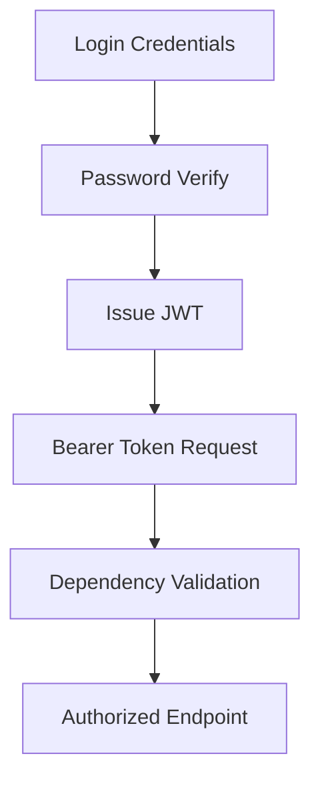

# Day 057 [Intermediate]: FastAPI Auth and Security

## Index

- [Goal](#goal)
- [Prerequisites](#prerequisites)
- [Explanation](#explanation)
- [Topic by Topic](#topic-by-topic)
- [Key Concepts](#key-concepts)
- [Visual Concept Map](#visual-concept-map)
- [End-to-End Practical](#end-to-end-practical)
- [Hands-on Coding](#hands-on-coding)
- [Mini Exercise](#mini-exercise)
- [Assessment Quiz](#assessment-quiz)
- [Task](#task)
- [Self Check](#self-check)
- [Interview Questions and Answers](#interview-questions-and-answers)
- [Day 057 Outcome](#day-057-outcome)

## Goal

Implement secure authentication and authorization in FastAPI using token-based flows and practical security hardening.

## Prerequisites

- Day 056 completed
- Familiarity with FastAPI dependencies and validation models

## Explanation

Auth and security are foundational for production APIs. FastAPI offers strong building blocks for OAuth2 password flow, JWT tokens, route protection, and role checks through dependency injection.

## Topic by Topic

### Topic 1: Auth Concepts for APIs

Theory:
Authentication verifies who the user is; authorization controls what they can do.

Practical:
Separate these responsibilities in code structure.

Code Example:

```python
# AuthN: verify identity
# AuthZ: verify permissions for requested resource
```

**Explanation:**
This topic explains Auth Concepts for APIs in a practical Python context so you can write clear, reliable, and maintainable programs for real-world tasks.

**Key Points:**
- Understand the core idea behind Auth Concepts for APIs.
- Apply the practical pattern with good readability and validation habits.
- Keep the solution maintainable, testable, and safe for production use where relevant.

### Topic 2: Password Hashing and Verification

Theory:
Never store raw passwords; use one-way hashing.

Practical:
Use passlib or equivalent secure hash tooling.

Code Example:

```python
from passlib.context import CryptContext

pwd = CryptContext(schemes=["bcrypt"], deprecated="auto")
hashed = pwd.hash("secret123")
print(pwd.verify("secret123", hashed))
```

**Explanation:**
This topic explains Password Hashing and Verification in a practical Python context so you can write clear, reliable, and maintainable programs for real-world tasks.

**Key Points:**
- Understand the core idea behind Password Hashing and Verification.
- Apply the practical pattern with good readability and validation habits.
- Keep the solution maintainable, testable, and safe for production use where relevant.

### Topic 3: OAuth2 Password Flow Setup

Theory:
FastAPI includes helpers for bearer token parsing.

Practical:
Use OAuth2PasswordBearer and token endpoint pattern.

Code Example:

```python
from fastapi.security import OAuth2PasswordBearer

oauth2_scheme = OAuth2PasswordBearer(tokenUrl="/token")
```

**Explanation:**
This topic explains OAuth2 Password Flow Setup in a practical Python context so you can write clear, reliable, and maintainable programs for real-world tasks.

**Key Points:**
- Understand the core idea behind OAuth2 Password Flow Setup.
- Apply the practical pattern with good readability and validation habits.
- Keep the solution maintainable, testable, and safe for production use where relevant.

### Topic 4: JWT Token Creation and Validation

Theory:
JWT carries signed claims that server can verify.

Practical:
Include subject and expiry claims, validate each request.

Code Example:

```python
from datetime import datetime, timedelta
import jwt

SECRET = "change-me"

def create_token(sub: str):
  payload = {"sub": sub, "exp": datetime.utcnow() + timedelta(minutes=30)}
  return jwt.encode(payload, SECRET, algorithm="HS256")
```

**Explanation:**
This topic explains JWT Token Creation and Validation in a practical Python context so you can write clear, reliable, and maintainable programs for real-world tasks.

**Key Points:**
- Understand the core idea behind JWT Token Creation and Validation.
- Apply the practical pattern with good readability and validation habits.
- Keep the solution maintainable, testable, and safe for production use where relevant.

### Topic 5: Protecting Routes with Dependencies

Theory:
Security checks should be reusable and centralized.

Practical:
Inject current user dependency into protected routes.

Code Example:

```python
from fastapi import Depends, HTTPException

def get_current_user(token: str = Depends(oauth2_scheme)):
  if not token:
    raise HTTPException(status_code=401, detail="Unauthorized")
  return {"id": 1, "role": "admin"}
```

**Explanation:**
This topic explains Protecting Routes with Dependencies in a practical Python context so you can write clear, reliable, and maintainable programs for real-world tasks.

**Key Points:**
- Understand the core idea behind Protecting Routes with Dependencies.
- Apply the practical pattern with good readability and validation habits.
- Keep the solution maintainable, testable, and safe for production use where relevant.

### Topic 6: Security Hardening Basics

Theory:
Beyond login, systems need defense-in-depth controls.

Practical:
Add rate limiting, CORS policy, secure secrets handling, and token expiry policies.

Code Example:

```python
# Store JWT secrets in env vars and keep token lifetime limited.
```

**Explanation:**
This topic explains Security Hardening Basics in a practical Python context so you can write clear, reliable, and maintainable programs for real-world tasks.

**Key Points:**
- Understand the core idea behind Security Hardening Basics.
- Apply the practical pattern with good readability and validation habits.
- Keep the solution maintainable, testable, and safe for production use where relevant.

## Key Concepts

- AuthN and AuthZ are separate concerns
- Password hashing is mandatory
- OAuth2 bearer flow integrates cleanly in FastAPI
- JWT should include expiry and be verified every request
- Route protection is dependency-driven
- Security posture includes operational controls beyond code

## Visual Concept Map



## End-to-End Practical

1. Build user login endpoint with password verification.
2. Issue JWT token with short expiration.
3. Create get_current_user dependency.
4. Protect CRUD endpoints with dependency.
5. Add one role check for admin-only route.

## Hands-on Coding

### Example 1: Case - Token Endpoint

Scenario:
Return access token after credential validation.

```python
@app.post("/token")
def token(username: str, password: str):
  # verify username/password
  return {"access_token": create_token(username), "token_type": "bearer"}
```

### Example 2: Case - Protected Profile API

Scenario:
Allow only authenticated users to see profile.

```python
@app.get("/me")
def me(user=Depends(get_current_user)):
  return user
```

### Example 3: Case - Role-Based Route

Scenario:
Block non-admin access to management endpoint.

```python
@app.delete("/users/{uid}")
def delete_user(uid: int, user=Depends(get_current_user)):
  if user["role"] != "admin":
    raise HTTPException(status_code=403, detail="Forbidden")
  return {"deleted": uid}
```

## Mini Exercise

Scenario:
Implement signup/login and one protected route using JWT. Add role check for one admin endpoint.

Expected output:

- Working token issue and token validation flow
- At least one protected endpoint
- One role-based authorization check

## Assessment Quiz

### Quiz Questions

1. Why should JWT include expiry?
2. What is difference between 401 and 403?
3. True or False: Storing plain passwords is acceptable in internal tools.
4. Why inject current user as dependency?
5. What is one non-code security control for APIs?

### Quiz Answers

1. To limit risk from leaked tokens
2. 401 means unauthenticated, 403 means authenticated but forbidden
3. False
4. Reusable centralized authorization logic
5. Rate limiting and secure secret management

## Task

- Build JWT auth flow with login endpoint
- Protect two routes using auth dependency
- Add one admin-only route and test forbidden path

## Self Check

- You can implement FastAPI token auth end to end
- You can protect and authorize routes cleanly
- You can apply practical security hardening patterns

## Interview Questions and Answers

### Beginner

**Question:** Why hash passwords?

**Answer:** To protect credentials if database is compromised.

**Question:** What is a bearer token?

**Answer:** A token sent in Authorization header to prove access rights.

### Middle

**Question:** Why separate auth and authorization logic?

**Answer:** It keeps code modular and makes policy changes easier.

**Question:** How do you secure token secrets?

**Answer:** Keep them in environment/secret manager, never in source code.

### Advanced

**Question:** What is a common JWT implementation mistake?

**Answer:** Skipping expiry validation or using weak/static secret handling.

**Question:** How do teams mature API security over time?

**Answer:** Add threat modeling, key rotation, audit logs, and layered controls.

## Day 057 Outcome

- You can build secure auth and authorization in FastAPI
- You can apply token, dependency, and role checks effectively
- You are ready for async database integration on Day 058
