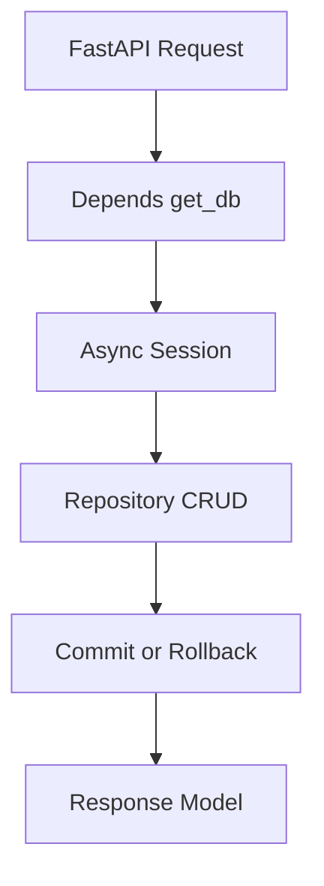

# Day 058 [Intermediate]: FastAPI Async Database

## Index

- [Goal](#goal)
- [Prerequisites](#prerequisites)
- [Explanation](#explanation)
- [Topic by Topic](#topic-by-topic)
- [Key Concepts](#key-concepts)
- [Visual Concept Map](#visual-concept-map)
- [End-to-End Practical](#end-to-end-practical)
- [Hands-on Coding](#hands-on-coding)
- [Mini Exercise](#mini-exercise)
- [Assessment Quiz](#assessment-quiz)
- [Task](#task)
- [Self Check](#self-check)
- [Interview Questions and Answers](#interview-questions-and-answers)
- [Day 058 Outcome](#day-058-outcome)

## Goal

Build a production-style async database layer in FastAPI for scalable and non-blocking API operations.

## Prerequisites

- Day 057 completed
- Basic SQL knowledge and familiarity with ORM concepts

## Explanation

Async database access prevents event-loop blocking and improves throughput for I/O-heavy APIs. In FastAPI, async SQLAlchemy sessions and dependency-based session management are common patterns.

## Topic by Topic

### Topic 1: Why Async Database in FastAPI

Theory:
FastAPI is async-friendly. Blocking DB calls can reduce concurrency.

Practical:
Use async drivers and async sessions to align with async endpoints.

Code Example:

```python
from sqlalchemy.ext.asyncio import create_async_engine

DATABASE_URL = "sqlite+aiosqlite:///./app.db"
engine = create_async_engine(DATABASE_URL, echo=False)
```

**Explanation:**
This topic explains Why Async Database in FastAPI in a practical Python context so you can write clear, reliable, and maintainable programs for real-world tasks.

**Key Points:**
- Understand the core idea behind Why Async Database in FastAPI.
- Apply the practical pattern with good readability and validation habits.
- Keep the solution maintainable, testable, and safe for production use where relevant.

### Topic 2: Async Session Factory and Dependency

Theory:
Sessions should be short-lived per request.

Practical:
Create async sessionmaker and inject via Depends.

Code Example:

```python
from sqlalchemy.ext.asyncio import async_sessionmaker, AsyncSession

SessionLocal = async_sessionmaker(engine, expire_on_commit=False)

async def get_db() -> AsyncSession:
  async with SessionLocal() as session:
    yield session
```

**Explanation:**
This topic explains Async Session Factory and Dependency in a practical Python context so you can write clear, reliable, and maintainable programs for real-world tasks.

**Key Points:**
- Understand the core idea behind Async Session Factory and Dependency.
- Apply the practical pattern with good readability and validation habits.
- Keep the solution maintainable, testable, and safe for production use where relevant.

### Topic 3: Async CRUD Patterns

Theory:
Use await for query execution and commits.

Practical:
Write clean repository-style async CRUD functions.

Code Example:

```python
async def create_user(db: AsyncSession, name: str):
  user = User(name=name)
  db.add(user)
  await db.commit()
  await db.refresh(user)
  return user
```

**Explanation:**
This topic explains Async CRUD Patterns in a practical Python context so you can write clear, reliable, and maintainable programs for real-world tasks.

**Key Points:**
- Understand the core idea behind Async CRUD Patterns.
- Apply the practical pattern with good readability and validation habits.
- Keep the solution maintainable, testable, and safe for production use where relevant.

### Topic 4: Transactions and Error Handling

Theory:
Write operations should be atomic.

Practical:
Rollback on failure and return meaningful API errors.

Code Example:

```python
try:
  await db.commit()
except Exception:
  await db.rollback()
  raise
```

**Explanation:**
This topic explains Transactions and Error Handling in a practical Python context so you can write clear, reliable, and maintainable programs for real-world tasks.

**Key Points:**
- Understand the core idea behind Transactions and Error Handling.
- Apply the practical pattern with good readability and validation habits.
- Keep the solution maintainable, testable, and safe for production use where relevant.

### Topic 5: Query Performance Basics

Theory:
Async does not automatically solve poor query design.

Practical:
Use indexes, pagination, and avoid N+1 problems.

Code Example:

```python
# Add limit/offset for listing endpoints to control load.
```

**Explanation:**
This topic explains Query Performance Basics in a practical Python context so you can write clear, reliable, and maintainable programs for real-world tasks.

**Key Points:**
- Understand the core idea behind Query Performance Basics.
- Apply the practical pattern with good readability and validation habits.
- Keep the solution maintainable, testable, and safe for production use where relevant.

### Topic 6: Layered Architecture for DB Access

Theory:
Keep route, service, and data layers separated for maintainability.

Practical:
Move SQL operations into repository/service functions.

Code Example:

```python
# routes -> service -> repository -> db session
```

**Explanation:**
This topic explains Layered Architecture for DB Access in a practical Python context so you can write clear, reliable, and maintainable programs for real-world tasks.

**Key Points:**
- Understand the core idea behind Layered Architecture for DB Access.
- Apply the practical pattern with good readability and validation habits.
- Keep the solution maintainable, testable, and safe for production use where relevant.

## Key Concepts

- Async DB calls improve request concurrency
- Per-request session lifecycle is essential
- CRUD should use explicit await commit/refresh flows
- Transactions and rollback preserve consistency
- Query design still drives performance
- Layered code improves testability and refactoring

## Visual Concept Map



## End-to-End Practical

1. Configure async engine and sessionmaker.
2. Build one model and async CRUD set.
3. Inject AsyncSession in routes via Depends.
4. Add rollback handling for write failure.
5. Add pagination for list endpoint.

## Hands-on Coding

### Example 1: Case - Async Create Endpoint

Scenario:
Create product record asynchronously.

```python
@app.post("/products")
async def add_product(data: ProductIn, db: AsyncSession = Depends(get_db)):
  product = await create_product(db, data)
  return product
```

### Example 2: Case - Async List Endpoint

Scenario:
Return paginated products list.

```python
@app.get("/products")
async def list_products(limit: int = 10, offset: int = 0, db: AsyncSession = Depends(get_db)):
  return await fetch_products(db, limit, offset)
```

### Example 3: Case - Safe Update with Rollback

Scenario:
Update inventory with rollback on DB exception.

```python
async def update_stock(db: AsyncSession, pid: int, new_stock: int):
  try:
    item = await db.get(Product, pid)
    item.stock = new_stock
    await db.commit()
    return item
  except Exception:
    await db.rollback()
    raise
```

## Mini Exercise

Scenario:
Implement async CRUD for a Task entity with create, list, and update endpoints. Add transaction safety for update.

Expected output:

- Async session dependency
- Working async CRUD endpoints
- Proper rollback on error

## Assessment Quiz

### Quiz Questions

1. Why use async DB drivers with FastAPI async routes?
2. What does expire_on_commit=False help with?
3. True or False: Async automatically makes slow queries fast.
4. Why is rollback important in write paths?
5. One way to reduce list endpoint load?

### Quiz Answers

1. To avoid blocking event loop during DB I/O
2. Allows objects to remain usable after commit
3. False
4. Prevents partial/invalid state persistence
5. Pagination with limit and offset

## Task

- Set up async SQLAlchemy engine and session
- Implement async create/list/update for one resource
- Add rollback and pagination support

## Self Check

- You can design async DB flow in FastAPI cleanly
- You can implement safe transaction behavior
- You can reason about performance and architecture tradeoffs

## Interview Questions and Answers

### Beginner

**Question:** What is AsyncSession?

**Answer:** SQLAlchemy session designed for async/await database operations.

**Question:** Why use Depends(get_db)?

**Answer:** To provide a request-scoped DB session cleanly to endpoints.

### Middle

**Question:** What can go wrong without rollback handling?

**Answer:** Failed writes can leave inconsistent transaction state.

**Question:** Is async enough for DB performance?

**Answer:** No, query/index design and schema quality still matter heavily.

### Advanced

**Question:** How do you avoid tight coupling between routes and ORM?

**Answer:** Use service/repository layers and map response schemas explicitly.

**Question:** What is a practical anti-pattern in async DB projects?

**Answer:** Mixing sync DB calls in async routes, which silently blocks concurrency.

## Day 058 Outcome

- You can build async-safe database integration in FastAPI
- You can implement robust CRUD with transaction safety
- You are ready for testing and API documentation practices on Day 059
