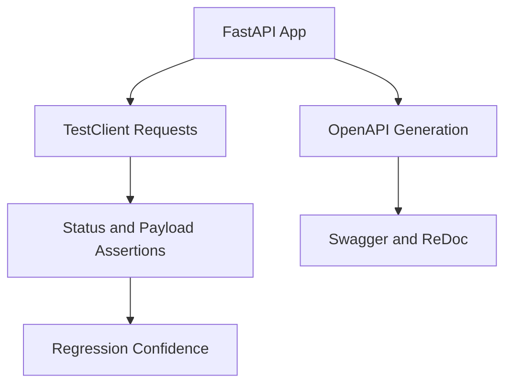

# Day 059 [Intermediate]: FastAPI Testing and Docs

## Index

- [Goal](#goal)
- [Prerequisites](#prerequisites)
- [Explanation](#explanation)
- [Topic by Topic](#topic-by-topic)
- [Key Concepts](#key-concepts)
- [Visual Concept Map](#visual-concept-map)
- [End-to-End Practical](#end-to-end-practical)
- [Hands-on Coding](#hands-on-coding)
- [Mini Exercise](#mini-exercise)
- [Assessment Quiz](#assessment-quiz)
- [Task](#task)
- [Self Check](#self-check)
- [Interview Questions and Answers](#interview-questions-and-answers)
- [Day 059 Outcome](#day-059-outcome)

## Goal

Create reliable FastAPI services with automated tests and clear API documentation for team and client use.

## Prerequisites

- Day 058 completed
- Basic pytest familiarity and understanding of FastAPI routes

## Explanation

Good APIs are both testable and understandable. FastAPI provides built-in OpenAPI docs, while pytest-based test suites ensure behavior remains stable during changes.

## Topic by Topic

### Topic 1: Test Strategy for API Projects

Theory:
Balance unit tests, integration tests, and endpoint contract tests.

Practical:
Start with core happy path + validation failure paths.

Code Example:

```python
# Unit test: business function
# Integration test: route + DB + validation
```

**Explanation:**
This topic explains Test Strategy for API Projects in a practical Python context so you can write clear, reliable, and maintainable programs for real-world tasks.

**Key Points:**
- Understand the core idea behind Test Strategy for API Projects.
- Apply the practical pattern with good readability and validation habits.
- Keep the solution maintainable, testable, and safe for production use where relevant.

### Topic 2: FastAPI TestClient Basics

Theory:
TestClient allows request simulation without running external server.

Practical:
Use it for GET/POST status and response checks.

Code Example:

```python
from fastapi.testclient import TestClient
from main import app

client = TestClient(app)

def test_health():
  response = client.get("/health")
  assert response.status_code == 200
```

**Explanation:**
This topic explains FastAPI TestClient Basics in a practical Python context so you can write clear, reliable, and maintainable programs for real-world tasks.

**Key Points:**
- Understand the core idea behind FastAPI TestClient Basics.
- Apply the practical pattern with good readability and validation habits.
- Keep the solution maintainable, testable, and safe for production use where relevant.

### Topic 3: Dependency Overrides for Testing

Theory:
Production dependencies (DB/auth) should be replaceable in tests.

Practical:
Override get_db or get_current_user with test versions.

Code Example:

```python
def override_user():
  return {"id": 1, "role": "admin"}

app.dependency_overrides[get_current_user] = override_user
```

**Explanation:**
This topic explains Dependency Overrides for Testing in a practical Python context so you can write clear, reliable, and maintainable programs for real-world tasks.

**Key Points:**
- Understand the core idea behind Dependency Overrides for Testing.
- Apply the practical pattern with good readability and validation habits.
- Keep the solution maintainable, testable, and safe for production use where relevant.

### Topic 4: Testing Auth and Validation Failures

Theory:
Failure tests prevent security and contract regressions.

Practical:
Test 401, 403, and 422 paths explicitly.

Code Example:

```python
def test_unauthorized():
  response = client.get("/me")
  assert response.status_code == 401
```

**Explanation:**
This topic explains Testing Auth and Validation Failures in a practical Python context so you can write clear, reliable, and maintainable programs for real-world tasks.

**Key Points:**
- Understand the core idea behind Testing Auth and Validation Failures.
- Apply the practical pattern with good readability and validation habits.
- Keep the solution maintainable, testable, and safe for production use where relevant.

### Topic 5: OpenAPI and Interactive Docs Quality

Theory:
Docs are generated from routes, models, and metadata.

Practical:
Add tags, summaries, and schema descriptions for clarity.

Code Example:

```python
@app.get("/products", tags=["products"], summary="List products")
async def list_products():
  return []
```

**Explanation:**
This topic explains OpenAPI and Interactive Docs Quality in a practical Python context so you can write clear, reliable, and maintainable programs for real-world tasks.

**Key Points:**
- Understand the core idea behind OpenAPI and Interactive Docs Quality.
- Apply the practical pattern with good readability and validation habits.
- Keep the solution maintainable, testable, and safe for production use where relevant.

### Topic 6: Documentation and Test Maintenance

Theory:
Docs and tests must evolve with code changes.

Practical:
Treat test and docs updates as required in every PR.

Code Example:

```python
# CI should run pytest and reject PRs with failing API tests.
```

**Explanation:**
This topic explains Documentation and Test Maintenance in a practical Python context so you can write clear, reliable, and maintainable programs for real-world tasks.

**Key Points:**
- Understand the core idea behind Documentation and Test Maintenance.
- Apply the practical pattern with good readability and validation habits.
- Keep the solution maintainable, testable, and safe for production use where relevant.

## Key Concepts

- API testing should include happy and failure paths
- TestClient is the base tool for endpoint tests
- Dependency overrides make isolated testing practical
- Auth and validation error paths are critical checks
- OpenAPI docs quality depends on route metadata
- Tests and docs are part of maintainable API contracts

## Visual Concept Map



## End-to-End Practical

1. Add health and CRUD endpoint tests.
2. Add validation failure tests (422).
3. Add auth failure tests (401/403).
4. Override dependencies for predictable tests.
5. Improve endpoint metadata for generated docs.

## Hands-on Coding

### Example 1: Case - Create Endpoint Test

Scenario:
Ensure product creation returns expected contract.

```python
def test_create_product():
  payload = {"name": "Keyboard", "price": 1000, "stock": 5}
  response = client.post("/products", json=payload)
  assert response.status_code == 201
```

### Example 2: Case - Validation Error Test

Scenario:
Ensure invalid payload is rejected.

```python
def test_create_product_invalid_price():
  payload = {"name": "Bad", "price": -1, "stock": 5}
  response = client.post("/products", json=payload)
  assert response.status_code == 422
```

### Example 3: Case - Docs Quality Improvement

Scenario:
Add route summary and response descriptions for consumer clarity.

```python
@app.get("/orders", summary="Fetch orders", response_description="Order list")
async def orders():
  return []
```

## Mini Exercise

Scenario:
Write five tests for your FastAPI project: two success, two validation/auth failures, and one edge case. Improve docs for at least two routes.

Expected output:

- Five passing tests
- Documented API routes with clear summaries
- Verified Swagger UI with meaningful schemas

## Assessment Quiz

### Quiz Questions

1. Why test 422 responses explicitly?
2. What problem does dependency override solve in tests?
3. True or False: Docs can be ignored if tests pass.
4. Where does FastAPI get schema definitions from?
5. Why include auth failure tests?

### Quiz Answers

1. To prevent validation contract regressions
2. It isolates external services and makes tests deterministic
3. False
4. Pydantic models and route definitions
5. To ensure protected resources stay protected

## Task

- Build a focused API test suite with auth and validation checks
- Add route metadata to improve generated documentation
- Include tests/docs updates as standard development practice

## Self Check

- You can create stable FastAPI tests with TestClient
- You can validate both success and failure contracts
- You can ship API docs that are useful for consumers

## Interview Questions and Answers

### Beginner

**Question:** Why use TestClient in FastAPI?

**Answer:** It enables endpoint testing without manually running the server.

**Question:** What is Swagger UI used for?

**Answer:** To explore, understand, and manually test API endpoints.

### Middle

**Question:** Why test auth failures along with success?

**Answer:** Security behavior can break silently, so failure paths are essential.

**Question:** How do dependency overrides help speed testing?

**Answer:** They replace expensive or external dependencies with lightweight mocks.

### Advanced

**Question:** What is a common anti-pattern in API tests?

**Answer:** Asserting only status code without checking response body contract.

**Question:** How does documentation quality affect engineering velocity?

**Answer:** Better docs reduce integration confusion and cut onboarding/debug time.

## Day 059 Outcome

- You can create robust FastAPI test coverage with pytest/TestClient
- You can maintain useful API documentation through route metadata
- You are ready to build a complete REST API mini project on Day 060
