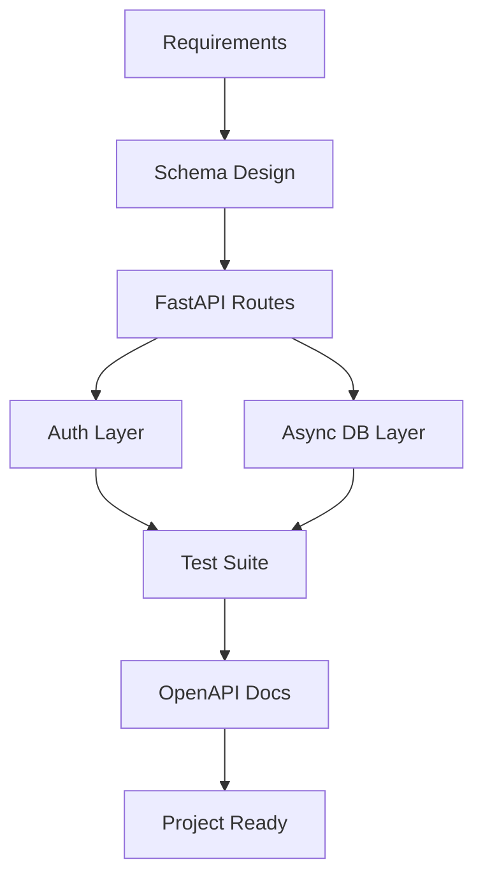

# Day 060 [Intermediate]: Mini Project REST API Service

## Index

- [Goal](#goal)
- [Prerequisites](#prerequisites)
- [Explanation](#explanation)
- [Topic by Topic](#topic-by-topic)
- [Key Concepts](#key-concepts)
- [Visual Concept Map](#visual-concept-map)
- [End-to-End Practical](#end-to-end-practical)
- [Hands-on Coding](#hands-on-coding)
- [Mini Exercise](#mini-exercise)
- [Assessment Quiz](#assessment-quiz)
- [Task](#task)
- [Self Check](#self-check)
- [Interview Questions and Answers](#interview-questions-and-answers)
- [Day 060 Outcome](#day-060-outcome)

## Goal

Build a complete REST API service mini project using FastAPI, validation, auth, async DB patterns, tests, and documentation.

## Prerequisites

- Day 056 to Day 059 completed
- Working local Python environment with FastAPI toolchain

## Explanation

This capstone day combines your recent FastAPI learning into one coherent service. The focus is not just coding endpoints, but building maintainable project structure with quality and security checks.

## Topic by Topic

### Topic 1: Project Scope and Resource Design

Theory:
Define resources, relationships, and endpoint boundaries before coding.

Practical:
Pick one clear domain, for example Task Manager or Inventory API.

Code Example:

```text
Resources:
- users
- tasks
- labels
```

**Explanation:**
This topic explains Project Scope and Resource Design in a practical Python context so you can write clear, reliable, and maintainable programs for real-world tasks.

**Key Points:**
- Understand the core idea behind Project Scope and Resource Design.
- Apply the practical pattern with good readability and validation habits.
- Keep the solution maintainable, testable, and safe for production use where relevant.

### Topic 2: Contract-First Schemas

Theory:
Schema contracts guide both implementation and client integration.

Practical:
Create request/response models first.

Code Example:

```python
class TaskCreate(BaseModel):
  title: str = Field(min_length=3)
  priority: int = Field(ge=1, le=5)

class TaskOut(BaseModel):
  id: int
  title: str
  priority: int
```

**Explanation:**
This topic explains Contract-First Schemas in a practical Python context so you can write clear, reliable, and maintainable programs for real-world tasks.

**Key Points:**
- Understand the core idea behind Contract-First Schemas.
- Apply the practical pattern with good readability and validation habits.
- Keep the solution maintainable, testable, and safe for production use where relevant.

### Topic 3: Secure Access Design

Theory:
Public and private endpoints must be intentionally separated.

Practical:
Add auth dependency for protected CRUD operations.

Code Example:

```python
@app.get("/tasks")
async def list_tasks(user=Depends(get_current_user)):
  return []
```

**Explanation:**
This topic explains Secure Access Design in a practical Python context so you can write clear, reliable, and maintainable programs for real-world tasks.

**Key Points:**
- Understand the core idea behind Secure Access Design.
- Apply the practical pattern with good readability and validation habits.
- Keep the solution maintainable, testable, and safe for production use where relevant.

### Topic 4: Async Persistence Layer

Theory:
Persistence should be isolated from route handlers.

Practical:
Use repository/service abstraction and async session injection.

Code Example:

```python
async def list_tasks_repo(db: AsyncSession, limit: int, offset: int):
  ...
```

**Explanation:**
This topic explains Async Persistence Layer in a practical Python context so you can write clear, reliable, and maintainable programs for real-world tasks.

**Key Points:**
- Understand the core idea behind Async Persistence Layer.
- Apply the practical pattern with good readability and validation habits.
- Keep the solution maintainable, testable, and safe for production use where relevant.

### Topic 5: Quality Gate with Tests

Theory:
Core behaviors need automated regression checks.

Practical:
Test create/read/update/delete + auth and validation failures.

Code Example:

```python
def test_create_task_unauthorized():
  response = client.post("/tasks", json={"title": "A", "priority": 1})
  assert response.status_code in (401, 403)
```

**Explanation:**
This topic explains Quality Gate with Tests in a practical Python context so you can write clear, reliable, and maintainable programs for real-world tasks.

**Key Points:**
- Understand the core idea behind Quality Gate with Tests.
- Apply the practical pattern with good readability and validation habits.
- Keep the solution maintainable, testable, and safe for production use where relevant.

### Topic 6: Docs and Deployment Readiness

Theory:
A usable API includes docs, env configuration, and run instructions.

Practical:
Ensure Swagger/ReDoc clarity and add README quickstart.

Code Example:

```text
Run:
uvicorn app.main:app --reload
```

**Explanation:**
This topic explains Docs and Deployment Readiness in a practical Python context so you can write clear, reliable, and maintainable programs for real-world tasks.

**Key Points:**
- Understand the core idea behind Docs and Deployment Readiness.
- Apply the practical pattern with good readability and validation habits.
- Keep the solution maintainable, testable, and safe for production use where relevant.

## Key Concepts

- End-to-end API design needs architecture, not just routes
- Schema-first contracts reduce ambiguity
- Auth and authorization should be default for mutable resources
- Async data layer should stay modular
- Tests define reliability baseline
- Documentation improves adoption and maintenance

## Visual Concept Map



## End-to-End Practical

1. Select domain and resource list.
2. Build Pydantic request/response schemas.
3. Implement auth-protected CRUD endpoints.
4. Connect async DB session and repository layer.
5. Write tests and verify OpenAPI docs quality.

## Hands-on Coding

### Example 1: Case - Skeleton Setup

Scenario:
Create app modules: routes, schemas, auth, db, tests.

```text
app/
  main.py
  routes/
  schemas/
  services/
  db/
tests/
```

### Example 2: Case - Task CRUD with Auth

Scenario:
Implement authenticated CRUD endpoints for tasks.

```python
@app.post("/tasks", response_model=TaskOut)
async def create_task(data: TaskCreate, db: AsyncSession = Depends(get_db), user=Depends(get_current_user)):
  return await create_task_service(db, data, user)
```

### Example 3: Case - Test and Docs Completion

Scenario:
Add contract tests and ensure endpoint descriptions are present in docs.

```python
def test_create_task_validation_error():
  response = client.post("/tasks", json={"title": "x", "priority": 9})
  assert response.status_code == 422
```

## Mini Exercise

Scenario:
Build your own REST API mini project with one primary resource and one related secondary resource. Include auth, async DB, tests, and docs.

Expected output:

- Structured FastAPI codebase
- Protected and validated endpoints
- Passing test suite for core flows
- Clear interactive API docs

## Assessment Quiz

### Quiz Questions

1. Why is schema-first design useful in API projects?
2. What risk appears if CRUD routes are left unprotected?
3. True or False: Async DB integration removes need for tests.
4. Why separate repository/service from route handlers?
5. What documentation artifact is mandatory for API consumers?

### Quiz Answers

1. It gives clear contract and implementation direction
2. Unauthorized data access or mutation
3. False
4. Better maintainability and easier testing
5. OpenAPI docs with accurate route/schema metadata

## Task

- Complete a mini REST API service from design to tests
- Apply validation, security, and async DB best practices
- Publish clear run instructions and API docs

## Self Check

- You can design and ship a complete FastAPI service
- You can explain architecture and tradeoffs clearly
- You can defend quality and security decisions in review/interview

## Interview Questions and Answers

### Beginner

**Question:** What are the minimum layers in a production-ready API?

**Answer:** Routes, schemas, persistence, and basic auth/error handling.

**Question:** Why are tests needed if API works manually?

**Answer:** Tests prevent regressions and provide repeatable quality checks.

### Middle

**Question:** How do you keep route handlers clean in larger projects?

**Answer:** Move business logic to service/repository layers and keep handlers orchestrational.

**Question:** What is one key deployment-readiness check?

**Answer:** Environment-based configuration with secure secret handling.

### Advanced

**Question:** What tradeoff exists between rapid feature delivery and API contract stability?

**Answer:** Faster iteration can cause breaking changes unless versioning and strict schema governance are enforced.

**Question:** How would you evolve this mini project for scale?

**Answer:** Add observability, caching, background jobs, stricter CI quality gates, and modular domain boundaries.

## Day 060 Outcome

- You have completed a practical FastAPI REST API mini project blueprint
- You can integrate validation, security, async persistence, testing, and docs together
- You are ready to continue toward advanced Python backend engineering topics
