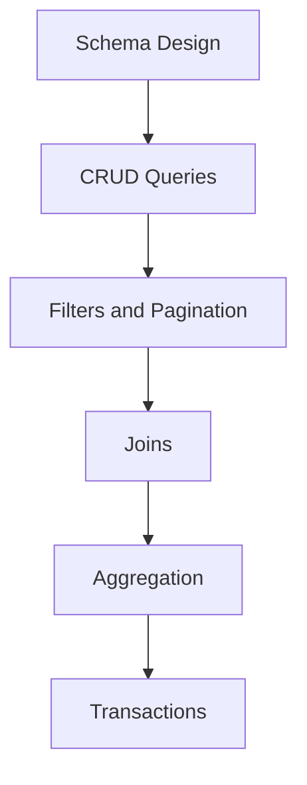

# Day 061 [Intermediate]: SQL Fundamentals for Python Developers

## Index

- [Goal](#goal)
- [Prerequisites](#prerequisites)
- [Explanation](#explanation)
- [Topic by Topic](#topic-by-topic)
- [Key Concepts](#key-concepts)
- [Visual Concept Map](#visual-concept-map)
- [End-to-End Practical](#end-to-end-practical)
- [Hands-on Coding](#hands-on-coding)
- [Mini Exercise](#mini-exercise)
- [Assessment Quiz](#assessment-quiz)
- [Task](#task)
- [Self Check](#self-check)
- [Interview Questions and Answers](#interview-questions-and-answers)
- [Day 061 Outcome](#day-061-outcome)

## Goal

Build a strong SQL foundation for backend Python work, covering query design, joins, aggregation, and transaction basics.

## Prerequisites

- Day 060 completed
- Comfortable with Python functions and FastAPI data flow

## Explanation

Even when using ORMs, serious backend work needs SQL fluency. SQL helps you debug slow queries, model data clearly, and write better persistence logic in production systems.

## Topic by Topic

### Topic 1: Tables, Rows, and Relational Thinking

Theory:
Data in relational systems is organized into tables with primary keys and typed columns.

Practical:
Design table structure before writing application code.

Code Example:

```sql
CREATE TABLE users (
  id SERIAL PRIMARY KEY,
  email TEXT UNIQUE NOT NULL,
  created_at TIMESTAMP NOT NULL DEFAULT NOW()
);
```

**Explanation:**
This topic explains Tables, Rows, and Relational Thinking in a practical Python context so you can write clear, reliable, and maintainable programs for real-world tasks.

**Key Points:**
- Understand the core idea behind Tables, Rows, and Relational Thinking.
- Apply the practical pattern with good readability and validation habits.
- Keep the solution maintainable, testable, and safe for production use where relevant.

### Topic 2: CRUD Query Building

Theory:
Create, read, update, and delete are the base operations of every data API.

Practical:
Write explicit SQL for each operation with safe filtering.

Code Example:

```sql
INSERT INTO users (email) VALUES ('a@example.com');
SELECT id, email FROM users WHERE id = 1;
UPDATE users SET email = 'b@example.com' WHERE id = 1;
DELETE FROM users WHERE id = 1;
```

**Explanation:**
This topic explains CRUD Query Building in a practical Python context so you can write clear, reliable, and maintainable programs for real-world tasks.

**Key Points:**
- Understand the core idea behind CRUD Query Building.
- Apply the practical pattern with good readability and validation habits.
- Keep the solution maintainable, testable, and safe for production use where relevant.

### Topic 3: Filtering, Sorting, and Pagination

Theory:
Large datasets need constrained retrieval for performance and UX.

Practical:
Use WHERE, ORDER BY, LIMIT, and OFFSET intentionally.

Code Example:

```sql
SELECT id, email
FROM users
WHERE email ILIKE '%example%'
ORDER BY id DESC
LIMIT 20 OFFSET 0;
```

**Explanation:**
This topic explains Filtering, Sorting, and Pagination in a practical Python context so you can write clear, reliable, and maintainable programs for real-world tasks.

**Key Points:**
- Understand the core idea behind Filtering, Sorting, and Pagination.
- Apply the practical pattern with good readability and validation habits.
- Keep the solution maintainable, testable, and safe for production use where relevant.

### Topic 4: Joins and Relationship Queries

Theory:
Joins combine related tables and power most business reporting.

Practical:
Use INNER JOIN for required relationships and LEFT JOIN for optional relationships.

Code Example:

```sql
SELECT o.id, u.email
FROM orders o
JOIN users u ON o.user_id = u.id;
```

**Explanation:**
This topic explains Joins and Relationship Queries in a practical Python context so you can write clear, reliable, and maintainable programs for real-world tasks.

**Key Points:**
- Understand the core idea behind Joins and Relationship Queries.
- Apply the practical pattern with good readability and validation habits.
- Keep the solution maintainable, testable, and safe for production use where relevant.

### Topic 5: Aggregation and Grouping

Theory:
COUNT, SUM, AVG, GROUP BY, and HAVING create analytical views of operational data.

Practical:
Use aggregation for dashboards and usage metrics.

Code Example:

```sql
SELECT user_id, COUNT(*) AS total_orders
FROM orders
GROUP BY user_id
HAVING COUNT(*) > 5;
```

**Explanation:**
This topic explains Aggregation and Grouping in a practical Python context so you can write clear, reliable, and maintainable programs for real-world tasks.

**Key Points:**
- Understand the core idea behind Aggregation and Grouping.
- Apply the practical pattern with good readability and validation habits.
- Keep the solution maintainable, testable, and safe for production use where relevant.

### Topic 6: Transactions and Data Integrity

Theory:
Transactions ensure multiple related writes succeed or fail together.

Practical:
Wrap dependent operations in BEGIN/COMMIT with rollback on failure.

Code Example:

```sql
BEGIN;
UPDATE accounts SET balance = balance - 100 WHERE id = 1;
UPDATE accounts SET balance = balance + 100 WHERE id = 2;
COMMIT;
```

**Explanation:**
This topic explains Transactions and Data Integrity in a practical Python context so you can write clear, reliable, and maintainable programs for real-world tasks.

**Key Points:**
- Understand the core idea behind Transactions and Data Integrity.
- Apply the practical pattern with good readability and validation habits.
- Keep the solution maintainable, testable, and safe for production use where relevant.

## Key Concepts

- SQL clarity improves backend reliability
- CRUD must be explicit and filter-safe
- Joins and aggregates are essential for real systems
- Pagination is mandatory for scalable list endpoints
- Transactions preserve consistency in multi-step updates
- SQL understanding improves ORM debugging and performance tuning

## Visual Concept Map



## End-to-End Practical

1. Define users and orders tables.
2. Insert seed data.
3. Build joined order-list query.
4. Add paginated filtering.
5. Add transaction for two-step update.

## Hands-on Coding

### Example 1: Case - User and Order Data Model

Scenario:
Create a minimal relational schema with one-to-many relationship.

```sql
CREATE TABLE orders (
  id SERIAL PRIMARY KEY,
  user_id INT NOT NULL REFERENCES users(id),
  amount NUMERIC(10,2) NOT NULL
);
```

### Example 2: Case - Reporting Query

Scenario:
Find top users by order count.

```sql
SELECT u.email, COUNT(o.id) AS total
FROM users u
LEFT JOIN orders o ON o.user_id = u.id
GROUP BY u.id, u.email
ORDER BY total DESC;
```

### Example 3: Case - Safe Update Pattern

Scenario:
Prevent accidental full-table updates with clear WHERE clause.

```sql
UPDATE users SET email = 'new@example.com' WHERE id = 42;
```

## Mini Exercise

Scenario:
Design three tables for a blog system and write SQL for create post, list posts with author, and count posts per author.

Expected output:

- Three CREATE TABLE statements
- At least one JOIN query
- At least one GROUP BY query

## Assessment Quiz

### Quiz Questions

1. Why is LIMIT and OFFSET important in APIs?
2. What does INNER JOIN return compared to LEFT JOIN?
3. True or False: Transactions are only needed in banking apps.
4. What risk appears without WHERE in UPDATE queries?
5. Why should Python developers know SQL if using ORM?

### Quiz Answers

1. It controls payload size and improves query efficiency
2. INNER JOIN keeps matched rows only, LEFT JOIN keeps all left-side rows
3. False
4. Unintended mass updates of entire table
5. SQL is needed for debugging, optimization, and complex reporting

## Task

- Build a mini relational schema with at least two linked tables
- Write five SQL queries covering CRUD, join, and aggregation
- Demonstrate one transaction with explanation

## Self Check

- You can design normalized relational tables
- You can write join and aggregation queries confidently
- You can use transactions for consistency-sensitive operations

## Interview Questions and Answers

### Beginner

**Question:** What is a primary key?

**Answer:** A unique identifier for each row in a table.

**Question:** Why use SQL filters?

**Answer:** To retrieve only relevant records and reduce unnecessary load.

### Middle

**Question:** When do you choose LEFT JOIN over INNER JOIN?

**Answer:** When you want all records from the left table even if no related row exists.

**Question:** Why paginate list queries?

**Answer:** To avoid heavy responses and keep API latency stable.

### Advanced

**Question:** What anti-pattern is common in SQL-backed APIs?

**Answer:** Fetching large unbounded result sets without indexing or pagination.

**Question:** How does SQL literacy improve ORM usage?

**Answer:** You can read generated queries, detect inefficiencies, and tune schema/index choices.

## Day 061 Outcome

- You can write practical SQL for backend features
- You can reason about joins, aggregation, and transactional safety
- You are ready to connect Python code to PostgreSQL in Day 062
