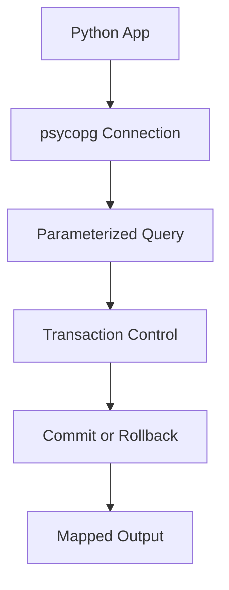

# Day 062 [Intermediate]: PostgreSQL with psycopg

## Index

- [Goal](#goal)
- [Prerequisites](#prerequisites)
- [Explanation](#explanation)
- [Topic by Topic](#topic-by-topic)
- [Key Concepts](#key-concepts)
- [Visual Concept Map](#visual-concept-map)
- [End-to-End Practical](#end-to-end-practical)
- [Hands-on Coding](#hands-on-coding)
- [Mini Exercise](#mini-exercise)
- [Assessment Quiz](#assessment-quiz)
- [Task](#task)
- [Self Check](#self-check)
- [Interview Questions and Answers](#interview-questions-and-answers)
- [Day 062 Outcome](#day-062-outcome)

## Goal

Connect Python applications to PostgreSQL using psycopg with safe queries, transaction control, and reliable error handling.

## Prerequisites

- Day 061 completed
- Basic SQL query writing skills

## Explanation

psycopg is a robust PostgreSQL adapter for Python. It gives low-level control over SQL execution, transactions, and database-side features while keeping performance predictable.

## Topic by Topic

### Topic 1: Connecting to PostgreSQL Safely

Theory:
Connections should use secure credentials and explicit lifecycle management.

Practical:
Use environment variables and close resources properly.

Code Example:

```python
import psycopg

conn = psycopg.connect("dbname=appdb user=appuser password=secret host=localhost")
cur = conn.cursor()
```

**Explanation:**
This topic explains Connecting to PostgreSQL Safely in a practical Python context so you can write clear, reliable, and maintainable programs for real-world tasks.

**Key Points:**
- Understand the core idea behind Connecting to PostgreSQL Safely.
- Apply the practical pattern with good readability and validation habits.
- Keep the solution maintainable, testable, and safe for production use where relevant.

### Topic 2: Parameterized Queries

Theory:
String concatenation in SQL is unsafe and error-prone.

Practical:
Use placeholders with bound parameters to prevent SQL injection.

Code Example:

```python
cur.execute("SELECT id, email FROM users WHERE email = %s", (email,))
row = cur.fetchone()
```

**Explanation:**
This topic explains Parameterized Queries in a practical Python context so you can write clear, reliable, and maintainable programs for real-world tasks.

**Key Points:**
- Understand the core idea behind Parameterized Queries.
- Apply the practical pattern with good readability and validation habits.
- Keep the solution maintainable, testable, and safe for production use where relevant.

### Topic 3: Transactions with Commit and Rollback

Theory:
Write operations must be committed or rolled back explicitly.

Practical:
Wrap critical operations in try/except with rollback on failure.

Code Example:

```python
try:
  cur.execute("UPDATE accounts SET balance = balance - %s WHERE id = %s", (100, 1))
  cur.execute("UPDATE accounts SET balance = balance + %s WHERE id = %s", (100, 2))
  conn.commit()
except Exception:
  conn.rollback()
  raise
```

**Explanation:**
This topic explains Transactions with Commit and Rollback in a practical Python context so you can write clear, reliable, and maintainable programs for real-world tasks.

**Key Points:**
- Understand the core idea behind Transactions with Commit and Rollback.
- Apply the practical pattern with good readability and validation habits.
- Keep the solution maintainable, testable, and safe for production use where relevant.

### Topic 4: Bulk Operations and Performance Basics

Theory:
Batch inserts reduce round trips and improve throughput.

Practical:
Use executemany for repeated writes where suitable.

Code Example:

```python
users = [("a@example.com",), ("b@example.com",)]
cur.executemany("INSERT INTO users (email) VALUES (%s)", users)
conn.commit()
```

**Explanation:**
This topic explains Bulk Operations and Performance Basics in a practical Python context so you can write clear, reliable, and maintainable programs for real-world tasks.

**Key Points:**
- Understand the core idea behind Bulk Operations and Performance Basics.
- Apply the practical pattern with good readability and validation habits.
- Keep the solution maintainable, testable, and safe for production use where relevant.

### Topic 5: Reading Query Results Cleanly

Theory:
Result handling should be explicit and predictable.

Practical:
Use fetchone/fetchall appropriately and map rows to output models.

Code Example:

```python
cur.execute("SELECT id, email FROM users ORDER BY id DESC LIMIT 10")
rows = cur.fetchall()
```

**Explanation:**
This topic explains Reading Query Results Cleanly in a practical Python context so you can write clear, reliable, and maintainable programs for real-world tasks.

**Key Points:**
- Understand the core idea behind Reading Query Results Cleanly.
- Apply the practical pattern with good readability and validation habits.
- Keep the solution maintainable, testable, and safe for production use where relevant.

### Topic 6: Resource Management and Reliability

Theory:
Unclosed cursors/connections can leak resources.

Practical:
Use context managers for automatic cleanup.

Code Example:

```python
with psycopg.connect(dsn) as conn:
  with conn.cursor() as cur:
    cur.execute("SELECT 1")
```

**Explanation:**
This topic explains Resource Management and Reliability in a practical Python context so you can write clear, reliable, and maintainable programs for real-world tasks.

**Key Points:**
- Understand the core idea behind Resource Management and Reliability.
- Apply the practical pattern with good readability and validation habits.
- Keep the solution maintainable, testable, and safe for production use where relevant.

## Key Concepts

- Use secure and explicit connection management
- Parameterized queries are mandatory for safety
- Transaction handling protects data integrity
- Bulk operations can improve write performance
- Result handling should align with output contract design
- Context managers reduce leakage and failure risk

## Visual Concept Map



## End-to-End Practical

1. Connect Python service to local PostgreSQL.
2. Create one table and insert sample data.
3. Add safe read and write queries with parameters.
4. Add transaction handling with rollback path.
5. Refactor to context manager based connection lifecycle.

## Hands-on Coding

### Example 1: Case - User Repository Function

Scenario:
Build function to insert user and return generated id.

```python
def create_user(conn, email: str):
  with conn.cursor() as cur:
    cur.execute("INSERT INTO users (email) VALUES (%s) RETURNING id", (email,))
    return cur.fetchone()[0]
```

### Example 2: Case - Search API Query Function

Scenario:
Fetch users with prefix match and pagination.

```python
def list_users(conn, prefix: str, limit: int, offset: int):
  with conn.cursor() as cur:
    cur.execute(
      "SELECT id, email FROM users WHERE email ILIKE %s ORDER BY id LIMIT %s OFFSET %s",
      (f"{prefix}%", limit, offset),
    )
    return cur.fetchall()
```

### Example 3: Case - Resilient Transfer Operation

Scenario:
Implement funds transfer with strict commit/rollback behavior.

```python
def transfer(conn, from_id: int, to_id: int, amount: int):
  try:
    with conn.cursor() as cur:
      cur.execute("UPDATE accounts SET balance = balance - %s WHERE id = %s", (amount, from_id))
      cur.execute("UPDATE accounts SET balance = balance + %s WHERE id = %s", (amount, to_id))
    conn.commit()
  except Exception:
    conn.rollback()
    raise
```

## Mini Exercise

Scenario:
Create a Python script using psycopg to manage products: create table, insert 5 products, search by name, update stock, and delete by id.

Expected output:

- Fully parameterized SQL usage
- One successful commit path
- One forced rollback test path

## Assessment Quiz

### Quiz Questions

1. Why are parameterized queries essential?
2. When should rollback be called?
3. True or False: Closing only cursor is enough in long-running apps.
4. What advantage do context managers provide?
5. Why may executemany be preferred for inserts?

### Quiz Answers

1. They prevent SQL injection and typing errors
2. After exceptions during transactional write operations
3. False
4. Automatic cleanup and safer error handling
5. Fewer database round trips and simpler batch writes

## Task

- Build a small psycopg data access module for one entity
- Include query parameterization, commits, rollbacks, and cleanup
- Document one performance and one reliability improvement

## Self Check

- You can connect Python to PostgreSQL confidently
- You can execute safe and reliable SQL from Python
- You can design robust transaction-aware data operations

## Interview Questions and Answers

### Beginner

**Question:** Why should SQL use placeholders instead of string concat?

**Answer:** Placeholders avoid injection risks and ensure safe query construction.

**Question:** What does commit do?

**Answer:** It permanently applies current transaction changes to the database.

### Middle

**Question:** How would you handle a failed multi-query update?

**Answer:** Catch exception, call rollback, and propagate or map the error.

**Question:** Why use context managers with psycopg?

**Answer:** They reduce connection leaks and enforce deterministic cleanup.

### Advanced

**Question:** What is a common anti-pattern in direct SQL adapters?

**Answer:** Mixing SQL strings and user input directly without parameterization.

**Question:** How can you mature a psycopg-based layer for production?

**Answer:** Add pooling, structured error mapping, retries for transient faults, and observability.

## Day 062 Outcome

- You can build safe PostgreSQL integrations using psycopg
- You can manage transactions, errors, and resource lifecycle effectively
- You are ready for ORM patterns and migration workflows on Day 063
