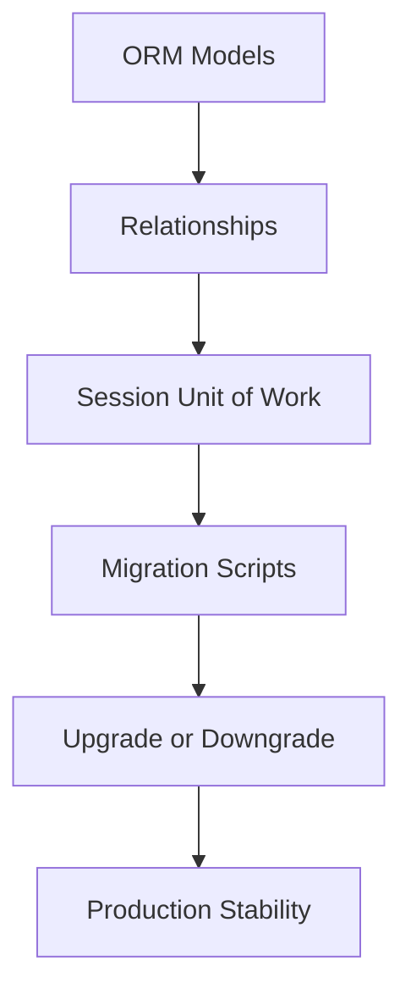

# Day 063 [Intermediate]: ORM Patterns and Migrations

## Index

- [Goal](#goal)
- [Prerequisites](#prerequisites)
- [Explanation](#explanation)
- [Topic by Topic](#topic-by-topic)
- [Key Concepts](#key-concepts)
- [Visual Concept Map](#visual-concept-map)
- [End-to-End Practical](#end-to-end-practical)
- [Hands-on Coding](#hands-on-coding)
- [Mini Exercise](#mini-exercise)
- [Assessment Quiz](#assessment-quiz)
- [Task](#task)
- [Self Check](#self-check)
- [Interview Questions and Answers](#interview-questions-and-answers)
- [Day 063 Outcome](#day-063-outcome)

## Goal

Learn maintainable ORM design patterns and schema migration workflows for evolving Python backend systems safely.

## Prerequisites

- Day 062 completed
- Basic understanding of SQLAlchemy models and SQL fundamentals

## Explanation

ORMs speed up development, but architecture decisions determine long-term maintainability. Migrations ensure schema evolution is reproducible across local, staging, and production environments.

## Topic by Topic

### Topic 1: Model Design Principles

Theory:
Entities should represent business concepts clearly with explicit constraints.

Practical:
Define model columns, relationships, and indexes intentionally.

Code Example:

```python
class User(Base):
  __tablename__ = "users"
  id = Column(Integer, primary_key=True)
  email = Column(String, unique=True, nullable=False, index=True)
```

**Explanation:**
This topic explains Model Design Principles in a practical Python context so you can write clear, reliable, and maintainable programs for real-world tasks.

**Key Points:**
- Understand the core idea behind Model Design Principles.
- Apply the practical pattern with good readability and validation habits.
- Keep the solution maintainable, testable, and safe for production use where relevant.

### Topic 2: Relationship Patterns

Theory:
One-to-many and many-to-many relationships need careful mapping.

Practical:
Use relationship with back_populates for bidirectional readability.

Code Example:

```python
class Order(Base):
  __tablename__ = "orders"
  id = Column(Integer, primary_key=True)
  user_id = Column(Integer, ForeignKey("users.id"), nullable=False)
  user = relationship("User", back_populates="orders")
```

**Explanation:**
This topic explains Relationship Patterns in a practical Python context so you can write clear, reliable, and maintainable programs for real-world tasks.

**Key Points:**
- Understand the core idea behind Relationship Patterns.
- Apply the practical pattern with good readability and validation habits.
- Keep the solution maintainable, testable, and safe for production use where relevant.

### Topic 3: Session and Unit of Work Pattern

Theory:
Session tracks pending ORM state and applies changes as one unit.

Practical:
Keep session scope request-local and explicit in service layers.

Code Example:

```python
def create_order(db: Session, user_id: int):
  order = Order(user_id=user_id)
  db.add(order)
  db.commit()
  db.refresh(order)
  return order
```

**Explanation:**
This topic explains Session and Unit of Work Pattern in a practical Python context so you can write clear, reliable, and maintainable programs for real-world tasks.

**Key Points:**
- Understand the core idea behind Session and Unit of Work Pattern.
- Apply the practical pattern with good readability and validation habits.
- Keep the solution maintainable, testable, and safe for production use where relevant.

### Topic 4: Migration Workflow with Alembic

Theory:
Manual schema edits are risky and non-reproducible.

Practical:
Create migration scripts, review them, and apply via version control.

Code Example:

```bash
alembic revision --autogenerate -m "add orders table"
alembic upgrade head
```

**Explanation:**
This topic explains Migration Workflow with Alembic in a practical Python context so you can write clear, reliable, and maintainable programs for real-world tasks.

**Key Points:**
- Understand the core idea behind Migration Workflow with Alembic.
- Apply the practical pattern with good readability and validation habits.
- Keep the solution maintainable, testable, and safe for production use where relevant.

### Topic 5: Migration Safety and Rollback Strategy

Theory:
Migrations can fail in production due to data shape and locking.

Practical:
Use backward-compatible changes and tested rollback paths.

Code Example:

```bash
alembic downgrade -1
```

**Explanation:**
This topic explains Migration Safety and Rollback Strategy in a practical Python context so you can write clear, reliable, and maintainable programs for real-world tasks.

**Key Points:**
- Understand the core idea behind Migration Safety and Rollback Strategy.
- Apply the practical pattern with good readability and validation habits.
- Keep the solution maintainable, testable, and safe for production use where relevant.

### Topic 6: Common ORM Performance Pitfalls

Theory:
N+1 queries and lazy-loading misuse can hurt API latency.

Practical:
Use eager loading options and query profiling when needed.

Code Example:

```python
from sqlalchemy.orm import selectinload

query = db.query(User).options(selectinload(User.orders))
```

**Explanation:**
This topic explains Common ORM Performance Pitfalls in a practical Python context so you can write clear, reliable, and maintainable programs for real-world tasks.

**Key Points:**
- Understand the core idea behind Common ORM Performance Pitfalls.
- Apply the practical pattern with good readability and validation habits.
- Keep the solution maintainable, testable, and safe for production use where relevant.

## Key Concepts

- Model design quality influences long-term backend stability
- Relationship mapping should stay explicit and reviewable
- Session scope and transaction boundaries are crucial
- Alembic migrations provide reproducible schema evolution
- Rollback planning is part of migration design
- ORM abstraction still requires query-performance awareness

## Visual Concept Map



## End-to-End Practical

1. Design User and Order ORM models.
2. Add relationship mapping and constraints.
3. Generate migration with Alembic.
4. Apply migration and verify schema.
5. Add eager-loading query to avoid N+1.

## Hands-on Coding

### Example 1: Case - Model with Constraints

Scenario:
Define Product model with unique SKU and indexed name.

```python
class Product(Base):
  __tablename__ = "products"
  id = Column(Integer, primary_key=True)
  sku = Column(String, unique=True, nullable=False)
  name = Column(String, index=True, nullable=False)
```

### Example 2: Case - Migration for New Column

Scenario:
Add nullable description column to products table safely.

```bash
alembic revision --autogenerate -m "add product description"
alembic upgrade head
```

### Example 3: Case - Prevent N+1 in API List

Scenario:
Load user orders in one optimized flow.

```python
users = db.query(User).options(selectinload(User.orders)).all()
```

## Mini Exercise

Scenario:
Build models for BlogPost and Comment with one-to-many mapping, generate migration, and write one optimized query returning posts with comments.

Expected output:

- Two related ORM models
- Alembic migration script and applied upgrade
- Query with eager-loading optimization

## Assessment Quiz

### Quiz Questions

1. Why is migration tooling needed even for small teams?
2. What issue does N+1 query pattern cause?
3. True or False: Autogenerated migrations should be applied without review.
4. Why keep session scope limited?
5. One safe strategy for schema changes in production?

### Quiz Answers

1. To keep schema changes consistent and reproducible across environments
2. Excessive query count and degraded performance
3. False
4. To avoid state leaks and transaction confusion
5. Backward-compatible incremental migrations

## Task

- Implement two related ORM models with constraints
- Generate and apply a migration using Alembic
- Document one performance pitfall and one mitigation

## Self Check

- You can model entities and relationships cleanly
- You can run safe migration workflows end to end
- You can identify and reduce common ORM query pitfalls

## Interview Questions and Answers

### Beginner

**Question:** What problem do migrations solve?

**Answer:** They track schema changes in versioned, reproducible scripts.

**Question:** Why use ORM relationships?

**Answer:** They represent linked business entities in readable Python code.

### Middle

**Question:** What is a common migration risk in production?

**Answer:** Data-locking or incompatible schema changes without fallback planning.

**Question:** How do you detect N+1 issues?

**Answer:** Query logs and profiling show repeated per-row follow-up queries.

### Advanced

**Question:** What anti-pattern appears in model design over time?

**Answer:** Overloaded god-models with mixed responsibilities and weak boundaries.

**Question:** How do mature teams handle schema evolution at scale?

**Answer:** They use staged migrations, compatibility windows, monitoring, and rollback rehearsals.

## Day 063 Outcome

- You can design maintainable ORM model structures
- You can run migration workflows safely with Alembic
- You are ready for Redis caching strategy on Day 064
