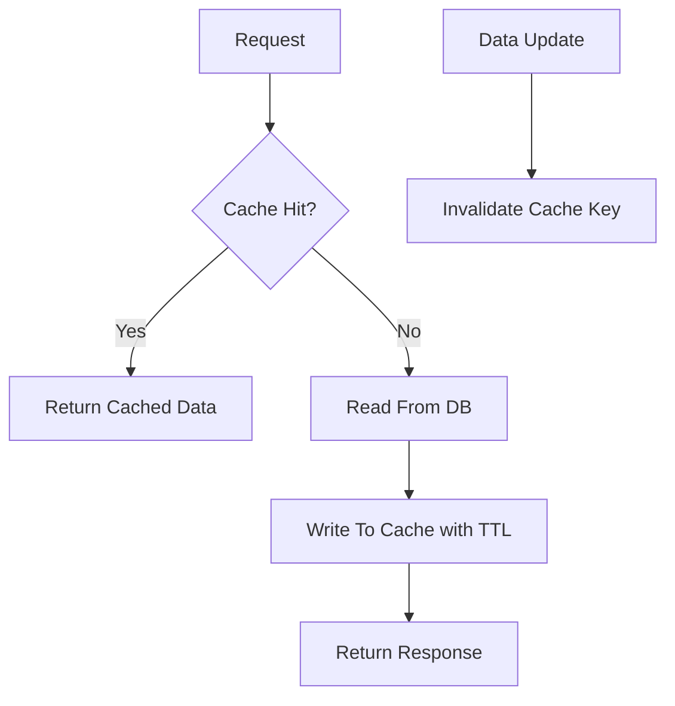

# Day 064 [Intermediate]: Caching with Redis

## Index

- [Goal](#goal)
- [Prerequisites](#prerequisites)
- [Explanation](#explanation)
- [Topic by Topic](#topic-by-topic)
- [Key Concepts](#key-concepts)
- [Visual Concept Map](#visual-concept-map)
- [End-to-End Practical](#end-to-end-practical)
- [Hands-on Coding](#hands-on-coding)
- [Mini Exercise](#mini-exercise)
- [Assessment Quiz](#assessment-quiz)
- [Task](#task)
- [Self Check](#self-check)
- [Interview Questions and Answers](#interview-questions-and-answers)
- [Day 064 Outcome](#day-064-outcome)

## Goal

Implement Redis caching patterns in Python services to reduce latency, lower database load, and improve scalability.

## Prerequisites

- Day 063 completed
- Familiarity with API request-response flow and database reads

## Explanation

Caching stores frequently accessed data close to the application. Redis is widely used for low-latency key-value caching, session storage, rate limits, and temporary coordination state.

## Topic by Topic

### Topic 1: Caching Fundamentals and Tradeoffs

Theory:
Caching improves speed but introduces staleness risk.

Practical:
Choose what to cache based on read frequency and update sensitivity.

Code Example:

```text
Good cache candidates: product catalogs, profile summaries, computed stats
Poor candidates: highly volatile real-time balances
```

**Explanation:**
This topic explains Caching Fundamentals and Tradeoffs in a practical Python context so you can write clear, reliable, and maintainable programs for real-world tasks.

**Key Points:**
- Understand the core idea behind Caching Fundamentals and Tradeoffs.
- Apply the practical pattern with good readability and validation habits.
- Keep the solution maintainable, testable, and safe for production use where relevant.

### Topic 2: Redis Basics in Python

Theory:
Redis operations are key-value primitives with optional TTL.

Practical:
Use redis-py client for set/get and expiry policies.

Code Example:

```python
import redis

r = redis.Redis(host="localhost", port=6379, decode_responses=True)
r.set("health", "ok", ex=60)
print(r.get("health"))
```

**Explanation:**
This topic explains Redis Basics in Python in a practical Python context so you can write clear, reliable, and maintainable programs for real-world tasks.

**Key Points:**
- Understand the core idea behind Redis Basics in Python.
- Apply the practical pattern with good readability and validation habits.
- Keep the solution maintainable, testable, and safe for production use where relevant.

### Topic 3: Cache-Aside Pattern

Theory:
Read path checks cache first, falls back to DB on miss.

Practical:
After DB fetch, populate cache with TTL.

Code Example:

```python
def get_user_profile(user_id: int):
  key = f"user:{user_id}"
  cached = r.get(key)
  if cached:
    return cached
  data = fetch_user_from_db(user_id)
  r.set(key, data, ex=120)
  return data
```

**Explanation:**
This topic explains Cache-Aside Pattern in a practical Python context so you can write clear, reliable, and maintainable programs for real-world tasks.

**Key Points:**
- Understand the core idea behind Cache-Aside Pattern.
- Apply the practical pattern with good readability and validation habits.
- Keep the solution maintainable, testable, and safe for production use where relevant.

### Topic 4: Invalidation Strategies

Theory:
Cache invalidation is often harder than cache reads.

Practical:
Delete or update keys immediately on data mutation.

Code Example:

```python
def update_user(user_id: int, payload: dict):
  save_user_to_db(user_id, payload)
  r.delete(f"user:{user_id}")
```

**Explanation:**
This topic explains Invalidation Strategies in a practical Python context so you can write clear, reliable, and maintainable programs for real-world tasks.

**Key Points:**
- Understand the core idea behind Invalidation Strategies.
- Apply the practical pattern with good readability and validation habits.
- Keep the solution maintainable, testable, and safe for production use where relevant.

### Topic 5: TTL Design and Key Naming

Theory:
TTL should reflect data freshness needs and access patterns.

Practical:
Use predictable key prefixes and lifecycle-aware expiry.

Code Example:

```text
Key format: service:entity:id
Example: api:user:42
```

**Explanation:**
This topic explains TTL Design and Key Naming in a practical Python context so you can write clear, reliable, and maintainable programs for real-world tasks.

**Key Points:**
- Understand the core idea behind TTL Design and Key Naming.
- Apply the practical pattern with good readability and validation habits.
- Keep the solution maintainable, testable, and safe for production use where relevant.

### Topic 6: Failure Handling and Fallbacks

Theory:
Redis outages should degrade gracefully, not crash APIs.

Practical:
Wrap cache calls in resilient fallback logic.

Code Example:

```python
try:
  cached = r.get(key)
except Exception:
  cached = None
```

**Explanation:**
This topic explains Failure Handling and Fallbacks in a practical Python context so you can write clear, reliable, and maintainable programs for real-world tasks.

**Key Points:**
- Understand the core idea behind Failure Handling and Fallbacks.
- Apply the practical pattern with good readability and validation habits.
- Keep the solution maintainable, testable, and safe for production use where relevant.

## Key Concepts

- Caching accelerates read-heavy workflows
- Cache-aside is a practical default strategy
- Invalidation and TTL policies are critical design choices
- Naming conventions improve maintainability and observability
- Redis should be optional in runtime path with graceful fallback
- Incorrect caching can hurt correctness more than performance helps

## Visual Concept Map



## End-to-End Practical

1. Add Redis client setup to API service.
2. Implement cache-aside for one read endpoint.
3. Add invalidation on corresponding write endpoint.
4. Define key namespace and TTL policy.
5. Add fallback behavior when Redis is unavailable.

## Hands-on Coding

### Example 1: Case - Product List Caching

Scenario:
Cache product list result for 60 seconds.

```python
def list_products_cached():
  key = "api:products:list"
  val = r.get(key)
  if val:
    return val
  data = fetch_products_db()
  r.set(key, data, ex=60)
  return data
```

### Example 2: Case - Invalidate on Product Update

Scenario:
After update, clear cached list and item keys.

```python
r.delete("api:products:list")
r.delete(f"api:products:{pid}")
```

### Example 3: Case - Graceful Degradation

Scenario:
If Redis fails, continue with DB data and serve response.

```python
def safe_cache_get(key: str):
  try:
    return r.get(key)
  except Exception:
    return None
```

## Mini Exercise

Scenario:
Add caching to two endpoints in your project: one list and one detail endpoint. Include invalidation for create/update actions.

Expected output:

- Cache hit/miss flow implemented
- Proper invalidation after writes
- Defined TTL and key naming policy

## Assessment Quiz

### Quiz Questions

1. What is the cache-aside read flow?
2. Why does cache invalidation matter?
3. True or False: Long TTL is always better for performance.
4. What should happen if Redis is down?
5. Why standardize key names?

### Quiz Answers

1. Check cache, on miss query DB, then populate cache
2. Without it, stale data can be served incorrectly
3. False
4. Service should fall back to DB and remain available
5. Better manageability, debugging, and monitoring

## Task

- Add Redis-backed cache-aside to one high-read API
- Implement invalidation for related write operations
- Document TTL, key patterns, and fallback strategy

## Self Check

- You can choose good cache candidates
- You can implement safe cache-aside with invalidation
- You can design resilient behavior for cache failures

## Interview Questions and Answers

### Beginner

**Question:** What does Redis typically store in API systems?

**Answer:** Frequently read temporary data such as cached query results and sessions.

**Question:** What is TTL?

**Answer:** Time-to-live, the duration after which cached data expires automatically.

### Middle

**Question:** What is the biggest risk of caching?

**Answer:** Serving stale or inconsistent data due to poor invalidation policy.

**Question:** Why can key design affect operations?

**Answer:** Consistent keys make bulk invalidation and troubleshooting much easier.

### Advanced

**Question:** What anti-pattern appears in naive cache adoption?

**Answer:** Caching every endpoint indiscriminately without freshness or invalidation design.

**Question:** How do teams mature caching over time?

**Answer:** They add hit-rate metrics, adaptive TTL tuning, and targeted cache scopes by domain.

## Day 064 Outcome

- You can implement practical Redis caching in Python APIs
- You can manage freshness, invalidation, and failure resilience
- You are ready for background task processing with Celery on Day 065
