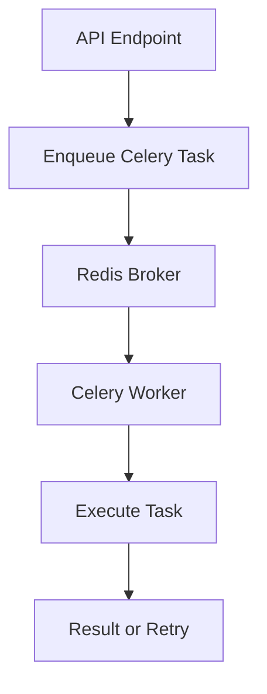

# Day 065 [Intermediate]: Task Queues with Celery

## Index

- [Goal](#goal)
- [Prerequisites](#prerequisites)
- [Explanation](#explanation)
- [Topic by Topic](#topic-by-topic)
- [Key Concepts](#key-concepts)
- [Visual Concept Map](#visual-concept-map)
- [End-to-End Practical](#end-to-end-practical)
- [Hands-on Coding](#hands-on-coding)
- [Mini Exercise](#mini-exercise)
- [Assessment Quiz](#assessment-quiz)
- [Task](#task)
- [Self Check](#self-check)
- [Interview Questions and Answers](#interview-questions-and-answers)
- [Day 065 Outcome](#day-065-outcome)

## Goal

Offload long-running workloads from request-response APIs using Celery task queues with reliable retry and monitoring patterns.

## Prerequisites

- Day 064 completed
- Familiarity with Redis and Python backend architecture

## Explanation

Some operations should not block API responses, such as sending emails, report generation, and media processing. Celery executes these tasks asynchronously using worker processes and a broker.

## Topic by Topic

### Topic 1: Why Task Queues Matter

Theory:
Synchronous APIs degrade when slow tasks run inline.

Practical:
Move heavy work to background queue while API returns quickly.

Code Example:

```text
API request -> enqueue task -> immediate response -> worker processes task
```

**Explanation:**
This topic explains Why Task Queues Matter in a practical Python context so you can write clear, reliable, and maintainable programs for real-world tasks.

**Key Points:**
- Understand the core idea behind Why Task Queues Matter.
- Apply the practical pattern with good readability and validation habits.
- Keep the solution maintainable, testable, and safe for production use where relevant.

### Topic 2: Celery Core Components

Theory:
Celery needs task producer, broker, worker, and optional result backend.

Practical:
Use Redis as broker for local learning setups.

Code Example:

```python
from celery import Celery

celery_app = Celery("tasks", broker="redis://localhost:6379/0", backend="redis://localhost:6379/1")
```

**Explanation:**
This topic explains Celery Core Components in a practical Python context so you can write clear, reliable, and maintainable programs for real-world tasks.

**Key Points:**
- Understand the core idea behind Celery Core Components.
- Apply the practical pattern with good readability and validation habits.
- Keep the solution maintainable, testable, and safe for production use where relevant.

### Topic 3: Defining and Triggering Tasks

Theory:
Task functions are decorated and executed by workers.

Practical:
Call delay or apply_async from API routes/services.

Code Example:

```python
@celery_app.task
def send_welcome_email(user_email: str):
  return f"sent to {user_email}"
```

**Explanation:**
This topic explains Defining and Triggering Tasks in a practical Python context so you can write clear, reliable, and maintainable programs for real-world tasks.

**Key Points:**
- Understand the core idea behind Defining and Triggering Tasks.
- Apply the practical pattern with good readability and validation habits.
- Keep the solution maintainable, testable, and safe for production use where relevant.

### Topic 4: Retries and Failure Handling

Theory:
External dependencies fail transiently; retries improve robustness.

Practical:
Add retry policies for recoverable errors.

Code Example:

```python
@celery_app.task(bind=True, max_retries=3)
def process_payment(self, order_id: int):
  try:
    charge(order_id)
  except Exception as exc:
    raise self.retry(exc=exc, countdown=10)
```

**Explanation:**
This topic explains Retries and Failure Handling in a practical Python context so you can write clear, reliable, and maintainable programs for real-world tasks.

**Key Points:**
- Understand the core idea behind Retries and Failure Handling.
- Apply the practical pattern with good readability and validation habits.
- Keep the solution maintainable, testable, and safe for production use where relevant.

### Topic 5: Idempotency and Task Safety

Theory:
Retries or duplicate delivery can execute a task more than once.

Practical:
Design tasks so repeated execution does not corrupt state.

Code Example:

```text
Use operation keys or status checks before applying side effects.
```

**Explanation:**
This topic explains Idempotency and Task Safety in a practical Python context so you can write clear, reliable, and maintainable programs for real-world tasks.

**Key Points:**
- Understand the core idea behind Idempotency and Task Safety.
- Apply the practical pattern with good readability and validation habits.
- Keep the solution maintainable, testable, and safe for production use where relevant.

### Topic 6: Monitoring and Operational Visibility

Theory:
Background systems need visibility for queue depth and failures.

Practical:
Track task status and inspect worker health regularly.

Code Example:

```bash
celery -A app.worker worker --loglevel=info
```

**Explanation:**
This topic explains Monitoring and Operational Visibility in a practical Python context so you can write clear, reliable, and maintainable programs for real-world tasks.

**Key Points:**
- Understand the core idea behind Monitoring and Operational Visibility.
- Apply the practical pattern with good readability and validation habits.
- Keep the solution maintainable, testable, and safe for production use where relevant.

## Key Concepts

- Queue offloading protects API response time
- Celery architecture separates producer from worker execution
- Retry logic improves resilience against transient faults
- Idempotent task design is required for safety
- Monitoring is part of production readiness, not optional
- Task queues complement, not replace, core API design quality

## Visual Concept Map



## End-to-End Practical

1. Configure Celery app with Redis broker.
2. Create one email/report background task.
3. Trigger task from FastAPI endpoint.
4. Add retry handling for transient failure.
5. Return task id and expose status endpoint.

## Hands-on Coding

### Example 1: Case - Enqueue Notification Task

Scenario:
When user signs up, queue a welcome email task.

```python
@app.post("/signup")
def signup(email: str):
  task = send_welcome_email.delay(email)
  return {"task_id": task.id, "status": "queued"}
```

### Example 2: Case - Report Generation in Background

Scenario:
Generate analytics report asynchronously and poll status.

```python
@celery_app.task
def build_report(report_id: int):
  return {"report_id": report_id, "state": "done"}
```

### Example 3: Case - Retryable External Call

Scenario:
Retry webhook delivery task with delay on failure.

```python
@celery_app.task(bind=True, max_retries=5)
def deliver_webhook(self, payload: dict):
  try:
    send_webhook(payload)
  except Exception as exc:
    raise self.retry(exc=exc, countdown=5)
```

## Mini Exercise

Scenario:
Add Celery to your API project for one heavy operation, implement status tracking, and simulate failure retries.

Expected output:

- Working queue producer and worker
- One background task triggered by API
- Retry behavior visible in logs or task state

## Assessment Quiz

### Quiz Questions

1. Why move tasks out of request-response flow?
2. What is broker responsibility in Celery architecture?
3. True or False: Task retries are always safe without idempotency checks.
4. What does delay do?
5. Why monitor queue depth and failures?

### Quiz Answers

1. To keep API latency low and improve reliability
2. It transports task messages from producer to workers
3. False
4. It enqueues a task for asynchronous execution
5. To detect backlogs, worker issues, and operational risk early

## Task

- Integrate Celery with Redis in your Python project
- Implement one retryable background task and status check
- Document idempotency and monitoring strategy

## Self Check

- You can identify workloads suitable for background queues
- You can build and trigger Celery tasks from APIs
- You can design safer retries with idempotent behavior

## Interview Questions and Answers

### Beginner

**Question:** What problem does Celery solve?

**Answer:** It processes slow or heavy jobs asynchronously outside API request threads.

**Question:** What is a broker?

**Answer:** A message transport layer that delivers tasks to worker processes.

### Middle

**Question:** Why is idempotency important in queued tasks?

**Answer:** Tasks may run multiple times, so repeated execution must not corrupt data.

**Question:** How do retries improve reliability?

**Answer:** They recover from temporary failures such as network or service disruptions.

### Advanced

**Question:** What anti-pattern appears in Celery adoption?

**Answer:** Offloading everything indiscriminately without task ownership, observability, or delivery guarantees.

**Question:** How do teams run Celery safely at scale?

**Answer:** They enforce idempotency, monitor queue health, tune concurrency, and isolate critical workloads.

## Day 065 Outcome

- You can integrate Celery task queues into Python backend systems
- You can design retry-safe and observable background processing
- You are ready for messaging and broker patterns on Day 066
