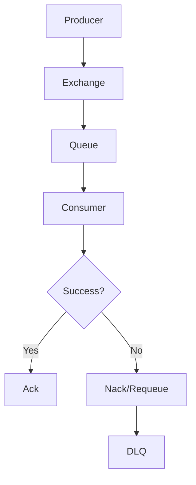

# Day 066 [Intermediate]: Message Brokers and RabbitMQ

## Index

- [Goal](#goal)
- [Prerequisites](#prerequisites)
- [Explanation](#explanation)
- [Topic by Topic](#topic-by-topic)
- [Key Concepts](#key-concepts)
- [Visual Concept Map](#visual-concept-map)
- [End-to-End Practical](#end-to-end-practical)
- [Hands-on Coding](#hands-on-coding)
- [Mini Exercise](#mini-exercise)
- [Assessment Quiz](#assessment-quiz)
- [Task](#task)
- [Self Check](#self-check)
- [Interview Questions and Answers](#interview-questions-and-answers)
- [Day 066 Outcome](#day-066-outcome)

## Goal

Understand message broker architecture and implement reliable async communication workflows with RabbitMQ in Python services.

## Prerequisites

- Day 065 completed
- Familiarity with Celery/background-task concepts

## Explanation

RabbitMQ is a message broker that decouples producers from consumers, improving resiliency and scalability in distributed systems. It supports advanced routing, acknowledgments, retries, and delivery guarantees.

## Topic by Topic

### Topic 1: Producer, Broker, and Consumer Model

Theory:
Producers publish events, the broker stores/routes messages, and consumers process them asynchronously.

Practical:
Use broker-based async pipelines for tasks that should survive API restarts.

Code Example:

```text
API Service (producer) -> RabbitMQ -> Worker Service (consumer)
```

**Explanation:**
This topic explains Producer, Broker, and Consumer Model in a practical Python context so you can write clear, reliable, and maintainable programs for real-world tasks.

**Key Points:**
- Understand the core idea behind Producer, Broker, and Consumer Model.
- Apply the practical pattern with good readability and validation habits.
- Keep the solution maintainable, testable, and safe for production use where relevant.

### Topic 2: Exchange Types and Routing Keys

Theory:
Direct, topic, fanout, and headers exchanges define message routing behavior.

Practical:
Choose exchange type based on single-target vs pattern-based broadcast requirements.

Code Example:

```text
Exchange: orders.topic
Routing Key: order.created
Queue Bind Pattern: order.*
```

**Explanation:**
This topic explains Exchange Types and Routing Keys in a practical Python context so you can write clear, reliable, and maintainable programs for real-world tasks.

**Key Points:**
- Understand the core idea behind Exchange Types and Routing Keys.
- Apply the practical pattern with good readability and validation habits.
- Keep the solution maintainable, testable, and safe for production use where relevant.

### Topic 3: Queue Durability and Message Persistence

Theory:
Durable queues and persistent messages improve reliability across broker restarts.

Practical:
Enable durability for business-critical workflows.

Code Example:

```python
channel.queue_declare(queue="email_jobs", durable=True)
```

**Explanation:**
This topic explains Queue Durability and Message Persistence in a practical Python context so you can write clear, reliable, and maintainable programs for real-world tasks.

**Key Points:**
- Understand the core idea behind Queue Durability and Message Persistence.
- Apply the practical pattern with good readability and validation habits.
- Keep the solution maintainable, testable, and safe for production use where relevant.

### Topic 4: Acknowledgments and Requeue Behavior

Theory:
Manual ack ensures messages are removed only after successful processing.

Practical:
Use nack/requeue flows for transient failures.

Code Example:

```python
def callback(ch, method, properties, body):
  try:
    handle(body)
    ch.basic_ack(delivery_tag=method.delivery_tag)
  except Exception:
    ch.basic_nack(delivery_tag=method.delivery_tag, requeue=True)
```

**Explanation:**
This topic explains Acknowledgments and Requeue Behavior in a practical Python context so you can write clear, reliable, and maintainable programs for real-world tasks.

**Key Points:**
- Understand the core idea behind Acknowledgments and Requeue Behavior.
- Apply the practical pattern with good readability and validation habits.
- Keep the solution maintainable, testable, and safe for production use where relevant.

### Topic 5: Dead Letter Queues and Retry Patterns

Theory:
Poison messages should be isolated instead of endlessly retried.

Practical:
Configure dead-letter exchange and inspect failed messages.

Code Example:

```text
Queue A -> retries exhausted -> DLQ
```

**Explanation:**
This topic explains Dead Letter Queues and Retry Patterns in a practical Python context so you can write clear, reliable, and maintainable programs for real-world tasks.

**Key Points:**
- Understand the core idea behind Dead Letter Queues and Retry Patterns.
- Apply the practical pattern with good readability and validation habits.
- Keep the solution maintainable, testable, and safe for production use where relevant.

### Topic 6: Operational Observability for Messaging

Theory:
Queue depth, consumer lag, and redelivery rates are key production signals.

Practical:
Track metrics and alert on backlog spikes.

Code Example:

```text
Monitor: ready messages, unacked messages, consumer count
```

**Explanation:**
This topic explains Operational Observability for Messaging in a practical Python context so you can write clear, reliable, and maintainable programs for real-world tasks.

**Key Points:**
- Understand the core idea behind Operational Observability for Messaging.
- Apply the practical pattern with good readability and validation habits.
- Keep the solution maintainable, testable, and safe for production use where relevant.

## Key Concepts

- RabbitMQ decouples services and improves resilience
- Routing is exchange- and key-driven
- Durability and persistence are required for critical messages
- Ack/nack logic controls processing guarantees
- DLQ prevents infinite retry loops
- Messaging systems require active monitoring

## Visual Concept Map



## End-to-End Practical

1. Create producer that publishes order events.
2. Configure RabbitMQ exchange and queue bindings.
3. Implement consumer with manual ack handling.
4. Add retry and DLQ strategy for failures.
5. Observe queue metrics during load simulation.

## Hands-on Coding

### Example 1: Case - Event Publish from API

Scenario:
Publish order-created event after successful DB transaction.

```python
channel.basic_publish(
  exchange="orders.topic",
  routing_key="order.created",
  body='{"order_id": 101}',
)
```

### Example 2: Case - Consumer Worker

Scenario:
Consume and process order-created messages for downstream notifications.

```python
channel.basic_consume(queue="notify_queue", on_message_callback=callback)
channel.start_consuming()
```

### Example 3: Case - Failure Isolation

Scenario:
Route repeatedly failing messages to dead-letter queue for manual inspection.

```text
Configure x-dead-letter-exchange and max retry attempts.
```

## Mini Exercise

Scenario:
Build producer-consumer messaging for user signup events with one queue for email and one queue for analytics.

Expected output:

- Exchange with appropriate routing strategy
- Two consumer workers
- Retry and DLQ behavior for at least one failure scenario

## Assessment Quiz

### Quiz Questions

1. Why use a broker instead of direct service-to-service calls?
2. What does manual acknowledgment guarantee?
3. True or False: Requeue forever is a good failure strategy.
4. When is topic exchange preferred?
5. Why is DLQ valuable in production?

### Quiz Answers

1. It decouples services and improves reliability under load/failure
2. Message is removed only after successful processing
3. False
4. When routing by pattern, such as order.\* events
5. It isolates poison messages for debugging and protects queue health

## Task

- Implement RabbitMQ publish/consume flow for one domain event
- Add ack/nack and retry-safe handling
- Configure DLQ and document operational metrics to monitor

## Self Check

- You can design broker-based async workflows
- You can choose correct exchange and routing strategy
- You can implement robust error handling and replay patterns

## Interview Questions and Answers

### Beginner

**Question:** What is RabbitMQ used for?

**Answer:** It transports messages between systems asynchronously using queues.

**Question:** What is the role of a consumer?

**Answer:** It receives and processes messages from queue(s).

### Middle

**Question:** Why are acknowledgments important?

**Answer:** They prevent message loss by confirming work completion before removal.

**Question:** When would you choose topic exchange?

**Answer:** When one event type should route to multiple queues by key pattern.

### Advanced

**Question:** What anti-pattern harms message-driven architectures?

**Answer:** Treating queues like synchronous RPC and tightly coupling producer/consumer schemas without versioning.

**Question:** How do teams scale RabbitMQ consumers safely?

**Answer:** They tune prefetch, enforce idempotency, monitor lag, and partition workloads by queue.

## Day 066 Outcome

- You can build reliable async flows with RabbitMQ
- You can handle retries, acknowledgments, and DLQ patterns
- You are ready to process tabular datasets with pandas on Day 067
