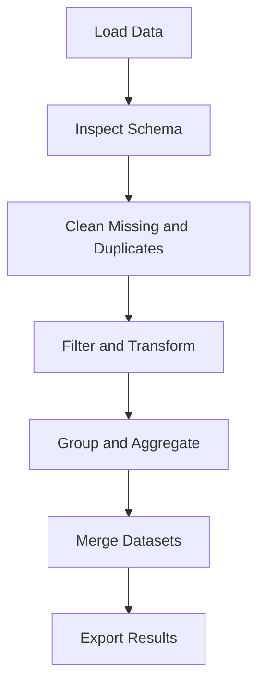

# Day 067 [Intermediate]: Data Processing with pandas

## Index

- [Goal](#goal)
- [Prerequisites](#prerequisites)
- [Explanation](#explanation)
- [Topic by Topic](#topic-by-topic)
- [Key Concepts](#key-concepts)
- [Visual Concept Map](#visual-concept-map)
- [End-to-End Practical](#end-to-end-practical)
- [Hands-on Coding](#hands-on-coding)
- [Mini Exercise](#mini-exercise)
- [Assessment Quiz](#assessment-quiz)
- [Task](#task)
- [Self Check](#self-check)
- [Interview Questions and Answers](#interview-questions-and-answers)
- [Day 067 Outcome](#day-067-outcome)

## Goal

Process, clean, and transform real-world tabular data efficiently using pandas for analytics and backend data pipelines.

## Prerequisites

- Day 066 completed
- Basic Python collections and functions knowledge

## Explanation

pandas provides high-productivity tools for ingesting CSV/Excel/JSON data, cleaning missing values, filtering records, grouping, and exporting results. It is a core library for ETL and exploratory data analysis.

## Topic by Topic

### Topic 1: DataFrame Fundamentals

Theory:
DataFrame is a labeled 2D table with index and typed columns.

Practical:
Load and inspect data quickly before transformation.

Code Example:

```python
import pandas as pd

df = pd.read_csv("sales.csv")
print(df.head())
print(df.info())
```

**Explanation:**
This topic explains DataFrame Fundamentals in a practical Python context so you can write clear, reliable, and maintainable programs for real-world tasks.

**Key Points:**
- Understand the core idea behind DataFrame Fundamentals.
- Apply the practical pattern with good readability and validation habits.
- Keep the solution maintainable, testable, and safe for production use where relevant.

### Topic 2: Selection, Filtering, and Sorting

Theory:
Precise row/column selection is the base of every analysis step.

Practical:
Use boolean masks and sort values for focused views.

Code Example:

```python
high_value = df[df["amount"] > 1000]
ordered = high_value.sort_values("amount", ascending=False)
```

**Explanation:**
This topic explains Selection, Filtering, and Sorting in a practical Python context so you can write clear, reliable, and maintainable programs for real-world tasks.

**Key Points:**
- Understand the core idea behind Selection, Filtering, and Sorting.
- Apply the practical pattern with good readability and validation habits.
- Keep the solution maintainable, testable, and safe for production use where relevant.

### Topic 3: Missing Values and Data Cleaning

Theory:
Real datasets contain nulls, duplicates, and inconsistent formats.

Practical:
Detect and clean data with explicit decisions.

Code Example:

```python
df = df.drop_duplicates()
df["city"] = df["city"].fillna("unknown")
df = df.dropna(subset=["amount"])
```

**Explanation:**
This topic explains Missing Values and Data Cleaning in a practical Python context so you can write clear, reliable, and maintainable programs for real-world tasks.

**Key Points:**
- Understand the core idea behind Missing Values and Data Cleaning.
- Apply the practical pattern with good readability and validation habits.
- Keep the solution maintainable, testable, and safe for production use where relevant.

### Topic 4: GroupBy and Aggregation

Theory:
Grouping summarizes large datasets into actionable insights.

Practical:
Compute totals, means, and counts by business dimensions.

Code Example:

```python
summary = df.groupby("region", as_index=False)["amount"].sum()
```

**Explanation:**
This topic explains GroupBy and Aggregation in a practical Python context so you can write clear, reliable, and maintainable programs for real-world tasks.

**Key Points:**
- Understand the core idea behind GroupBy and Aggregation.
- Apply the practical pattern with good readability and validation habits.
- Keep the solution maintainable, testable, and safe for production use where relevant.

### Topic 5: Merging and Joining Datasets

Theory:
Data pipelines often combine multiple tables/files.

Practical:
Merge datasets with clear join keys and type checks.

Code Example:

```python
orders = pd.read_csv("orders.csv")
users = pd.read_csv("users.csv")
merged = orders.merge(users, on="user_id", how="left")
```

**Explanation:**
This topic explains Merging and Joining Datasets in a practical Python context so you can write clear, reliable, and maintainable programs for real-world tasks.

**Key Points:**
- Understand the core idea behind Merging and Joining Datasets.
- Apply the practical pattern with good readability and validation habits.
- Keep the solution maintainable, testable, and safe for production use where relevant.

### Topic 6: Export and Pipeline Readiness

Theory:
Transformed data must be reproducible and exportable.

Practical:
Write output files and keep transformation steps deterministic.

Code Example:

```python
summary.to_csv("sales_summary.csv", index=False)
```

**Explanation:**
This topic explains Export and Pipeline Readiness in a practical Python context so you can write clear, reliable, and maintainable programs for real-world tasks.

**Key Points:**
- Understand the core idea behind Export and Pipeline Readiness.
- Apply the practical pattern with good readability and validation habits.
- Keep the solution maintainable, testable, and safe for production use where relevant.

## Key Concepts

- DataFrame operations are expressive and composable
- Cleaning decisions directly affect result quality
- GroupBy is central for reporting and analytics
- Merge correctness depends on key integrity
- Reproducibility matters more than one-off notebook results
- Export should preserve schema and intended types

## Visual Concept Map



## End-to-End Practical

1. Load sales and users datasets.
2. Clean null and duplicate records.
3. Create filtered subset for active customers.
4. Aggregate revenue by region and month.
5. Export final curated dataset.

## Hands-on Coding

### Example 1: Case - Revenue Dashboard Prep

Scenario:
Prepare summarized monthly revenue dataset for dashboard team.

```python
df["month"] = pd.to_datetime(df["order_date"]).dt.to_period("M")
monthly = df.groupby("month", as_index=False)["amount"].sum()
```

### Example 2: Case - Data Quality Cleanup

Scenario:
Normalize category values and remove invalid rows.

```python
df["category"] = df["category"].str.lower().str.strip()
df = df[df["category"].notna()]
```

### Example 3: Case - Join for Enriched Analytics

Scenario:
Combine order facts with customer segment data.

```python
segments = pd.read_csv("segments.csv")
enriched = df.merge(segments, on="customer_id", how="left")
```

## Mini Exercise

Scenario:
Create a mini ETL flow using pandas: read two CSVs, clean data, join tables, compute one aggregate metric, and export result.

Expected output:

- Cleaned DataFrame
- One merged table
- One aggregated report output file

## Assessment Quiz

### Quiz Questions

1. Why inspect df.info() before transformations?
2. What is difference between fillna and dropna?
3. True or False: groupby always returns sorted output by default business importance.
4. Why validate join keys before merge?
5. Why keep ETL steps deterministic?

### Quiz Answers

1. To confirm column types and null distributions
2. fillna imputes missing data; dropna removes incomplete rows
3. False
4. Wrong keys can produce duplicate or missing matches
5. Reproducibility and auditing of data outputs

## Task

- Build a pandas pipeline for one real CSV dataset
- Apply cleaning, filtering, grouping, and joining steps
- Export final output and document transformation logic

## Self Check

- You can clean and transform tabular data confidently
- You can generate grouped insights for reporting
- You can construct reproducible pandas workflows

## Interview Questions and Answers

### Beginner

**Question:** What is a DataFrame?

**Answer:** A two-dimensional labeled data structure with columns and index.

**Question:** Why is missing data handling important?

**Answer:** It prevents wrong statistics and broken downstream processing.

### Middle

**Question:** How do you avoid accidental chained assignment bugs?

**Answer:** Use explicit assignment with .loc and avoid ambiguous slice updates.

**Question:** What common issue appears after merging?

**Answer:** Unexpected row explosion due to non-unique join keys.

### Advanced

**Question:** What anti-pattern is common in pandas notebooks?

**Answer:** Unstructured ad-hoc transformations without reusable pipeline functions.

**Question:** How do teams productionize pandas workflows?

**Answer:** They standardize schemas, modularize transforms, add tests, and schedule ETL runs.

## Day 067 Outcome

- You can build practical data processing pipelines with pandas
- You can clean, aggregate, and merge datasets effectively
- You are ready for high-performance numerical computing with NumPy on Day 068
