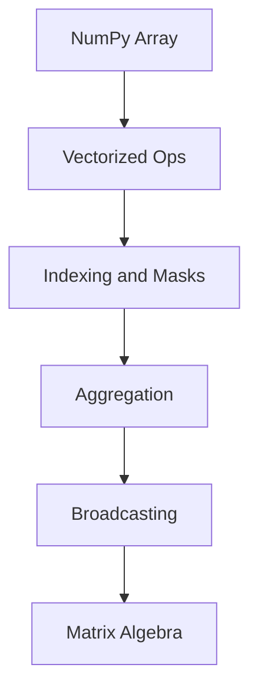

# Day 068 [Intermediate]: Numerical Computing with NumPy

## Index

- [Goal](#goal)
- [Prerequisites](#prerequisites)
- [Explanation](#explanation)
- [Topic by Topic](#topic-by-topic)
- [Key Concepts](#key-concepts)
- [Visual Concept Map](#visual-concept-map)
- [End-to-End Practical](#end-to-end-practical)
- [Hands-on Coding](#hands-on-coding)
- [Mini Exercise](#mini-exercise)
- [Assessment Quiz](#assessment-quiz)
- [Task](#task)
- [Self Check](#self-check)
- [Interview Questions and Answers](#interview-questions-and-answers)
- [Day 068 Outcome](#day-068-outcome)

## Goal

Perform fast, reliable numerical computations using NumPy arrays, vectorized operations, and matrix-style transformations.

## Prerequisites

- Day 067 completed
- Basic Python loops, lists, and functions

## Explanation

NumPy is the foundation of Python numerical computing. It provides contiguous typed arrays and optimized C-backed operations, enabling high performance compared to pure Python loops.

## Topic by Topic

### Topic 1: Arrays, Dtypes, and Shapes

Theory:
NumPy arrays store homogeneous data with explicit shape and dtype.

Practical:
Inspect shape and dtype before processing.

Code Example:

```python
import numpy as np

a = np.array([[1, 2, 3], [4, 5, 6]], dtype=np.int32)
print(a.shape)  # (2, 3)
print(a.dtype)  # int32
```

**Explanation:**
This topic explains Arrays, Dtypes, and Shapes in a practical Python context so you can write clear, reliable, and maintainable programs for real-world tasks.

**Key Points:**
- Understand the core idea behind Arrays, Dtypes, and Shapes.
- Apply the practical pattern with good readability and validation habits.
- Keep the solution maintainable, testable, and safe for production use where relevant.

### Topic 2: Vectorization over Loops

Theory:
Element-wise operations run much faster with vectorized expressions.

Practical:
Replace manual loops where possible.

Code Example:

```python
arr = np.array([1, 2, 3, 4])
scaled = arr * 10
```

**Explanation:**
This topic explains Vectorization over Loops in a practical Python context so you can write clear, reliable, and maintainable programs for real-world tasks.

**Key Points:**
- Understand the core idea behind Vectorization over Loops.
- Apply the practical pattern with good readability and validation habits.
- Keep the solution maintainable, testable, and safe for production use where relevant.

### Topic 3: Indexing, Slicing, and Boolean Masks

Theory:
Advanced indexing enables compact filtering and feature selection.

Practical:
Use masks for condition-based data extraction.

Code Example:

```python
scores = np.array([42, 87, 65, 91])
passed = scores[scores >= 60]
```

**Explanation:**
This topic explains Indexing, Slicing, and Boolean Masks in a practical Python context so you can write clear, reliable, and maintainable programs for real-world tasks.

**Key Points:**
- Understand the core idea behind Indexing, Slicing, and Boolean Masks.
- Apply the practical pattern with good readability and validation habits.
- Keep the solution maintainable, testable, and safe for production use where relevant.

### Topic 4: Aggregation and Statistics

Theory:
NumPy supports fast summary metrics along specified axes.

Practical:
Use mean/sum/std/min/max in data pipelines.

Code Example:

```python
matrix = np.array([[10, 20], [30, 40]])
print(matrix.mean(axis=0))
```

**Explanation:**
This topic explains Aggregation and Statistics in a practical Python context so you can write clear, reliable, and maintainable programs for real-world tasks.

**Key Points:**
- Understand the core idea behind Aggregation and Statistics.
- Apply the practical pattern with good readability and validation habits.
- Keep the solution maintainable, testable, and safe for production use where relevant.

### Topic 5: Broadcasting Rules

Theory:
Broadcasting applies operations across compatible shapes without copies.

Practical:
Normalize rows/columns using broadcast semantics.

Code Example:

```python
data = np.array([[1, 2, 3], [4, 5, 6]])
offset = np.array([1, 0, -1])
adjusted = data + offset
```

**Explanation:**
This topic explains Broadcasting Rules in a practical Python context so you can write clear, reliable, and maintainable programs for real-world tasks.

**Key Points:**
- Understand the core idea behind Broadcasting Rules.
- Apply the practical pattern with good readability and validation habits.
- Keep the solution maintainable, testable, and safe for production use where relevant.

### Topic 6: Matrix and Linear Algebra Basics

Theory:
Dot products and matrix multiplication are core for ML and scientific tasks.

Practical:
Use @ and np.linalg utilities for common operations.

Code Example:

```python
x = np.array([[1, 2], [3, 4]])
y = np.array([[2], [1]])
result = x @ y
```

**Explanation:**
This topic explains Matrix and Linear Algebra Basics in a practical Python context so you can write clear, reliable, and maintainable programs for real-world tasks.

**Key Points:**
- Understand the core idea behind Matrix and Linear Algebra Basics.
- Apply the practical pattern with good readability and validation habits.
- Keep the solution maintainable, testable, and safe for production use where relevant.

## Key Concepts

- Typed arrays and shape awareness drive correctness
- Vectorization significantly boosts performance
- Boolean masks simplify condition-based filtering
- Axis-based aggregations support fast analytics
- Broadcasting reduces manual reshaping complexity
- Linear algebra operations are first-class primitives

## Visual Concept Map



## End-to-End Practical

1. Load numeric dataset into ndarray.
2. Clean invalid values with masks.
3. Compute aggregated metrics by axis.
4. Apply normalization via broadcasting.
5. Run matrix operation for final feature transform.

## Hands-on Coding

### Example 1: Case - Sensor Data Normalization

Scenario:
Normalize daily sensor readings for modeling.

```python
readings = np.array([10, 20, 30, 40], dtype=float)
norm = (readings - readings.mean()) / readings.std()
```

### Example 2: Case - Filter Outliers

Scenario:
Keep values within expected operating range.

```python
vals = np.array([5, 8, 100, 7, 9])
clean = vals[(vals >= 0) & (vals <= 20)]
```

### Example 3: Case - Batch Score Computation

Scenario:
Compute weighted score for multiple records.

```python
features = np.array([[1.2, 0.8], [0.5, 1.5]])
weights = np.array([0.6, 0.4])
scores = features @ weights
```

## Mini Exercise

Scenario:
Create a NumPy workflow that loads a numeric matrix, filters invalid rows, computes per-column stats, and outputs normalized matrix.

Expected output:

- Filtered matrix
- Mean and std arrays
- Normalized result matrix

## Assessment Quiz

### Quiz Questions

1. Why is vectorization faster than Python loops?
2. What does axis=0 mean in aggregations?
3. True or False: NumPy arrays can safely store arbitrary mixed types for performance.
4. What is broadcasting used for?
5. Why check dtype before calculations?

### Quiz Answers

1. It uses optimized low-level operations over contiguous memory
2. Compute down rows to produce per-column result
3. False
4. Applying operations across compatible shapes efficiently
5. Wrong dtype can cause precision bugs or slow object operations

## Task

- Build one NumPy-based numeric processing pipeline
- Replace at least one loop with vectorized expression
- Document shape, dtype, and broadcasting assumptions

## Self Check

- You can reason about array shapes and dtypes
- You can write vectorized numeric transformations
- You can apply aggregation and matrix operations confidently

## Interview Questions and Answers

### Beginner

**Question:** What is a NumPy array?

**Answer:** A fixed-type, n-dimensional array optimized for numerical operations.

**Question:** Why use NumPy over plain lists for math?

**Answer:** NumPy is faster and provides rich numerical primitives.

### Middle

**Question:** What bug happens with shape mismatch?

**Answer:** Broadcasting errors or unintended dimension expansion can produce wrong results.

**Question:** Why avoid object dtype arrays for numeric tasks?

**Answer:** They lose vectorized performance benefits and can hide type issues.

### Advanced

**Question:** What anti-pattern is common in numeric Python code?

**Answer:** Mixing Python loops and NumPy operations excessively, causing performance bottlenecks.

**Question:** How do teams productionize NumPy workloads?

**Answer:** They enforce shape contracts, benchmark hotspots, and add reproducible test datasets.

## Day 068 Outcome

- You can build efficient numerical workflows with NumPy
- You can leverage vectorization, masks, and broadcasting effectively
- You are ready for visualization workflows with Matplotlib on Day 069
