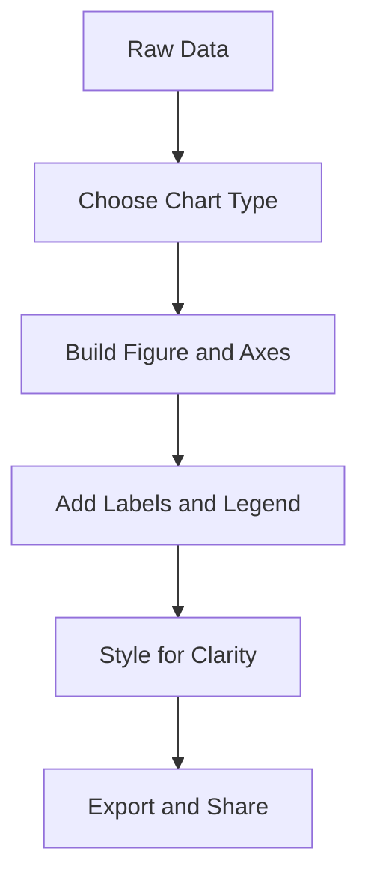

# Day 069 [Intermediate]: Data Visualization with Matplotlib

## Index

- [Goal](#goal)
- [Prerequisites](#prerequisites)
- [Explanation](#explanation)
- [Topic by Topic](#topic-by-topic)
- [Key Concepts](#key-concepts)
- [Visual Concept Map](#visual-concept-map)
- [End-to-End Practical](#end-to-end-practical)
- [Hands-on Coding](#hands-on-coding)
- [Mini Exercise](#mini-exercise)
- [Assessment Quiz](#assessment-quiz)
- [Task](#task)
- [Self Check](#self-check)
- [Interview Questions and Answers](#interview-questions-and-answers)
- [Day 069 Outcome](#day-069-outcome)

## Goal

Create clear, decision-ready visualizations using Matplotlib with good chart selection, labeling, and styling practices.

## Prerequisites

- Day 068 completed
- Familiarity with pandas/NumPy data structures

## Explanation

Matplotlib is a foundational Python plotting library used for line charts, bars, histograms, scatter plots, and multi-figure dashboards. Effective visualization is about communication clarity, not decorative complexity.

## Topic by Topic

### Topic 1: Plotting Basics with Figure and Axes

Theory:
Matplotlib revolves around figure containers and axis objects.

Practical:
Use object-oriented plotting style for maintainable chart code.

Code Example:

```python
import matplotlib.pyplot as plt

fig, ax = plt.subplots()
ax.plot([1, 2, 3], [3, 5, 4])
plt.show()
```

**Explanation:**
This topic explains Plotting Basics with Figure and Axes in a practical Python context so you can write clear, reliable, and maintainable programs for real-world tasks.

**Key Points:**
- Understand the core idea behind Plotting Basics with Figure and Axes.
- Apply the practical pattern with good readability and validation habits.
- Keep the solution maintainable, testable, and safe for production use where relevant.

### Topic 2: Choosing the Right Chart Type

Theory:
Chart type must match analytical intent: trend, comparison, distribution, relation.

Practical:
Avoid misleading chart choices for given data shape.

Code Example:

```text
Trend -> line, category compare -> bar, distribution -> histogram, relation -> scatter
```

**Explanation:**
This topic explains Choosing the Right Chart Type in a practical Python context so you can write clear, reliable, and maintainable programs for real-world tasks.

**Key Points:**
- Understand the core idea behind Choosing the Right Chart Type.
- Apply the practical pattern with good readability and validation habits.
- Keep the solution maintainable, testable, and safe for production use where relevant.

### Topic 3: Labeling, Titles, and Legends

Theory:
Unlabeled charts are hard to interpret and risky in business contexts.

Practical:
Always include axis labels, title, and legend when multiple series exist.

Code Example:

```python
ax.set_title("Monthly Revenue")
ax.set_xlabel("Month")
ax.set_ylabel("Revenue")
ax.legend(["Revenue"])
```

**Explanation:**
This topic explains Labeling, Titles, and Legends in a practical Python context so you can write clear, reliable, and maintainable programs for real-world tasks.

**Key Points:**
- Understand the core idea behind Labeling, Titles, and Legends.
- Apply the practical pattern with good readability and validation habits.
- Keep the solution maintainable, testable, and safe for production use where relevant.

### Topic 4: Styling for Readability

Theory:
Consistent colors, grid usage, and font sizes improve comprehension.

Practical:
Use restrained styling to highlight key signal.

Code Example:

```python
ax.grid(alpha=0.3)
ax.spines["top"].set_visible(False)
ax.spines["right"].set_visible(False)
```

**Explanation:**
This topic explains Styling for Readability in a practical Python context so you can write clear, reliable, and maintainable programs for real-world tasks.

**Key Points:**
- Understand the core idea behind Styling for Readability.
- Apply the practical pattern with good readability and validation habits.
- Keep the solution maintainable, testable, and safe for production use where relevant.

### Topic 5: Multi-Plot Layouts

Theory:
Comparative analysis often requires side-by-side views.

Practical:
Use subplots and tight layout for dashboard-like outputs.

Code Example:

```python
fig, axes = plt.subplots(1, 2, figsize=(10, 4))
```

**Explanation:**
This topic explains Multi-Plot Layouts in a practical Python context so you can write clear, reliable, and maintainable programs for real-world tasks.

**Key Points:**
- Understand the core idea behind Multi-Plot Layouts.
- Apply the practical pattern with good readability and validation habits.
- Keep the solution maintainable, testable, and safe for production use where relevant.

### Topic 6: Exporting and Reproducibility

Theory:
Visualization output should be reproducible and portable.

Practical:
Save charts with resolution settings and consistent style configs.

Code Example:

```python
fig.savefig("revenue_chart.png", dpi=150, bbox_inches="tight")
```

**Explanation:**
This topic explains Exporting and Reproducibility in a practical Python context so you can write clear, reliable, and maintainable programs for real-world tasks.

**Key Points:**
- Understand the core idea behind Exporting and Reproducibility.
- Apply the practical pattern with good readability and validation habits.
- Keep the solution maintainable, testable, and safe for production use where relevant.

## Key Concepts

- Use OO plotting API for structured chart code
- Match chart type to analytic question
- Labels and legends are required for clarity
- Styling should reduce cognitive load
- Subplots enable comparative reasoning
- Save figures with reproducible settings

## Visual Concept Map



## End-to-End Practical

1. Load cleaned sales data.
2. Create line chart for monthly revenue trend.
3. Create bar chart for category comparison.
4. Build subplot view combining both.
5. Export PNG output for reporting.

## Hands-on Coding

### Example 1: Case - Monthly Revenue Trend

Scenario:
Show revenue growth over 12 months.

```python
months = ["Jan", "Feb", "Mar", "Apr"]
revenue = [100, 120, 115, 140]
fig, ax = plt.subplots()
ax.plot(months, revenue, marker="o")
ax.set_title("Revenue Trend")
```

### Example 2: Case - Category Performance Bar Chart

Scenario:
Compare category totals in one period.

```python
cats = ["A", "B", "C"]
vals = [320, 280, 410]
fig, ax = plt.subplots()
ax.bar(cats, vals)
```

### Example 3: Case - Combined Analytical View

Scenario:
Display trend and distribution together.

```python
fig, axes = plt.subplots(1, 2, figsize=(12, 4))
axes[0].plot(revenue)
axes[1].hist(revenue, bins=5)
```

## Mini Exercise

Scenario:
Build a 2x1 dashboard: first chart for trend, second for distribution. Include title, labels, and exported image.

Expected output:

- Two well-labeled plots
- Consistent styling choices
- Saved figure file for sharing

## Assessment Quiz

### Quiz Questions

1. Why choose chart type based on question rather than preference?
2. What does subplot help with?
3. True or False: Legends are unnecessary when plotting multiple lines.
4. Why save plots with dpi and bbox settings?
5. What is one readability improvement beyond color changes?

### Quiz Answers

1. Different chart forms encode information differently and can mislead if mismatched
2. It enables side-by-side comparisons in one coherent figure
3. False
4. Better output quality and clipping control for reports
5. Clean axes, labels, and grid tuning

## Task

- Build three charts from one dataset: trend, comparison, distribution
- Present them in a subplot layout with clear labels
- Export image assets ready for documentation or presentation

## Self Check

- You can choose and build appropriate chart types
- You can style plots for clear communication
- You can deliver reproducible visualization outputs

## Interview Questions and Answers

### Beginner

**Question:** Why not use one chart type for all data?

**Answer:** Each chart type communicates specific structures; wrong type hides or distorts insights.

**Question:** What are figure and axes in Matplotlib?

**Answer:** Figure is the container, axes are individual plotting areas.

### Middle

**Question:** What is a common mistake in data visualization?

**Answer:** Overcrowded charts with missing labels and unclear scales.

**Question:** Why prefer OO API over pyplot shortcuts in larger codebases?

**Answer:** It keeps plot logic explicit and easier to maintain in modular scripts.

### Advanced

**Question:** What anti-pattern appears in reporting dashboards?

**Answer:** Decorative complexity that obscures core business signal and trend interpretation.

**Question:** How do teams standardize visualization quality?

**Answer:** They define chart templates, style guides, and review rules for labels/scales/context.

## Day 069 Outcome

- You can produce clear analytical visualizations with Matplotlib
- You can structure plots for readability and reproducibility
- You are ready for notebook-based analysis workflow on Day 070
