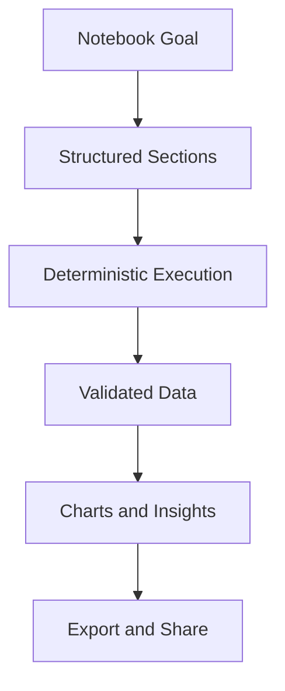

# Day 070 [Intermediate]: Jupyter Notebook Workflow

## Index

- [Goal](#goal)
- [Prerequisites](#prerequisites)
- [Explanation](#explanation)
- [Topic by Topic](#topic-by-topic)
- [Key Concepts](#key-concepts)
- [Visual Concept Map](#visual-concept-map)
- [End-to-End Practical](#end-to-end-practical)
- [Hands-on Coding](#hands-on-coding)
- [Mini Exercise](#mini-exercise)
- [Assessment Quiz](#assessment-quiz)
- [Task](#task)
- [Self Check](#self-check)
- [Interview Questions and Answers](#interview-questions-and-answers)
- [Day 070 Outcome](#day-070-outcome)

## Goal

Build a professional Jupyter notebook workflow for exploration, analysis storytelling, and reproducible handoff.

## Prerequisites

- Day 069 completed
- Comfortable with pandas, NumPy, and Matplotlib basics

## Explanation

Jupyter notebooks combine code, narrative text, tables, and charts. They are excellent for exploration and communication, but require discipline in cell order, environment reproducibility, and output hygiene.

## Topic by Topic

### Topic 1: Notebook Structure and Storytelling

Theory:
Strong notebooks follow a narrative: context, method, results, conclusion.

Practical:
Use clear section headings and concise markdown explanations.

Code Example:

```text
1. Problem
2. Data Loading
3. Cleaning
4. Analysis
5. Conclusion
```

**Explanation:**
This topic explains Notebook Structure and Storytelling in a practical Python context so you can write clear, reliable, and maintainable programs for real-world tasks.

**Key Points:**
- Understand the core idea behind Notebook Structure and Storytelling.
- Apply the practical pattern with good readability and validation habits.
- Keep the solution maintainable, testable, and safe for production use where relevant.

### Topic 2: Reproducible Execution Order

Theory:
Hidden state from out-of-order cells causes fragile notebooks.

Practical:
Restart kernel and run all before sharing.

Code Example:

```python
# Place imports in first code cell and keep deterministic seed
import numpy as np
np.random.seed(42)
```

**Explanation:**
This topic explains Reproducible Execution Order in a practical Python context so you can write clear, reliable, and maintainable programs for real-world tasks.

**Key Points:**
- Understand the core idea behind Reproducible Execution Order.
- Apply the practical pattern with good readability and validation habits.
- Keep the solution maintainable, testable, and safe for production use where relevant.

### Topic 3: Data Loading and Validation Cells

Theory:
Early validation catches schema or quality issues quickly.

Practical:
Add dedicated cells for shape, dtypes, null checks.

Code Example:

```python
print(df.shape)
print(df.dtypes)
print(df.isna().sum())
```

**Explanation:**
This topic explains Data Loading and Validation Cells in a practical Python context so you can write clear, reliable, and maintainable programs for real-world tasks.

**Key Points:**
- Understand the core idea behind Data Loading and Validation Cells.
- Apply the practical pattern with good readability and validation habits.
- Keep the solution maintainable, testable, and safe for production use where relevant.

### Topic 4: Visualization and Insight Narration

Theory:
Charts need context and interpretation, not just rendering.

Practical:
Pair each figure with a short insight markdown block.

Code Example:

```text
Insight: Revenue dips in Q2 align with campaign pause period.
```

**Explanation:**
This topic explains Visualization and Insight Narration in a practical Python context so you can write clear, reliable, and maintainable programs for real-world tasks.

**Key Points:**
- Understand the core idea behind Visualization and Insight Narration.
- Apply the practical pattern with good readability and validation habits.
- Keep the solution maintainable, testable, and safe for production use where relevant.

### Topic 5: Parameterization and Reuse

Theory:
Hardcoded values limit notebook reuse.

Practical:
Define configurable variables in one setup cell.

Code Example:

```python
DATA_PATH = "data/sales.csv"
START_DATE = "2026-01-01"
```

**Explanation:**
This topic explains Parameterization and Reuse in a practical Python context so you can write clear, reliable, and maintainable programs for real-world tasks.

**Key Points:**
- Understand the core idea behind Parameterization and Reuse.
- Apply the practical pattern with good readability and validation habits.
- Keep the solution maintainable, testable, and safe for production use where relevant.

### Topic 6: Export, Versioning, and Handoff

Theory:
Notebook deliverables should be easy for others to run and review.

Practical:
Keep outputs clean, pin dependencies, and export to HTML/PDF when needed.

Code Example:

```bash
jupyter nbconvert --to html analysis.ipynb
```

**Explanation:**
This topic explains Export, Versioning, and Handoff in a practical Python context so you can write clear, reliable, and maintainable programs for real-world tasks.

**Key Points:**
- Understand the core idea behind Export, Versioning, and Handoff.
- Apply the practical pattern with good readability and validation habits.
- Keep the solution maintainable, testable, and safe for production use where relevant.

## Key Concepts

- Notebook quality is about clarity plus reproducibility
- Run order consistency prevents hidden-state bugs
- Validation cells build trust in data quality
- Explanatory markdown is part of technical output
- Parameterization improves reuse across datasets
- Export and environment notes enable smooth collaboration

## Visual Concept Map



## End-to-End Practical

1. Create notebook sections with clear headings.
2. Add deterministic setup and import cell.
3. Build data validation and cleaning cells.
4. Add analysis charts with written insights.
5. Run all and export notebook artifact.

## Hands-on Coding

### Example 1: Case - Setup and Data Validation Block

Scenario:
Initialize reproducible environment and verify dataset integrity.

```python
import pandas as pd
import numpy as np
import matplotlib.pyplot as plt

np.random.seed(42)
df = pd.read_csv(DATA_PATH)
```

### Example 2: Case - Analysis with Narrative

Scenario:
Compute KPI and explain business implication.

```python
kpi = df.groupby("month", as_index=False)["revenue"].sum()
```

```text
Insight: Month-over-month growth stabilized after discount policy update.
```

### Example 3: Case - Export for Stakeholders

Scenario:
Generate shareable HTML report from notebook.

```bash
jupyter nbconvert --to html sales_report.ipynb
```

## Mini Exercise

Scenario:
Build a complete analysis notebook from raw CSV to final insight summary and export. Ensure kernel restart plus run-all succeeds without errors.

Expected output:

- Structured notebook with markdown narrative
- Reproducible end-to-end execution
- Exported HTML or PDF artifact

## Assessment Quiz

### Quiz Questions

1. Why run notebook from top after restart before sharing?
2. What is hidden state in notebook context?
3. True or False: Markdown commentary is optional for professional notebook handoff.
4. Why centralize parameters in one cell?
5. What does nbconvert provide?

### Quiz Answers

1. It verifies reproducibility and catches execution-order bugs
2. Variables created in prior runs not reflected in visible cell order
3. False
4. Easier updates and safer reuse
5. Conversion to shareable formats like HTML/PDF

## Task

- Create one reproducible notebook from data load to insight summary
- Include validation, analysis, and visualization sections
- Export deliverable and document run instructions

## Self Check

- You can build notebooks others can rerun reliably
- You can combine code outputs with clear narrative insights
- You can package notebook work for stakeholder consumption

## Interview Questions and Answers

### Beginner

**Question:** Why use notebooks for analysis tasks?

**Answer:** They combine code, visual outputs, and explanations in one document.

**Question:** What is one common notebook mistake?

**Answer:** Running cells out of order and sharing without restart-run validation.

### Middle

**Question:** How do you make notebooks easier to review in teams?

**Answer:** Use clear sections, concise markdown, deterministic setup, and clean outputs.

**Question:** Why should heavy logic move out of notebook cells over time?

**Answer:** Reusable modules improve testing, versioning, and maintainability.

### Advanced

**Question:** What anti-pattern appears in long-lived notebook projects?

**Answer:** Treating notebooks as unstructured production code with hidden dependencies and no runbook.

**Question:** How do mature teams integrate notebooks into engineering workflows?

**Answer:** They pair notebooks with scripts/modules, CI execution checks, and environment pinning.

## Day 070 Outcome

- You can produce professional and reproducible Jupyter notebook workflows
- You can communicate insights clearly using code plus narrative
- You are ready to continue into ETL pipeline engineering on Day 071
