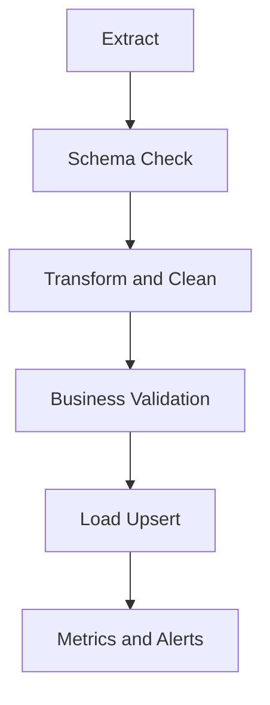

# Day 071 [Advanced]: ETL Pipeline Basics

## Index

- [Goal](#goal)
- [Prerequisites](#prerequisites)
- [Explanation](#explanation)
- [Topic by Topic](#topic-by-topic)
- [Key Concepts](#key-concepts)
- [Visual Concept Map](#visual-concept-map)
- [End-to-End Practical](#end-to-end-practical)
- [Hands-on Coding](#hands-on-coding)
- [Mini Exercise](#mini-exercise)
- [Assessment Quiz](#assessment-quiz)
- [Task](#task)
- [Self Check](#self-check)
- [Interview Questions and Answers](#interview-questions-and-answers)
- [Day 071 Outcome](#day-071-outcome)

## Goal

Design reliable ETL pipelines that extract data from sources, transform it safely, and load clean outputs into analytics-ready storage.

## Prerequisites

- Day 070 completed
- Good familiarity with pandas workflows

## Explanation

ETL pipelines power reporting, BI, and machine learning. Production ETL requires repeatability, schema validation, idempotency, and observability, not just one-time scripts.

## Topic by Topic

### Topic 1: ETL Architecture and Data Contracts

Theory:
ETL consists of extract, transform, and load stages, each with clear contracts and ownership.

Practical:
Define input schema and output schema before coding.

Code Example:

```python
REQUIRED_COLUMNS = {"order_id", "created_at", "amount", "region"}
```

**Explanation:**
This topic explains ETL Architecture and Data Contracts in a practical Python context so you can write clear, reliable, and maintainable programs for real-world tasks.

**Key Points:**
- Understand the core idea behind ETL Architecture and Data Contracts.
- Apply the practical pattern with good readability and validation habits.
- Keep the solution maintainable, testable, and safe for production use where relevant.

### Topic 2: Extraction Strategies

Theory:
Sources can be files, APIs, or databases with different failure modes.

Practical:
Use incremental extraction where possible to reduce load.

Code Example:

```python
def extract_csv(path: str):
  return pd.read_csv(path)
```

**Explanation:**
This topic explains Extraction Strategies in a practical Python context so you can write clear, reliable, and maintainable programs for real-world tasks.

**Key Points:**
- Understand the core idea behind Extraction Strategies.
- Apply the practical pattern with good readability and validation habits.
- Keep the solution maintainable, testable, and safe for production use where relevant.

### Topic 3: Transformation with Validation

Theory:
Transform step should clean, normalize, and validate business rules.

Practical:
Separate transform logic from I/O for easier testing.

Code Example:

```python
def transform(df: pd.DataFrame) -> pd.DataFrame:
  df = df.dropna(subset=["order_id", "amount"])
  df["amount"] = df["amount"].astype(float)
  return df[df["amount"] >= 0]
```

**Explanation:**
This topic explains Transformation with Validation in a practical Python context so you can write clear, reliable, and maintainable programs for real-world tasks.

**Key Points:**
- Understand the core idea behind Transformation with Validation.
- Apply the practical pattern with good readability and validation habits.
- Keep the solution maintainable, testable, and safe for production use where relevant.

### Topic 4: Loading and Idempotency

Theory:
Load should avoid duplicate records on reruns.

Practical:
Use upsert/merge patterns keyed by natural or surrogate IDs.

Code Example:

```sql
INSERT INTO fact_orders(order_id, amount)
VALUES (%s, %s)
ON CONFLICT (order_id) DO UPDATE SET amount = EXCLUDED.amount;
```

**Explanation:**
This topic explains Loading and Idempotency in a practical Python context so you can write clear, reliable, and maintainable programs for real-world tasks.

**Key Points:**
- Understand the core idea behind Loading and Idempotency.
- Apply the practical pattern with good readability and validation habits.
- Keep the solution maintainable, testable, and safe for production use where relevant.

### Topic 5: Scheduling and Retry Behavior

Theory:
Pipelines should run predictably with clear retry policy.

Practical:
Use cron/scheduler and fail-fast with alerting.

Code Example:

```text
Schedule: daily 02:00
Retries: 3 with exponential backoff
```

**Explanation:**
This topic explains Scheduling and Retry Behavior in a practical Python context so you can write clear, reliable, and maintainable programs for real-world tasks.

**Key Points:**
- Understand the core idea behind Scheduling and Retry Behavior.
- Apply the practical pattern with good readability and validation habits.
- Keep the solution maintainable, testable, and safe for production use where relevant.

### Topic 6: Observability and Data Quality Checks

Theory:
Operational and data-quality metrics are equally important.

Practical:
Track row counts, null rates, latency, and failed records.

Code Example:

```python
print({"rows_in": len(raw_df), "rows_out": len(clean_df)})
```

**Explanation:**
This topic explains Observability and Data Quality Checks in a practical Python context so you can write clear, reliable, and maintainable programs for real-world tasks.

**Key Points:**
- Understand the core idea behind Observability and Data Quality Checks.
- Apply the practical pattern with good readability and validation habits.
- Keep the solution maintainable, testable, and safe for production use where relevant.

## Key Concepts

- ETL design starts with schemas and contracts
- Transform logic should be testable and deterministic
- Idempotent loading prevents duplication
- Scheduling and retries must be intentional
- Observability includes data-quality metrics
- Robust ETL is a product, not a one-off script

## Visual Concept Map



## End-to-End Practical

1. Extract raw sales CSV and API enrichment.
2. Validate required columns and types.
3. Transform and clean invalid rows.
4. Load into warehouse table with upsert.
5. Emit run metrics and failure summary.

## Hands-on Coding

### Example 1: Case - Batch ETL Script

Scenario:
Process daily order file into analytics table.

```python
raw_df = extract_csv("data/orders_2026_07_25.csv")
clean_df = transform(raw_df)
```

### Example 2: Case - Incremental ETL Window

Scenario:
Run ETL only for records after last successful watermark.

```python
last_watermark = "2026-07-24T00:00:00"
```

### Example 3: Case - Failed Row Quarantine

Scenario:
Store invalid rows for later audit.

```python
bad_rows = raw_df[~raw_df["amount"].notna()]
bad_rows.to_csv("quarantine/bad_orders.csv", index=False)
```

## Mini Exercise

Scenario:
Build a mini ETL that ingests customer transactions, cleans data, computes daily totals by region, and loads results into an output table/file.

Expected output:

- Reusable extract/transform/load functions
- Validation and quarantine for bad records
- Summary metrics for each run

## Assessment Quiz

### Quiz Questions

1. Why is idempotency essential in ETL reruns?
2. What should be validated before transform logic?
3. True or False: ETL observability is only about runtime duration.
4. What is the benefit of separating transform from load?
5. Why keep failed-row quarantine?

### Quiz Answers

1. It prevents duplicate or conflicting outputs
2. Input schema and required columns
3. False
4. Better testability and reuse
5. For auditability and targeted data-quality fixes

## Task

- Implement one end-to-end ETL pipeline for a sample dataset
- Add schema checks, quarantine output, and run metrics
- Document retry and idempotency strategy

## Self Check

- You can build resilient ETL stages with clear boundaries
- You can enforce schema and data-quality checks
- You can run ETL reliably in scheduled environments

## Interview Questions and Answers

### Beginner

**Question:** What does ETL stand for?

**Answer:** Extract, Transform, and Load.

**Question:** Why not clean data manually each day?

**Answer:** Automated ETL ensures repeatability and scale.

### Middle

**Question:** What is an incremental load pattern?

**Answer:** Processing only new/updated records after a watermark.

**Question:** Why isolate bad rows instead of dropping silently?

**Answer:** It preserves evidence and supports debugging and compliance.

### Advanced

**Question:** What anti-pattern often breaks ETL reliability?

**Answer:** Mixing extraction, transformation, and loading in one monolithic script with no idempotency.

**Question:** How do mature teams scale ETL quality?

**Answer:** They add schema contracts, automated tests, lineage tracking, and alert-driven operations.

## Day 071 Outcome

- You can design and implement dependable ETL pipelines
- You can enforce data contracts and operational quality checks
- You are ready for model building with scikit-learn on Day 072
