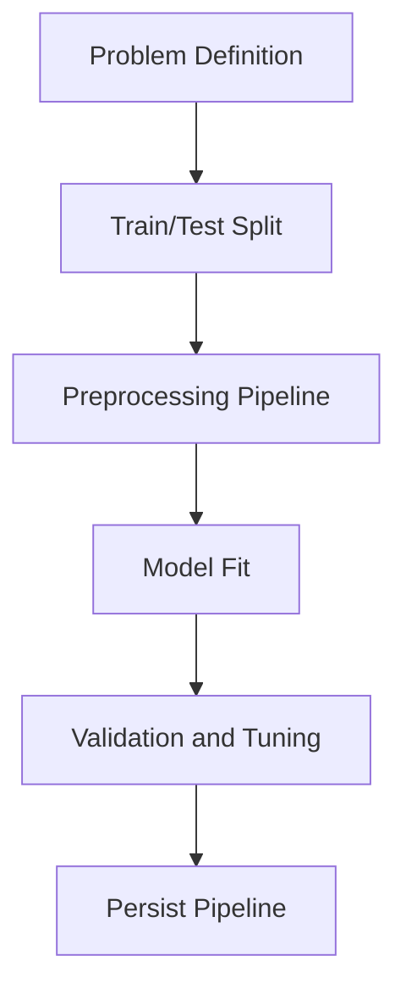

# Day 072 [Advanced]: Machine Learning with scikit-learn

## Index

- [Goal](#goal)
- [Prerequisites](#prerequisites)
- [Explanation](#explanation)
- [Topic by Topic](#topic-by-topic)
- [Key Concepts](#key-concepts)
- [Visual Concept Map](#visual-concept-map)
- [End-to-End Practical](#end-to-end-practical)
- [Hands-on Coding](#hands-on-coding)
- [Mini Exercise](#mini-exercise)
- [Assessment Quiz](#assessment-quiz)
- [Task](#task)
- [Self Check](#self-check)
- [Interview Questions and Answers](#interview-questions-and-answers)
- [Day 072 Outcome](#day-072-outcome)

## Goal

Build practical supervised ML pipelines in scikit-learn, from preprocessing to model training and baseline evaluation.

## Prerequisites

- Day 071 completed
- Solid pandas and NumPy understanding

## Explanation

scikit-learn offers a consistent API for preprocessing, model training, validation, and inference. The objective is reproducible baselines with sound split strategy and pipeline hygiene.

## Topic by Topic

### Topic 1: ML Problem Framing

Theory:
Define problem type: classification, regression, or clustering.

Practical:
Start with a clear target variable and success metric.

Code Example:

```python
TARGET = "churn"
FEATURES = ["tenure", "monthly_charges", "contract_type"]
```

**Explanation:**
This topic explains ML Problem Framing in a practical Python context so you can write clear, reliable, and maintainable programs for real-world tasks.

**Key Points:**
- Understand the core idea behind ML Problem Framing.
- Apply the practical pattern with good readability and validation habits.
- Keep the solution maintainable, testable, and safe for production use where relevant.

### Topic 2: Data Splitting and Leakage Prevention

Theory:
Train-test split estimates generalization and protects against overfitting illusions.

Practical:
Split before fitting transforms to avoid data leakage.

Code Example:

```python
from sklearn.model_selection import train_test_split

X_train, X_test, y_train, y_test = train_test_split(X, y, test_size=0.2, random_state=42)
```

**Explanation:**
This topic explains Data Splitting and Leakage Prevention in a practical Python context so you can write clear, reliable, and maintainable programs for real-world tasks.

**Key Points:**
- Understand the core idea behind Data Splitting and Leakage Prevention.
- Apply the practical pattern with good readability and validation habits.
- Keep the solution maintainable, testable, and safe for production use where relevant.

### Topic 3: Preprocessing with Pipelines

Theory:
Features often need scaling/encoding before model training.

Practical:
Use Pipeline and ColumnTransformer for consistent train/infer behavior.

Code Example:

```python
from sklearn.compose import ColumnTransformer
from sklearn.preprocessing import OneHotEncoder, StandardScaler

preprocess = ColumnTransformer(
  transformers=[
    ("num", StandardScaler(), ["tenure", "monthly_charges"]),
    ("cat", OneHotEncoder(handle_unknown="ignore"), ["contract_type"]),
  ]
)
```

**Explanation:**
This topic explains Preprocessing with Pipelines in a practical Python context so you can write clear, reliable, and maintainable programs for real-world tasks.

**Key Points:**
- Understand the core idea behind Preprocessing with Pipelines.
- Apply the practical pattern with good readability and validation habits.
- Keep the solution maintainable, testable, and safe for production use where relevant.

### Topic 4: Baseline Models and Training

Theory:
Start with simple interpretable models before complex ones.

Practical:
Fit logistic regression or random forest as baseline.

Code Example:

```python
from sklearn.pipeline import Pipeline
from sklearn.linear_model import LogisticRegression

model = Pipeline([
  ("prep", preprocess),
  ("clf", LogisticRegression(max_iter=1000)),
])
model.fit(X_train, y_train)
```

**Explanation:**
This topic explains Baseline Models and Training in a practical Python context so you can write clear, reliable, and maintainable programs for real-world tasks.

**Key Points:**
- Understand the core idea behind Baseline Models and Training.
- Apply the practical pattern with good readability and validation habits.
- Keep the solution maintainable, testable, and safe for production use where relevant.

### Topic 5: Hyperparameter Tuning Basics

Theory:
Default settings are starting points, not final answers.

Practical:
Use cross-validation and grid/random search for candidate improvements.

Code Example:

```python
from sklearn.model_selection import GridSearchCV

search = GridSearchCV(model, {"clf__C": [0.1, 1.0, 10.0]}, cv=5)
search.fit(X_train, y_train)
```

**Explanation:**
This topic explains Hyperparameter Tuning Basics in a practical Python context so you can write clear, reliable, and maintainable programs for real-world tasks.

**Key Points:**
- Understand the core idea behind Hyperparameter Tuning Basics.
- Apply the practical pattern with good readability and validation habits.
- Keep the solution maintainable, testable, and safe for production use where relevant.

### Topic 6: Model Persistence and Inference

Theory:
Deployed models must preserve preprocessing + estimator together.

Practical:
Serialize full pipeline object and version it.

Code Example:

```python
import joblib

joblib.dump(model, "models/churn_pipeline.joblib")
```

**Explanation:**
This topic explains Model Persistence and Inference in a practical Python context so you can write clear, reliable, and maintainable programs for real-world tasks.

**Key Points:**
- Understand the core idea behind Model Persistence and Inference.
- Apply the practical pattern with good readability and validation habits.
- Keep the solution maintainable, testable, and safe for production use where relevant.

## Key Concepts

- Problem framing drives all later choices
- Split strategy and leakage control are non-negotiable
- Pipeline abstraction keeps preprocessing consistent
- Baseline models provide useful reference points
- Hyperparameter tuning should be metric-driven
- Model artifacts must be versioned and reproducible

## Visual Concept Map



## End-to-End Practical

1. Load labeled dataset and define target.
2. Split train/test with fixed random seed.
3. Build preprocessing + model pipeline.
4. Train baseline model and evaluate.
5. Save best model artifact for reuse.

## Hands-on Coding

### Example 1: Case - Binary Churn Classifier

Scenario:
Predict churn using customer usage and contract features.

```python
preds = model.predict(X_test)
```

### Example 2: Case - Regression Baseline

Scenario:
Predict monthly sales from historical attributes.

```python
from sklearn.ensemble import RandomForestRegressor
```

### Example 3: Case - Pipeline Reload and Inference

Scenario:
Load saved model and run predictions on new records.

```python
loaded = joblib.load("models/churn_pipeline.joblib")
new_preds = loaded.predict(new_data)
```

## Mini Exercise

Scenario:
Build one scikit-learn classification pipeline with numeric and categorical features. Compare two models and save the better one.

Expected output:

- Complete train/test pipeline
- Metric comparison table
- Persisted model artifact

## Assessment Quiz

### Quiz Questions

1. Why split before fitting preprocessing steps?
2. What issue does OneHotEncoder(handle_unknown="ignore") prevent?
3. True or False: Higher training accuracy always means better model.
4. Why persist full pipeline instead of model only?
5. Why use cross-validation in tuning?

### Quiz Answers

1. To avoid leakage from test data
2. Failures when unseen categories appear during inference
3. False
4. To guarantee identical preprocessing at inference time
5. More robust estimate across data folds

## Task

- Train and compare two supervised models with pipeline workflow
- Prevent leakage and evaluate with proper split strategy
- Save and document the chosen model for inference

## Self Check

- You can construct end-to-end sklearn pipelines
- You can apply safe split and preprocessing strategy
- You can persist and reload model artifacts confidently

## Interview Questions and Answers

### Beginner

**Question:** What does scikit-learn Pipeline solve?

**Answer:** It chains preprocessing and model steps into one reusable object.

**Question:** Why is train-test split needed?

**Answer:** To evaluate how the model performs on unseen data.

### Middle

**Question:** What is data leakage in ML?

**Answer:** Using information from test/future data during training, producing overly optimistic results.

**Question:** Why compare baseline models first?

**Answer:** It sets a reference and avoids unnecessary complexity early.

### Advanced

**Question:** What anti-pattern appears in ML prototyping?

**Answer:** Manual ad-hoc preprocessing outside pipeline, causing training-inference mismatch.

**Question:** How do mature teams productionize sklearn models?

**Answer:** They version datasets and artifacts, monitor drift, and automate retraining/evaluation checks.

## Day 072 Outcome

- You can build reproducible ML pipelines using scikit-learn
- You can train, tune, and persist baseline models safely
- You are ready for deep model evaluation techniques on Day 073
