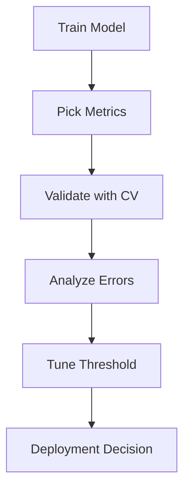

# Day 073 [Advanced]: Model Evaluation Basics

## Index

- [Goal](#goal)
- [Prerequisites](#prerequisites)
- [Explanation](#explanation)
- [Topic by Topic](#topic-by-topic)
- [Key Concepts](#key-concepts)
- [Visual Concept Map](#visual-concept-map)
- [End-to-End Practical](#end-to-end-practical)
- [Hands-on Coding](#hands-on-coding)
- [Mini Exercise](#mini-exercise)
- [Assessment Quiz](#assessment-quiz)
- [Task](#task)
- [Self Check](#self-check)
- [Interview Questions and Answers](#interview-questions-and-answers)
- [Day 073 Outcome](#day-073-outcome)

## Goal

Evaluate ML models rigorously using suitable metrics, validation strategies, and error analysis for trustworthy decision making.

## Prerequisites

- Day 072 completed
- Basic familiarity with classification and regression models

## Explanation

Model evaluation is about measuring generalization quality and practical business impact. Correct metric selection and robust validation prevent misleading conclusions from raw accuracy alone.

## Topic by Topic

### Topic 1: Choosing Metrics by Problem Context

Theory:
Different tasks need different metrics: classification vs regression vs ranking.

Practical:
Define primary and secondary metrics aligned to business objective.

Code Example:

```python
PRIMARY_METRIC = "f1"
SECONDARY_METRIC = "precision"
```

**Explanation:**
This topic explains Choosing Metrics by Problem Context in a practical Python context so you can write clear, reliable, and maintainable programs for real-world tasks.

**Key Points:**
- Understand the core idea behind Choosing Metrics by Problem Context.
- Apply the practical pattern with good readability and validation habits.
- Keep the solution maintainable, testable, and safe for production use where relevant.

### Topic 2: Confusion Matrix and Classification Metrics

Theory:
Precision, recall, F1, and specificity capture different tradeoffs.

Practical:
Use confusion matrix to inspect false positives/false negatives.

Code Example:

```python
from sklearn.metrics import confusion_matrix, classification_report

print(confusion_matrix(y_test, y_pred))
print(classification_report(y_test, y_pred))
```

**Explanation:**
This topic explains Confusion Matrix and Classification Metrics in a practical Python context so you can write clear, reliable, and maintainable programs for real-world tasks.

**Key Points:**
- Understand the core idea behind Confusion Matrix and Classification Metrics.
- Apply the practical pattern with good readability and validation habits.
- Keep the solution maintainable, testable, and safe for production use where relevant.

### Topic 3: Regression Metrics and Residuals

Theory:
MAE, RMSE, and R2 provide complementary model quality perspectives.

Practical:
Inspect residual distribution to find systematic bias.

Code Example:

```python
from sklearn.metrics import mean_absolute_error, mean_squared_error

mae = mean_absolute_error(y_test, y_pred)
rmse = mean_squared_error(y_test, y_pred, squared=False)
```

**Explanation:**
This topic explains Regression Metrics and Residuals in a practical Python context so you can write clear, reliable, and maintainable programs for real-world tasks.

**Key Points:**
- Understand the core idea behind Regression Metrics and Residuals.
- Apply the practical pattern with good readability and validation habits.
- Keep the solution maintainable, testable, and safe for production use where relevant.

### Topic 4: Cross-Validation and Stability

Theory:
Single split can be noisy; cross-validation gives more robust estimates.

Practical:
Use KFold/StratifiedKFold for consistent comparisons.

Code Example:

```python
from sklearn.model_selection import cross_val_score

scores = cross_val_score(model, X, y, cv=5, scoring="f1")
```

**Explanation:**
This topic explains Cross-Validation and Stability in a practical Python context so you can write clear, reliable, and maintainable programs for real-world tasks.

**Key Points:**
- Understand the core idea behind Cross-Validation and Stability.
- Apply the practical pattern with good readability and validation habits.
- Keep the solution maintainable, testable, and safe for production use where relevant.

### Topic 5: Threshold Tuning and ROC/PR Curves

Theory:
Default threshold 0.5 is not always optimal for business goals.

Practical:
Adjust threshold based on precision-recall tradeoff.

Code Example:

```python
proba = model.predict_proba(X_test)[:, 1]
y_adj = (proba >= 0.35).astype(int)
```

**Explanation:**
This topic explains Threshold Tuning and ROC/PR Curves in a practical Python context so you can write clear, reliable, and maintainable programs for real-world tasks.

**Key Points:**
- Understand the core idea behind Threshold Tuning and ROC/PR Curves.
- Apply the practical pattern with good readability and validation habits.
- Keep the solution maintainable, testable, and safe for production use where relevant.

### Topic 6: Error Analysis and Slice Diagnostics

Theory:
Overall metrics can hide poor performance on important subgroups.

Practical:
Evaluate performance by segment (region, device, user type).

Code Example:

```python
# Evaluate metrics per segment to identify weak cohorts.
```

**Explanation:**
This topic explains Error Analysis and Slice Diagnostics in a practical Python context so you can write clear, reliable, and maintainable programs for real-world tasks.

**Key Points:**
- Understand the core idea behind Error Analysis and Slice Diagnostics.
- Apply the practical pattern with good readability and validation habits.
- Keep the solution maintainable, testable, and safe for production use where relevant.

## Key Concepts

- Metric selection must reflect real-world objective
- Confusion matrix reveals failure patterns
- Cross-validation improves confidence in comparisons
- Threshold tuning can optimize business tradeoffs
- Residual and slice analysis expose blind spots
- Good evaluation combines statistics and domain context

## Visual Concept Map



## End-to-End Practical

1. Train two baseline models on same split.
2. Compute classification/regression metrics as relevant.
3. Run 5-fold cross-validation for stability.
4. Tune threshold for target precision-recall balance.
5. Perform segment-wise error analysis and document findings.

## Hands-on Coding

### Example 1: Case - Churn Model Evaluation

Scenario:
Assess churn classifier with F1 and confusion matrix.

```python
from sklearn.metrics import f1_score

f1 = f1_score(y_test, y_pred)
```

### Example 2: Case - Sales Forecast Residual Review

Scenario:
Inspect regression residuals for seasonal bias.

```python
residuals = y_test - y_pred
```

### Example 3: Case - Segment Fairness Check

Scenario:
Compare precision by customer segment.

```python
# Group by segment and compute metric per group.
```

## Mini Exercise

Scenario:
Evaluate one classification model using at least four metrics, cross-validation, and one threshold adjustment. Provide a short recommendation report.

Expected output:

- Metric table and confusion matrix
- CV score summary (mean and std)
- Recommendation with tradeoff discussion

## Assessment Quiz

### Quiz Questions

1. Why can high accuracy still be misleading?
2. What does cross-validation variance indicate?
3. True or False: Threshold tuning only matters for imbalanced data.
4. Why do segment-level metrics matter?
5. What is one risk of evaluating only one random split?

### Quiz Answers

1. Class imbalance can inflate accuracy despite poor minority performance
2. Stability of model performance across folds
3. False
4. They expose hidden weak performance on key cohorts
5. Over- or under-estimation due to split noise

## Task

- Evaluate one trained model with robust metrics and CV
- Add threshold tuning and error-slice analysis
- Write a short decision memo: ship, iterate, or reject

## Self Check

- You can pick metrics that match business goals
- You can compare models with robust validation
- You can diagnose model failure patterns beyond averages

## Interview Questions and Answers

### Beginner

**Question:** What is precision vs recall?

**Answer:** Precision measures correctness of positive predictions; recall measures coverage of actual positives.

**Question:** Why use confusion matrix?

**Answer:** It shows counts of TP, FP, TN, and FN directly.

### Middle

**Question:** Why might F1 be preferred over accuracy?

**Answer:** F1 balances precision and recall, useful when classes are imbalanced.

**Question:** What does CV mean score plus std tell you?

**Answer:** Expected performance and consistency across folds.

### Advanced

**Question:** What anti-pattern appears in model evaluation?

**Answer:** Picking whichever metric looks best after repeated test-set peeking, causing optimistic bias.

**Question:** How do mature teams formalize model-go/no-go decisions?

**Answer:** They define metric thresholds, stability criteria, and segment-level guardrails before training.

## Day 073 Outcome

- You can evaluate models rigorously with appropriate metrics
- You can tune and diagnose model behavior with practical depth
- You are ready to build stronger feature sets on Day 074
