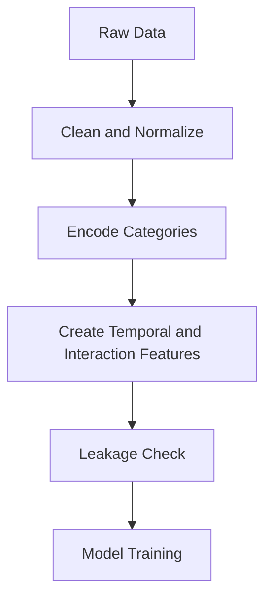

# Day 074 [Advanced]: Feature Engineering Essentials

## Index

- [Goal](#goal)
- [Prerequisites](#prerequisites)
- [Explanation](#explanation)
- [Topic by Topic](#topic-by-topic)
- [Key Concepts](#key-concepts)
- [Visual Concept Map](#visual-concept-map)
- [End-to-End Practical](#end-to-end-practical)
- [Hands-on Coding](#hands-on-coding)
- [Mini Exercise](#mini-exercise)
- [Assessment Quiz](#assessment-quiz)
- [Task](#task)
- [Self Check](#self-check)
- [Interview Questions and Answers](#interview-questions-and-answers)
- [Day 074 Outcome](#day-074-outcome)

## Goal

Design high-value input features that improve model quality while preserving reproducibility and leakage safety.

## Prerequisites

- Day 073 completed
- Strong understanding of model training and evaluation basics

## Explanation

Feature engineering converts raw data into informative representations that make patterns easier for models to learn. Good features often outperform complex algorithms trained on poor inputs.

## Topic by Topic

### Topic 1: Feature Types and Signal Discovery

Theory:
Features can be numeric, categorical, temporal, text-derived, or interaction-based.

Practical:
Map domain hypotheses to measurable columns.

Code Example:

```python
candidate_features = ["tenure_days", "avg_ticket", "last_login_gap"]
```

**Explanation:**
This topic explains Feature Types and Signal Discovery in a practical Python context so you can write clear, reliable, and maintainable programs for real-world tasks.

**Key Points:**
- Understand the core idea behind Feature Types and Signal Discovery.
- Apply the practical pattern with good readability and validation habits.
- Keep the solution maintainable, testable, and safe for production use where relevant.

### Topic 2: Categorical Encoding Strategies

Theory:
Models require numerical representation of categories.

Practical:
Choose one-hot, ordinal, or target-style encodings carefully.

Code Example:

```python
from sklearn.preprocessing import OneHotEncoder
encoder = OneHotEncoder(handle_unknown="ignore")
```

**Explanation:**
This topic explains Categorical Encoding Strategies in a practical Python context so you can write clear, reliable, and maintainable programs for real-world tasks.

**Key Points:**
- Understand the core idea behind Categorical Encoding Strategies.
- Apply the practical pattern with good readability and validation habits.
- Keep the solution maintainable, testable, and safe for production use where relevant.

### Topic 3: Scaling and Transformation

Theory:
Some models are sensitive to feature scale and skew.

Practical:
Apply standardization or log transforms where justified.

Code Example:

```python
df["log_revenue"] = np.log1p(df["revenue"])
```

**Explanation:**
This topic explains Scaling and Transformation in a practical Python context so you can write clear, reliable, and maintainable programs for real-world tasks.

**Key Points:**
- Understand the core idea behind Scaling and Transformation.
- Apply the practical pattern with good readability and validation habits.
- Keep the solution maintainable, testable, and safe for production use where relevant.

### Topic 4: Temporal and Aggregated Features

Theory:
Time-based features and historical aggregates add predictive context.

Practical:
Build rolling means, recency, and frequency metrics without peeking ahead.

Code Example:

```python
df["days_since_last_order"] = (ref_date - df["last_order_date"]).dt.days
```

**Explanation:**
This topic explains Temporal and Aggregated Features in a practical Python context so you can write clear, reliable, and maintainable programs for real-world tasks.

**Key Points:**
- Understand the core idea behind Temporal and Aggregated Features.
- Apply the practical pattern with good readability and validation habits.
- Keep the solution maintainable, testable, and safe for production use where relevant.

### Topic 5: Interaction Features and Nonlinearity

Theory:
Interactions capture effects not visible in standalone variables.

Practical:
Create targeted interactions and validate impact empirically.

Code Example:

```python
df["tenure_x_spend"] = df["tenure_days"] * df["avg_ticket"]
```

**Explanation:**
This topic explains Interaction Features and Nonlinearity in a practical Python context so you can write clear, reliable, and maintainable programs for real-world tasks.

**Key Points:**
- Understand the core idea behind Interaction Features and Nonlinearity.
- Apply the practical pattern with good readability and validation habits.
- Keep the solution maintainable, testable, and safe for production use where relevant.

### Topic 6: Leakage and Feature Governance

Theory:
Leaky features can inflate metrics and fail in production.

Practical:
Use train-only fit and strict feature lineage documentation.

Code Example:

```text
Rule: No feature may use post-event information at prediction time.
```

**Explanation:**
This topic explains Leakage and Feature Governance in a practical Python context so you can write clear, reliable, and maintainable programs for real-world tasks.

**Key Points:**
- Understand the core idea behind Leakage and Feature Governance.
- Apply the practical pattern with good readability and validation habits.
- Keep the solution maintainable, testable, and safe for production use where relevant.

## Key Concepts

- Feature quality often dominates model choice
- Encoding and scaling must match model behavior
- Temporal features require strict causality discipline
- Interaction terms can unlock hidden signal
- Leakage prevention is essential for trustworthy evaluation
- Feature pipelines should be versioned and testable

## Visual Concept Map



## End-to-End Practical

1. Start with baseline raw feature set.
2. Add categorical encoding and scaling.
3. Create temporal recency and frequency features.
4. Add one interaction term and compare metrics.
5. Document feature definitions and leakage checks.

## Hands-on Coding

### Example 1: Case - Customer Churn Features

Scenario:
Engineer recency and engagement features for churn model.

```python
df["weekly_sessions"] = df["sessions_30d"] / 4.0
```

### Example 2: Case - Revenue Prediction Features

Scenario:
Add log transform and normalized ratios.

```python
df["orders_per_user"] = df["total_orders"] / (df["active_users"] + 1)
```

### Example 3: Case - Leakage Audit

Scenario:
Remove fields that contain future information.

```python
drop_cols = ["churn_label_generated_at", "future_revenue"]
```

## Mini Exercise

Scenario:
Improve an existing model by adding at least five engineered features from raw columns. Compare old vs new metrics and explain the gains.

Expected output:

- Feature table with descriptions
- Before/after model comparison
- Leakage and reproducibility notes

## Assessment Quiz

### Quiz Questions

1. Why can simple models with strong features outperform complex models?
2. What is a leakage example in temporal datasets?
3. True or False: One-hot encoding is always the best categorical strategy.
4. Why version feature definitions?
5. What is the risk of creating too many interaction features blindly?

### Quiz Answers

1. Better signal representation improves learnability
2. Using post-prediction outcomes in training features
3. False
4. To ensure reproducibility and traceability across model versions
5. Overfitting and noisy feature space explosion

## Task

- Engineer and evaluate a feature set for one ML problem
- Add leakage checks and feature documentation
- Report metric improvements with clear tradeoffs

## Self Check

- You can design feature transformations from domain insights
- You can evaluate whether engineered features actually help
- You can avoid leakage and keep feature pipelines reproducible

## Interview Questions and Answers

### Beginner

**Question:** What is feature engineering?

**Answer:** Transforming raw data into informative model inputs.

**Question:** Why encode categorical values?

**Answer:** Most ML algorithms need numeric representations.

### Middle

**Question:** How do you verify a new feature is useful?

**Answer:** Compare validation metrics with and without the feature under same split/CV setup.

**Question:** Why are temporal features tricky?

**Answer:** They can easily introduce future-data leakage if timestamps are mishandled.

### Advanced

**Question:** What anti-pattern appears in feature engineering workflows?

**Answer:** Massive feature generation without governance, evaluation discipline, or explainability.

**Question:** How do mature teams manage feature lifecycle?

**Answer:** They maintain feature catalogs, ownership, tests, and version-controlled transformation code.

## Day 074 Outcome

- You can engineer high-impact features for practical ML tasks
- You can guard against leakage and overfitting risks
- You are ready to package Python projects professionally on Day 075
