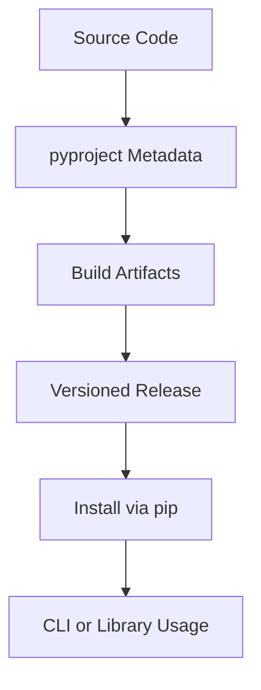

# Day 075 [Advanced]: Packaging Python Projects

## Index

- [Goal](#goal)
- [Prerequisites](#prerequisites)
- [Explanation](#explanation)
- [Topic by Topic](#topic-by-topic)
- [Key Concepts](#key-concepts)
- [Visual Concept Map](#visual-concept-map)
- [End-to-End Practical](#end-to-end-practical)
- [Hands-on Coding](#hands-on-coding)
- [Mini Exercise](#mini-exercise)
- [Assessment Quiz](#assessment-quiz)
- [Task](#task)
- [Self Check](#self-check)
- [Interview Questions and Answers](#interview-questions-and-answers)
- [Day 075 Outcome](#day-075-outcome)

## Goal

Package Python applications and libraries professionally for installation, distribution, and team reuse.

## Prerequisites

- Day 074 completed
- Familiarity with Python project structure and dependency basics

## Explanation

Packaging turns source code into reusable artifacts. A well-packaged project improves installation reliability, dependency management, versioning, and release automation.

## Topic by Topic

### Topic 1: Modern Packaging Standards

Theory:
Modern Python packaging relies on pyproject.toml and build backends.

Practical:
Use standards-compliant metadata and explicit dependency declarations.

Code Example:

```toml
[build-system]
requires = ["setuptools>=68", "wheel"]
build-backend = "setuptools.build_meta"
```

**Explanation:**
This topic explains Modern Packaging Standards in a practical Python context so you can write clear, reliable, and maintainable programs for real-world tasks.

**Key Points:**
- Understand the core idea behind Modern Packaging Standards.
- Apply the practical pattern with good readability and validation habits.
- Keep the solution maintainable, testable, and safe for production use where relevant.

### Topic 2: Project Layout and Import Safety

Theory:
Consistent layout improves tooling interoperability and testing behavior.

Practical:
Adopt src layout for library-style projects.

Code Example:

```text
project/
  pyproject.toml
  src/my_pkg/
  tests/
```

**Explanation:**
This topic explains Project Layout and Import Safety in a practical Python context so you can write clear, reliable, and maintainable programs for real-world tasks.

**Key Points:**
- Understand the core idea behind Project Layout and Import Safety.
- Apply the practical pattern with good readability and validation habits.
- Keep the solution maintainable, testable, and safe for production use where relevant.

### Topic 3: Dependencies and Optional Extras

Theory:
Runtime and development dependencies should be separated.

Practical:
Declare extras for optional features such as visualization or ML.

Code Example:

```toml
[project.optional-dependencies]
dev = ["pytest", "ruff"]
viz = ["matplotlib"]
```

**Explanation:**
This topic explains Dependencies and Optional Extras in a practical Python context so you can write clear, reliable, and maintainable programs for real-world tasks.

**Key Points:**
- Understand the core idea behind Dependencies and Optional Extras.
- Apply the practical pattern with good readability and validation habits.
- Keep the solution maintainable, testable, and safe for production use where relevant.

### Topic 4: Versioning and Release Strategy

Theory:
Semantic versioning helps communicate change impact.

Practical:
Increment versions intentionally based on API compatibility.

Code Example:

```text
MAJOR.MINOR.PATCH  ->  2.4.1
```

**Explanation:**
This topic explains Versioning and Release Strategy in a practical Python context so you can write clear, reliable, and maintainable programs for real-world tasks.

**Key Points:**
- Understand the core idea behind Versioning and Release Strategy.
- Apply the practical pattern with good readability and validation habits.
- Keep the solution maintainable, testable, and safe for production use where relevant.

### Topic 5: Building and Publishing Artifacts

Theory:
Distribution artifacts include source distribution and wheel.

Practical:
Build reproducible packages and publish to index/repository.

Code Example:

```bash
python -m build
```

**Explanation:**
This topic explains Building and Publishing Artifacts in a practical Python context so you can write clear, reliable, and maintainable programs for real-world tasks.

**Key Points:**
- Understand the core idea behind Building and Publishing Artifacts.
- Apply the practical pattern with good readability and validation habits.
- Keep the solution maintainable, testable, and safe for production use where relevant.

### Topic 6: Entry Points, CLI, and Installation UX

Theory:
Console scripts make packages executable from terminal.

Practical:
Expose clear command entry point for user workflows.

Code Example:

```toml
[project.scripts]
mytool = "my_pkg.cli:main"
```

**Explanation:**
This topic explains Entry Points, CLI, and Installation UX in a practical Python context so you can write clear, reliable, and maintainable programs for real-world tasks.

**Key Points:**
- Understand the core idea behind Entry Points, CLI, and Installation UX.
- Apply the practical pattern with good readability and validation habits.
- Keep the solution maintainable, testable, and safe for production use where relevant.

## Key Concepts

- pyproject.toml is the modern package definition center
- Project layout affects test/import behavior
- Dependency scopes should be explicit and minimal
- Versioning communicates compatibility guarantees
- Build artifacts must be reproducible and verifiable
- Good installation UX increases adoption and reliability

## Visual Concept Map



## End-to-End Practical

1. Create src-based package structure.
2. Add pyproject metadata and dependencies.
3. Configure CLI entry point.
4. Build wheel and sdist artifacts.
5. Install locally and verify command usage.

## Hands-on Coding

### Example 1: Case - Minimal Library Package

Scenario:
Package a utility module and install it in editable mode.

```bash
pip install -e .
```

### Example 2: Case - CLI Tool Packaging

Scenario:
Expose command-line interface for ETL runner.

```python
def main():
  print("ETL job started")
```

### Example 3: Case - Release Build Validation

Scenario:
Build package and inspect dist artifacts.

```bash
python -m build
twine check dist/*
```

## Mini Exercise

Scenario:
Package one existing Python mini project from this curriculum with pyproject.toml, extras, and CLI entry point. Build and test installation locally.

Expected output:

- Installable package layout
- Built wheel and sdist
- Working CLI command after installation

## Assessment Quiz

### Quiz Questions

1. Why is pyproject.toml preferred over legacy setup.py-only workflows?
2. What benefit does src layout provide?
3. True or False: Dev dependencies should always be runtime dependencies.
4. Why generate both wheel and sdist?
5. What does entry point mapping enable?

### Quiz Answers

1. It standardizes build metadata and tool interoperability
2. It prevents accidental imports from project root during tests
3. False
4. Broader compatibility and reliable distribution options
5. Executable CLI commands linked to package functions

## Task

- Package one project using modern pyproject standards
- Define runtime and dev dependencies cleanly
- Build artifacts and verify install/CLI execution

## Self Check

- You can structure and package Python projects professionally
- You can manage versions and dependencies correctly
- You can produce and validate release artifacts

## Interview Questions and Answers

### Beginner

**Question:** What is a Python wheel?

**Answer:** A built distribution format for fast installation.

**Question:** Why package a project instead of sharing scripts?

**Answer:** Packaging improves reuse, installation consistency, and release management.

### Middle

**Question:** What issue does src layout commonly prevent?

**Answer:** False-positive imports from local working directory during tests.

**Question:** Why separate optional extras?

**Answer:** Users install only needed dependency groups, reducing footprint.

### Advanced

**Question:** What anti-pattern appears in package releases?

**Answer:** Unpinned build setup and ad-hoc manual release steps without artifact checks.

**Question:** How do mature teams harden packaging pipelines?

**Answer:** They automate build/test/publish in CI with version policies and artifact verification.

## Day 075 Outcome

- You can package Python projects for reliable distribution
- You can build, validate, and version release artifacts confidently
- You are ready to continue with CLI-focused application workflows on Day 076
