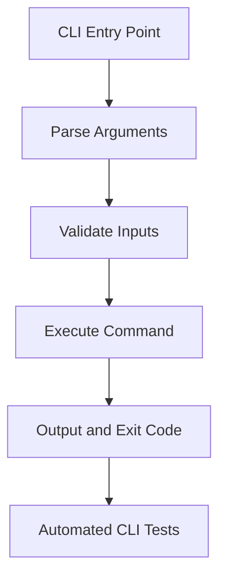

# Day 076 [Advanced]: CLI Apps with argparse and click

## Index

- [Goal](#goal)
- [Prerequisites](#prerequisites)
- [Explanation](#explanation)
- [Topic by Topic](#topic-by-topic)
- [Key Concepts](#key-concepts)
- [Visual Concept Map](#visual-concept-map)
- [End-to-End Practical](#end-to-end-practical)
- [Hands-on Coding](#hands-on-coding)
- [Mini Exercise](#mini-exercise)
- [Assessment Quiz](#assessment-quiz)
- [Task](#task)
- [Self Check](#self-check)
- [Interview Questions and Answers](#interview-questions-and-answers)
- [Day 076 Outcome](#day-076-outcome)

## Goal

Build robust command-line applications in Python using argparse and click with strong UX, validation, and testability.

## Prerequisites

- Day 075 completed
- Basic understanding of Python packaging and project layout

## Explanation

CLI apps are powerful automation interfaces for developers and ops teams. A strong CLI design includes command grouping, clear help output, reliable input validation, and deterministic exit codes.

## Topic by Topic

### Topic 1: CLI Design Principles

Theory:
Good CLIs are discoverable, predictable, and script-friendly.

Practical:
Define consistent command naming, flags, and output format.

Code Example:

```text
mytool users list --limit 20 --format json
```

**Explanation:**
This topic explains CLI Design Principles in a practical Python context so you can write clear, reliable, and maintainable programs for real-world tasks.

**Key Points:**
- Understand the core idea behind CLI Design Principles.
- Apply the practical pattern with good readability and validation habits.
- Keep the solution maintainable, testable, and safe for production use where relevant.

### Topic 2: Building with argparse

Theory:
argparse is built-in and excellent for lightweight CLIs.

Practical:
Use subparsers to organize command groups.

Code Example:

```python
import argparse

parser = argparse.ArgumentParser(prog="mytool")
sub = parser.add_subparsers(dest="command", required=True)
sub.add_parser("health")
```

**Explanation:**
This topic explains Building with argparse in a practical Python context so you can write clear, reliable, and maintainable programs for real-world tasks.

**Key Points:**
- Understand the core idea behind Building with argparse.
- Apply the practical pattern with good readability and validation habits.
- Keep the solution maintainable, testable, and safe for production use where relevant.

### Topic 3: Building with click

Theory:
click provides decorators, rich option handling, and composability.

Practical:
Use click groups for larger tools with multiple domains.

Code Example:

```python
import click

@click.group()
def cli():
  pass

@cli.command()
def health():
  click.echo("ok")
```

**Explanation:**
This topic explains Building with click in a practical Python context so you can write clear, reliable, and maintainable programs for real-world tasks.

**Key Points:**
- Understand the core idea behind Building with click.
- Apply the practical pattern with good readability and validation habits.
- Keep the solution maintainable, testable, and safe for production use where relevant.

### Topic 4: Validation, Errors, and Exit Codes

Theory:
Scripts depend on exit status and stable error messages.

Practical:
Validate inputs early and return meaningful non-zero exits.

Code Example:

```python
if limit <= 0:
  raise SystemExit("--limit must be > 0")
```

**Explanation:**
This topic explains Validation, Errors, and Exit Codes in a practical Python context so you can write clear, reliable, and maintainable programs for real-world tasks.

**Key Points:**
- Understand the core idea behind Validation, Errors, and Exit Codes.
- Apply the practical pattern with good readability and validation habits.
- Keep the solution maintainable, testable, and safe for production use where relevant.

### Topic 5: Configuration and Environment Integration

Theory:
CLI defaults often come from config files or env vars.

Practical:
Allow explicit flag override over config/env defaults.

Code Example:

```text
Priority: CLI flag > ENV var > config file > hardcoded default
```

**Explanation:**
This topic explains Configuration and Environment Integration in a practical Python context so you can write clear, reliable, and maintainable programs for real-world tasks.

**Key Points:**
- Understand the core idea behind Configuration and Environment Integration.
- Apply the practical pattern with good readability and validation habits.
- Keep the solution maintainable, testable, and safe for production use where relevant.

### Topic 6: Testing CLI Behavior

Theory:
CLI tests should validate output, error paths, and exit codes.

Practical:
Use pytest and click testing utilities or subprocess assertions.

Code Example:

```python
from click.testing import CliRunner

result = CliRunner().invoke(cli, ["health"])
assert result.exit_code == 0
```

**Explanation:**
This topic explains Testing CLI Behavior in a practical Python context so you can write clear, reliable, and maintainable programs for real-world tasks.

**Key Points:**
- Understand the core idea behind Testing CLI Behavior.
- Apply the practical pattern with good readability and validation habits.
- Keep the solution maintainable, testable, and safe for production use where relevant.

## Key Concepts

- CLI UX design impacts adoption and script reliability
- argparse is great for simple/builtin-first tools
- click scales well for larger command ecosystems
- Input validation and exit codes are contract-level behavior
- Config layering should be deterministic
- Automated CLI tests prevent regression in automation flows

## Visual Concept Map



## End-to-End Practical

1. Design command tree for a utility tool.
2. Implement with argparse or click.
3. Add options, arguments, and help text.
4. Handle validation and failure exit codes.
5. Add automated tests for key command paths.

## Hands-on Coding

### Example 1: Case - ETL Runner CLI

Scenario:
Trigger ETL pipelines with environment and date flags.

```text
etl run --env prod --date 2026-07-25
```

### Example 2: Case - Data Export CLI

Scenario:
Export query results in csv/json format.

```text
report export --format csv --out summary.csv
```

### Example 3: Case - Admin Utility CLI

Scenario:
Create users and reset passwords from a command group.

```text
admin user create --email dev@example.com
```

## Mini Exercise

Scenario:
Build a multi-command CLI with at least three commands and two global options. Include one invalid-input error case with proper exit code.

Expected output:

- Structured command tree
- Helpful --help documentation
- Tested success and failure flows

## Assessment Quiz

### Quiz Questions

1. Why are stable exit codes important in CLI tools?
2. What advantage does click offer over raw argparse for large CLIs?
3. True or False: Human-readable output alone is enough for automation scripts.
4. Why should CLI support both env vars and flags?
5. What is one common CLI anti-pattern?

### Quiz Answers

1. They allow automation scripts to detect success/failure reliably
2. Cleaner command composition and richer argument abstractions
3. False
4. Flexibility in local usage and CI/CD integration
5. Inconsistent argument naming and error semantics

## Task

- Implement one production-style CLI with grouped commands
- Add deterministic config precedence and input validation
- Write tests for key command behaviors

## Self Check

- You can design and implement maintainable CLIs
- You can provide predictable output and exit behavior
- You can test and ship command-line tools with confidence

## Interview Questions and Answers

### Beginner

**Question:** What is argparse used for?

**Answer:** Parsing command-line arguments in Python applications.

**Question:** Why expose a CLI for backend tools?

**Answer:** It enables automation and operational workflows without UI overhead.

### Middle

**Question:** Why should error messages in CLI be explicit?

**Answer:** Operators need quick diagnosis and script authors need deterministic failure causes.

**Question:** When would you choose click over argparse?

**Answer:** For larger tools needing command groups, reusable options, and cleaner developer ergonomics.

### Advanced

**Question:** What anti-pattern appears in internal CLI ecosystems?

**Answer:** Growing ad-hoc scripts without shared argument conventions, tests, or versioning.

**Question:** How do teams harden CLI tools for enterprise use?

**Answer:** They enforce interface contracts, semantic versioning, integration tests, and backward compatibility policies.

## Day 076 Outcome

- You can build production-style CLIs using argparse and click
- You can enforce reliable input, output, and exit semantics
- You are ready for advanced configuration management on Day 077
