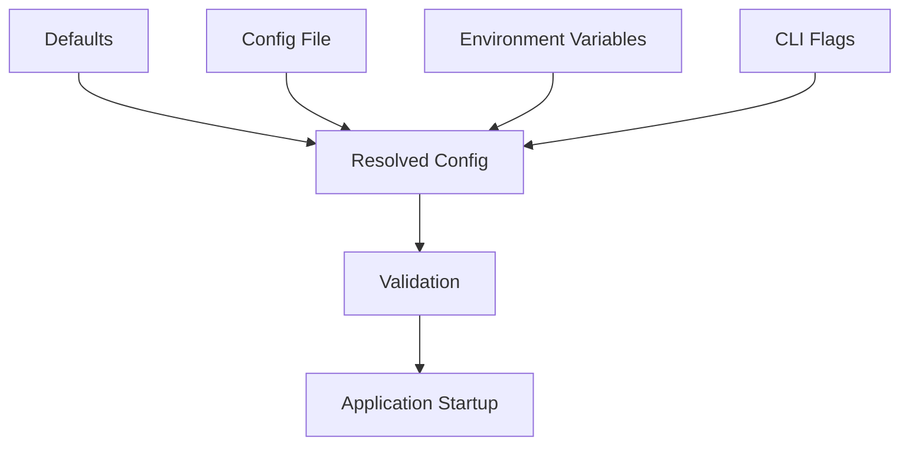

# Day 077 [Advanced]: Configuration Management

## Index

- [Goal](#goal)
- [Prerequisites](#prerequisites)
- [Explanation](#explanation)
- [Topic by Topic](#topic-by-topic)
- [Key Concepts](#key-concepts)
- [Visual Concept Map](#visual-concept-map)
- [End-to-End Practical](#end-to-end-practical)
- [Hands-on Coding](#hands-on-coding)
- [Mini Exercise](#mini-exercise)
- [Assessment Quiz](#assessment-quiz)
- [Task](#task)
- [Self Check](#self-check)
- [Interview Questions and Answers](#interview-questions-and-answers)
- [Day 077 Outcome](#day-077-outcome)

## Goal

Implement scalable configuration management for Python apps with environment-specific settings, validation, and safe defaults.

## Prerequisites

- Day 076 completed
- Familiarity with environment variables and project packaging

## Explanation

Configuration management separates deploy-time settings from code. Reliable systems use typed settings, deterministic precedence rules, and clear environment profiles for dev, staging, and production.

## Topic by Topic

### Topic 1: Config Sources and Precedence

Theory:
Config may come from defaults, files, env vars, and CLI flags.

Practical:
Define explicit precedence to avoid ambiguity.

Code Example:

```text
Precedence: CLI > ENV > config file > defaults
```

**Explanation:**
This topic explains Config Sources and Precedence in a practical Python context so you can write clear, reliable, and maintainable programs for real-world tasks.

**Key Points:**
- Understand the core idea behind Config Sources and Precedence.
- Apply the practical pattern with good readability and validation habits.
- Keep the solution maintainable, testable, and safe for production use where relevant.

### Topic 2: Typed Settings Models

Theory:
Untyped string configs cause runtime errors.

Practical:
Use pydantic settings/dataclasses for parsing and validation.

Code Example:

```python
from pydantic import BaseModel

class AppConfig(BaseModel):
  app_name: str
  debug: bool = False
  port: int = 8000
```

**Explanation:**
This topic explains Typed Settings Models in a practical Python context so you can write clear, reliable, and maintainable programs for real-world tasks.

**Key Points:**
- Understand the core idea behind Typed Settings Models.
- Apply the practical pattern with good readability and validation habits.
- Keep the solution maintainable, testable, and safe for production use where relevant.

### Topic 3: Environment Profiles

Theory:
Different environments require distinct, controlled values.

Practical:
Support local, test, staging, and production profiles.

Code Example:

```text
ENV=dev | test | staging | prod
```

**Explanation:**
This topic explains Environment Profiles in a practical Python context so you can write clear, reliable, and maintainable programs for real-world tasks.

**Key Points:**
- Understand the core idea behind Environment Profiles.
- Apply the practical pattern with good readability and validation habits.
- Keep the solution maintainable, testable, and safe for production use where relevant.

### Topic 4: Validation and Fail-Fast Boot

Theory:
Invalid config should fail at startup, not mid-request.

Practical:
Validate required keys and ranges at app bootstrap.

Code Example:

```python
if config.port <= 0:
  raise ValueError("Invalid port")
```

**Explanation:**
This topic explains Validation and Fail-Fast Boot in a practical Python context so you can write clear, reliable, and maintainable programs for real-world tasks.

**Key Points:**
- Understand the core idea behind Validation and Fail-Fast Boot.
- Apply the practical pattern with good readability and validation habits.
- Keep the solution maintainable, testable, and safe for production use where relevant.

### Topic 5: Dynamic Reload vs Immutable Config

Theory:
Some services require runtime reload; others prefer immutable config for stability.

Practical:
Choose strategy intentionally based on risk and operational needs.

Code Example:

```text
Immutable startup config is simplest for most API services.
```

**Explanation:**
This topic explains Dynamic Reload vs Immutable Config in a practical Python context so you can write clear, reliable, and maintainable programs for real-world tasks.

**Key Points:**
- Understand the core idea behind Dynamic Reload vs Immutable Config.
- Apply the practical pattern with good readability and validation habits.
- Keep the solution maintainable, testable, and safe for production use where relevant.

### Topic 6: Testing Configuration Paths

Theory:
Config bugs often appear only in specific environments.

Practical:
Add tests for precedence, parsing, and required-key failures.

Code Example:

```python
def test_env_overrides_file():
  assert resolved.port == 9000
```

**Explanation:**
This topic explains Testing Configuration Paths in a practical Python context so you can write clear, reliable, and maintainable programs for real-world tasks.

**Key Points:**
- Understand the core idea behind Testing Configuration Paths.
- Apply the practical pattern with good readability and validation habits.
- Keep the solution maintainable, testable, and safe for production use where relevant.

## Key Concepts

- Configuration should be externalized and typed
- Precedence rules must be deterministic and documented
- Environment profiles reduce deployment mistakes
- Fail-fast startup prevents latent runtime errors
- Runtime reload should be deliberate, not accidental
- Config behavior needs automated tests

## Visual Concept Map



## End-to-End Practical

1. Create typed config model.
2. Load values from file and env.
3. Apply precedence and resolve final settings.
4. Validate at startup and fail fast on errors.
5. Add tests for config paths.

## Hands-on Coding

### Example 1: Case - API Service Config Loader

Scenario:
Resolve host, port, and DB URL from multiple config sources.

```python
resolved = AppConfig(app_name="orders-api", port=8080)
```

### Example 2: Case - Profile-based Feature Flags

Scenario:
Enable experimental routes only in non-prod environments.

```python
is_experimental = env in {"dev", "staging"}
```

### Example 3: Case - Misconfiguration Guardrails

Scenario:
Stop startup if required DB configuration is missing.

```python
if not db_url:
  raise RuntimeError("DB_URL is required")
```

## Mini Exercise

Scenario:
Implement a configuration module for a Python service with file + env + CLI precedence, typed validation, and startup checks.

Expected output:

- One config model with required and optional settings
- Deterministic source precedence behavior
- Tests for invalid and override scenarios

## Assessment Quiz

### Quiz Questions

1. Why should config values be typed?
2. What risk appears without precedence rules?
3. True or False: Config validation can wait until the first request.
4. Why use environment profiles?
5. What should happen if required config is missing?

### Quiz Answers

1. To catch invalid values early and reliably
2. Non-deterministic behavior across deployments
3. False
4. Safer environment-specific behavior and deployment clarity
5. Application should fail fast with a clear error

## Task

- Build robust config module for one existing project
- Add typed validation and precedence resolution
- Add tests and documentation for environment usage

## Self Check

- You can design safe, typed configuration systems
- You can manage environment-specific behavior predictably
- You can detect configuration issues before runtime incidents

## Interview Questions and Answers

### Beginner

**Question:** Why not hardcode config in source code?

**Answer:** Different environments need different values; hardcoding is brittle and unsafe.

**Question:** What is config precedence?

**Answer:** The ordered rule deciding which source wins when multiple values exist.

### Middle

**Question:** Why validate config on startup?

**Answer:** It prevents hidden runtime failures and makes misconfiguration obvious.

**Question:** What is a common config anti-pattern?

**Answer:** Scattered config reads throughout code without centralized model.

### Advanced

**Question:** How do teams handle config at scale across many services?

**Answer:** They standardize schema-driven config modules, shared conventions, and automated policy checks.

**Question:** What tradeoff exists between dynamic config reload and immutability?

**Answer:** Reload adds flexibility but increases complexity and state-consistency risk.

## Day 077 Outcome

- You can build deterministic and validated configuration systems
- You can manage multi-environment settings safely
- You are ready for secrets and environment strategy on Day 078
