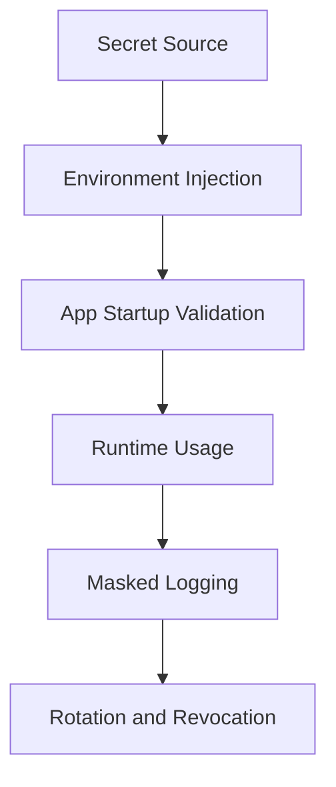

# Day 078 [Advanced]: Secrets and Environment Strategy

## Index

- [Goal](#goal)
- [Prerequisites](#prerequisites)
- [Explanation](#explanation)
- [Topic by Topic](#topic-by-topic)
- [Key Concepts](#key-concepts)
- [Visual Concept Map](#visual-concept-map)
- [End-to-End Practical](#end-to-end-practical)
- [Hands-on Coding](#hands-on-coding)
- [Mini Exercise](#mini-exercise)
- [Assessment Quiz](#assessment-quiz)
- [Task](#task)
- [Self Check](#self-check)
- [Interview Questions and Answers](#interview-questions-and-answers)
- [Day 078 Outcome](#day-078-outcome)

## Goal

Apply secure secrets handling and environment strategies for Python systems across local, CI, and production deployments.

## Prerequisites

- Day 077 completed
- Familiarity with config management and deployment profiles

## Explanation

Secrets are sensitive values such as API tokens, DB passwords, and signing keys. Secure systems avoid hardcoding secrets, isolate environments, and enforce rotation plus least-privilege access.

## Topic by Topic

### Topic 1: Secrets vs Configuration

Theory:
Not all configuration is secret; secret handling requires stronger controls.

Practical:
Separate secret fields from normal runtime settings.

Code Example:

```text
Config: LOG_LEVEL, APP_NAME
Secrets: DB_PASSWORD, JWT_SECRET
```

**Explanation:**
This topic explains Secrets vs Configuration in a practical Python context so you can write clear, reliable, and maintainable programs for real-world tasks.

**Key Points:**
- Understand the core idea behind Secrets vs Configuration.
- Apply the practical pattern with good readability and validation habits.
- Keep the solution maintainable, testable, and safe for production use where relevant.

### Topic 2: Secure Source of Truth

Theory:
Secrets should come from secure stores or deployment environment, not source code.

Practical:
Use vault/service-managed secrets in production.

Code Example:

```python
import os

db_password = os.getenv("DB_PASSWORD")
```

**Explanation:**
This topic explains Secure Source of Truth in a practical Python context so you can write clear, reliable, and maintainable programs for real-world tasks.

**Key Points:**
- Understand the core idea behind Secure Source of Truth.
- Apply the practical pattern with good readability and validation habits.
- Keep the solution maintainable, testable, and safe for production use where relevant.

### Topic 3: Environment-specific Secret Strategy

Theory:
Local, test, and prod need different secret management methods.

Practical:
Use .env locally, secure secret manager in shared environments.

Code Example:

```text
dev: .env (gitignored)
prod: cloud secret manager
```

**Explanation:**
This topic explains Environment-specific Secret Strategy in a practical Python context so you can write clear, reliable, and maintainable programs for real-world tasks.

**Key Points:**
- Understand the core idea behind Environment-specific Secret Strategy.
- Apply the practical pattern with good readability and validation habits.
- Keep the solution maintainable, testable, and safe for production use where relevant.

### Topic 4: Rotation and Revocation

Theory:
Compromised credentials need fast replacement and invalidation.

Practical:
Design key rotation schedule and emergency revocation workflow.

Code Example:

```text
Rotate DB credentials every 90 days; rotate immediately on incident.
```

**Explanation:**
This topic explains Rotation and Revocation in a practical Python context so you can write clear, reliable, and maintainable programs for real-world tasks.

**Key Points:**
- Understand the core idea behind Rotation and Revocation.
- Apply the practical pattern with good readability and validation habits.
- Keep the solution maintainable, testable, and safe for production use where relevant.

### Topic 5: Access Control and Least Privilege

Theory:
Only required services/people should read specific secrets.

Practical:
Assign scoped IAM policies per app component.

Code Example:

```text
worker-service can read queue credentials, not billing secrets
```

**Explanation:**
This topic explains Access Control and Least Privilege in a practical Python context so you can write clear, reliable, and maintainable programs for real-world tasks.

**Key Points:**
- Understand the core idea behind Access Control and Least Privilege.
- Apply the practical pattern with good readability and validation habits.
- Keep the solution maintainable, testable, and safe for production use where relevant.

### Topic 6: Secret-safe Logging and Testing

Theory:
Logs/tests can accidentally leak secrets.

Practical:
Mask sensitive values and use fake secrets in tests.

Code Example:

```python
masked = "***" if token else None
```

**Explanation:**
This topic explains Secret-safe Logging and Testing in a practical Python context so you can write clear, reliable, and maintainable programs for real-world tasks.

**Key Points:**
- Understand the core idea behind Secret-safe Logging and Testing.
- Apply the practical pattern with good readability and validation habits.
- Keep the solution maintainable, testable, and safe for production use where relevant.

## Key Concepts

- Secrets need dedicated handling beyond standard config
- Source code and git history must never contain secrets
- Environment strategy should differ by deployment stage
- Rotation and revocation are operational requirements
- Least privilege minimizes blast radius
- Logging and tests must be secret-aware

## Visual Concept Map



## End-to-End Practical

1. Identify secret vs non-secret settings.
2. Move secrets to environment or secret manager.
3. Validate presence of required secrets at startup.
4. Implement masking in logs and debug output.
5. Document rotation and emergency revoke procedures.

## Hands-on Coding

### Example 1: Case - Secure API Startup Check

Scenario:
Fail application startup when critical secret is missing.

```python
if not os.getenv("JWT_SECRET"):
  raise RuntimeError("JWT_SECRET is required")
```

### Example 2: Case - CI Secret Injection

Scenario:
Use CI provider secret variables to run tests without exposing tokens.

```text
CI sets TEST_API_KEY as masked secret variable.
```

### Example 3: Case - Incident Rotation Drill

Scenario:
Simulate leaked credential response and rotate affected keys.

```text
Revoke old key -> issue new key -> redeploy -> verify access logs
```

## Mini Exercise

Scenario:
Audit one project for secret safety: remove hardcoded values, enforce startup checks, mask logs, and document rotation plan.

Expected output:

- Secret inventory document
- Updated secure loading strategy
- Verified no secret leakage in logs

## Assessment Quiz

### Quiz Questions

1. Why is .env acceptable locally but risky in production?
2. What does secret rotation reduce?
3. True or False: Masking secrets in logs is optional if logs are internal.
4. Why separate secret and non-secret config paths?
5. What is least-privilege in secret access?

### Quiz Answers

1. Local convenience is acceptable, but production needs stronger centralized controls
2. Impact window of compromised credentials
3. False
4. To apply stronger controls and audit for sensitive fields
5. Granting only minimal required secret access to each actor/service

## Task

- Implement secure secret loading and validation flow
- Remove hardcoded secrets from code/config history
- Document access control and rotation strategy

## Self Check

- You can separate secrets from general config correctly
- You can build environment-specific secret workflows safely
- You can enforce logging and rotation best practices

## Interview Questions and Answers

### Beginner

**Question:** Why should secrets never be committed to git?

**Answer:** Git history is hard to clean fully and can expose credentials permanently.

**Question:** What is an example of a secret?

**Answer:** Database password, API token, private key.

### Middle

**Question:** How do you prevent accidental secret leakage in logs?

**Answer:** Mask sensitive fields and avoid printing raw configuration objects.

**Question:** Why are separate secrets per environment important?

**Answer:** They isolate blast radius and reduce cross-environment compromise risk.

### Advanced

**Question:** What anti-pattern appears in secret management?

**Answer:** Shared long-lived credentials reused across multiple services and environments.

**Question:** How do mature teams operationalize secret security?

**Answer:** They automate rotation, enforce policy checks, and monitor secret access audit logs.

## Day 078 Outcome

- You can implement secure secrets strategy across environments
- You can reduce leakage and compromise risk through controls
- You are ready for observability and monitoring systems on Day 079
