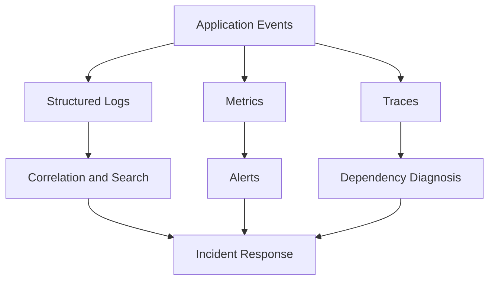

# Day 079 [Advanced]: Observability and Monitoring

## Index

- [Goal](#goal)
- [Prerequisites](#prerequisites)
- [Explanation](#explanation)
- [Topic by Topic](#topic-by-topic)
- [Key Concepts](#key-concepts)
- [Visual Concept Map](#visual-concept-map)
- [End-to-End Practical](#end-to-end-practical)
- [Hands-on Coding](#hands-on-coding)
- [Mini Exercise](#mini-exercise)
- [Assessment Quiz](#assessment-quiz)
- [Task](#task)
- [Self Check](#self-check)
- [Interview Questions and Answers](#interview-questions-and-answers)
- [Day 079 Outcome](#day-079-outcome)

## Goal

Build production-grade observability with logs, metrics, traces, and actionable alerting for Python services.

## Prerequisites

- Day 078 completed
- Basic understanding of backend services and deployments

## Explanation

Observability answers why systems fail and how to restore service quickly. It combines structured logs, service metrics, distributed tracing, and alert policies tied to user-impacting symptoms.

## Topic by Topic

### Topic 1: The Three Pillars

Theory:
Logs capture events, metrics quantify trends, traces show request journey.

Practical:
Implement all three for complete incident diagnosis.

Code Example:

```text
Pillars: Logs + Metrics + Traces
```

**Explanation:**
This topic explains The Three Pillars in a practical Python context so you can write clear, reliable, and maintainable programs for real-world tasks.

**Key Points:**
- Understand the core idea behind The Three Pillars.
- Apply the practical pattern with good readability and validation habits.
- Keep the solution maintainable, testable, and safe for production use where relevant.

### Topic 2: Structured Logging

Theory:
Structured JSON logs are easier to search and correlate.

Practical:
Include request_id, user_id, and service metadata.

Code Example:

```python
logger.info("order_created", extra={"request_id": rid, "order_id": oid})
```

**Explanation:**
This topic explains Structured Logging in a practical Python context so you can write clear, reliable, and maintainable programs for real-world tasks.

**Key Points:**
- Understand the core idea behind Structured Logging.
- Apply the practical pattern with good readability and validation habits.
- Keep the solution maintainable, testable, and safe for production use where relevant.

### Topic 3: Service Metrics and SLIs

Theory:
Metrics should map to service health and user experience.

Practical:
Track latency, error rate, throughput, and saturation.

Code Example:

```text
SLIs: p95 latency, 5xx rate, requests/sec, queue depth
```

**Explanation:**
This topic explains Service Metrics and SLIs in a practical Python context so you can write clear, reliable, and maintainable programs for real-world tasks.

**Key Points:**
- Understand the core idea behind Service Metrics and SLIs.
- Apply the practical pattern with good readability and validation habits.
- Keep the solution maintainable, testable, and safe for production use where relevant.

### Topic 4: Distributed Tracing

Theory:
Traces reveal cross-service bottlenecks and failures.

Practical:
Propagate correlation IDs and instrument critical spans.

Code Example:

```text
trace_id propagated from gateway to downstream workers
```

**Explanation:**
This topic explains Distributed Tracing in a practical Python context so you can write clear, reliable, and maintainable programs for real-world tasks.

**Key Points:**
- Understand the core idea behind Distributed Tracing.
- Apply the practical pattern with good readability and validation habits.
- Keep the solution maintainable, testable, and safe for production use where relevant.

### Topic 5: Alerting Strategy and On-call Signals

Theory:
Alert noise burns teams; alerts must be actionable.

Practical:
Alert on symptoms and SLO burn, not every warning.

Code Example:

```text
Alert: error_rate > 3% for 5m with traffic > baseline
```

**Explanation:**
This topic explains Alerting Strategy and On-call Signals in a practical Python context so you can write clear, reliable, and maintainable programs for real-world tasks.

**Key Points:**
- Understand the core idea behind Alerting Strategy and On-call Signals.
- Apply the practical pattern with good readability and validation habits.
- Keep the solution maintainable, testable, and safe for production use where relevant.

### Topic 6: Dashboards and Incident Workflow

Theory:
Dashboards should support diagnosis, not just decoration.

Practical:
Create runbook-linked panels for top endpoints and dependencies.

Code Example:

```text
Dashboard sections: API health, DB health, queue health, deployment markers
```

**Explanation:**
This topic explains Dashboards and Incident Workflow in a practical Python context so you can write clear, reliable, and maintainable programs for real-world tasks.

**Key Points:**
- Understand the core idea behind Dashboards and Incident Workflow.
- Apply the practical pattern with good readability and validation habits.
- Keep the solution maintainable, testable, and safe for production use where relevant.

## Key Concepts

- Observability requires logs, metrics, and traces together
- Structured logs improve searchability and correlation
- SLIs/SLOs define measurable reliability targets
- Good alerts are actionable and low-noise
- Dashboards should support real incident decisions
- Runbooks convert signals into repeatable response

## Visual Concept Map



## End-to-End Practical

1. Add structured logging with request IDs.
2. Instrument core metrics for API and queue.
3. Add trace propagation across two services.
4. Configure symptom-based alert rules.
5. Build one incident dashboard with runbook links.

## Hands-on Coding

### Example 1: Case - API Latency Monitoring

Scenario:
Track p95 latency and per-endpoint error rate.

```text
Export endpoint latency histogram and 5xx counters.
```

### Example 2: Case - Background Job Observability

Scenario:
Monitor queue lag and worker failure rate.

```text
Metrics: queue_depth, task_failures_total, worker_busy_ratio
```

### Example 3: Case - Incident Correlation

Scenario:
Link logs and traces using shared request_id for failed checkout flow.

```text
request_id=abc123 across gateway, payments, notifications
```

## Mini Exercise

Scenario:
Instrument one service with structured logs + 3 key metrics + trace IDs. Build a simple dashboard and one actionable alert.

Expected output:

- Searchable logs with correlation IDs
- Metrics showing health trends
- Alert rule tied to user-facing impact

## Assessment Quiz

### Quiz Questions

1. Why are plain text logs harder in production analysis?
2. What is one difference between SLI and SLO?
3. True or False: More alerts always improve reliability.
4. Why include deployment markers in dashboards?
5. What incident risk appears without trace propagation?

### Quiz Answers

1. They are harder to parse, filter, and correlate at scale
2. SLI is measurement; SLO is target threshold for that measurement
3. False
4. They help correlate behavior changes with releases
5. Root-cause investigation across services becomes slow and ambiguous

## Task

- Add baseline observability instrumentation to one Python app
- Define SLIs and one SLO-backed alert
- Document incident response steps in a short runbook

## Self Check

- You can instrument logs, metrics, and traces coherently
- You can design practical alerting that avoids noise
- You can build dashboards that speed incident recovery

## Interview Questions and Answers

### Beginner

**Question:** What is observability in simple terms?

**Answer:** The ability to understand internal system behavior from external signals.

**Question:** Why add request IDs to logs?

**Answer:** They let you follow one user request across many log entries/services.

### Middle

**Question:** What is a bad alerting practice?

**Answer:** Alerting on every warning without user-impact context, causing alert fatigue.

**Question:** Why combine logs with metrics?

**Answer:** Metrics show what changed; logs help explain why it changed.

### Advanced

**Question:** What anti-pattern appears in observability adoption?

**Answer:** Building dashboards first without defining SLIs, SLOs, and incident workflows.

**Question:** How do mature teams evolve observability programs?

**Answer:** They align telemetry to reliability goals, automate runbooks, and continuously tune alert quality.

## Day 079 Outcome

- You can implement practical observability foundations for Python services
- You can design low-noise monitoring and alert workflows
- You are ready to finish with CI/CD production automation on Day 080
