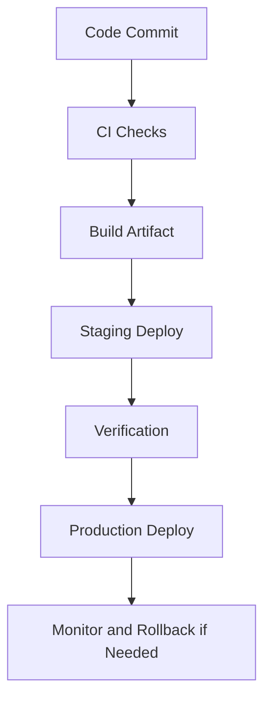

# Day 080 [Advanced]: CI CD for Python Projects

## Index

- [Goal](#goal)
- [Prerequisites](#prerequisites)
- [Explanation](#explanation)
- [Topic by Topic](#topic-by-topic)
- [Key Concepts](#key-concepts)
- [Visual Concept Map](#visual-concept-map)
- [End-to-End Practical](#end-to-end-practical)
- [Hands-on Coding](#hands-on-coding)
- [Mini Exercise](#mini-exercise)
- [Assessment Quiz](#assessment-quiz)
- [Task](#task)
- [Self Check](#self-check)
- [Interview Questions and Answers](#interview-questions-and-answers)
- [Day 080 Outcome](#day-080-outcome)

## Goal

Build reliable CI/CD pipelines for Python projects that automate quality checks, packaging, and safe deployments.

## Prerequisites

- Day 079 completed
- Working knowledge of tests, linting, packaging, and environment configs

## Explanation

CI/CD turns manual release steps into repeatable automation. Strong pipelines validate code quality, build artifacts, and deploy with guardrails like approvals, rollbacks, and environment promotion.

## Topic by Topic

### Topic 1: CI/CD Pipeline Architecture

Theory:
Typical stages are validate, build, test, package, deploy, verify.

Practical:
Design stage boundaries and artifact handoff clearly.

Code Example:

```text
Stages: lint -> unit tests -> build -> integration tests -> deploy
```

**Explanation:**
This topic explains CI/CD Pipeline Architecture in a practical Python context so you can write clear, reliable, and maintainable programs for real-world tasks.

**Key Points:**
- Understand the core idea behind CI/CD Pipeline Architecture.
- Apply the practical pattern with good readability and validation habits.
- Keep the solution maintainable, testable, and safe for production use where relevant.

### Topic 2: CI Quality Gates for Python

Theory:
Automated gates prevent regressions from merging.

Practical:
Run lint, type checks, and tests on every PR.

Code Example:

```bash
ruff check .
pytest -q
```

**Explanation:**
This topic explains CI Quality Gates for Python in a practical Python context so you can write clear, reliable, and maintainable programs for real-world tasks.

**Key Points:**
- Understand the core idea behind CI Quality Gates for Python.
- Apply the practical pattern with good readability and validation habits.
- Keep the solution maintainable, testable, and safe for production use where relevant.

### Topic 3: Build Artifacts and Dependency Reproducibility

Theory:
Reliable deploys depend on reproducible builds.

Practical:
Build wheel/sdist and pin dependency ranges intentionally.

Code Example:

```bash
python -m build
```

**Explanation:**
This topic explains Build Artifacts and Dependency Reproducibility in a practical Python context so you can write clear, reliable, and maintainable programs for real-world tasks.

**Key Points:**
- Understand the core idea behind Build Artifacts and Dependency Reproducibility.
- Apply the practical pattern with good readability and validation habits.
- Keep the solution maintainable, testable, and safe for production use where relevant.

### Topic 4: CD Strategy and Environment Promotion

Theory:
Deploying directly to prod from every change is risky.

Practical:
Promote artifacts through dev -> staging -> prod with checks.

Code Example:

```text
Promotion: same artifact digest across all environments
```

**Explanation:**
This topic explains CD Strategy and Environment Promotion in a practical Python context so you can write clear, reliable, and maintainable programs for real-world tasks.

**Key Points:**
- Understand the core idea behind CD Strategy and Environment Promotion.
- Apply the practical pattern with good readability and validation habits.
- Keep the solution maintainable, testable, and safe for production use where relevant.

### Topic 5: Release Safety, Rollback, and Feature Flags

Theory:
Even tested releases can fail in production.

Practical:
Use rollback plans, canary deployment, and feature flags.

Code Example:

```text
Rollback trigger: error rate > threshold for 10 minutes
```

**Explanation:**
This topic explains Release Safety, Rollback, and Feature Flags in a practical Python context so you can write clear, reliable, and maintainable programs for real-world tasks.

**Key Points:**
- Understand the core idea behind Release Safety, Rollback, and Feature Flags.
- Apply the practical pattern with good readability and validation habits.
- Keep the solution maintainable, testable, and safe for production use where relevant.

### Topic 6: Pipeline Security and Secrets in CI

Theory:
CI systems often hold powerful credentials and must be hardened.

Practical:
Use masked secrets, short-lived tokens, and least-privilege access.

Code Example:

```text
Never print secrets in job logs; use OIDC or scoped deploy tokens.
```

**Explanation:**
This topic explains Pipeline Security and Secrets in CI in a practical Python context so you can write clear, reliable, and maintainable programs for real-world tasks.

**Key Points:**
- Understand the core idea behind Pipeline Security and Secrets in CI.
- Apply the practical pattern with good readability and validation habits.
- Keep the solution maintainable, testable, and safe for production use where relevant.

## Key Concepts

- CI/CD is a reliability system, not only a convenience tool
- Quality gates enforce minimum standards before merge
- Artifact reproducibility enables confident promotions
- Progressive rollout and rollback reduce deployment risk
- Pipeline credentials need strict security controls
- Observability is required to validate post-deploy health

## Visual Concept Map



## End-to-End Practical

1. Configure CI for lint, test, and build.
2. Publish artifact to internal registry.
3. Deploy to staging automatically on main merge.
4. Run smoke tests and quality checks.
5. Promote to production with approval gate and rollback rule.

## Hands-on Coding

### Example 1: Case - PR Validation Pipeline

Scenario:
Block merge when lint or tests fail.

```text
Required checks: ruff, pytest, packaging build
```

### Example 2: Case - Staging Auto-Deploy

Scenario:
Deploy each main branch build to staging for quick feedback.

```text
Trigger: push to main
Action: deploy artifact to staging
```

### Example 3: Case - Production with Guardrails

Scenario:
Use manual approval and rollback automation based on metrics.

```text
If p95 latency doubles and 5xx spikes, auto rollback to last stable release.
```

## Mini Exercise

Scenario:
Design a CI/CD pipeline for one Python project in this curriculum with PR checks, package build, staging deploy, and production promotion plan.

Expected output:

- Pipeline stage diagram
- Quality gate checklist
- Deployment/rollback runbook summary

## Assessment Quiz

### Quiz Questions

1. Why are quality gates essential in CI?
2. What is the advantage of environment promotion using the same artifact?
3. True or False: CD should always deploy to production automatically after merge.
4. Why combine feature flags with deployment?
5. What security risk is common in CI pipelines?

### Quiz Answers

1. They prevent low-quality or broken changes from merging
2. It reduces environment drift and increases release confidence
3. False
4. To decouple deployment from user-facing feature exposure
5. Secret leakage or over-privileged deploy credentials

## Task

- Create a CI/CD blueprint for one Python service
- Add quality gates, artifact strategy, and deploy safety controls
- Document rollback triggers and operational responsibilities

## Self Check

- You can design end-to-end Python CI/CD pipelines
- You can enforce quality and security in automation flow
- You can plan safe progressive production releases

## Interview Questions and Answers

### Beginner

**Question:** What does CI mean in practice?

**Answer:** Automatically validating code changes with checks like linting and tests.

**Question:** Why use CD pipelines?

**Answer:** To deploy reliably and consistently with less manual error.

### Middle

**Question:** Why promote the same artifact across environments?

**Answer:** It ensures the tested build is exactly what reaches production.

**Question:** What is a common deployment safety pattern?

**Answer:** Canary rollout with monitored rollback thresholds.

### Advanced

**Question:** What anti-pattern appears in immature CI/CD setups?

**Answer:** Treating pipelines as optional scripts without ownership, versioning, or reliability metrics.

**Question:** How do high-performing teams evolve CI/CD maturity?

**Answer:** They enforce policy-as-code, automate provenance checks, and tie deployments to SLO-based verification.

## Day 080 Outcome

- You can design production-oriented CI/CD for Python projects
- You can automate quality, packaging, and safe release workflows
- You are ready to continue with larger capstone and system-design integration tracks
