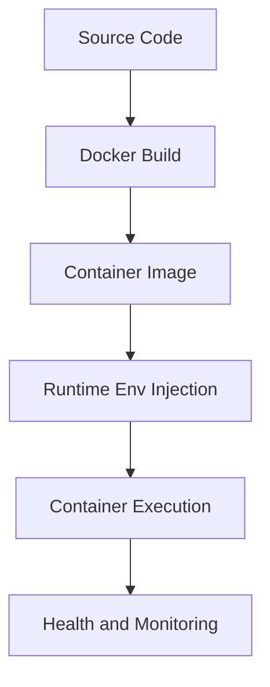

# Day 081 [Advanced]: Docker for Python Apps

## Index

- [Goal](#goal)
- [Prerequisites](#prerequisites)
- [Explanation](#explanation)
- [Topic by Topic](#topic-by-topic)
- [Key Concepts](#key-concepts)
- [Visual Concept Map](#visual-concept-map)
- [End-to-End Practical](#end-to-end-practical)
- [Hands-on Coding](#hands-on-coding)
- [Mini Exercise](#mini-exercise)
- [Assessment Quiz](#assessment-quiz)
- [Task](#task)
- [Self Check](#self-check)
- [Interview Questions and Answers](#interview-questions-and-answers)
- [Day 081 Outcome](#day-081-outcome)

## Goal

Containerize Python applications for consistent local, CI, and production runtime behavior with efficient Docker workflows.

## Prerequisites

- Day 080 completed
- Basic Linux command familiarity and Python packaging knowledge

## Explanation

Docker packages app code, dependencies, and runtime environment into a portable image. This eliminates machine drift and creates reproducible deployment units.

## Topic by Topic

### Topic 1: Docker Fundamentals for Python Services

Theory:
Images are immutable templates; containers are running instances.

Practical:
Start with minimal base image and explicit dependency installation.

Code Example:

```dockerfile
FROM python:3.12-slim
WORKDIR /app
COPY requirements.txt .
RUN pip install --no-cache-dir -r requirements.txt
COPY . .
CMD ["python", "main.py"]
```

**Explanation:**
This topic explains Docker Fundamentals for Python Services in a practical Python context so you can write clear, reliable, and maintainable programs for real-world tasks.

**Key Points:**
- Understand the core idea behind Docker Fundamentals for Python Services.
- Apply the practical pattern with good readability and validation habits.
- Keep the solution maintainable, testable, and safe for production use where relevant.

### Topic 2: Multi-stage Build and Image Optimization

Theory:
Smaller images improve security and deployment speed.

Practical:
Use multi-stage builds and cache layers intentionally.

Code Example:

```dockerfile
# build stage installs dependencies, runtime stage copies only needed artifacts
```

**Explanation:**
This topic explains Multi-stage Build and Image Optimization in a practical Python context so you can write clear, reliable, and maintainable programs for real-world tasks.

**Key Points:**
- Understand the core idea behind Multi-stage Build and Image Optimization.
- Apply the practical pattern with good readability and validation habits.
- Keep the solution maintainable, testable, and safe for production use where relevant.

### Topic 3: Environment Variables and Config Injection

Theory:
Container images should be environment-agnostic.

Practical:
Inject runtime config via env vars, not hardcoded values.

Code Example:

```bash
docker run -e APP_ENV=prod -e PORT=8080 myapp:1.0.0
```

**Explanation:**
This topic explains Environment Variables and Config Injection in a practical Python context so you can write clear, reliable, and maintainable programs for real-world tasks.

**Key Points:**
- Understand the core idea behind Environment Variables and Config Injection.
- Apply the practical pattern with good readability and validation habits.
- Keep the solution maintainable, testable, and safe for production use where relevant.

### Topic 4: Volumes, Networking, and Compose for Dev

Theory:
Real apps need DB/cache dependencies and networked services.

Practical:
Use docker-compose for local multi-service orchestration.

Code Example:

```yaml
services:
  api:
    build: .
  redis:
    image: redis:7
```

**Explanation:**
This topic explains Volumes, Networking, and Compose for Dev in a practical Python context so you can write clear, reliable, and maintainable programs for real-world tasks.

**Key Points:**
- Understand the core idea behind Volumes, Networking, and Compose for Dev.
- Apply the practical pattern with good readability and validation habits.
- Keep the solution maintainable, testable, and safe for production use where relevant.

### Topic 5: Healthchecks and Production Readiness

Theory:
Orchestrators need reliable health signals.

Practical:
Expose health endpoint and Docker HEALTHCHECK where relevant.

Code Example:

```dockerfile
HEALTHCHECK CMD curl -f http://localhost:8000/health || exit 1
```

**Explanation:**
This topic explains Healthchecks and Production Readiness in a practical Python context so you can write clear, reliable, and maintainable programs for real-world tasks.

**Key Points:**
- Understand the core idea behind Healthchecks and Production Readiness.
- Apply the practical pattern with good readability and validation habits.
- Keep the solution maintainable, testable, and safe for production use where relevant.

### Topic 6: Security Hardening Basics

Theory:
Default container settings can be overly permissive.

Practical:
Use non-root user, pinned dependencies, and minimal base image.

Code Example:

```dockerfile
RUN useradd -m appuser
USER appuser
```

**Explanation:**
This topic explains Security Hardening Basics in a practical Python context so you can write clear, reliable, and maintainable programs for real-world tasks.

**Key Points:**
- Understand the core idea behind Security Hardening Basics.
- Apply the practical pattern with good readability and validation habits.
- Keep the solution maintainable, testable, and safe for production use where relevant.

## Key Concepts

- Docker ensures environment consistency across stages
- Layer and base-image choices affect size and speed
- Runtime config should be externalized
- Compose improves local multi-service development
- Health signals are critical for automated recovery
- Container security starts with least privilege

## Visual Concept Map



## End-to-End Practical

1. Create Dockerfile for Python API.
2. Build and run image locally.
3. Add env-based configuration.
4. Add Redis/DB via compose.
5. Harden image with non-root runtime and healthcheck.

## Hands-on Coding

### Example 1: Case - FastAPI Containerization

Scenario:
Containerize a FastAPI app and expose port 8000.

```bash
docker build -t fastapi-app:dev .
docker run -p 8000:8000 fastapi-app:dev
```

### Example 2: Case - Local Stack with Compose

Scenario:
Run API + Postgres + Redis for local integration testing.

```bash
docker compose up --build
```

### Example 3: Case - Lean Production Image

Scenario:
Reduce image size and attack surface with slim runtime stage.

```text
Use multi-stage build and copy only app + deps.
```

## Mini Exercise

Scenario:
Containerize one curriculum project with Dockerfile + compose file. Add health endpoint and run all dependencies together.

Expected output:

- Working image build/run workflow
- Multi-service local stack via compose
- Basic security and health hardening

## Assessment Quiz

### Quiz Questions

1. Why avoid installing dependencies on every container startup?
2. What is one benefit of multi-stage builds?
3. True or False: Running container as root is acceptable by default.
4. Why should config be injected at runtime?
5. What does a healthcheck enable in orchestration systems?

### Quiz Answers

1. It slows startup and makes runtime behavior less reproducible
2. Smaller, cleaner production images
3. False
4. Same image can safely run across different environments
5. Automated restart and traffic routing decisions

## Task

- Build a production-style Docker image for one Python app
- Add compose setup for local dependencies
- Implement non-root runtime and health checks

## Self Check

- You can containerize Python services reliably
- You can optimize image size and security posture
- You can run local multi-service stacks reproducibly

## Interview Questions and Answers

### Beginner

**Question:** Why use Docker for Python apps?

**Answer:** It ensures the app runs consistently across machines and environments.

**Question:** What is an image vs container?

**Answer:** Image is a template; container is a running instance of that template.

### Middle

**Question:** Why is layer ordering important in Dockerfile?

**Answer:** It affects build cache efficiency and build times.

**Question:** What is a common Docker anti-pattern for Python apps?

**Answer:** Copying full source before dependency install, breaking build cache reuse.

### Advanced

**Question:** How do teams harden container supply chains?

**Answer:** They pin base images, scan vulnerabilities, sign artifacts, and enforce policy gates in CI.

**Question:** What tradeoff exists between image minimalism and debugging convenience?

**Answer:** Minimal images are safer and smaller, but may require separate debug tooling workflows.

## Day 081 Outcome

- You can package Python services into production-ready Docker images
- You can design container workflows for local and deployment use
- You are ready for Kubernetes fundamentals on Day 082
