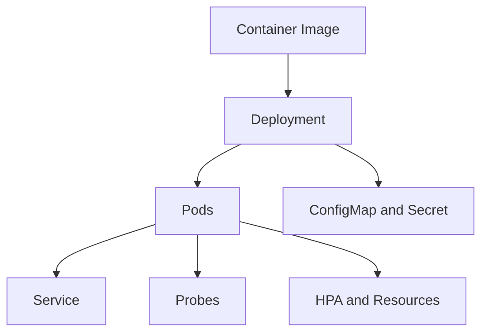

# Day 082 [Advanced]: Kubernetes Basics for Python Services

## Index

- [Goal](#goal)
- [Prerequisites](#prerequisites)
- [Explanation](#explanation)
- [Topic by Topic](#topic-by-topic)
- [Key Concepts](#key-concepts)
- [Visual Concept Map](#visual-concept-map)
- [End-to-End Practical](#end-to-end-practical)
- [Hands-on Coding](#hands-on-coding)
- [Mini Exercise](#mini-exercise)
- [Assessment Quiz](#assessment-quiz)
- [Task](#task)
- [Self Check](#self-check)
- [Interview Questions and Answers](#interview-questions-and-answers)
- [Day 082 Outcome](#day-082-outcome)

## Goal

Deploy and operate Python services on Kubernetes using core primitives for scaling, resilience, and controlled rollout.

## Prerequisites

- Day 081 completed
- Comfortable with Docker images and container runtime basics

## Explanation

Kubernetes orchestrates containers across a cluster. It handles service discovery, horizontal scaling, rollout strategies, and self-healing when pods fail.

## Topic by Topic

### Topic 1: Core Kubernetes Objects

Theory:
Pods run containers, Deployments manage replica sets, Services expose workloads.

Practical:
Map each app concern to the right object.

Code Example:

```yaml
kind: Deployment
metadata:
  name: orders-api
```

**Explanation:**
This topic explains Core Kubernetes Objects in a practical Python context so you can write clear, reliable, and maintainable programs for real-world tasks.

**Key Points:**
- Understand the core idea behind Core Kubernetes Objects.
- Apply the practical pattern with good readability and validation habits.
- Keep the solution maintainable, testable, and safe for production use where relevant.

### Topic 2: Deployment and Rolling Updates

Theory:
Deployments support zero-downtime rollout with rollback support.

Practical:
Use image tags and rollout status checks.

Code Example:

```bash
kubectl rollout status deployment/orders-api
```

**Explanation:**
This topic explains Deployment and Rolling Updates in a practical Python context so you can write clear, reliable, and maintainable programs for real-world tasks.

**Key Points:**
- Understand the core idea behind Deployment and Rolling Updates.
- Apply the practical pattern with good readability and validation habits.
- Keep the solution maintainable, testable, and safe for production use where relevant.

### Topic 3: ConfigMap and Secret Integration

Theory:
Runtime settings belong outside images.

Practical:
Inject config via ConfigMap and sensitive data via Secret.

Code Example:

```yaml
envFrom:
  - configMapRef:
      name: orders-config
```

**Explanation:**
This topic explains ConfigMap and Secret Integration in a practical Python context so you can write clear, reliable, and maintainable programs for real-world tasks.

**Key Points:**
- Understand the core idea behind ConfigMap and Secret Integration.
- Apply the practical pattern with good readability and validation habits.
- Keep the solution maintainable, testable, and safe for production use where relevant.

### Topic 4: Probes and Health-driven Traffic

Theory:
Liveness, readiness, and startup probes control restart and traffic behavior.

Practical:
Use dedicated health endpoints from Python service.

Code Example:

```yaml
readinessProbe:
  httpGet:
    path: /health
    port: 8000
```

**Explanation:**
This topic explains Probes and Health-driven Traffic in a practical Python context so you can write clear, reliable, and maintainable programs for real-world tasks.

**Key Points:**
- Understand the core idea behind Probes and Health-driven Traffic.
- Apply the practical pattern with good readability and validation habits.
- Keep the solution maintainable, testable, and safe for production use where relevant.

### Topic 5: Autoscaling and Resource Limits

Theory:
Requests/limits protect cluster stability; HPA scales based on metrics.

Practical:
Set realistic CPU/memory values and tune over time.

Code Example:

```yaml
resources:
  requests:
    cpu: "200m"
    memory: "256Mi"
```

**Explanation:**
This topic explains Autoscaling and Resource Limits in a practical Python context so you can write clear, reliable, and maintainable programs for real-world tasks.

**Key Points:**
- Understand the core idea behind Autoscaling and Resource Limits.
- Apply the practical pattern with good readability and validation habits.
- Keep the solution maintainable, testable, and safe for production use where relevant.

### Topic 6: Debugging and Operational Basics

Theory:
Operational confidence requires quick diagnosis workflows.

Practical:
Use logs, describe, events, and rollout history during incidents.

Code Example:

```bash
kubectl logs deploy/orders-api
kubectl describe pod <pod-name>
```

**Explanation:**
This topic explains Debugging and Operational Basics in a practical Python context so you can write clear, reliable, and maintainable programs for real-world tasks.

**Key Points:**
- Understand the core idea behind Debugging and Operational Basics.
- Apply the practical pattern with good readability and validation habits.
- Keep the solution maintainable, testable, and safe for production use where relevant.

## Key Concepts

- Kubernetes primitives each solve distinct runtime concerns
- Rolling updates and rollback are core release safety tools
- Config and secrets should be cluster-managed
- Probe configuration directly impacts availability
- Resource governance and autoscaling must be tuned
- Operational tooling and observability remain essential

## Visual Concept Map



## End-to-End Practical

1. Build and push Python app image.
2. Create Deployment and Service manifests.
3. Attach ConfigMap/Secret for settings.
4. Add readiness/liveness probes.
5. Apply autoscaling and verify rollout behavior.

## Hands-on Coding

### Example 1: Case - FastAPI Deployment

Scenario:
Deploy FastAPI app with three replicas and service exposure.

```bash
kubectl apply -f k8s/deployment.yaml
kubectl apply -f k8s/service.yaml
```

### Example 2: Case - Safe Config Change

Scenario:
Update ConfigMap and roll deployment restart.

```bash
kubectl rollout restart deployment/orders-api
```

### Example 3: Case - Scale under Load

Scenario:
Enable HPA and observe replica changes with synthetic traffic.

```bash
kubectl get hpa -w
```

## Mini Exercise

Scenario:
Deploy one curriculum project to local Kubernetes (kind/minikube) with Deployment, Service, probes, ConfigMap, and resource limits.

Expected output:

- Working Kubernetes manifests
- Successful health-aware rollout
- Basic scaling and logs verification

## Assessment Quiz

### Quiz Questions

1. Why separate Deployment and Service responsibilities?
2. What does readiness probe control?
3. True or False: Resource limits are optional in production.
4. Why use ConfigMap instead of hardcoding config in image?
5. What command helps inspect rollout failure quickly?

### Quiz Answers

1. Deployment manages pods; Service manages stable network access
2. Whether a pod should receive traffic
3. False
4. It decouples environment configuration from build artifacts
5. kubectl rollout status and kubectl describe

## Task

- Containerize and deploy one Python service on Kubernetes
- Add health probes, resource policy, and config integration
- Validate rollout, logs, and scale behavior

## Self Check

- You can deploy Python workloads using core Kubernetes objects
- You can configure runtime safety via probes and resources
- You can troubleshoot common deployment issues

## Interview Questions and Answers

### Beginner

**Question:** What is a Kubernetes pod?

**Answer:** The smallest deployable unit running one or more containers.

**Question:** Why use a Service object?

**Answer:** It provides stable networking to a changing set of pods.

### Middle

**Question:** What is a common probe misconfiguration risk?

**Answer:** Aggressive probe timing can cause restart loops and false downtime.

**Question:** Why define resource requests?

**Answer:** They help scheduler place workloads and avoid resource starvation.

### Advanced

**Question:** What anti-pattern appears in Kubernetes onboarding?

**Answer:** Treating manifests as static files without considering rollout strategy, observability, and capacity constraints.

**Question:** How do mature teams manage Kubernetes manifests at scale?

**Answer:** They use templating/policy validation, environment overlays, and automated drift detection.

## Day 082 Outcome

- You can deploy and operate Python services on Kubernetes
- You can use probes, config, and scaling for runtime reliability
- You are ready to apply design patterns effectively on Day 083
