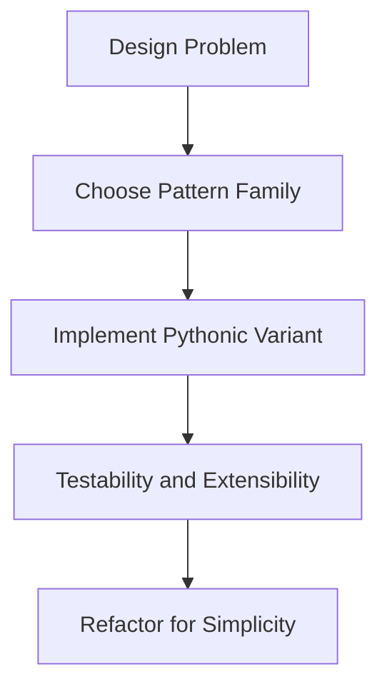

# Day 083 [Advanced]: Design Patterns in Python

## Index

- [Goal](#goal)
- [Prerequisites](#prerequisites)
- [Explanation](#explanation)
- [Topic by Topic](#topic-by-topic)
- [Key Concepts](#key-concepts)
- [Visual Concept Map](#visual-concept-map)
- [End-to-End Practical](#end-to-end-practical)
- [Hands-on Coding](#hands-on-coding)
- [Mini Exercise](#mini-exercise)
- [Assessment Quiz](#assessment-quiz)
- [Task](#task)
- [Self Check](#self-check)
- [Interview Questions and Answers](#interview-questions-and-answers)
- [Day 083 Outcome](#day-083-outcome)

## Goal

Apply design patterns idiomatically in Python to improve extensibility, maintainability, and testability of real systems.

## Prerequisites

- Day 082 completed
- Good understanding of object-oriented Python and modular project structure

## Explanation

Design patterns are reusable solution templates for recurring design problems. In Python, patterns should be adapted to language features rather than copied mechanically from other ecosystems.

## Topic by Topic

### Topic 1: Pattern Selection Mindset

Theory:
Choose patterns based on pressure points: flexibility, testability, and coupling.

Practical:
Avoid pattern overuse when simple functions/classes are enough.

Code Example:

```text
Problem first, pattern second.
```

**Explanation:**
This topic explains Pattern Selection Mindset in a practical Python context so you can write clear, reliable, and maintainable programs for real-world tasks.

**Key Points:**
- Understand the core idea behind Pattern Selection Mindset.
- Apply the practical pattern with good readability and validation habits.
- Keep the solution maintainable, testable, and safe for production use where relevant.

### Topic 2: Creational Patterns (Factory, Builder)

Theory:
Creational patterns hide object creation complexity.

Practical:
Use Factory for plugin-like behavior and Builder for multi-step construction.

Code Example:

```python
def payment_gateway(kind: str):
  return StripeGateway() if kind == "stripe" else RazorpayGateway()
```

**Explanation:**
This topic explains Creational Patterns (Factory, Builder) in a practical Python context so you can write clear, reliable, and maintainable programs for real-world tasks.

**Key Points:**
- Understand the core idea behind Creational Patterns (Factory, Builder).
- Apply the practical pattern with good readability and validation habits.
- Keep the solution maintainable, testable, and safe for production use where relevant.

### Topic 3: Structural Patterns (Adapter, Facade)

Theory:
Structural patterns simplify or standardize external dependencies.

Practical:
Use Adapter to normalize third-party APIs.

Code Example:

```python
class SmsAdapter:
  def __init__(self, provider):
    self.provider = provider

  def send(self, number: str, text: str):
    return self.provider.dispatch(number, text)
```

**Explanation:**
This topic explains Structural Patterns (Adapter, Facade) in a practical Python context so you can write clear, reliable, and maintainable programs for real-world tasks.

**Key Points:**
- Understand the core idea behind Structural Patterns (Adapter, Facade).
- Apply the practical pattern with good readability and validation habits.
- Keep the solution maintainable, testable, and safe for production use where relevant.

### Topic 4: Behavioral Patterns (Strategy, Observer)

Theory:
Behavioral patterns encapsulate changing logic and event flows.

Practical:
Use Strategy for algorithm switching at runtime.

Code Example:

```python
class DiscountStrategy:
  def apply(self, total: float) -> float:
    raise NotImplementedError
```

**Explanation:**
This topic explains Behavioral Patterns (Strategy, Observer) in a practical Python context so you can write clear, reliable, and maintainable programs for real-world tasks.

**Key Points:**
- Understand the core idea behind Behavioral Patterns (Strategy, Observer).
- Apply the practical pattern with good readability and validation habits.
- Keep the solution maintainable, testable, and safe for production use where relevant.

### Topic 5: Dependency Injection and Inversion

Theory:
Concrete dependencies create tight coupling and brittle tests.

Practical:
Inject abstractions into services for easier testing.

Code Example:

```python
class OrderService:
  def __init__(self, payment_client):
    self.payment_client = payment_client
```

**Explanation:**
This topic explains Dependency Injection and Inversion in a practical Python context so you can write clear, reliable, and maintainable programs for real-world tasks.

**Key Points:**
- Understand the core idea behind Dependency Injection and Inversion.
- Apply the practical pattern with good readability and validation habits.
- Keep the solution maintainable, testable, and safe for production use where relevant.

### Topic 6: Pattern Anti-patterns

Theory:
Over-engineering with too many abstractions reduces clarity.

Practical:
Refactor toward simpler design when complexity no longer pays off.

Code Example:

```text
Avoid creating interfaces for every class without a real variation need.
```

**Explanation:**
This topic explains Pattern Anti-patterns in a practical Python context so you can write clear, reliable, and maintainable programs for real-world tasks.

**Key Points:**
- Understand the core idea behind Pattern Anti-patterns.
- Apply the practical pattern with good readability and validation habits.
- Keep the solution maintainable, testable, and safe for production use where relevant.

## Key Concepts

- Pattern usage should be problem-driven
- Pythonic implementation often prefers lightweight abstractions
- Strategy/Adapter/Factory solve frequent backend design needs
- Dependency inversion improves testability and modularity
- Patterns introduce tradeoffs and should be reviewed over time
- Simplicity remains a first-class design goal

## Visual Concept Map



## End-to-End Practical

1. Identify one tightly coupled service.
2. Introduce Strategy for variable business logic.
3. Add Adapter around one external dependency.
4. Inject dependencies for easier testing.
5. Evaluate complexity vs maintainability tradeoff.

## Hands-on Coding

### Example 1: Case - Payment Provider Strategy

Scenario:
Switch payment provider without changing order workflow.

```python
provider = payment_gateway(config.provider)
provider.charge(order_id, amount)
```

### Example 2: Case - Notification Adapter

Scenario:
Unify SMS and email provider interfaces behind one abstraction.

```python
notifier.send(user.contact, message)
```

### Example 3: Case - Service Facade

Scenario:
Expose simplified API for a multi-step onboarding workflow.

```python
onboarding.create_account_and_send_welcome(payload)
```

## Mini Exercise

Scenario:
Refactor one mini-project module using two patterns (for example Strategy + Adapter) and add tests showing improved extensibility.

Expected output:

- Before/after architecture notes
- Pattern-based implementation
- Passing tests for variant behavior

## Assessment Quiz

### Quiz Questions

1. Why can design patterns hurt if applied blindly?
2. What problem does Strategy pattern solve?
3. True or False: Adapter pattern changes third-party code directly.
4. Why inject dependencies in services?
5. What is one sign of over-engineering?

### Quiz Answers

1. They can add unnecessary complexity and indirection
2. Runtime selection among interchangeable behaviors
3. False
4. Better testability and lower coupling
5. Too many abstractions with minimal real variation

## Task

- Apply at least two patterns in one project module
- Demonstrate improved flexibility with tests
- Document tradeoffs and when not to use those patterns

## Self Check

- You can choose patterns based on design pressure points
- You can implement patterns idiomatically in Python
- You can keep balance between flexibility and simplicity

## Interview Questions and Answers

### Beginner

**Question:** What is a design pattern?

**Answer:** A reusable template for solving common software design problems.

**Question:** Why not always use patterns everywhere?

**Answer:** Extra abstraction can increase complexity without clear value.

### Middle

**Question:** When is Strategy better than if/else chains?

**Answer:** When multiple algorithms evolve independently and need clean extension.

**Question:** How does Adapter help integration work?

**Answer:** It normalizes incompatible interfaces and isolates vendor-specific details.

### Advanced

**Question:** What anti-pattern is common in enterprise Python codebases?

**Answer:** Java-style abstraction layers replicated mechanically without Pythonic simplification.

**Question:** How do mature teams evaluate pattern ROI?

**Answer:** They measure change cost, test isolation, onboarding clarity, and defect trends.

## Day 083 Outcome

- You can apply design patterns effectively in Python systems
- You can refactor toward modular and testable architecture
- You are ready for clean architecture boundaries on Day 084
