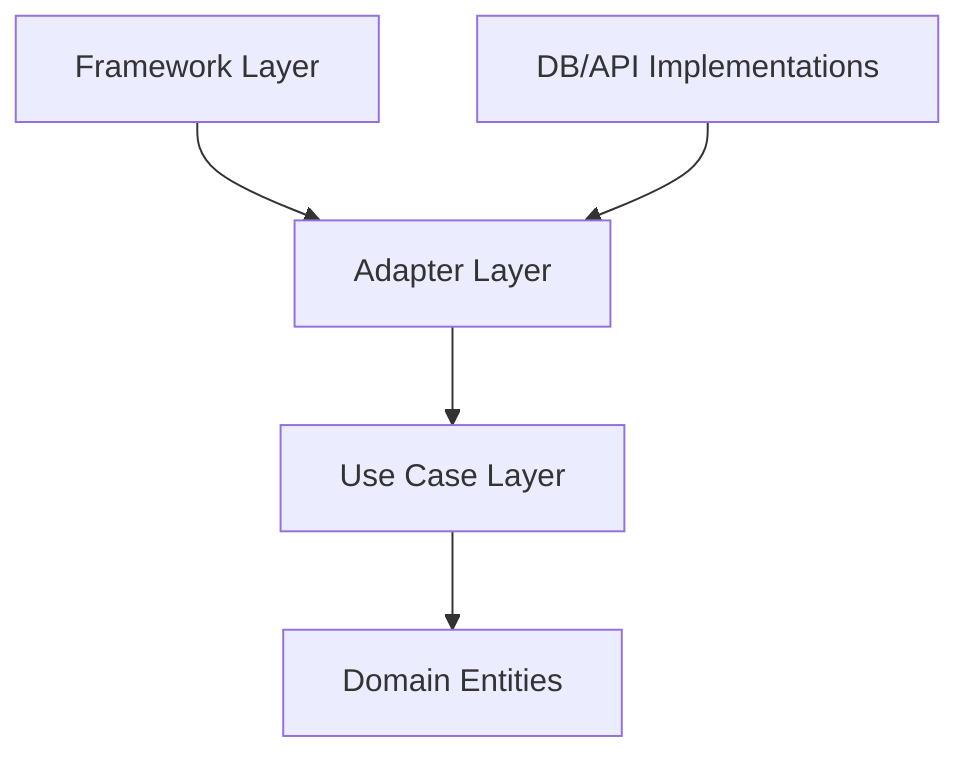

# Day 084 [Advanced]: Clean Architecture in Python

## Index

- [Goal](#goal)
- [Prerequisites](#prerequisites)
- [Explanation](#explanation)
- [Topic by Topic](#topic-by-topic)
- [Key Concepts](#key-concepts)
- [Visual Concept Map](#visual-concept-map)
- [End-to-End Practical](#end-to-end-practical)
- [Hands-on Coding](#hands-on-coding)
- [Mini Exercise](#mini-exercise)
- [Assessment Quiz](#assessment-quiz)
- [Task](#task)
- [Self Check](#self-check)
- [Interview Questions and Answers](#interview-questions-and-answers)
- [Day 084 Outcome](#day-084-outcome)

## Goal

Design Python systems using Clean Architecture principles so business logic stays independent from frameworks and infrastructure.

## Prerequisites

- Day 083 completed
- Comfortable with service layers and dependency injection basics

## Explanation

Clean Architecture separates core domain logic from external concerns. This improves testability, change safety, and portability across databases, frameworks, and delivery channels.

## Topic by Topic

### Topic 1: Layered Boundaries and Dependency Rule

Theory:
Dependencies should point inward toward business rules.

Practical:
Core domain must not import framework-specific modules.

Code Example:

```text
Domain <- Use Cases <- Interface Adapters <- Frameworks
```

**Explanation:**
This topic explains Layered Boundaries and Dependency Rule in a practical Python context so you can write clear, reliable, and maintainable programs for real-world tasks.

**Key Points:**
- Understand the core idea behind Layered Boundaries and Dependency Rule.
- Apply the practical pattern with good readability and validation habits.
- Keep the solution maintainable, testable, and safe for production use where relevant.

### Topic 2: Entities and Use Cases

Theory:
Entities represent core business concepts; use cases orchestrate business actions.

Practical:
Keep business invariants inside entities/use cases.

Code Example:

```python
class Order:
  def __init__(self, total: float):
    if total <= 0:
      raise ValueError("total must be positive")
    self.total = total
```

**Explanation:**
This topic explains Entities and Use Cases in a practical Python context so you can write clear, reliable, and maintainable programs for real-world tasks.

**Key Points:**
- Understand the core idea behind Entities and Use Cases.
- Apply the practical pattern with good readability and validation habits.
- Keep the solution maintainable, testable, and safe for production use where relevant.

### Topic 3: Ports and Adapters

Theory:
Ports define required behavior; adapters implement details for DB/API/files.

Practical:
Use protocol/interface abstractions between use cases and external services.

Code Example:

```python
class OrderRepositoryPort:
  def save(self, order):
    raise NotImplementedError
```

**Explanation:**
This topic explains Ports and Adapters in a practical Python context so you can write clear, reliable, and maintainable programs for real-world tasks.

**Key Points:**
- Understand the core idea behind Ports and Adapters.
- Apply the practical pattern with good readability and validation habits.
- Keep the solution maintainable, testable, and safe for production use where relevant.

### Topic 4: Framework Isolation

Theory:
Web frameworks should be thin delivery mechanisms.

Practical:
Controllers/route handlers call use cases and map I/O only.

Code Example:

```python
def create_order_handler(payload):
  return create_order_use_case.execute(payload)
```

**Explanation:**
This topic explains Framework Isolation in a practical Python context so you can write clear, reliable, and maintainable programs for real-world tasks.

**Key Points:**
- Understand the core idea behind Framework Isolation.
- Apply the practical pattern with good readability and validation habits.
- Keep the solution maintainable, testable, and safe for production use where relevant.

### Topic 5: Testing by Layer

Theory:
Each layer benefits from targeted tests.

Practical:
Use unit tests for domain/use cases, integration tests for adapters.

Code Example:

```text
Unit: use-case logic with fake repository
Integration: real DB adapter behavior
```

**Explanation:**
This topic explains Testing by Layer in a practical Python context so you can write clear, reliable, and maintainable programs for real-world tasks.

**Key Points:**
- Understand the core idea behind Testing by Layer.
- Apply the practical pattern with good readability and validation habits.
- Keep the solution maintainable, testable, and safe for production use where relevant.

### Topic 6: Tradeoffs and Migration Strategy

Theory:
Clean Architecture adds abstraction overhead.

Practical:
Adopt incrementally where change frequency and complexity justify it.

Code Example:

```text
Start by extracting one high-churn use case behind a port.
```

**Explanation:**
This topic explains Tradeoffs and Migration Strategy in a practical Python context so you can write clear, reliable, and maintainable programs for real-world tasks.

**Key Points:**
- Understand the core idea behind Tradeoffs and Migration Strategy.
- Apply the practical pattern with good readability and validation habits.
- Keep the solution maintainable, testable, and safe for production use where relevant.

## Key Concepts

- Dependency rule protects business logic from infrastructure churn
- Entities/use cases capture domain behavior cleanly
- Ports/adapters isolate integrations
- Thin framework layer improves maintainability
- Layered testing increases confidence and speed
- Apply architecture depth proportional to project complexity

## Visual Concept Map



## End-to-End Practical

1. Identify one business workflow in existing app.
2. Define entity and use case for that workflow.
3. Create repository port interface.
4. Implement DB adapter for the port.
5. Update route/controller to use the use case.

## Hands-on Coding

### Example 1: Case - Order Creation Use Case

Scenario:
Move order validation and creation logic from route into use case class.

```python
class CreateOrderUseCase:
  def __init__(self, repo):
    self.repo = repo
```

### Example 2: Case - Adapter Swap

Scenario:
Switch from in-memory repository to PostgreSQL adapter without changing use case.

```text
Use case depends on port, not concrete database client.
```

### Example 3: Case - Framework-independent Unit Test

Scenario:
Test business behavior using fake repository with no FastAPI import.

```python
def test_create_order_rejects_zero_total():
  ...
```

## Mini Exercise

Scenario:
Refactor one mini project into clean layers: domain, use case, adapter, framework entry point. Add tests for use case and adapter.

Expected output:

- Layered project structure
- Ports/adapters for at least one dependency
- Unit and integration test coverage

## Assessment Quiz

### Quiz Questions

1. What is the dependency rule in Clean Architecture?
2. Why should route handlers be thin?
3. True or False: Domain entities can directly import ORM models.
4. What benefit do ports provide?
5. When might clean layering be unnecessary?

### Quiz Answers

1. Dependencies should point inward toward core business logic
2. To keep business rules framework-agnostic and testable
3. False
4. They decouple use cases from concrete infrastructure
5. In very small low-change scripts where complexity overhead outweighs value

## Task

- Refactor one module using clean architecture boundaries
- Add port abstraction and one concrete adapter implementation
- Add tests validating domain/use-case independence

## Self Check

- You can separate business logic from technical details
- You can design ports/adapters in Python effectively
- You can reason about architecture tradeoffs pragmatically

## Interview Questions and Answers

### Beginner

**Question:** What is Clean Architecture in one line?

**Answer:** A design approach that keeps business logic independent from frameworks and infrastructure.

**Question:** Why isolate domain logic?

**Answer:** So core behavior remains stable when external tools change.

### Middle

**Question:** How do ports improve maintainability?

**Answer:** They allow swapping implementations without changing core use cases.

**Question:** What is a common migration approach to clean architecture?

**Answer:** Incrementally extract high-change workflows rather than full rewrite.

### Advanced

**Question:** What anti-pattern appears when applying clean architecture dogmatically?

**Answer:** Creating excessive abstraction layers for trivial logic, reducing development velocity.

**Question:** How do teams decide architecture depth?

**Answer:** Based on system lifetime, change frequency, team size, and integration volatility.

## Day 084 Outcome

- You can structure Python systems with clean architecture principles
- You can isolate business logic for long-term maintainability
- You are ready for DDD foundational concepts on Day 085
