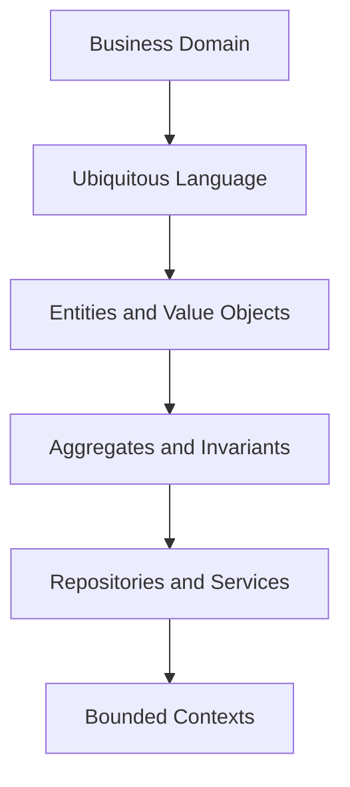

# Day 085 [Advanced]: Domain Driven Design Introduction

## Index

- [Goal](#goal)
- [Prerequisites](#prerequisites)
- [Explanation](#explanation)
- [Topic by Topic](#topic-by-topic)
- [Key Concepts](#key-concepts)
- [Visual Concept Map](#visual-concept-map)
- [End-to-End Practical](#end-to-end-practical)
- [Hands-on Coding](#hands-on-coding)
- [Mini Exercise](#mini-exercise)
- [Assessment Quiz](#assessment-quiz)
- [Task](#task)
- [Self Check](#self-check)
- [Interview Questions and Answers](#interview-questions-and-answers)
- [Day 085 Outcome](#day-085-outcome)

## Goal

Understand and apply Domain-Driven Design foundations to model complex business domains in Python systems.

## Prerequisites

- Day 084 completed
- Familiarity with clean architecture and service-layer design

## Explanation

DDD focuses software design around business domain understanding. It introduces shared language and domain model patterns that reduce mismatch between code and real business behavior.

## Topic by Topic

### Topic 1: Ubiquitous Language

Theory:
Engineering and domain experts should share a common vocabulary.

Practical:
Use business terms directly in code, docs, and tests.

Code Example:

```text
Use "Order", "Shipment", "Invoice" instead of generic "Data" objects.
```

**Explanation:**
This topic explains Ubiquitous Language in a practical Python context so you can write clear, reliable, and maintainable programs for real-world tasks.

**Key Points:**
- Understand the core idea behind Ubiquitous Language.
- Apply the practical pattern with good readability and validation habits.
- Keep the solution maintainable, testable, and safe for production use where relevant.

### Topic 2: Entities and Value Objects

Theory:
Entities have identity over time; value objects are immutable descriptive values.

Practical:
Model domain rules in these building blocks.

Code Example:

```python
class Money:
  def __init__(self, amount: float, currency: str):
    self.amount = amount
    self.currency = currency
```

**Explanation:**
This topic explains Entities and Value Objects in a practical Python context so you can write clear, reliable, and maintainable programs for real-world tasks.

**Key Points:**
- Understand the core idea behind Entities and Value Objects.
- Apply the practical pattern with good readability and validation habits.
- Keep the solution maintainable, testable, and safe for production use where relevant.

### Topic 3: Aggregates and Invariants

Theory:
Aggregates enforce transactional consistency boundaries.

Practical:
Guard business invariants inside aggregate roots.

Code Example:

```python
class OrderAggregate:
  def add_item(self, item):
    if self.status == "PAID":
      raise ValueError("Cannot modify paid order")
```

**Explanation:**
This topic explains Aggregates and Invariants in a practical Python context so you can write clear, reliable, and maintainable programs for real-world tasks.

**Key Points:**
- Understand the core idea behind Aggregates and Invariants.
- Apply the practical pattern with good readability and validation habits.
- Keep the solution maintainable, testable, and safe for production use where relevant.

### Topic 4: Repositories and Domain Services

Theory:
Repositories abstract persistence; domain services host cross-entity logic.

Practical:
Keep repository interfaces domain-focused.

Code Example:

```python
class OrderRepository:
  def by_id(self, order_id):
    raise NotImplementedError
```

**Explanation:**
This topic explains Repositories and Domain Services in a practical Python context so you can write clear, reliable, and maintainable programs for real-world tasks.

**Key Points:**
- Understand the core idea behind Repositories and Domain Services.
- Apply the practical pattern with good readability and validation habits.
- Keep the solution maintainable, testable, and safe for production use where relevant.

### Topic 5: Bounded Contexts and Context Mapping

Theory:
Large domains contain subdomains with different models.

Practical:
Define clear context boundaries and integration contracts.

Code Example:

```text
Billing context != Fulfillment context; integrate via explicit events/API.
```

**Explanation:**
This topic explains Bounded Contexts and Context Mapping in a practical Python context so you can write clear, reliable, and maintainable programs for real-world tasks.

**Key Points:**
- Understand the core idea behind Bounded Contexts and Context Mapping.
- Apply the practical pattern with good readability and validation habits.
- Keep the solution maintainable, testable, and safe for production use where relevant.

### Topic 6: DDD Adoption Strategy

Theory:
DDD is most useful where business complexity is high.

Practical:
Start with one core domain and iterate modeling depth.

Code Example:

```text
Pilot DDD in highest-change domain before broader rollout.
```

**Explanation:**
This topic explains DDD Adoption Strategy in a practical Python context so you can write clear, reliable, and maintainable programs for real-world tasks.

**Key Points:**
- Understand the core idea behind DDD Adoption Strategy.
- Apply the practical pattern with good readability and validation habits.
- Keep the solution maintainable, testable, and safe for production use where relevant.

## Key Concepts

- Ubiquitous language aligns code with business understanding
- Entities, value objects, and aggregates shape domain model quality
- Repository abstractions protect domain from persistence details
- Bounded contexts reduce model confusion at scale
- DDD depth should match domain complexity
- Strategic and tactical patterns should evolve incrementally

## Visual Concept Map



## End-to-End Practical

1. Choose one domain area with complex rules.
2. Define ubiquitous language glossary.
3. Model entities, value objects, and aggregate root.
4. Add repository interface and use-case orchestration.
5. Document bounded context boundaries and integrations.

## Hands-on Coding

### Example 1: Case - Order Domain Modeling

Scenario:
Model order lifecycle with invariant checks.

```python
class OrderStatus:
  CREATED = "created"
  PAID = "paid"
```

### Example 2: Case - Value Object for Address

Scenario:
Encapsulate shipping address validation in value object.

```python
class Address:
  def __init__(self, city: str, pincode: str):
    if not city:
      raise ValueError("city required")
```

### Example 3: Case - Context Integration Event

Scenario:
Publish domain event when order is paid to notify fulfillment context.

```text
Event: OrderPaid(order_id, paid_at)
```

## Mini Exercise

Scenario:
Design a DDD model for one mini project (for example e-commerce, booking, or invoicing) with aggregate boundaries and context map.

Expected output:

- Domain glossary
- Aggregate + value object definitions
- Context integration diagram/notes

## Assessment Quiz

### Quiz Questions

1. What is the purpose of ubiquitous language?
2. How does an aggregate differ from an entity?
3. True or False: Bounded contexts should share one identical model always.
4. Why use value objects?
5. When is DDD overkill?

### Quiz Answers

1. To align business and engineering understanding in one shared model
2. Aggregate defines a consistency boundary; entity is one member with identity
3. False
4. They encapsulate immutable descriptive concepts and validation
5. In simple low-complexity CRUD domains with minimal business rules

## Task

- Create DDD model for one business domain in your project
- Define entities, value objects, and aggregates with invariants
- Document bounded contexts and integration rules

## Self Check

- You can map business language into code structures
- You can design aggregate boundaries and consistency rules
- You can decide where DDD depth is justified

## Interview Questions and Answers

### Beginner

**Question:** What is DDD in simple terms?

**Answer:** Designing software around real business concepts and rules.

**Question:** Why use ubiquitous language?

**Answer:** It reduces misunderstanding between domain experts and developers.

### Middle

**Question:** What is a bounded context?

**Answer:** A boundary where a specific domain model and terminology are valid.

**Question:** Why avoid giant shared domain models across all teams?

**Answer:** Different subdomains have different meanings and change rates.

### Advanced

**Question:** What anti-pattern appears in superficial DDD adoption?

**Answer:** Renaming classes to DDD terms without enforcing invariants or context boundaries.

**Question:** How do mature teams evolve domain models safely?

**Answer:** They use event contracts, context maps, and iterative refactoring with domain expert feedback.

## Day 085 Outcome

- You can apply foundational DDD concepts to Python systems
- You can model complex business rules with clear boundaries
- You are ready to continue into security and advanced validation tracks on Day 086+
