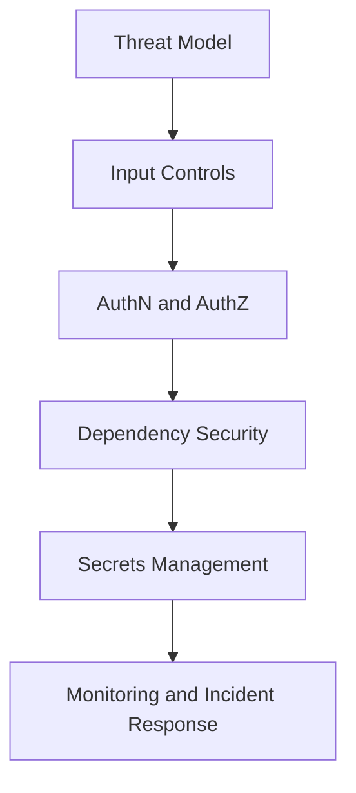

# Day 086 [Advanced]: Security Best Practices in Python

## Index

- [Goal](#goal)
- [Prerequisites](#prerequisites)
- [Explanation](#explanation)
- [Topic by Topic](#topic-by-topic)
- [Key Concepts](#key-concepts)
- [Visual Concept Map](#visual-concept-map)
- [End-to-End Practical](#end-to-end-practical)
- [Hands-on Coding](#hands-on-coding)
- [Mini Exercise](#mini-exercise)
- [Assessment Quiz](#assessment-quiz)
- [Task](#task)
- [Self Check](#self-check)
- [Interview Questions and Answers](#interview-questions-and-answers)
- [Day 086 Outcome](#day-086-outcome)

## Goal

Implement practical Python security controls across coding, dependency management, authentication, and runtime operations.

## Prerequisites

- Day 085 completed
- Familiarity with API/backend development workflows

## Explanation

Security in Python is a layered practice: safe coding, dependency hygiene, least privilege, and operational monitoring. Most incidents come from weak defaults and missing guardrails rather than advanced zero-day exploits.

## Topic by Topic

### Topic 1: Threat Modeling for Python Services

Theory:
Identify attack surfaces: input, auth, dependencies, secrets, and infra.

Practical:
Start each service with a short threat model checklist.

Code Example:

```text
Assets -> Threats -> Controls -> Monitoring
```

**Explanation:**
This topic explains Threat Modeling for Python Services in a practical Python context so you can write clear, reliable, and maintainable programs for real-world tasks.

**Key Points:**
- Understand the core idea behind Threat Modeling for Python Services.
- Apply the practical pattern with good readability and validation habits.
- Keep the solution maintainable, testable, and safe for production use where relevant.

### Topic 2: Input Validation and Injection Defense

Theory:
Untrusted input can trigger SQL injection, command injection, and path traversal.

Practical:
Validate and sanitize inputs; use parameterized DB queries.

Code Example:

```python
cursor.execute("SELECT * FROM users WHERE email = %s", (email,))
```

**Explanation:**
This topic explains Input Validation and Injection Defense in a practical Python context so you can write clear, reliable, and maintainable programs for real-world tasks.

**Key Points:**
- Understand the core idea behind Input Validation and Injection Defense.
- Apply the practical pattern with good readability and validation habits.
- Keep the solution maintainable, testable, and safe for production use where relevant.

### Topic 3: Authentication, Authorization, and Session Security

Theory:
AuthN verifies identity; AuthZ controls access scope.

Practical:
Use short-lived tokens, role checks, and deny-by-default policies.

Code Example:

```python
if user.role != "admin":
  raise PermissionError("forbidden")
```

**Explanation:**
This topic explains Authentication, Authorization, and Session Security in a practical Python context so you can write clear, reliable, and maintainable programs for real-world tasks.

**Key Points:**
- Understand the core idea behind Authentication, Authorization, and Session Security.
- Apply the practical pattern with good readability and validation habits.
- Keep the solution maintainable, testable, and safe for production use where relevant.

### Topic 4: Dependency and Supply Chain Security

Theory:
Third-party packages can introduce vulnerabilities.

Practical:
Pin versions, scan dependencies, and update regularly.

Code Example:

```bash
pip-audit
```

**Explanation:**
This topic explains Dependency and Supply Chain Security in a practical Python context so you can write clear, reliable, and maintainable programs for real-world tasks.

**Key Points:**
- Understand the core idea behind Dependency and Supply Chain Security.
- Apply the practical pattern with good readability and validation habits.
- Keep the solution maintainable, testable, and safe for production use where relevant.

### Topic 5: Secret Management and Secure Defaults

Theory:
Hardcoded secrets and permissive defaults are common breach vectors.

Practical:
Load secrets from env/secret manager and enforce secure defaults.

Code Example:

```python
DEBUG = False
JWT_SECRET = os.getenv("JWT_SECRET")
```

**Explanation:**
This topic explains Secret Management and Secure Defaults in a practical Python context so you can write clear, reliable, and maintainable programs for real-world tasks.

**Key Points:**
- Understand the core idea behind Secret Management and Secure Defaults.
- Apply the practical pattern with good readability and validation habits.
- Keep the solution maintainable, testable, and safe for production use where relevant.

### Topic 6: Logging, Monitoring, and Incident Response

Theory:
Detection and response speed reduce impact.

Practical:
Log security-relevant events and create incident playbooks.

Code Example:

```text
Track: failed login spikes, privilege changes, unusual token usage
```

**Explanation:**
This topic explains Logging, Monitoring, and Incident Response in a practical Python context so you can write clear, reliable, and maintainable programs for real-world tasks.

**Key Points:**
- Understand the core idea behind Logging, Monitoring, and Incident Response.
- Apply the practical pattern with good readability and validation habits.
- Keep the solution maintainable, testable, and safe for production use where relevant.

## Key Concepts

- Security is a continuous process, not a one-time feature
- Input validation and parameterization are baseline controls
- AuthZ failures are often more damaging than AuthN failures
- Dependency risk must be managed proactively
- Secure defaults and secret hygiene reduce breach likelihood
- Monitoring and response readiness are critical

## Visual Concept Map



## End-to-End Practical

1. Build threat model for one API.
2. Add validation and injection-safe data access.
3. Harden auth and role checks.
4. Scan dependencies and patch critical issues.
5. Add security telemetry and incident checklist.

## Hands-on Coding

### Example 1: Case - Hardened Login Endpoint

Scenario:
Add rate limits, strong password hashing, and account lockout thresholds.

```python
# lock account temporarily after repeated failed attempts
```

### Example 2: Case - File Upload Safety

Scenario:
Validate file type/size and store outside executable paths.

```python
ALLOWED_TYPES = {"image/png", "image/jpeg"}
```

### Example 3: Case - Security Dependency Pipeline

Scenario:
Fail CI on high severity dependency findings.

```text
Policy: Block merge when critical vulnerabilities are present.
```

## Mini Exercise

Scenario:
Perform a mini security hardening pass on one existing project: input validation, auth checks, dependency audit, and secret cleanup.

Expected output:

- Security checklist with fixes applied
- At least one automated security check in CI
- Documented residual risks

## Assessment Quiz

### Quiz Questions

1. Why is parameterized SQL mandatory?
2. What is one difference between authentication and authorization?
3. True or False: Security scans can be skipped if tests pass.
4. Why avoid hardcoded secrets?
5. What is one benefit of security event logging?

### Quiz Answers

1. It prevents injection attacks from untrusted input
2. AuthN verifies identity; AuthZ checks allowed actions
3. False
4. Secrets can leak through code/history and are hard to rotate safely
5. Faster detection and investigation of suspicious behavior

## Task

- Apply a security baseline to one Python project
- Add dependency scanning and secret hygiene controls
- Document threat model assumptions and monitoring plan

## Self Check

- You can identify and mitigate common Python security risks
- You can combine code-level and operational security controls
- You can establish repeatable security practices in CI/CD

## Interview Questions and Answers

### Beginner

**Question:** What is the most common Python app security mistake?

**Answer:** Trusting unvalidated user input and building unsafe queries/commands.

**Question:** Why is least privilege important?

**Answer:** It limits damage if one account or service is compromised.

### Middle

**Question:** How do you secure API tokens in production?

**Answer:** Short expiry, secure storage, rotation, and scoped permissions.

**Question:** What is a practical dependency security policy?

**Answer:** Scheduled audits plus CI checks that block critical vulnerabilities.

### Advanced

**Question:** What anti-pattern appears in backend security programs?

**Answer:** One-time audit with no continuous enforcement or incident readiness.

**Question:** How do mature teams improve security posture over time?

**Answer:** They combine threat modeling, secure coding standards, automation, and incident drills.

## Day 086 Outcome

- You can apply practical security controls in Python services
- You can reduce risk across code, dependencies, and operations
- You are ready for API contract governance on Day 087
