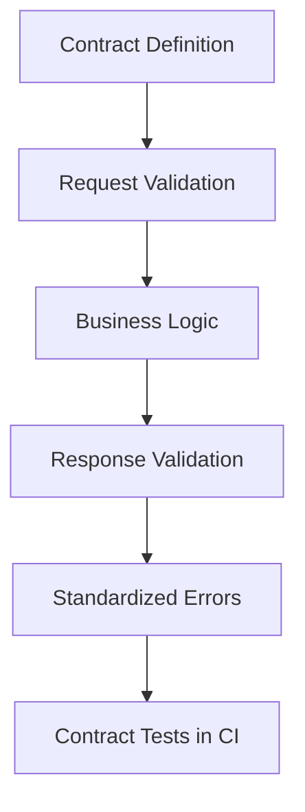

# Day 087 [Advanced]: API Contract and Runtime Validation

## Index

- [Goal](#goal)
- [Prerequisites](#prerequisites)
- [Explanation](#explanation)
- [Topic by Topic](#topic-by-topic)
- [Key Concepts](#key-concepts)
- [Visual Concept Map](#visual-concept-map)
- [End-to-End Practical](#end-to-end-practical)
- [Hands-on Coding](#hands-on-coding)
- [Mini Exercise](#mini-exercise)
- [Assessment Quiz](#assessment-quiz)
- [Task](#task)
- [Self Check](#self-check)
- [Interview Questions and Answers](#interview-questions-and-answers)
- [Day 087 Outcome](#day-087-outcome)

## Goal

Define and enforce robust API contracts with runtime validation so integrations stay stable and failures remain predictable.

## Prerequisites

- Day 086 completed
- Familiarity with Python APIs and schema validation concepts

## Explanation

API contracts are promises between producers and consumers. Runtime validation ensures requests and responses conform to those promises, preventing silent drift and integration breakage.

## Topic by Topic

### Topic 1: Contract-first API Design

Theory:
Schema definitions should guide implementation, not follow it.

Practical:
Define request/response models and error contract upfront.

Code Example:

```text
Contract components: endpoint, method, schema, status codes, error format
```

**Explanation:**
This topic explains Contract-first API Design in a practical Python context so you can write clear, reliable, and maintainable programs for real-world tasks.

**Key Points:**
- Understand the core idea behind Contract-first API Design.
- Apply the practical pattern with good readability and validation habits.
- Keep the solution maintainable, testable, and safe for production use where relevant.

### Topic 2: Request Validation Patterns

Theory:
Input validation protects business logic and data quality.

Practical:
Validate types, ranges, enums, and required fields.

Code Example:

```python
class CreateUserIn(BaseModel):
  email: str
  age: int = Field(ge=13)
```

**Explanation:**
This topic explains Request Validation Patterns in a practical Python context so you can write clear, reliable, and maintainable programs for real-world tasks.

**Key Points:**
- Understand the core idea behind Request Validation Patterns.
- Apply the practical pattern with good readability and validation habits.
- Keep the solution maintainable, testable, and safe for production use where relevant.

### Topic 3: Response Contract Enforcement

Theory:
Response drift can break clients even if internal logic succeeds.

Practical:
Validate response shape before returning.

Code Example:

```python
@app.get("/users/{uid}", response_model=UserOut)
def get_user(uid: int):
  ...
```

**Explanation:**
This topic explains Response Contract Enforcement in a practical Python context so you can write clear, reliable, and maintainable programs for real-world tasks.

**Key Points:**
- Understand the core idea behind Response Contract Enforcement.
- Apply the practical pattern with good readability and validation habits.
- Keep the solution maintainable, testable, and safe for production use where relevant.

### Topic 4: Versioning and Backward Compatibility

Theory:
Contract changes need controlled rollout strategy.

Practical:
Use versioning and deprecation windows for breaking changes.

Code Example:

```text
/v1/users and /v2/users with documented migration timeline
```

**Explanation:**
This topic explains Versioning and Backward Compatibility in a practical Python context so you can write clear, reliable, and maintainable programs for real-world tasks.

**Key Points:**
- Understand the core idea behind Versioning and Backward Compatibility.
- Apply the practical pattern with good readability and validation habits.
- Keep the solution maintainable, testable, and safe for production use where relevant.

### Topic 5: Runtime Guards and Error Standardization

Theory:
Consistent errors improve client resilience and debugging speed.

Practical:
Use one structured error envelope with code/message/details.

Code Example:

```json
{ "error_code": "INVALID_INPUT", "message": "age must be >= 13" }
```

**Explanation:**
This topic explains Runtime Guards and Error Standardization in a practical Python context so you can write clear, reliable, and maintainable programs for real-world tasks.

**Key Points:**
- Understand the core idea behind Runtime Guards and Error Standardization.
- Apply the practical pattern with good readability and validation habits.
- Keep the solution maintainable, testable, and safe for production use where relevant.

### Topic 6: Contract Testing and Drift Detection

Theory:
Automated tests should detect accidental contract changes.

Practical:
Add consumer-driven or schema snapshot tests in CI.

Code Example:

```text
Fail CI if OpenAPI schema changes without approval.
```

**Explanation:**
This topic explains Contract Testing and Drift Detection in a practical Python context so you can write clear, reliable, and maintainable programs for real-world tasks.

**Key Points:**
- Understand the core idea behind Contract Testing and Drift Detection.
- Apply the practical pattern with good readability and validation habits.
- Keep the solution maintainable, testable, and safe for production use where relevant.

## Key Concepts

- Contracts are product-level promises
- Validation is needed on both request and response paths
- Versioning and deprecation protect client integrations
- Standardized error structures reduce ambiguity
- Contract tests catch drift early
- API governance improves long-term integration reliability

## Visual Concept Map



## End-to-End Practical

1. Define schema for one endpoint pair (create/list).
2. Enforce request model constraints.
3. Add response model checks.
4. Standardize error payload structure.
5. Add CI contract drift test.

## Hands-on Coding

### Example 1: Case - Signup Contract Enforcement

Scenario:
Validate signup payload and ensure response excludes internal fields.

```python
class SignupOut(BaseModel):
  user_id: int
  email: str
```

### Example 2: Case - Backward-compatible Field Addition

Scenario:
Add optional response field without breaking existing clients.

```python
display_name: str | None = None
```

### Example 3: Case - Error Envelope Uniformity

Scenario:
Map validation and business errors into one consistent response shape.

```text
All 4xx errors return {error_code, message, details}.
```

## Mini Exercise

Scenario:
Choose one existing API module, define explicit contracts for two endpoints, enforce runtime validation, and add contract tests in CI.

Expected output:

- Contract schema definitions
- Runtime validation on both input and output
- CI check for schema drift

## Assessment Quiz

### Quiz Questions

1. Why validate responses if requests are already validated?
2. What is one safe way to evolve API without breaking clients?
3. True or False: Error payload format can vary per endpoint freely.
4. Why add contract tests in CI?
5. What is contract drift?

### Quiz Answers

1. Internal code changes can still violate outward contract
2. Add optional fields and version breaking changes
3. False
4. To detect accidental API behavior/schema changes early
5. Unintended divergence between documented and actual API behavior

## Task

- Implement contract-first validation for one API area
- Add standardized error schema and compatibility policy
- Gate contract changes through automated checks

## Self Check

- You can design stable API contracts with clear schemas
- You can enforce runtime validation for reliability
- You can manage versioning and compatibility intentionally

## Interview Questions and Answers

### Beginner

**Question:** What is an API contract?

**Answer:** A defined agreement of inputs, outputs, and error behavior between API and client.

**Question:** Why use schema validation?

**Answer:** To reject invalid data early and keep behavior predictable.

### Middle

**Question:** How do you avoid breaking existing API consumers?

**Answer:** Use backward-compatible changes, deprecations, and versioning for breaking updates.

**Question:** Why standardize error responses?

**Answer:** Clients can handle failures consistently across endpoints.

### Advanced

**Question:** What anti-pattern appears in API evolution?

**Answer:** Unversioned breaking changes pushed silently without contract tests or migration plan.

**Question:** How do mature teams govern API contracts?

**Answer:** They use schema review gates, compatibility policies, and consumer-aware rollout processes.

## Day 087 Outcome

- You can design and enforce durable API contracts
- You can prevent schema drift with runtime validation and CI checks
- You are ready for deep performance tuning on Day 088
