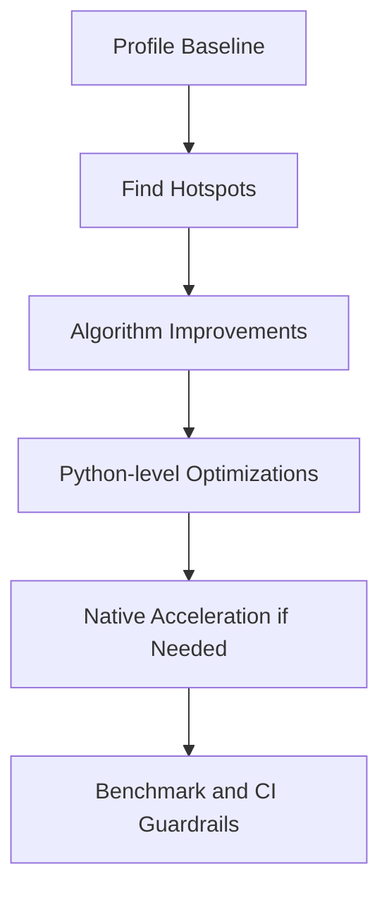

# Day 088 [Advanced]: Performance Tuning and C Extensions

## Index

- [Goal](#goal)
- [Prerequisites](#prerequisites)
- [Explanation](#explanation)
- [Topic by Topic](#topic-by-topic)
- [Key Concepts](#key-concepts)
- [Visual Concept Map](#visual-concept-map)
- [End-to-End Practical](#end-to-end-practical)
- [Hands-on Coding](#hands-on-coding)
- [Mini Exercise](#mini-exercise)
- [Assessment Quiz](#assessment-quiz)
- [Task](#task)
- [Self Check](#self-check)
- [Interview Questions and Answers](#interview-questions-and-answers)
- [Day 088 Outcome](#day-088-outcome)

## Goal

Profile Python workloads, remove bottlenecks, and selectively use native acceleration when it delivers clear ROI.

## Prerequisites

- Day 087 completed
- Comfort with Python functions, data structures, and basic benchmarking

## Explanation

Performance work is a measurement discipline. Start with profiling, optimize high-impact paths, and only then consider C extensions or native toolchains for critical bottlenecks.

## Topic by Topic

### Topic 1: Measure Before Optimizing

Theory:
Without profiling, optimization is guesswork.

Practical:
Use realistic datasets and collect timing + memory baseline.

Code Example:

```python
import cProfile
cProfile.run("run_pipeline()")
```

**Explanation:**
This topic explains Measure Before Optimizing in a practical Python context so you can write clear, reliable, and maintainable programs for real-world tasks.

**Key Points:**
- Understand the core idea behind Measure Before Optimizing.
- Apply the practical pattern with good readability and validation habits.
- Keep the solution maintainable, testable, and safe for production use where relevant.

### Topic 2: Algorithmic and Data-structure Wins

Theory:
Big-O improvements beat micro-optimizations.

Practical:
Replace nested scans with hash lookups where possible.

Code Example:

```python
seen = set(items)
```

**Explanation:**
This topic explains Algorithmic and Data-structure Wins in a practical Python context so you can write clear, reliable, and maintainable programs for real-world tasks.

**Key Points:**
- Understand the core idea behind Algorithmic and Data-structure Wins.
- Apply the practical pattern with good readability and validation habits.
- Keep the solution maintainable, testable, and safe for production use where relevant.

### Topic 3: Python-level Optimization Patterns

Theory:
Built-ins and vectorized operations are usually faster than Python loops.

Practical:
Use comprehensions, generators, and efficient standard-library APIs.

Code Example:

```python
total = sum(x * x for x in values)
```

**Explanation:**
This topic explains Python-level Optimization Patterns in a practical Python context so you can write clear, reliable, and maintainable programs for real-world tasks.

**Key Points:**
- Understand the core idea behind Python-level Optimization Patterns.
- Apply the practical pattern with good readability and validation habits.
- Keep the solution maintainable, testable, and safe for production use where relevant.

### Topic 4: Concurrency for Throughput

Theory:
I/O-bound and CPU-bound tasks need different approaches.

Practical:
Use asyncio/threads for I/O; processes or native code for CPU-heavy tasks.

Code Example:

```python
from concurrent.futures import ProcessPoolExecutor
```

**Explanation:**
This topic explains Concurrency for Throughput in a practical Python context so you can write clear, reliable, and maintainable programs for real-world tasks.

**Key Points:**
- Understand the core idea behind Concurrency for Throughput.
- Apply the practical pattern with good readability and validation habits.
- Keep the solution maintainable, testable, and safe for production use where relevant.

### Topic 5: Native Acceleration Options

Theory:
C extensions (Cython, CPython API, Rust bindings) can remove Python overhead.

Practical:
Accelerate only hot paths proven by profiling.

Code Example:

```text
Candidate path: inner loop called millions of times
```

**Explanation:**
This topic explains Native Acceleration Options in a practical Python context so you can write clear, reliable, and maintainable programs for real-world tasks.

**Key Points:**
- Understand the core idea behind Native Acceleration Options.
- Apply the practical pattern with good readability and validation habits.
- Keep the solution maintainable, testable, and safe for production use where relevant.

### Topic 6: Benchmarking, Regression Guards, and Tradeoffs

Theory:
Optimizations can hurt readability and maintainability.

Practical:
Track performance budgets in CI and document tradeoffs.

Code Example:

```text
Fail CI if p95 latency exceeds agreed threshold.
```

**Explanation:**
This topic explains Benchmarking, Regression Guards, and Tradeoffs in a practical Python context so you can write clear, reliable, and maintainable programs for real-world tasks.

**Key Points:**
- Understand the core idea behind Benchmarking, Regression Guards, and Tradeoffs.
- Apply the practical pattern with good readability and validation habits.
- Keep the solution maintainable, testable, and safe for production use where relevant.

## Key Concepts

- Profile first, optimize second
- Data structures and algorithms are highest leverage
- Python built-ins often outperform manual loops
- Concurrency strategy depends on workload type
- Native extensions are surgical tools, not default choices
- Performance budgets prevent regressions

## Visual Concept Map



## End-to-End Practical

1. Profile one slow workflow and rank top hotspots.
2. Apply algorithmic improvement to the top hotspot.
3. Add Python-level optimizations and re-measure.
4. Prototype native acceleration for remaining bottleneck.
5. Add benchmark checks in CI.

## Hands-on Coding

### Example 1: Case - Profiling a Report Generator

Scenario:
Measure CPU usage and find the most expensive function.

```python
import pstats
```

### Example 2: Case - Replacing N^2 Lookup

Scenario:
Convert repeated list scans into dictionary lookups.

```python
index = {item.id: item for item in items}
```

### Example 3: Case - Native Hot Path Prototype

Scenario:
Implement a Cython version of one compute-heavy loop and compare speedup.

```text
Compare baseline vs optimized median runtime across 30 runs.
```

## Mini Exercise

Scenario:
Pick one pipeline, profile it, apply two optimizations, and publish before/after metrics.

Expected output:

- Profiling report with identified hotspots
- Two implemented optimizations
- Documented performance gains and tradeoffs

## Assessment Quiz

### Quiz Questions

1. Why should profiling come before optimization?
2. When does native acceleration make sense?
3. True or False: Micro-optimizations should come first.
4. Which is better for CPU-bound parallel work: threads or processes?
5. Why add performance tests to CI?

### Quiz Answers

1. It reveals real bottlenecks and prevents wasted effort
2. When hot paths remain after high-level optimizations
3. False
4. Processes (or native code) in most CPython CPU-bound cases
5. To detect regressions before they reach production

## Task

- Run a full performance tuning cycle on one module
- Compare algorithmic, Python-level, and native optimization options
- Add benchmark thresholds for continuous validation

## Self Check

- You can profile and prioritize optimization work objectively
- You can choose the right optimization layer for each bottleneck
- You can preserve maintainability while improving speed

## Interview Questions and Answers

### Beginner

**Question:** What is the first step in performance tuning?

**Answer:** Measure current performance with a profiler and realistic inputs.

**Question:** Why are built-ins often faster?

**Answer:** They are optimized in C and reduce Python interpreter overhead.

### Middle

**Question:** How do you decide between asyncio and multiprocessing?

**Answer:** Use asyncio for I/O wait-heavy tasks and multiprocessing for CPU-heavy tasks.

**Question:** What is a practical sign for trying C extensions?

**Answer:** A verified hotspot dominates runtime despite algorithmic improvements.

### Advanced

**Question:** What tradeoff does native code introduce?

**Answer:** Better speed at the cost of build complexity, portability, and debugging effort.

**Question:** How do teams keep performance gains sustainable?

**Answer:** They automate benchmarks, set budgets, and treat regressions as release blockers.

## Day 088 Outcome

- You can execute an end-to-end performance tuning workflow
- You can justify when and where native acceleration is worth it
- You are ready for release governance on Day 089
