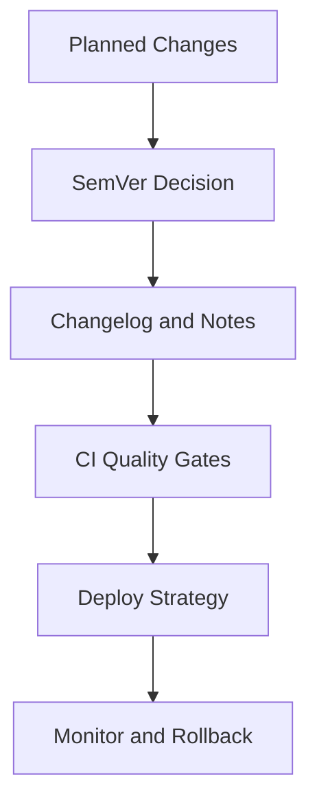

# Day 089 [Advanced]: Release Management and SemVer

## Index

- [Goal](#goal)
- [Prerequisites](#prerequisites)
- [Explanation](#explanation)
- [Topic by Topic](#topic-by-topic)
- [Key Concepts](#key-concepts)
- [Visual Concept Map](#visual-concept-map)
- [End-to-End Practical](#end-to-end-practical)
- [Hands-on Coding](#hands-on-coding)
- [Mini Exercise](#mini-exercise)
- [Assessment Quiz](#assessment-quiz)
- [Task](#task)
- [Self Check](#self-check)
- [Interview Questions and Answers](#interview-questions-and-answers)
- [Day 089 Outcome](#day-089-outcome)

## Goal

Design a predictable Python release process with Semantic Versioning, quality gates, and rollback safety.

## Prerequisites

- Day 088 completed
- Familiarity with Git branches, CI pipelines, and package publishing basics

## Explanation

Release management converts code changes into reliable customer-facing versions. Semantic Versioning provides a communication contract about compatibility while automation reduces human error during release cycles.

## Topic by Topic

### Topic 1: Release Strategy Fundamentals

Theory:
Choose release cadence and branching model based on team size and risk profile.

Practical:
Define release checklist, approvals, and owner responsibilities.

Code Example:

```text
Checklist: tests pass, changelog updated, migration notes ready
```

**Explanation:**
This topic explains Release Strategy Fundamentals in a practical Python context so you can write clear, reliable, and maintainable programs for real-world tasks.

**Key Points:**
- Understand the core idea behind Release Strategy Fundamentals.
- Apply the practical pattern with good readability and validation habits.
- Keep the solution maintainable, testable, and safe for production use where relevant.

### Topic 2: Semantic Versioning Rules

Theory:
SemVer uses MAJOR.MINOR.PATCH to signal compatibility.

Practical:
Map change type to version increment consistently.

Code Example:

```text
MAJOR: breaking API change, MINOR: backward-compatible feature, PATCH: bug fix
```

**Explanation:**
This topic explains Semantic Versioning Rules in a practical Python context so you can write clear, reliable, and maintainable programs for real-world tasks.

**Key Points:**
- Understand the core idea behind Semantic Versioning Rules.
- Apply the practical pattern with good readability and validation habits.
- Keep the solution maintainable, testable, and safe for production use where relevant.

### Topic 3: Changelog and Release Notes Discipline

Theory:
High-quality notes reduce support cost and upgrade friction.

Practical:
Categorize entries: Added, Changed, Fixed, Removed, Security.

Code Example:

```markdown
**Explanation:**
This topic explains Changelog and Release Notes Discipline in a practical Python context so you can write clear, reliable, and maintainable programs for real-world tasks.

**Key Points:**
- Understand the core idea behind Changelog and Release Notes Discipline.
- Apply the practical pattern with good readability and validation habits.
- Keep the solution maintainable, testable, and safe for production use where relevant.

## [2.4.0] - 2026-01-18

- Added: Async export endpoint
- Fixed: Token refresh race condition
```

### Topic 4: CI/CD Release Gates

Theory:
Automated gates maintain release confidence.

Practical:
Require tests, linting, security scan, and artifact integrity checks.

Code Example:

```text
Block release if coverage drops below target.
```

**Explanation:**
This topic explains CI/CD Release Gates in a practical Python context so you can write clear, reliable, and maintainable programs for real-world tasks.

**Key Points:**
- Understand the core idea behind CI/CD Release Gates.
- Apply the practical pattern with good readability and validation habits.
- Keep the solution maintainable, testable, and safe for production use where relevant.

### Topic 5: Deployment Safety and Rollback

Theory:
Releases should be reversible under time pressure.

Practical:
Use canary/blue-green deployment and tested rollback runbooks.

Code Example:

```text
Rollback trigger: elevated error rate for 5 minutes post-release
```

**Explanation:**
This topic explains Deployment Safety and Rollback in a practical Python context so you can write clear, reliable, and maintainable programs for real-world tasks.

**Key Points:**
- Understand the core idea behind Deployment Safety and Rollback.
- Apply the practical pattern with good readability and validation habits.
- Keep the solution maintainable, testable, and safe for production use where relevant.

### Topic 6: Governance, Compliance, and Auditability

Theory:
Regulated environments require traceability.

Practical:
Keep signed tags, immutable artifacts, and release approvals logged.

Code Example:

```text
Link release tag -> commit -> CI run -> approved change request
```

**Explanation:**
This topic explains Governance, Compliance, and Auditability in a practical Python context so you can write clear, reliable, and maintainable programs for real-world tasks.

**Key Points:**
- Understand the core idea behind Governance, Compliance, and Auditability.
- Apply the practical pattern with good readability and validation habits.
- Keep the solution maintainable, testable, and safe for production use where relevant.

## Key Concepts

- Release quality is a system, not an event
- SemVer communicates compatibility expectations clearly
- Changelogs are operational artifacts, not optional docs
- CI gates prevent risky releases
- Rollback readiness is part of release completeness
- Traceability supports reliability and compliance

## Visual Concept Map



## End-to-End Practical

1. Classify incoming changes into SemVer categories.
2. Generate changelog entries from merged PRs.
3. Run release pipeline with strict gates.
4. Deploy using safe rollout strategy.
5. Monitor post-release and execute rollback if needed.

## Hands-on Coding

### Example 1: Case - Automated Version Bump Rule

Scenario:
Derive next version from commit labels (feat/fix/breaking).

```text
feat -> MINOR, fix -> PATCH, breaking -> MAJOR
```

### Example 2: Case - Release Gate Workflow

Scenario:
Create CI workflow requiring tests, lint, security scan, and build verification.

```yaml
gate: all required checks must pass before tag creation
```

### Example 3: Case - Rollback Drill

Scenario:
Simulate failed release and perform timed rollback.

```text
Target: restore previous stable version under 10 minutes
```

## Mini Exercise

Scenario:
Define a SemVer and release governance policy for one Python service, then run a mock release from version bump to release notes and rollback plan.

Expected output:

- Version decision matrix
- Standard release checklist
- Rollback playbook with triggers

## Assessment Quiz

### Quiz Questions

1. When should MAJOR version be incremented?
2. Why are release notes operationally important?
3. True or False: Passing unit tests alone is enough for release.
4. What is one rollback trigger metric?
5. Why keep release traceability artifacts?

### Quiz Answers

1. When introducing backward-incompatible changes
2. They communicate risk, impact, and upgrade steps clearly
3. False
4. Sudden increase in error rate or latency
5. For auditability, incident analysis, and compliance evidence

## Task

- Build a release management playbook using SemVer
- Automate versioning, changelog, and quality gates
- Test rollback procedure before production release

## Self Check

- You can classify changes into correct SemVer increments
- You can operate a repeatable release workflow
- You can deploy with controlled risk and rollback readiness

## Interview Questions and Answers

### Beginner

**Question:** What does version 3.2.5 represent in SemVer?

**Answer:** Major version 3, minor version 2, patch version 5.

**Question:** Why should release notes be standardized?

**Answer:** Teams and users can quickly understand impact and required actions.

### Middle

**Question:** How do you avoid accidental breaking changes?

**Answer:** Contract tests, API compatibility checks, and explicit change review before release.

**Question:** What quality gates belong in a mature release pipeline?

**Answer:** Tests, static analysis, security checks, build integrity, and deployment validation.

### Advanced

**Question:** What anti-pattern harms release reliability most?

**Answer:** Manual releases with inconsistent checks and no rollback rehearsal.

**Question:** How do high-performing teams improve release confidence over time?

**Answer:** They track release metrics, automate controls, run incident retrospectives, and refine policies continuously.

## Day 089 Outcome

- You can run predictable Python releases with SemVer discipline
- You can enforce quality, safety, and traceability in release pipelines
- You are ready for browser automation with Playwright Python on Day 090
