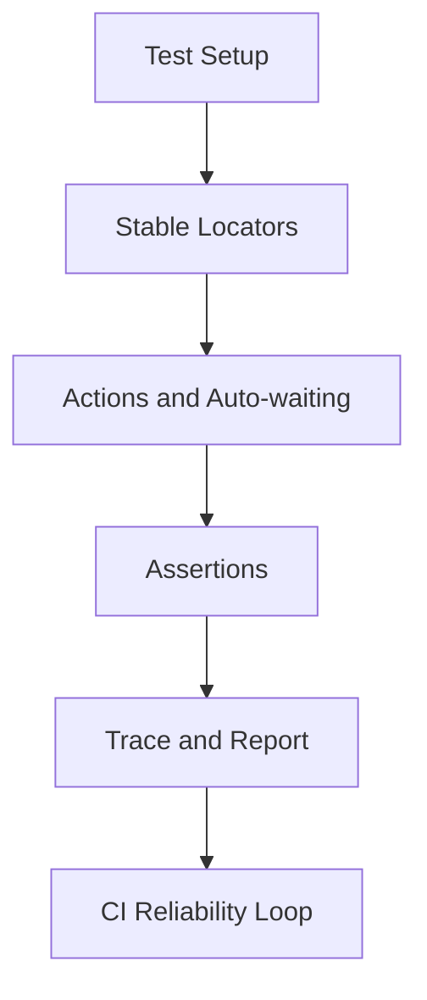

# Day 090 [Advanced]: Browser Automation with Playwright Python

## Index

- [Goal](#goal)
- [Prerequisites](#prerequisites)
- [Explanation](#explanation)
- [Topic by Topic](#topic-by-topic)
- [Key Concepts](#key-concepts)
- [Visual Concept Map](#visual-concept-map)
- [End-to-End Practical](#end-to-end-practical)
- [Hands-on Coding](#hands-on-coding)
- [Mini Exercise](#mini-exercise)
- [Assessment Quiz](#assessment-quiz)
- [Task](#task)
- [Self Check](#self-check)
- [Interview Questions and Answers](#interview-questions-and-answers)
- [Day 090 Outcome](#day-090-outcome)

## Goal

Use Playwright with Python to build reliable browser automation for testing, scraping workflows, and quality validation.

## Prerequisites

- Day 089 completed
- Python virtual environment and pip setup familiarity

## Explanation

Playwright provides modern browser automation with auto-waiting, robust selectors, and multi-browser support. The key to reliability is deterministic test design: clear locators, predictable setup, and strong assertions.

## Topic by Topic

### Topic 1: Playwright Architecture and Setup

Theory:
Playwright controls Chromium, Firefox, and WebKit through a unified API.

Practical:
Install Playwright, browser binaries, and initialize a test project.

Code Example:

```bash
pip install playwright pytest-playwright
playwright install
```

**Explanation:**
This topic explains Playwright Architecture and Setup in a practical Python context so you can write clear, reliable, and maintainable programs for real-world tasks.

**Key Points:**
- Understand the core idea behind Playwright Architecture and Setup.
- Apply the practical pattern with good readability and validation habits.
- Keep the solution maintainable, testable, and safe for production use where relevant.

### Topic 2: Locator Strategy and Auto-waiting

Theory:
Stable locators reduce flaky tests.

Practical:
Prefer role/text/test-id locators over brittle CSS paths.

Code Example:

```python
page.get_by_role("button", name="Sign in").click()
```

**Explanation:**
This topic explains Locator Strategy and Auto-waiting in a practical Python context so you can write clear, reliable, and maintainable programs for real-world tasks.

**Key Points:**
- Understand the core idea behind Locator Strategy and Auto-waiting.
- Apply the practical pattern with good readability and validation habits.
- Keep the solution maintainable, testable, and safe for production use where relevant.

### Topic 3: Assertions, Retries, and Test Determinism

Theory:
Reliable tests assert observable behavior, not implementation details.

Practical:
Use Playwright expectations and retry strategy intentionally.

Code Example:

```python
expect(page.get_by_text("Welcome")).to_be_visible()
```

**Explanation:**
This topic explains Assertions, Retries, and Test Determinism in a practical Python context so you can write clear, reliable, and maintainable programs for real-world tasks.

**Key Points:**
- Understand the core idea behind Assertions, Retries, and Test Determinism.
- Apply the practical pattern with good readability and validation habits.
- Keep the solution maintainable, testable, and safe for production use where relevant.

### Topic 4: Authentication and Test Isolation

Theory:
Session state sharing can speed tests, but isolation prevents cross-test pollution.

Practical:
Use storage state for login bootstrap and reset data per test suite.

Code Example:

```python
context = browser.new_context(storage_state="auth_state.json")
```

**Explanation:**
This topic explains Authentication and Test Isolation in a practical Python context so you can write clear, reliable, and maintainable programs for real-world tasks.

**Key Points:**
- Understand the core idea behind Authentication and Test Isolation.
- Apply the practical pattern with good readability and validation habits.
- Keep the solution maintainable, testable, and safe for production use where relevant.

### Topic 5: API + UI Hybrid Workflows

Theory:
Combining API setup with UI validation accelerates end-to-end testing.

Practical:
Seed data via API, verify user journey in browser.

Code Example:

```text
API creates order -> UI verifies order appears in dashboard
```

**Explanation:**
This topic explains API + UI Hybrid Workflows in a practical Python context so you can write clear, reliable, and maintainable programs for real-world tasks.

**Key Points:**
- Understand the core idea behind API + UI Hybrid Workflows.
- Apply the practical pattern with good readability and validation habits.
- Keep the solution maintainable, testable, and safe for production use where relevant.

### Topic 6: Reporting, Debugging, and CI Integration

Theory:
Trace artifacts make failures diagnosable.

Practical:
Capture screenshots/videos/traces and publish in CI pipeline.

Code Example:

```python
context.tracing.start(screenshots=True, snapshots=True)
```

**Explanation:**
This topic explains Reporting, Debugging, and CI Integration in a practical Python context so you can write clear, reliable, and maintainable programs for real-world tasks.

**Key Points:**
- Understand the core idea behind Reporting, Debugging, and CI Integration.
- Apply the practical pattern with good readability and validation habits.
- Keep the solution maintainable, testable, and safe for production use where relevant.

## Key Concepts

- Playwright auto-waiting improves stability
- Locator quality is the biggest flakiness determinant
- Deterministic assertions reduce false negatives
- Isolated test contexts improve reliability
- API+UI hybrid strategy speeds realistic E2E coverage
- Debug artifacts are essential for CI troubleshooting

## Visual Concept Map



## End-to-End Practical

1. Configure Playwright Python test framework.
2. Implement login and core user flow tests.
3. Add robust locators and expectation-based assertions.
4. Capture trace and screenshot on failure.
5. Run in CI across at least one browser profile.

## Hands-on Coding

### Example 1: Case - Login Flow E2E Test

Scenario:
Validate sign-in success and dashboard visibility.

```python
def test_login(page):
  page.goto("https://example.app/login")
  page.get_by_label("Email").fill("qa@example.com")
  page.get_by_label("Password").fill("password123")
  page.get_by_role("button", name="Sign in").click()
```

### Example 2: Case - Search and Filter Validation

Scenario:
Verify search results update correctly with filter toggles.

```python
expect(page.get_by_test_id("results-count")).to_have_text("12")
```

### Example 3: Case - Failure Diagnostics Pipeline

Scenario:
Enable trace retention for failed tests and publish artifacts.

```text
Trace ZIP + screenshot attached to CI job for every failed run
```

## Mini Exercise

Scenario:
Automate three user journeys for a sample web app: login, profile update, and logout. Include one negative test and failure artifact capture.

Expected output:

- 3 successful E2E tests
- 1 negative test with clear assertion
- CI-ready report artifacts

## Assessment Quiz

### Quiz Questions

1. Why prefer role/test-id locators over deep CSS selectors?
2. What does Playwright auto-waiting solve?
3. True or False: Sharing one browser context across all tests is always best.
4. Why capture traces in CI?
5. What is one benefit of API+UI hybrid tests?

### Quiz Answers

1. They are more stable against layout/style changes
2. It reduces timing-related flakiness in interactions/assertions
3. False
4. Faster root-cause analysis for failed tests
5. Faster setup with realistic end-user verification

## Task

- Build a Playwright Python test suite for one feature set
- Add stable locator strategy and deterministic assertions
- Integrate trace-based debugging into CI workflows

## Self Check

- You can write reliable browser automation with Playwright Python
- You can reduce flaky tests using robust locator and assertion patterns
- You can operate browser tests effectively in CI environments

## Interview Questions and Answers

### Beginner

**Question:** Why is Playwright popular for automation?

**Answer:** It offers reliable auto-waiting, modern locators, and multi-browser support.

**Question:** What causes flaky browser tests most often?

**Answer:** Weak selectors and timing assumptions.

### Middle

**Question:** How do you scale Playwright suites in CI?

**Answer:** Parallelize tests, isolate state, optimize setup, and collect failure artifacts.

**Question:** How would you test authenticated pages efficiently?

**Answer:** Reuse storage state for login while keeping data isolation across tests.

### Advanced

**Question:** What anti-pattern hurts long-term test reliability?

**Answer:** Over-reliance on arbitrary sleeps instead of expectation-driven synchronization.

**Question:** How do teams keep E2E suites valuable rather than slow and brittle?

**Answer:** They prioritize critical journeys, combine API+UI layers, and continuously remove flaky tests.

## Day 090 Outcome

- You can build production-grade browser automation with Playwright Python
- You can diagnose failures quickly using traces and artifacts
- You are ready to continue into advanced testing and platform topics
