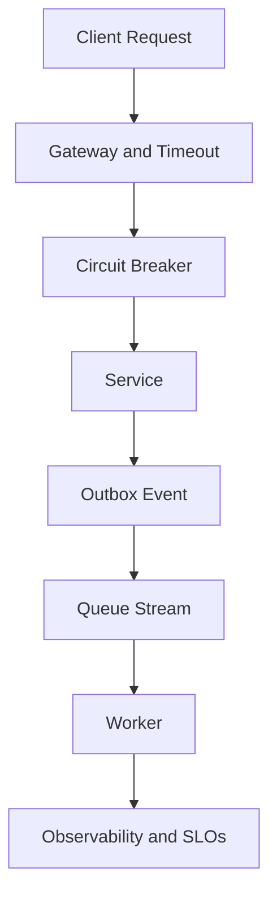

# Day 091 [Expert]: Distributed Systems Patterns

## Index

- [Goal](#goal)
- [Prerequisites](#prerequisites)
- [Explanation](#explanation)
- [Topic by Topic](#topic-by-topic)
- [Key Concepts](#key-concepts)
- [Visual Concept Map](#visual-concept-map)
- [End-to-End Practical](#end-to-end-practical)
- [Hands-on Coding](#hands-on-coding)
- [Mini Exercise](#mini-exercise)
- [Assessment Quiz](#assessment-quiz)
- [Task](#task)
- [Self Check](#self-check)
- [Interview Questions and Answers](#interview-questions-and-answers)
- [Day 091 Outcome](#day-091-outcome)

## Goal

Understand and apply core distributed systems patterns for reliability, scale, and correctness in Python backend platforms.

## Prerequisites

- Day 090 completed
- Comfortable with APIs, queues, and databases

## Explanation

Distributed systems are built from partial failure assumptions. The right patterns do not eliminate failure; they isolate, absorb, and recover from it with clear operational behavior.

## Topic by Topic

### Topic 1: Time, Failure, and Coordination Fundamentals

Theory:
In distributed systems, clocks drift, messages delay, and nodes fail independently.

Practical:
Design with timeouts, retries, and idempotency from day one.

Code Example:

```text
assume: network is unreliable, latency is variable, components can restart anytime
```

**Explanation:**
This topic explains Time, Failure, and Coordination Fundamentals in a practical Python context so you can write clear, reliable, and maintainable programs for real-world tasks.

**Key Points:**
- Understand the core idea behind Time, Failure, and Coordination Fundamentals.
- Apply the practical pattern with good readability and validation habits.
- Keep the solution maintainable, testable, and safe for production use where relevant.

### Topic 2: Request-Response Resilience Patterns

Theory:
Circuit breaker, retry with backoff, and timeout policies prevent cascading failures.

Practical:
Wrap outbound calls with bounded retries and fallback behavior.

Code Example:

```python
for attempt in range(3):
  try:
    return call_remote()
  except TimeoutError:
    sleep(2 ** attempt * 0.1)
```

**Explanation:**
This topic explains Request-Response Resilience Patterns in a practical Python context so you can write clear, reliable, and maintainable programs for real-world tasks.

**Key Points:**
- Understand the core idea behind Request-Response Resilience Patterns.
- Apply the practical pattern with good readability and validation habits.
- Keep the solution maintainable, testable, and safe for production use where relevant.

### Topic 3: Asynchronous Decoupling Patterns

Theory:
Queues and event streams decouple producer/consumer lifecycles.

Practical:
Move non-critical work to async workers and define dead-letter handling.

Code Example:

```text
checkout -> publish order_created -> email_worker consumes later
```

**Explanation:**
This topic explains Asynchronous Decoupling Patterns in a practical Python context so you can write clear, reliable, and maintainable programs for real-world tasks.

**Key Points:**
- Understand the core idea behind Asynchronous Decoupling Patterns.
- Apply the practical pattern with good readability and validation habits.
- Keep the solution maintainable, testable, and safe for production use where relevant.

### Topic 4: Data Consistency and Transaction Boundaries

Theory:
Strong consistency is expensive; eventual consistency needs compensation logic.

Practical:
Use saga or outbox patterns to coordinate cross-service updates.

Code Example:

```text
local DB commit + outbox event in same transaction
```

**Explanation:**
This topic explains Data Consistency and Transaction Boundaries in a practical Python context so you can write clear, reliable, and maintainable programs for real-world tasks.

**Key Points:**
- Understand the core idea behind Data Consistency and Transaction Boundaries.
- Apply the practical pattern with good readability and validation habits.
- Keep the solution maintainable, testable, and safe for production use where relevant.

### Topic 5: Partitioning, Replication, and Scalability

Theory:
Horizontal scale requires partition strategy and replication tradeoffs.

Practical:
Pick partition keys based on access patterns and hot-key risks.

Code Example:

```text
tenant_id-based sharding for multi-tenant workloads
```

**Explanation:**
This topic explains Partitioning, Replication, and Scalability in a practical Python context so you can write clear, reliable, and maintainable programs for real-world tasks.

**Key Points:**
- Understand the core idea behind Partitioning, Replication, and Scalability.
- Apply the practical pattern with good readability and validation habits.
- Keep the solution maintainable, testable, and safe for production use where relevant.

### Topic 6: Observability and Operational Controls

Theory:
Without telemetry, debugging distributed failures is guesswork.

Practical:
Instrument traces, correlation IDs, and SLO-based alerts.

Code Example:

```text
trace_id propagated across API -> queue -> worker -> database call chain
```

**Explanation:**
This topic explains Observability and Operational Controls in a practical Python context so you can write clear, reliable, and maintainable programs for real-world tasks.

**Key Points:**
- Understand the core idea behind Observability and Operational Controls.
- Apply the practical pattern with good readability and validation habits.
- Keep the solution maintainable, testable, and safe for production use where relevant.

## Key Concepts

- Partial failure is normal, not exceptional
- Idempotency is foundational for retries and at-least-once delivery
- Sync and async patterns must be mixed intentionally
- Consistency model choices impact product behavior
- Partitioning strategy determines scaling envelope
- Observability is a first-class architecture requirement

## Visual Concept Map



## End-to-End Practical

1. Model one business flow across two services.
2. Add timeout, retry, and circuit-breaker behaviors.
3. Introduce outbox + async worker for side effects.
4. Add idempotency keys for duplicate delivery safety.
5. Define SLOs and monitor error budget.

## Hands-on Coding

### Example 1: Case - Idempotent Payment Callback Handler

Scenario:
Handle repeated callback events without double-charging.

```python
if store.exists(event_id):
  return "already_processed"
store.save(event_id)
```

### Example 2: Case - Fallback on Inventory Service Timeout

Scenario:
Return stale cache data when dependency is unavailable.

```python
return cache.get(sku) if timeout else live_inventory
```

### Example 3: Case - Saga Compensation for Order Flow

Scenario:
If payment succeeds but shipping fails, issue refund compensation.

```text
order_created -> payment_captured -> shipping_failed -> refund_issued
```

## Mini Exercise

Scenario:
Design a distributed checkout architecture using at least three patterns from this lesson and explain failure handling at each step.

Expected output:

- Architecture diagram with sync and async boundaries
- Retry/idempotency strategy
- Compensation/rollback logic for inconsistent states

## Assessment Quiz

### Quiz Questions

1. Why is idempotency crucial in distributed workflows?
2. When should you use async messaging over direct sync calls?
3. True or False: Retries should be infinite by default.
4. What does the outbox pattern protect against?
5. Why propagate correlation IDs?

### Quiz Answers

1. It prevents duplicate side effects on repeated delivery
2. For decoupling, resilience, and non-blocking side effects
3. False
4. Lost events between DB commit and message publish
5. To trace one business request across multiple components

## Task

- Apply three distributed patterns to one existing backend flow
- Add one resilience policy and one observability policy
- Document consistency and failure tradeoffs

## Self Check

- You can reason about distributed failures without optimistic assumptions
- You can select patterns based on reliability and latency goals
- You can explain operational impact of architecture choices

## Interview Questions and Answers

### Beginner

**Question:** Why are distributed systems harder than monoliths?

**Answer:** More components communicate over unreliable networks, creating failure and coordination complexity.

**Question:** What is eventual consistency?

**Answer:** Data may be temporarily inconsistent but converges over time.

### Middle

**Question:** How do you prevent duplicate processing in queue consumers?

**Answer:** Use idempotency keys with persistent deduplication checks.

**Question:** What is the difference between circuit breaker and retry?

**Answer:** Retry re-attempts calls; circuit breaker short-circuits failing dependencies to prevent collapse.

### Advanced

**Question:** What tradeoff do you evaluate in consistency decisions?

**Answer:** User-visible correctness guarantees versus latency/availability under failure.

**Question:** How do mature teams validate distributed architecture decisions?

**Answer:** With load tests, chaos experiments, SLO tracking, and incident learning loops.

## Day 091 Outcome

- You can apply core distributed patterns in Python backends
- You can design for failure, consistency, and operability
- You are ready for event-driven architecture deep dive on Day 092
